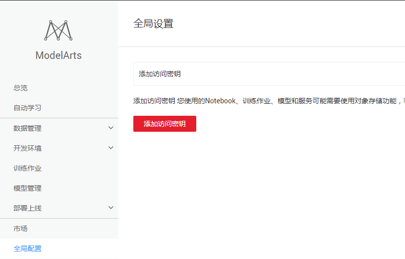
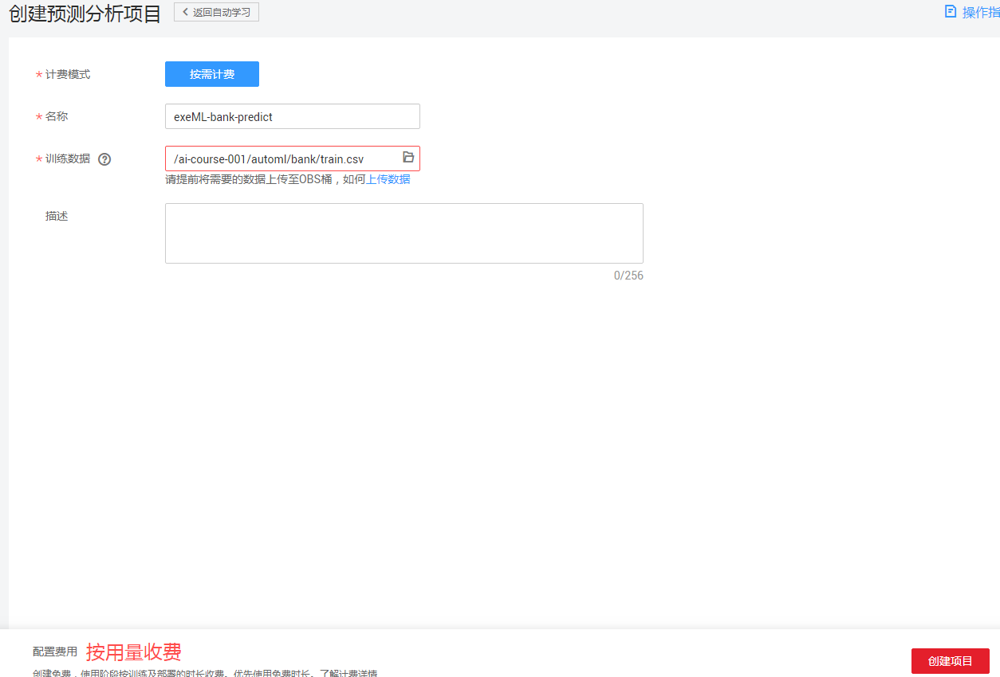
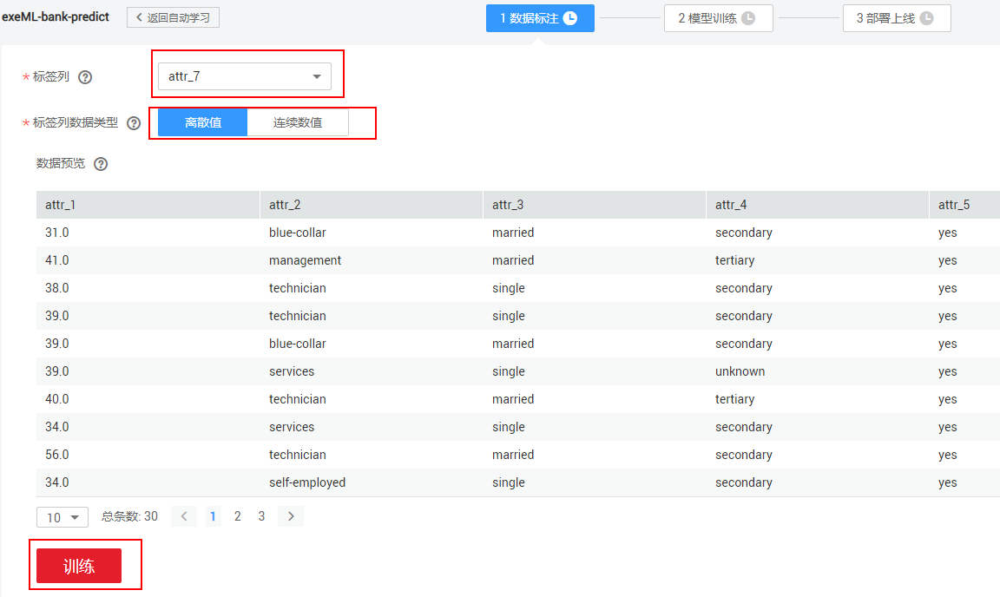
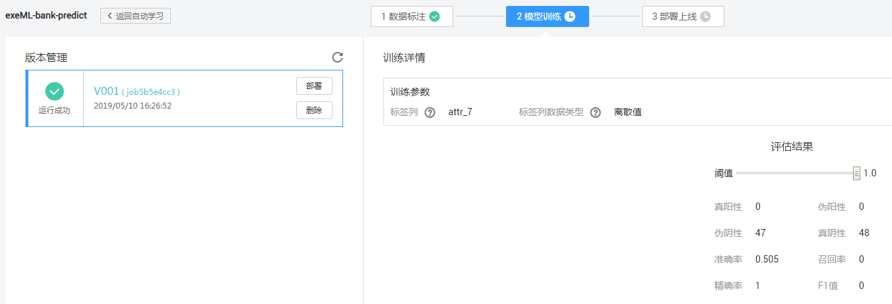
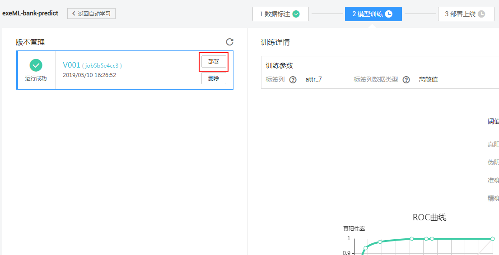
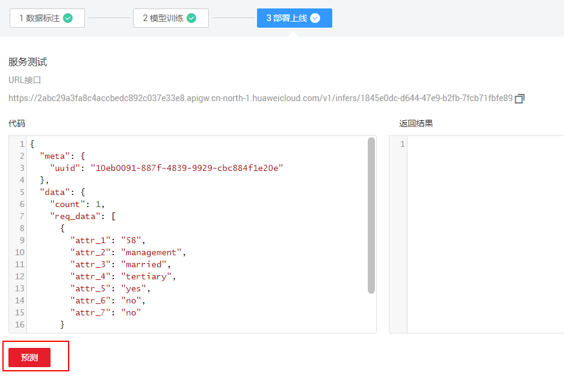
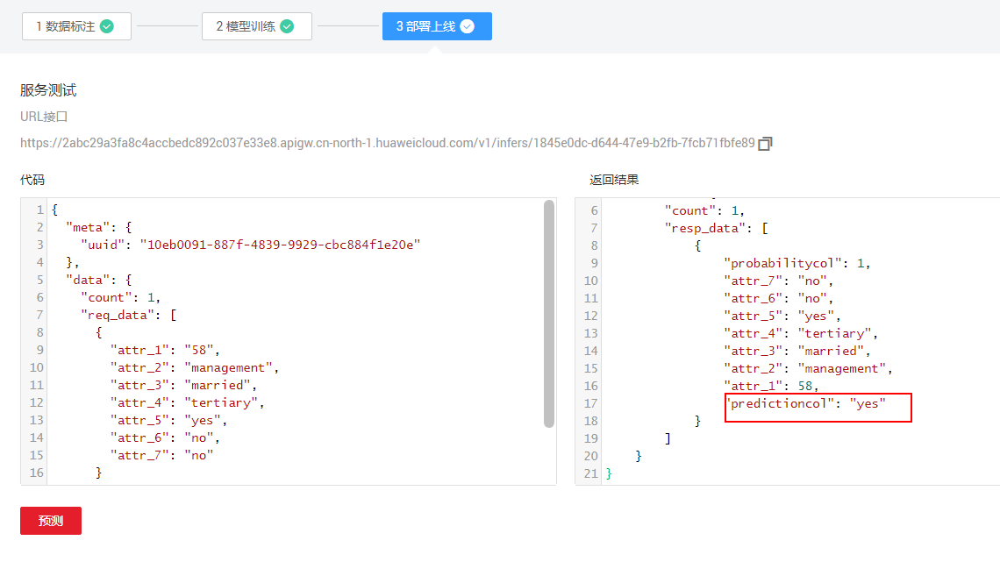

# [WIP] 此案例正在开发中，不建议进行实践。

# 使用ModelArts自动学习快速构建银行存款预测应用

本样例将详细介绍怎样用自动学习方法基于银行数据集快速构建银行存款预测应用。

## 服务配置

如果是第一次使用ModelArts服务，在使用之前需要给服务添加访问密钥，授权作业能够访问华为云存储OBS，若没有添加访问秘钥，则无法创建作业。具体操作步骤如下：

1. **生成访问秘钥**：在用户基本信息>管理我的凭证页面新增访问秘钥，创建后秘钥会下载到本地。

2. **设置ModelArts全局配置**：在ModelArts服务页面，添加访问秘钥，以授权访问OBS，使用ModelArts各项功能。

   

### 1. 生成访问秘钥

登陆华为云控制台访问账号中心，用户新增访问秘钥并下载到本地保存，操作步骤如下：

**步骤 1** &#160; &#160;   通过华为云账号访问华为云控制台，点击控制台右上角用户账号信息，跳转到“用户中心”。请参考图1。

图1 “用户中心”页面


**步骤 2** &#160; &#160; 在“用户中心>基本信息”页面点击“管理我的凭证”，跳转到“我的凭证”页面。请参考图2。

图2 “我的凭证”页面


**步骤 3** &#160; &#160; 在“我的凭证”页面切换到“管理访问秘钥”页签，执行“新建访问密钥”操作，输入登陆密码和短信验证码后，密钥会自动生成并下载到本地，文件名为“credentials.csv”。请参考图3。

图3 新增访问秘钥


### 2. 设置ModelArts全局配置

登陆ModelArts服务控制台，在“全局配置”中设置全局访问秘钥，具体操作步骤如下：

**步骤 1** &#160; &#160; 登陆ModelArts服务页面，通过左侧导航栏进入到“全局配置”页面。请参考图4。

图4 全局配置界面



**步骤 2** &#160; &#160; 执行“添加访问秘钥”操作，输入“credentials.csv”文件中的“Access Key”和“Secret Access Key”信息，执行确定操作，完成全局秘钥的设置。请参考图5。

图5 添加访问秘钥


## 使用自动学习构建银行存款预测应用

银行中有一种常见业务：根据客户特征（年龄、工作类型、婚姻状况、文化程度、是否有房贷和是否有个人贷款），预测客户是否会办理存款业务。以下展示如何使用自动学习预测分析构建一个银行存款预测应用的具体步骤。

### 1. 上传数据集文件

上传银行数据集文件至OBS（OBS操作指导参考：https://support.huaweicloud.com/qs-obs/obs_qs_0001.html ），本案例上传至OBS路径“/ai-course-001/automl/bank/train.csv”，数据集文件位于./data/目录下。

银行客户数据集的字段解释如下：

| 字段名 | 含义     | 类型   | 描述                     |
| ------ | -------- | ------ | ------------------------ |
| attr_1 | 年龄     | Int    | 表征客户的年龄           |
| attr_2 | 职业     | String | 表征客户所从事的职业     |
| attr_3 | 婚姻情况 | String | 表征客户是否结婚或已离异 |
| attr_4 | 教育情况 | String | 表征客户受教育的程度     |
| attr_5 | 房产情况 | String | 表征客户名下是否有房产   |
| attr_6 | 贷款情况 | String | 表征客户名下是否有贷款   |
| attr_7 | 存款情况 | String | 表征客户名下是否有存款   |

### 2. 创建预测分析项目

**步骤 1**&#160; &#160;进入“ModelArts”管理控制台界面。单击左侧导航栏的“自动学习”，进入“自动学习”界面。请参考图6。

图6 自动学习界面


**步骤 2** &#160; &#160; 点击“预测分析”创建项目按钮，创建自动学习>预测分析项目，自定义项目名称（本例输入exeML-bank-predict），训练数据选择OBS路径“/ai-course-001/automl/bank/train.csv”（之前数据集文件上传的OBS路径），点击“创建项目”完成预测分析项目创建。请参考图7。

图7 创建项目




### 2. 数据标注并训练

**步骤 1** &#160; &#160;页面会自动跳转到数据标注界面，可以看到样本数据。标签列选择“attr_7”（是否会办理存款），标签列数据类型选择“离散值”，点击“训练”按钮，开始训练。

图8 数据标注




### 4. 模型部署

在“模型训练”页面等待训练完成（预计5分钟），训练完成后，可以查看模型的精度：



点击“部署”按钮，将模型部署为一个在线服务：




### 5. 服务测试

在“部署上线”页面，等待服务部署成功。添加一条银行客户信息，然后点击“预测”按钮。如下图所示：

银行客户信息：

```json
{
  "meta": {
    "uuid": "10eb0091-887f-4839-9929-cbc884f1e20e"
  },
  "data": {
    "count": 1,
    "req_data": [
      {
        "attr_1": "58",
        "attr_2": "management",
        "attr_3": "married",
        "attr_4": "tertiary",
        "attr_5": "yes",
        "attr_6": "no",
        "attr_7": "no"
      }
    ]
  }
}
```



可以看到预测结果，预测这位银行用户会办理银行存款：



至此，银行存款预测应用实验完成。


