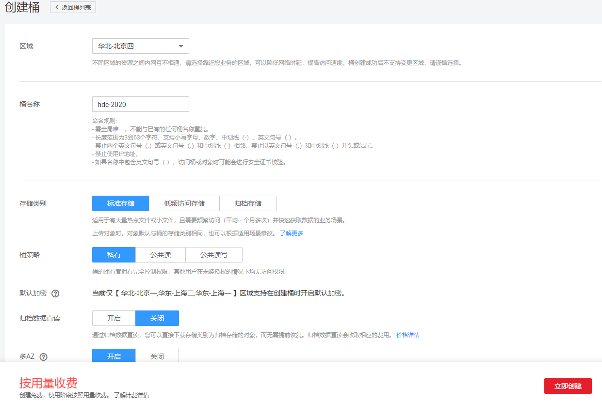
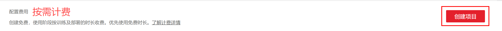
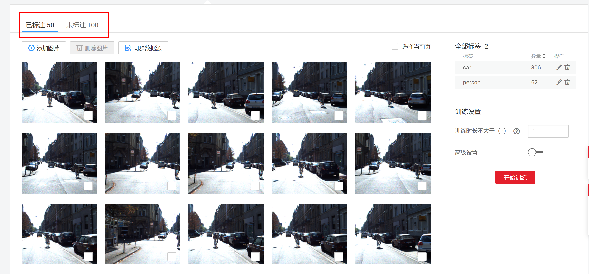
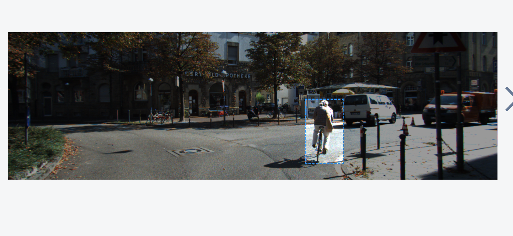
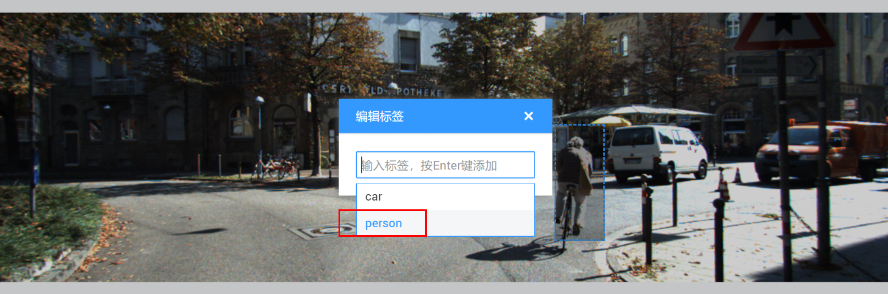
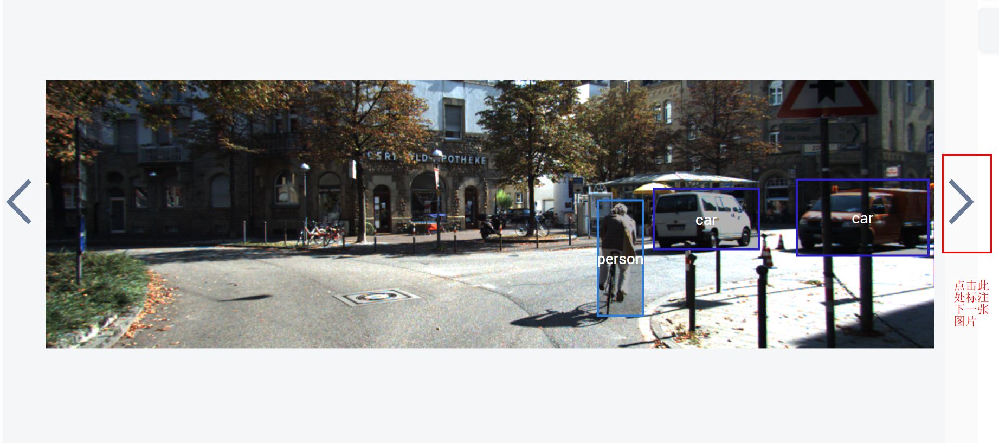
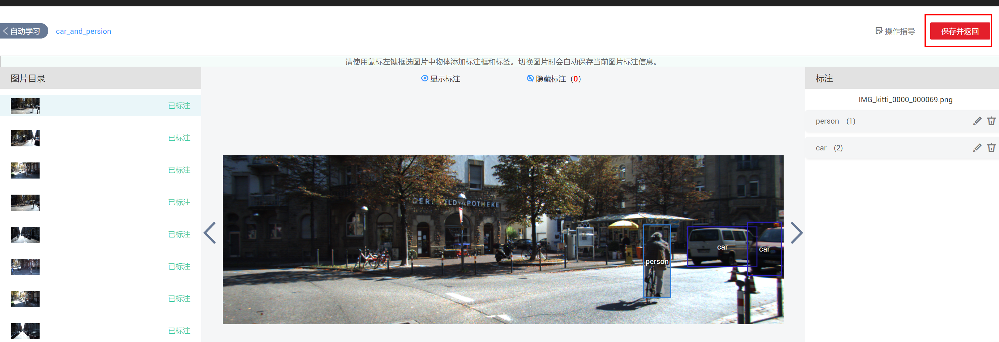
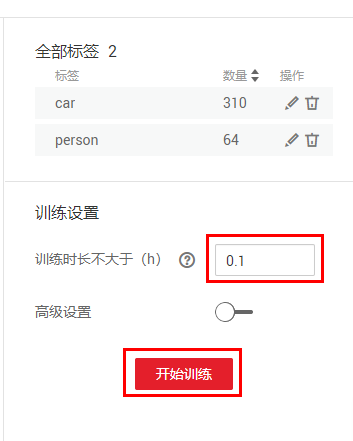
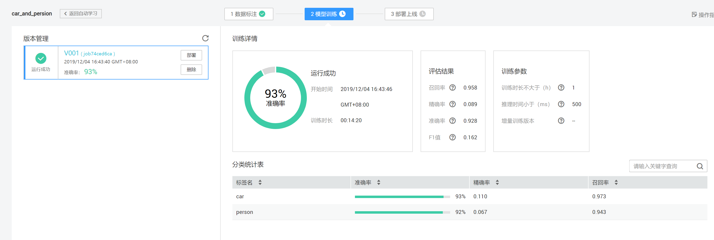
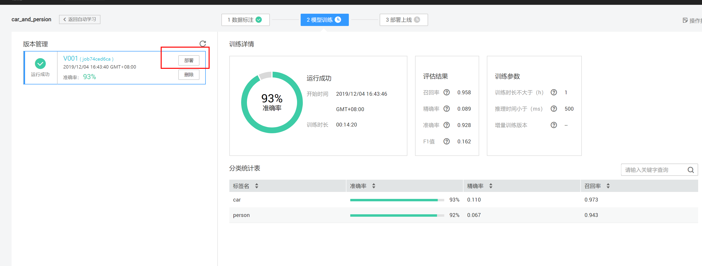

# 零代码完成自动驾驶AI模型开发

## 案例内容

在自动驾驶技术实现的过程中，物体检测是其中一个重要环节。本案例基于ModelArts自动学习功能，让开发者体验AI模型的开发过程，完成数据标注、模型训练和部署，开发一个物体检测AI应用。自动学习的特点是零代码、零AI知识，可以帮助AI初学者快速体验AI应用开发流程，同时自动学习训练的模型也可以部署到生产环境中使用。
## 案例目标

- 掌握使用ModelArts自动学习训练和部署模型。

## 准备工作

完成零代码自动驾驶AI模型开发，需要完成以下准备工作

### 创建华为云账号

参考[此链接](https://support.huaweicloud.com/prepare-modelarts/modelarts_08_0001.html)，注册华为云账号。

 **注意:**在使用ModelArts时要及时检查账号状态，避免账号处于欠费或冻结状态时资源被冻结，影响您的使用。 

### 获取访问密钥并完成ModelArts全局配置

参考[此文档](https://support.huaweicloud.com/prepare-modelarts/modelarts_08_0002.html)完成。

**注意**：访问秘钥文件请妥善保存，使用OBS Browser会用到。

### 下载并登录OBS Browser

点击[此链接]( https://support.huaweicloud.com/clientogw-obs/zh-cn_topic_0045829056.html )，根据操作系统版本下载相应版本的OBS Browser。

解压OBS Browser压缩包，参考[此文档](https://support.huaweicloud.com/clientogw-obs/zh-cn_topic_0045829058.html) 登录OBS Browser。

**注意**：AK SK从访问秘钥文件中获取。

### 创建OBS桶

**OBS**，即**Object Storage Service**，对象存储服务，是华为云上提供云上储存的服务。在使用ModelArts之前您需要创建一个OBS桶，并在其中创建一个用于存放数据的文件夹。 

登录[OBS管理控制台](https://storage.huaweicloud.com/obs/#/obs/manager/buckets)， 页面右上角单击"**创建桶**"，系统弹出如下图所示的对话框，选择"区域"为"华北-北京四"，输入自定义的桶名称，其他选项保持默认即可，最后点击页面下方"立即创建"按钮即可成功创建。 

## 准备数据

本案例采用自动驾驶场景的数据集，数据集中有两种物体，人和车。请点击[此链接](https://modelarts-labs.obs.cn-north-1.myhuaweicloud.com/codelab/car_and_person/car_and_person_150.tar.gz)下载数据到本地，解压。可以看到`car_and_person_150`文件夹下有`train`和`test`两个目录，`train`是训练集，`test`是测试集。

通过OBS Browser上传`car_and_person_150`数据集文件夹到刚刚创建的OBS桶下，可以参考[此文档](https://support.huaweicloud.com/qs-obs/obs_qs_0002.html) 。

## 创建项目

登录[ModelArts管理控制台](https://console.huaweicloud.com/modelarts/?region=cn-north-4#/manage/dashboard)，点击左侧导航栏的**自动学习**，进入自动学习页面；

点击右侧项目页面中的物体检测的**创建项目**按钮。
在创建自动学习项目页面，计费模式默认“按需计费”，填写“**名称**”并选择“**训练数据**”的存储路径。

训练数据：选择`train`目录的OBS路径。

点击右下角**创建项目**。

## 数据标注
### 步骤一、同步数据源

点击“同步数据源”按钮，等待右上角出现“数据同步完成”提示信息，可以看到界面显示的图像。共有100张未标注的图片和50张已经标注的图片。

### 步骤二、标注数据

点击**未标注**，选择第一张图片，开始标注数据集。

使用鼠标左键框选图片中物体添加标注框和标签。

为物体添加对应的标签。

点击箭头进入下一张图像，以同样的方式标注照片中的其他人或汽车。
标注5到10张图片后，点击右上角“**保存并返回**”。

如果您时间充足，可以把所有图片标注完。如果您时间有限，只标注几张图片即可，不标注完所有图片也可以训练。现在，您可以看到已标注和未标注的数据。

## 模型训练
首先设置训练时长不大于0.1（h），然后点击页面右下角**开始训练**按钮，开始模型训练。

具体的训练时长需要根据训练数据量来设置，如果精度不够，可以训练更长时间。

大概10分钟后训练结束，可以在右侧查看训练结果。

## 部署上线
### 步骤一、部署在线服务

点击部署，部署成功需要等待约3到5分钟左右

### 步骤二，测试样例图片

页面中间是服务测试，点击上传，选择`test`目录中一张图片上传，然后点击预测，在页面的右侧可以查看预测结果。

### 步骤三，查看在线服务详情

如果想要查看在线服务的详情，可以在“部署上线”->“在线服务”中找到相应的在线服务，然后点击名称进去查看详情，如下图所示：

API在线服务详情页有该API的调用指南和配置信息等信息。

### 步骤四，关闭在线服务

实验完成后，为了防止继续扣费，点击“停止”按钮，把在线服务关闭，在线服务停止后可以重新启动。

本次实验结束。

