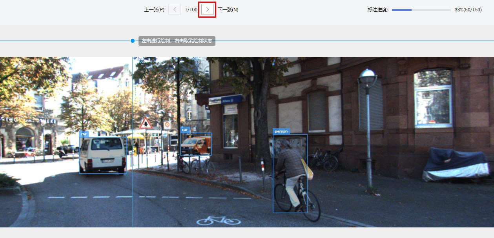

# 零代码实现自动驾驶场景人车检测模型开发

## 案例内容介绍

在自动驾驶技术实现的过程中，物体检测是其中一个重要环节。本案例基于ModelArts自动学习功能，让开发者体验AI模型的开发过程，完成数据标注、模型训练和部署，开发一个物体检测AI应用。

ModelArts自动学习具有零代码、零AI背景、泛化能力强的特点，可以帮助AI初学者快速体验AI应用开发流程，同时自动学习训练生成的模型也可以部署到生产环境中使用。

## 实验目标

1.掌握从AI Gallery下载数据集的方法；

2.掌握使用自动学习功能进行数据标注、模型训练和部署在线服务的方法。

## 实验步骤

### 准备工作

参考[此文档](https://github.com/huaweicloud/ModelArts-Lab/blob/master/docs/ModelArts准备工作/准备工作简易版.md)，完成ModelArts准备工作。

### 准备数据

#### 下载训练数据集

华为云AI Gallery中有开发者分享了丰富的数据集，大家可以前往订阅使用。本案例采用自动驾驶场景的数据集，数据集中有两种物体，人和车。我们从华为云AI Gallery订阅数据集至ModelArts，然后就可以在ModelArts中使用了。

请点击[此处](https://marketplace.huaweicloud.com/markets/aihub/datasets/detail/?content_id=39df6b73-c36c-458f-9b50-4b8b559b1d03)，进入该数据集主页，点击,进入下载详情，按照如下提示填写下载详情：

下载方式：选择ModelArts数据集

目标区域：华北-北京四

目标位置：选择一个OBS路径，作为数据集的存储位置。

名称：自定义。

填写好参数后，点击按钮，然后点击按钮。等待数据集状态变为推送成功（约2分钟），即可在[ModelArts数据集列表](https://console.huaweicloud.com/modelarts/?region=cn-north-4#/dataset)中查看到下载的数据集。

#### 下载测试数据集

请点击[此链接](https://modelarts-labs-bj4.obs.cn-north-4.myhuaweicloud.com:443/ExeML/ExeML_Car_And_Person_Detection/car_and_person_150.tar.gz)下载数据到本地，解压。可以看到`car_and_person_150`文件夹。测试集位于`car_and_person_150\test`目录下。

### 创建项目

登录[ModelArts管理控制台](https://console.huaweicloud.com/modelarts/?region=cn-north-4#/manage/dashboard)，点击左侧导航栏的**自动学习**，进入自动学习页面；

点击右侧项目页面中的物体检测的**创建项目**按钮。

在创建自动学习项目页面，计费模式默认“按需计费”，填写“**名称**”并选择“**训练数据**”的存储路径。

名称：自定义

数据来源：新建数据集

数据集输入位置：选择刚刚从AI Gallery订阅的人车检测数据集。

最后点击“创建项目”按钮完成物体检测项目创建。

### 数据标注
#### 同步数据源

点击“同步数据源”按钮，等待右上角出现“数据同步完成”提示信息，可以看到界面显示的图像。共有100张未标注的图片和50张已经标注的图片。

#### 标注数据

点击**未标注**，点击一张图片，开始标注数据集。

使用鼠标左键框选图片中物体，并添加标签（画矩形框的方式是分别点击矩形框的左上角和右下角）。

点击箭头进入下一张图像，以同样的方式标注照片中的人或汽车。

标注若干张图片后，点击左上角的作业名称，返回自动学习主页面。

如果您时间充足，可以把所有图片标注完。如果您时间有限，只标注几张图片即可，不标注完所有图片也可以训练。

### 模型训练
点击“开始训练”按钮，设置最大训练时长为12分钟，预期推理硬件选择CPU，其他默认。然后点击"确认"按钮，提交训练作业。如下图所示：

具体的训练时长需要根据训练数据量来设置，如果精度不够，可以训练更长时间。

大概12分钟后训练结束，可以在右侧查看训练结果。

### 部署上线
#### 部署在线服务

点击部署，部署成功需要等待5分钟左右

#### 测试样例图片

在线服务本质上是一个RESTful API，可以通过HTTP请求访问。本案例在网页上测试在线服务。

页面中间是服务测试，点击上传，选择`test`目录中一张图片上传，然后点击预测，在页面的右侧可以查看预测结果。

#### 查看在线服务详情

如果想要查看在线服务的详情，可以在“部署上线”->“在线服务”中找到相应的在线服务，然后点击名称进去查看详情，如下图所示：

API在线服务详情页有该API的调用指南和配置信息等信息。

### 关闭在线服务

实验完成后，为了防止继续扣费，点击“停止”按钮，把在线服务关闭，在线服务停止后可以重新启动。

至此，本案例完成。

