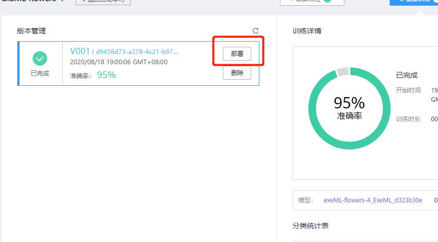

# 使用ModelArts自动学习快速构建花卉识别应用

本案例将详细介绍怎样用自动学习方法基于花卉数据集快速构建花卉识别应用。将介绍如何订阅和标注花卉数据、并进行模型训练和部署。

ModelArts是一站式的AI开发平台。ModelArts自动学习具有零代码、零AI背景、泛化能力强的特点，用户无需编码，无需AI背景，就可以使用自动学习快速构建自己的AI应用。

## 准备工作

参考[此文档](https://github.com/huaweicloud/ModelArts-Lab/blob/master/docs/ModelArts准备工作/准备工作简易版.md)，完成ModelArts准备工作。

## 准备数据

### 下载训练数据集

华为云AI市场中有开发者分享了丰富的数据集，大家可以前往订阅使用。本案例采用花卉识别数据集，数据集中有四种花卉，每种花有10张图片。我们从华为云AI市场订阅数据集至ModelArts，然后就可以在ModelArts中使用了。

该数据集包含的花朵及其类别如下图所示：

请点击[此处](https://marketplace.huaweicloud.com/markets/aihub/datasets/detail/?content_id=a3f3c385-ea26-4902-9b9c-e3e47aedff3a)，进入该数据集主页，点击，进入下载详情，按照如下提示填写下载详情:

图6下载详情：

下载方式：选择ModelArts数据集

目标区域：华北-北京四

目标位置：选择一个OBS路径，作为数据集的存储位置。

填写好参数后，点击按钮，然后点击按钮。等待数据集状态变为推送成功，即可在[ModelArts数据集列表](https://console.huaweicloud.com/modelarts/?region=cn-north-4#/dataset)中查看到下载的数据集。

### 下载测试数据集

点击[此处](https://modelarts-labs.obs.cn-north-1.myhuaweicloud.com/ExeML/ExeML_Flowers_Recognition/flowers_recognition.tar.gz)下载数据集压缩包至本地，解压。可以看到`flowers_recognition`文件夹。测试集位于`flowers_recognition\test`目录下。

##  创建图像分类项目

**步骤 1**&#160; &#160;点击[此链接](https://storage.huaweicloud.com/obs/?&locale=zh-cn#/obs/create) ，创建一个OBS桶（区域选北京四，桶名称自定义，其他使用默认参数），然后在创建的OBS桶下创建一个文件夹`/automl/flowers`（点击桶名称->对象->新建文件夹）。创建OBS桶和文件夹参考文档：https://support.huaweicloud.com/qs-obs/obs_qs_0001.html 。

**步骤 2**&#160; &#160;进入[ModelArts自动学习](https://console.huaweicloud.com/modelarts/?region=cn-north-4#/exeml)界面。

图7 自动学习界面

**步骤 3** &#160; &#160; 点击“图像分类”创建项目按钮，创建自动学习>图像分类项目，填写相应参数，点击“创建项目”完成图像分类项目创建。

图8 创建项目

项目名称：自定义

数据集来源：已有数据集

数据集名称：选择从AI市场订阅的花卉数据集

### 图片标注

创建完项目&#160;页面会自动跳转到数据标注界面。点击“同步数据源”按钮，等待右上角出现“数据同步完成”提示信息，可以看到界面显示的图像。共有40张未标注的图片和0张已经标注的图片。

进入“未标注”页面。批量选中相同类别的图片，然后选择标签（如果标签不存在，需要手动输入），最后点击“确定”按钮。如下图所示（如果对操作流程不熟悉，可以查看右上角的“操作指导”）：

图9 选择标签

“全部标签”中列举了所有的标签，以及每个标签下的图片数量。

校验图片标签。完成所有图片标注后，进入“已标注”页面。如果每个类不是10张图片，说明标注有误，可以在“已标注”页面修改标签。如果标注正确，可以跳过此步骤。

点击打开图片，可以查看图片的标签，如下图所示：

如果发现标签不正确，可以选中图片，重新选择标签。

### 4. 模型训练

在“数据标注”界面中，首先把数据集按照训练集/验证集=0.8/0.2的比例分开，设置训练时长为0.1（减小训练时长的同时，可能会降低模型精度），然后点击“开始训练”按钮，选择好训练参数，即可开始训练。参数设置如下图所示：

### 5. 模型部署

在“模型训练”页面等待训练完成（不超过6分钟），训练完成后，可以查看模型的精度：

点击“部署”按钮，将模型部署为一个在线服务：

### 6. 服务测试

在“部署上线”页面，等待服务部署成功。部署成功后，点击“上传本地图片”按钮，上传一张本地的测试图片（从测试集`test`目录中挑选）。如下图所示：

点击“预测”按钮进行预测：

可以看到预测结果：

### 7. 关闭服务

在“部署上线”页面，点击“停止”按钮，停止在线服务：

至此，花卉识别应用实验完成。

