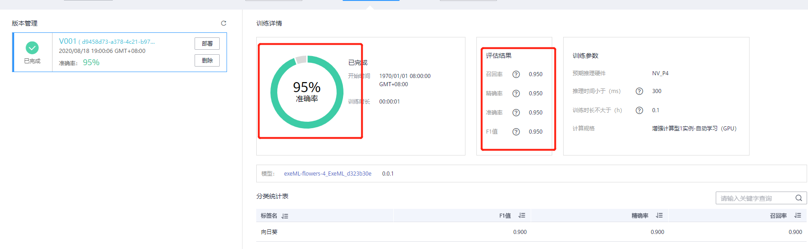

# 使用ModelArts自动学习快速构建花卉识别应用

本样例将详细介绍怎样用自动学习方法基于花卉数据集快速构建花卉识别应用。

## 服务配置

如果是第一次使用ModelArts服务，在使用之前需要给服务添加访问密钥，授权作业能够访问华为云存储OBS，若没有添加访问密钥，则无法创建作业。具体操作步骤如下：

### 1. 生成访问密钥

登陆华为云控制台访问账号中心，用户新增访问密钥并下载到本地保存，操作步骤如下：

**步骤 1** &#160; &#160;   点击[此链接](https://www.huaweicloud.com/product/modelarts.html)，登录华为云控制台。

**步骤 2** &#160; &#160; 点击[此链接](https://console.huaweicloud.com/iam/?locale=zh-cn#/mine/accessKey)，进入我的凭证页面。

**步骤 3** &#160; &#160; 在“我的凭证”页面切换到“访问密钥”页签，执行“新建访问密钥”操作，输入登陆密码和短信验证码后，密钥会自动生成并下载到本地，文件名为“credentials.csv”。请参考图3。

图3 新增访问密钥

### 2. 设置ModelArts全局配置

登陆[ModelArts服务控制台](https://console.huaweicloud.com/modelarts/?region=cn-north-1&locale=zh-cn#/manage/dashboard)，在“全局配置”中设置全局访问密钥，具体操作步骤如下：

**步骤 1** &#160; &#160; 登陆ModelArts服务页面，通过左侧导航栏进入到“全局配置”页面。请参考图4。

图4 全局配置界面

**步骤 2** &#160; &#160; 执行“添加访问密钥”操作，输入“credentials.csv”文件中的“Access Key”和“Secret Access Key”信息，执行确定操作，完成全局密钥的设置。请参考图5。

图5 添加访问密钥

## 使用自动学习构建花卉识别应用

这章介绍如何标注花卉数据、并进行模型训练和部署，以下是操作步骤。

### 1. 创建图像分类项目

**步骤 1**&#160; &#160;点击[此链接](https://storage.huaweicloud.com/obs/?&locale=zh-cn#/obs/create) ，创建一个OBS桶（区域选北京四，桶名称自定义，其他使用默认参数），然后在创建的OBS桶下创建一个文件夹`/automl/flowers`（点击桶名称->对象->新建文件夹）。创建OBS桶和文件夹参考文档：https://support.huaweicloud.com/qs-obs/obs_qs_0001.html 。

**步骤 2**&#160; &#160;进入[ModelArts管理控制台](https://console.huaweicloud.com/modelarts/?region=cn-north-1&locale=zh-cn#/manage/dashboard)界面。单击左侧导航栏的“自动学习”，进入“自动学习”界面。请参考图7。

图7 自动学习界面

**步骤 3** &#160; &#160; 点击“图像分类”创建项目按钮，创建自动学习>图像分类项目，自定义项目名称（本例输入exeML-flowers），训练数据选择OBS路径`/ai-course-001/automl/flowers/`（flowers目录是一个空目录即可），点击“创建项目”完成图像分类项目创建。请参考图8。

图8 创建项目

### 2. 下载数据集

点击[此处](https://modelarts-labs.obs.cn-north-1.myhuaweicloud.com/ExeML/ExeML_Flowers_Recognition/flowers_recognition.tar.gz)下载数据集压缩包至本地。

### 3. 图片标注

**步骤 1** &#160; &#160;**准备数据集**。找到本地下载好的数据集压缩包，然后解压。数据集文件夹名称是`flowers_recognition`，训练集位于`flowers_recognition\train`目录下，共4个花卉类别，每个类别10张图片。测试集位于`flowers_recognition\test`目录下。

该数据集包含的花朵及其类别如下图所示：

**步骤 2** &#160; &#160;页面会自动跳转到数据标注界面。点击下图中的“添加图片”按钮，添加本地的训练集（全选`train`目录下所有图片）。

如果图片加载不出来，需要等待两分钟，然后刷新页面。

图9 添加图片

**步骤 3** &#160; &#160;标注图片，给图片打标签。

进入“未标注”页面。批量选中相同类别的图片，然后选择标签（如果标签不存在，需要手动输入），最后点击“确定”按钮。如下图所示（如果对操作流程不熟悉，可以查看右上角的“操作指导”）：

图10 选择标签

“全部标签”中列举了所有的标签，以及每个标签下的图片数量，见图10 选择标签。

**步骤 4** &#160; &#160;校验图片标签。完成所有图片标注后，进入“已标注”页面。如果每个类不是10张图片，说明标注有误，可以在“已标注”页面修改标签。如果标注正确，可以跳过此步骤。

点击图片右下角按钮，可以查看图片的标签，如下图所示：

如果发现标签不正确，可以选中图片，重新选择标签。

### 4. 模型训练

在“数据标注”界面中，首先设置训练时长为0.1（减小训练时长的同时，可能会降低模型精度），然后点击“开始训练”按钮，即可开始训练。如下图所示：

### 5. 模型部署

在“模型训练”页面等待训练完成（不超过6分钟），训练完成后，可以查看模型的精度：

点击“部署”按钮，将模型部署为一个在线服务：

### 6. 服务测试

在“部署上线”页面，等待服务部署成功。部署成功后，点击“上传本地图片”按钮，上传一张本地的测试图片（从测试集`test`目录中挑选）。如下图所示：

点击“预测”按钮进行预测：

可以看到预测结果：

### 7. 关闭服务

在“部署上线”页面，点击“停止”按钮，停止在线服务：

至此，花卉识别应用实验完成。

