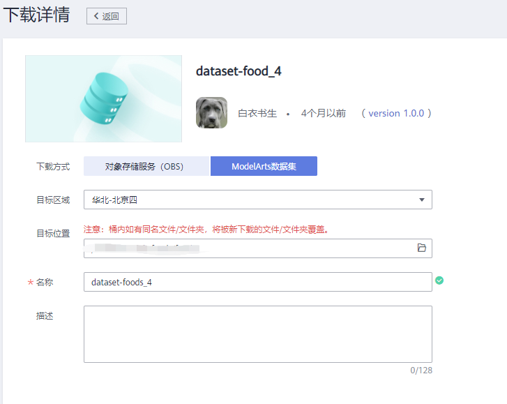
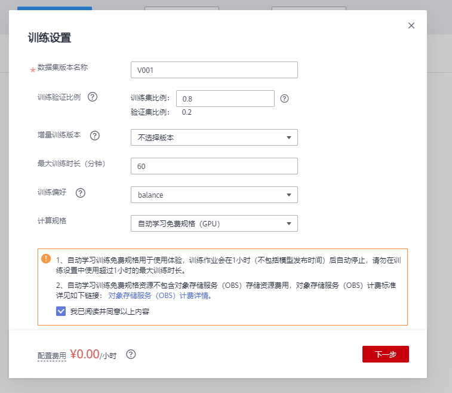

# 零代码美食分类模型开发

本案例将详细介绍怎样用ModelArts自动学习基于美食数据集快速构建美食识别应用。

ModelArts是一站式的AI开发平台。ModelArts自动学习具有零代码、零AI背景、泛化能力强的特点，用户无需编码，无需AI背景，就可以使用自动学习快速构建自己的AI应用。

## 准备工作

参考[此文档](https://github.com/huaweicloud/ModelArts-Lab/blob/master/docs/ModelArts准备工作/准备工作简易版.md)，完成ModelArts准备工作。包括注册华为云账号、ModelArts全局配置和OBS相关操作。

## 准备数据

### 数据集介绍

本次实验，我们使用包含四个类别的美食分类数据集，每个类别10张图片。

该数据集包含的美食及其类别如下图所示：

### 下载训练数据集

我们从华为云AI Gallery订阅数据集至ModelArts，然后就可以在ModelArts中使用了。华为云AI Gallery中有开发者分享了丰富的数据集，大家可以前往订阅使用。

点击[此处](https://marketplace.huaweicloud.com/markets/aihub/datasets/detail/?content_id=61286af8-4477-4dd3-bc43-d6f9b09c68b1)，进入该数据集主页，点击，进入下载详情，按照如下提示填写下载详情：

下载方式：选择ModelArts数据集

目标区域：华北-北京四

目标位置：选择一个OBS路径，作为数据集的存储位置。

名称：自定义。

填写好参数后，点击按钮，然后点击按钮。等待数据集状态变为推送成功，即可在[ModelArts数据集列表](https://console.huaweicloud.com/modelarts/?region=cn-north-4#/dataset)中查看到下载的数据集。

### 下载测试数据集

点击[此处](https://modelarts-labs-bj4.obs.cn-north-4.myhuaweicloud.com/ExeML/ExeML_Foods_Recognition/foods_recognition.tar.gz)下载数据集压缩包至本地，然后解压。可以得到文件夹`foods_recognition`。测试集位于`foods_recognition\test`目录下。

## 创建图像分类项目

点击进入[ModelArts自动学习](https://console.huaweicloud.com/modelarts/?region=cn-north-4#/exeml)界面，然后点击“图像分类”创建项目按钮，按照如下示例填写参数：

名称：自定义

数据来源：已有数据集

数据集名称：选择刚刚从AI Gallery订阅的美食分类数据集。

最后点击“创建项目”按钮完成图像分类项目创建。

## 图片标注

进入“未标注”页面。批量选中相同类别的图片，然后添加标签（如果标签已经存在，可以直接选择），最后点击“确定”按钮。如下图所示（如果对操作流程不熟悉，可以查看右上角的“操作指导”）：

“全部标签”中列举了所有的标签，以及每个标签下的图片数量。

完成所有图片标注后，进入“已标注”页面。在该页面可以校验图片标签，如果标注有误，可以在该页面修改标签。如果发现标签不正确，可以选中图片，重新选择标签。

## 模型训练

点击“开始训练”按钮，训练设置使用默认值即可，然后点击确认按钮，提交训练作业，如下图所示：

## 模型部署

在“模型训练”页面等待训练完成，等待6分钟左右，训练完成，可以查看模型的准确率：

点击“部署”按钮，将模型部署为一个在线服务，等待5分钟左右：

## 服务测试

在线服务本质上是一个RESTful API，可以通过HTTP请求访问。本案例在网页上测试在线服务。

在“部署上线”页面，等待服务部署成功。部署成功后，点击“上传本地图片”按钮，上传一张本地的测试图片（从测试集`test`目录中挑选）。如下图所示：

点击“预测”按钮进行预测：

可以看到预测结果：

## 关闭在线服务

在“部署上线”页面，点击“停止”按钮，停止在线服务，否则会持续收费：

当需要使用该在线服务的时候，可以重新启动该在线服务。

至此，本案例完成。

