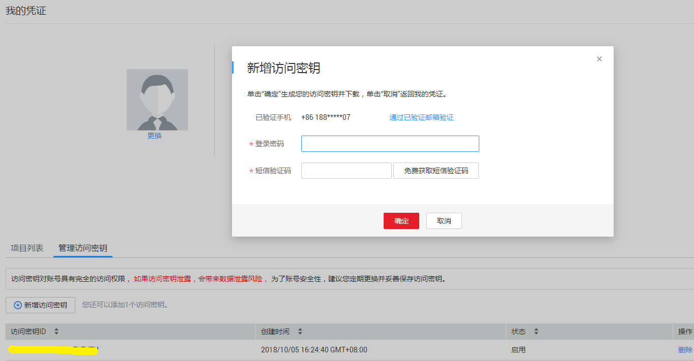
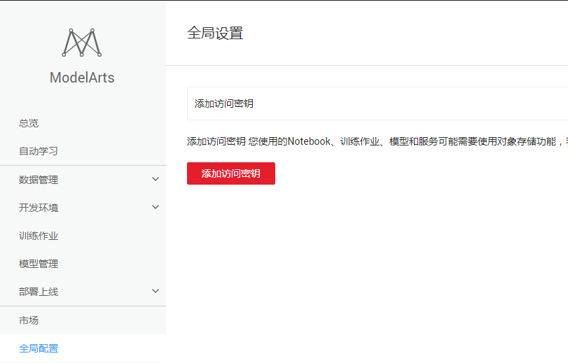
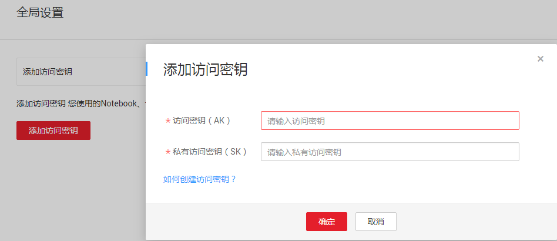
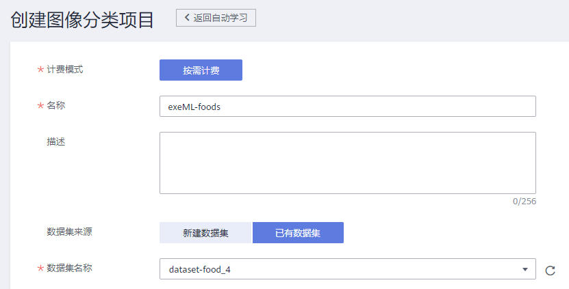
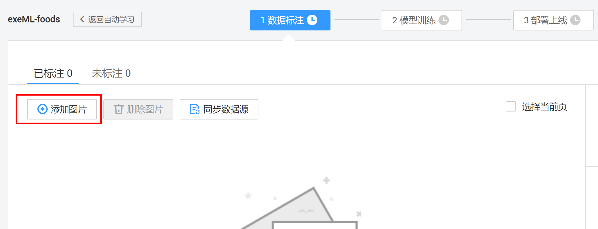
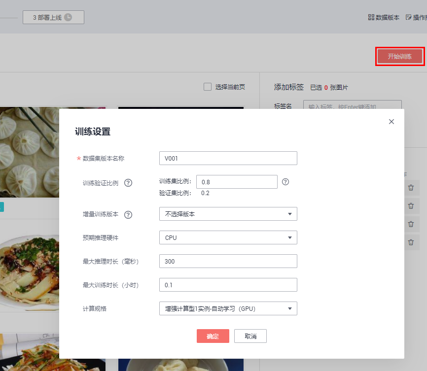
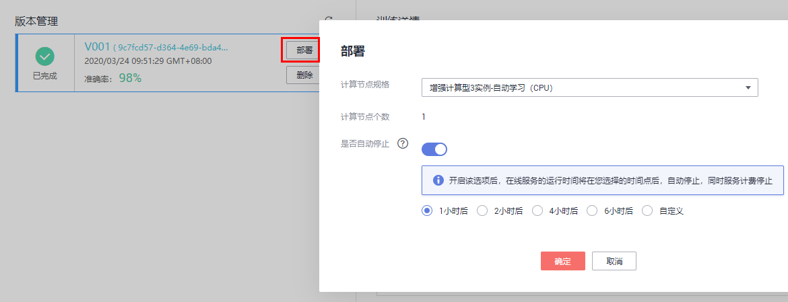

# 零代码美食分类模型开发

本案例将详细介绍怎样用ModelArts自动学习基于美食数据集快速构建美食识别应用。

## 服务配置

如果是第一次使用ModelArts服务，在使用之前需要做如下准备工作。

### 生成访问密钥

登陆华为云控制台访问账号中心，用户新增访问密钥并下载到本地保存，操作步骤如下：

**步骤 1** &#160; &#160;  点击[此链接](https://www.huaweicloud.com/product/modelarts.html)，登录华为云控制台。

**步骤 2** &#160; &#160; 点击[此链接](https://console.huaweicloud.com/iam/?locale=zh-cn#/mine/accessKey)，进入我的凭证页面。

**步骤 3** &#160; &#160; 在“我的凭证”页面切换到“访问密钥”页签，执行“新建访问密钥”操作，输入登陆密码和短信验证码后，密钥会自动生成并下载到本地，文件名为“credentials.csv”。请参考图3。

图3 新增访问密钥

### 设置ModelArts全局配置

登陆[ModelArts服务控制台](https://console.huaweicloud.com/modelarts/?region=cn-north-4&locale=zh-cn#/manage/dashboard)，在“全局配置”中设置全局访问密钥，具体操作步骤如下：

**步骤 1** &#160; &#160; 登陆ModelArts服务页面，通过左侧导航栏进入到“全局配置”页面。请参考图4。

图4 全局配置界面

**步骤 2** &#160; &#160; 执行“添加访问密钥”操作，输入“credentials.csv”文件中的“Access Key”和“Secret Access Key”信息，执行确定操作，完成全局密钥的设置。请参考图5。

图5 添加访问密钥

### 创建OBS桶

**OBS**，即**Object Storage Service**，对象存储服务，是华为云上提供云上数据储存的服务。在使用ModelArts之前您需要创建一个OBS桶。 

登录[OBS管理控制台](https://storage.huaweicloud.com/obs/#/obs/manager/buckets)， 页面右上角单击"**创建桶**"，系统弹出如下图所示的对话框，选择"区域"为"华北-北京四"，输入自定义的桶名称，其他选项保持默认即可，最后点击页面下方"立即创建"按钮即可成功创建。

## 创建图像分类项目

点击进入[ModelArts自动学习](https://console.huaweicloud.com/modelarts/?region=cn-north-4#/manage/autoML)界面，然后点击“图像分类”创建项目按钮，按照如下示例填写参数：

名称：自定义

训练数据：选择OBS路径`/modelarts-course/exeml/foods/`（保证foods目录为空。如果OBS路径不存在，可以直接在弹出的路径选择对话框中创建），该路径用来存储训练数据。

最后点击“创建项目”完成图像分类项目创建。

## 图片标注

### 下载数据集

点击[此处](https://modelarts-labs.obs.cn-north-1.myhuaweicloud.com/ExeML/ExeML_Foods_Recognition/foods_recognition.tar.gz)下载数据集压缩包至本地，然后解压。可以得到文件夹`foods_recognition`。

训练集位于`foods_recognition\train`目录下，共4类美食，每个类别10张图片。测试集位于`foods_recognition\test`目录下。

该数据集包含的美食及其类别如下图所示：

### 上传数据

进入图像分类项目后，首先会进入数据标注界面。点击下图中的“添加图片”按钮，添加本地的训练集（全选`train`目录下所有图片）。

### 给图片打标签

进入“未标注”页面。批量选中相同类别的图片，然后添加标签（如果标签已经存在，可以直接选择），最后点击“确定”按钮。如下图所示（如果对操作流程不熟悉，可以查看右上角的“操作指导”）：

“全部标签”中列举了所有的标签，以及每个标签下的图片数量，见图10 选择标签。

校验图片标签。完成所有图片标注后，进入“已标注”页面。如果每个类不是10张图片，说明标注有误，可以在“已标注”页面修改标签。如果标注正确，可以跳过此步骤。

点击图片右下角按钮，可以查看图片的标签，如下图所示：

如果发现标签不正确，可以选中图片，重新选择标签。

## 模型训练

在“数据标注”界面中，首先设置训练时长为0.1（不同任务类型和数据量需要的训练时长不一样），然后点击“开始训练”按钮，即可开始训练。如下图所示：

## 模型部署

在“模型训练”页面等待训练完成，不超过6分钟。训练完成后，可以查看模型的精度：

点击“部署”按钮，将模型部署为一个在线服务：

可以通过HTTP协议访问该在线API服务。

## 服务测试

在“部署上线”页面，等待服务部署成功。部署成功后，点击“上传本地图片”按钮，上传一张本地的测试图片（从测试集`test`目录中挑选）。如下图所示：

点击“预测”按钮进行预测：

可以看到预测结果：

## 关闭在线服务

在“部署上线”页面，点击“停止”按钮，停止在线服务，否则会持续收费：

当需要使用该在线服务的时候，可以重新启动该在线服务。

至此，美食识别应用实验完成。

