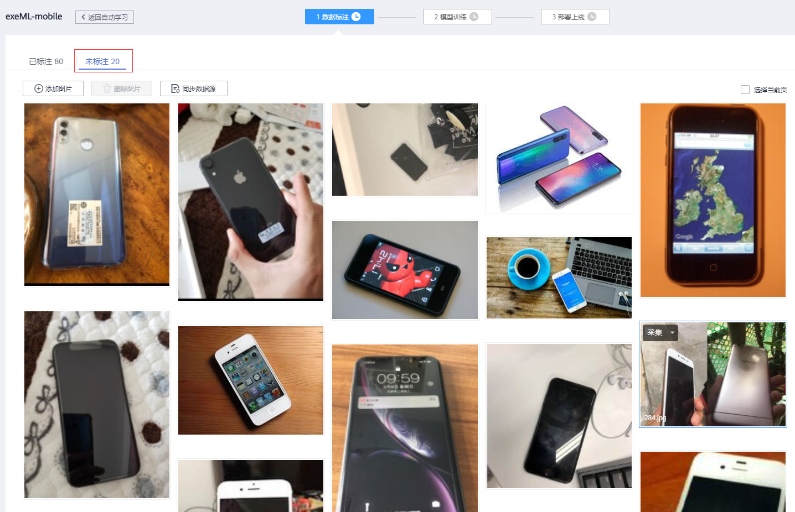
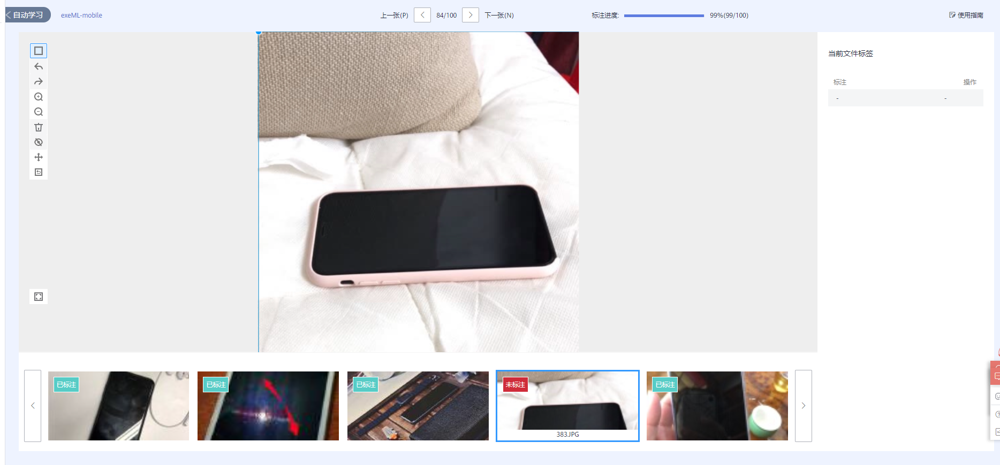
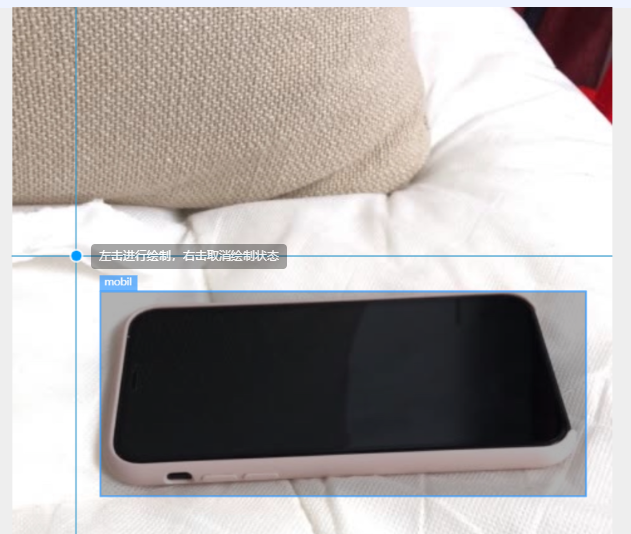
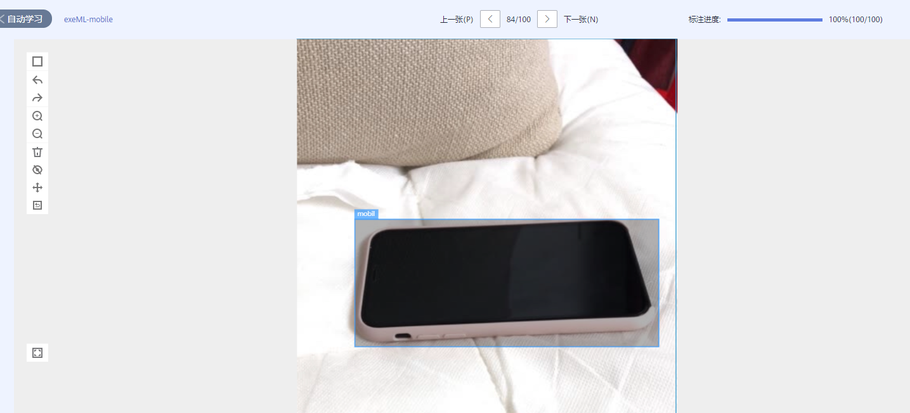
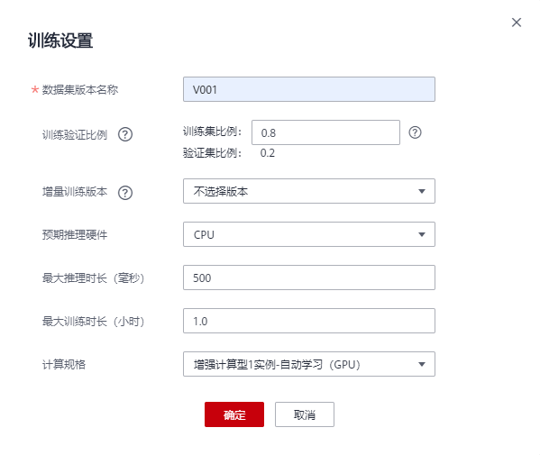
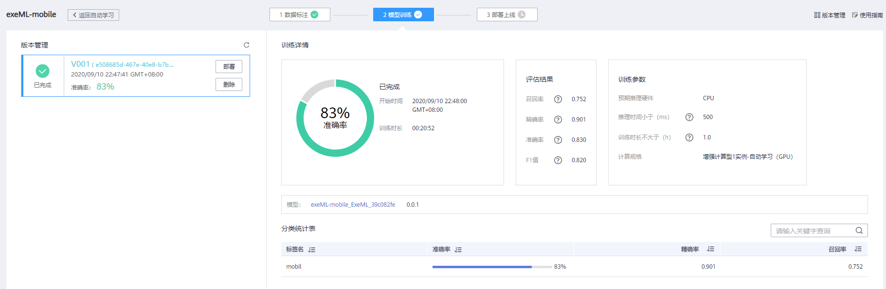

# 使用ModelArts自动学习快速构建手机检测应用

本样例将详细介绍如何使用ModelArts自动学习快速构建物体检测模型，实现手机图像检测应用。

## 服务配置

第一次使用ModelArts服务时，在使用之前需要添加访问密钥，授权作业能够访问华为云存储OBS，若没有添加访问密钥，则无法创建作业。具体操作步骤如下：

1. **创建访问密钥**：在用户基本信息>管理我的凭证页面新增访问密钥，创建后密钥会下载到本地。

2. **设置ModelArts全局配置**：在ModelArts全局配置中添加访问密钥，以授权ModelArts能够访问OBS。

### 1. 创建访问密钥

登录华为云控制台访问账号中心，新增访问密钥并下载到本地，操作步骤如下：

**步骤 1** &#160; &#160;   通过华为云账号访问华为云控制台，点击控制台右上角用户账号信息，跳转到“用户中心”。请参考图1。

图1 用户中心

**步骤 2** &#160; &#160; 在“用户中心>基本信息”页面点击“管理我的凭证”，跳转到“我的凭证”页面。请参考图2。

图2 我的凭证

**步骤 3** &#160; &#160; 在“我的凭证”页面切换到“管理访问密钥”页签，执行“新建访问密钥”操作，输入登录密码和短信验证码后，密钥会自动生成并下载到本地，文件名为“credentials.csv”。请参考图3。

图3 新增访问密钥

### 2. 设置ModelArts全局配置

登录ModelArts管理控制台，在“全局配置”中添加访问密钥，具体操作步骤如下：

**步骤 1** &#160; &#160; 登录ModelArts管理控制台，单击左侧导航栏中的“全局配置”页面。请参考图4。

图4 全局配置

**步骤 2** &#160; &#160; 执行“添加访问密钥”操作，输入“credentials.csv”文件中的“Access Key”和“Secret Access Key”信息，执行确定操作，完成访问密钥的设置。请参考图5。

图5 添加访问密钥

## 使用自动学习构建手机检测应用

本节介绍在华为云ModelArts平台如何使用自动学习物体检测对手机数据集进行标注，然后进行模型训练并将模型部署上线，从而构建手机检测应用。操作步骤分为5部分，分别是：

1. **准备数据**：使用OBS Browser上传数据。
2. **创建物体检测项目**：在ModelArts创建自动学习物体检测项目。
3. **数据标注**：完成手机图片的标注操作。
4. **模型训练**：数据标注完成后开始模型的自动训练。
5. **部署上线**：将训练生成的模型部署上线并且上传图片进行测试。

### 1. 准备数据

华为云AI市场中有开发者分享了丰富的数据集，大家可以前往订阅使用。本案例采用银行存款预测场景的数据集，数据集中包含年龄、职业等7个字段的302条数据。我们从华为云AI市场订阅数据集至数据云存储位置，然后就可以在ModelArts中引入使用了。

**步骤 1** &#160; &#160; 请点击[此处](https://marketplace.huaweicloud.com/markets/aihub/datasets/detail/?content_id=a7f6ffb2-ef20-4d11-8a14-cbaea8cd01ce)，进入该数据集主页，点击,进入下载详情。

**步骤 2** &#160; &#160; 下载方式选择ModelArts数据集，目标区域选择华北-北京一，点击目标位置输入框右侧的图标选择OBS路径，如下图：

**步骤 3** &#160; &#160; 待页面跳转到OBS新建桶页面，填写桶名，本案例为**obs-tempbucket**，其余设置保持默认创建桶，如下图：

**步骤 4** &#160; &#160; 待OBS桶新建完毕回到下载详情，点击obs右侧刷新按钮进行刷新，能看到上一步创建的桶，点击新建文件夹进行文件的创建，如下图：

**步骤 5** &#160; &#160; 按照如下提示填写下载详情：

下载方式：选择ModelArts数据集

目标区域：华北-北京一

目标位置：选择一个OBS路径，作为数据集的存储位置。

名称： dataset-mobilphone

描述： (可为空)

填写好参数后，点击按钮，然后点击按钮。等待数据集状态变为推送成功，即可在[ModelArts数据集列表](https://console.huaweicloud.com/modelarts/?region=cn-north-1#/dataset)中查看到下载的数据集。

### 2. 创建物体检测项目

在ModelArts自动学习页面创建物体检测项目，操作步骤如下：

**步骤 1** &#160; &#160; 登录ModelArts管理控制台，单击左侧导航栏中的“自动学习”。

**步骤 2** &#160; &#160; 单击物体检测“创建项目”按钮，在弹出的对话框中填写项目参数，自定义项目名称（本例输入exeML-mobil），选择训练数据路径（本例为/obs-tempbucket/mobilphone)。请参考图10。

图10 创建物体检测项目

**步骤 3** &#160; &#160; 单击“创建项目”，完成自动学习物体检测项目的创建。项目创建完成后会自动跳转到“数据标注”页面。

### 3. 数据标注

接下来将使用自动学习中数据标注功能对手机图片进行标注，操作步骤如下：

**步骤 1** &#160; &#160; 本次提供的数据中部分图片已经标注，用户可直接使用已经标注的图片进行训练。但如果对模型精度有更高要求，可对未标注的图片进行标注。

首先单击“未标注”页签，可以看到如下界面：

然后单击图片列表中任意一张图片，进入图片标注界面：

本案例使用的标注方法：使用鼠标左键框选图片中物体添加标注框，然后为标注框添加标签 （mobil），看到如下界面说明成功标注了一张图片：

所有图片标注完成后，单击左上角“exeML-mobil”返回：

### 4. 模型训练

完成数据标注后，接下来开始模型的自动训练，操作步骤如下：

**步骤 1** &#160; &#160; 在数据标注页面“训练设置”中设置预期推理硬件为CPU，然后单击“开始训练”按钮，即可启动训练（如果标注地不够准确，并且训练时长短，模型精度可能会降低）。请参考图15。

图15 开始训练

**步骤 2** &#160; &#160; 在“模型训练”页面刷新训练状态，等待模型训练完成（需等待20分钟）。请参考图16。

图16 模型训练完成

### 5. 部署上线

模型训练完成后，可将模型部署上线并添加图片进行预测，操作步骤如下：

**步骤 1** &#160; &#160; 当训练状态为“已完成”时，可单击“部署”按钮，执行物体检测模型的部署。请参考图17。

图17 模型部署

**步骤 2** &#160; &#160; 在“部署上线”页面可上传手机图片进行模型测试，测试结果可在页面上进行显示，如果觉得模型准确率不满足预期，可在“数据标注”页面中添加图片并进行标注，再次进行模型训练及发布。

首先单击"上传"按钮，上传[测试图片](https://cdn.jsdelivr.net/gh/huaweicloud/ModelArts-Lab/ExeML/ExeML_Mobilphone_Detection/test/249.jpg)（位于./test目录下），进行预测。

预测结果如下图所示：

至此手机检测应用实验完成。
