# 零代码动物叫声分类模型开发

本案例将详细介绍使用ModelArts自动学习声音分类识别动物叫声。

## 准备工作

参考[此文档](https://github.com/huaweicloud/ModelArts-Lab/tree/master/docs/ModelArts准备工作)，完成ModelArts准备工作。包括注册华为云账号、ModelArts全局配置和OBS相关操作。

## 下载数据集

首先点击[此处](https://modelarts-labs-bj4.obs.cn-north-4.myhuaweicloud.com:443/ExeML/ExeML_Sound_Classification/sound_classification.zip)下载数据集压缩包至本地，然后解压。可以得到文件夹`sound_classification`。

训练集位于`sound_classification\train`目录下，共4类动物叫声，分别是鸟（bird）、猫（cat）、狗（dog）和虎（tiger），每种动物25个叫声音频数据，共一百条音频数据。测试集位于`sound_classification\test`目录下，每种动物提供5个叫声音频数据。音频数据格式均为`wav`格式，均可在各音频播放器直接播放试听。

## 创建声音分类项目

点击进入[ModelArts自动学习](https://console.huaweicloud.com/modelarts/?region=cn-north-4#/manage/autoML)界面，然后点击“声音分类”创建项目按钮：

按照如下示例填写参数：名称、数据集名称、数据集输入位置、数据集输出位置。

最后点击“创建项目”完成声音分类项目创建。

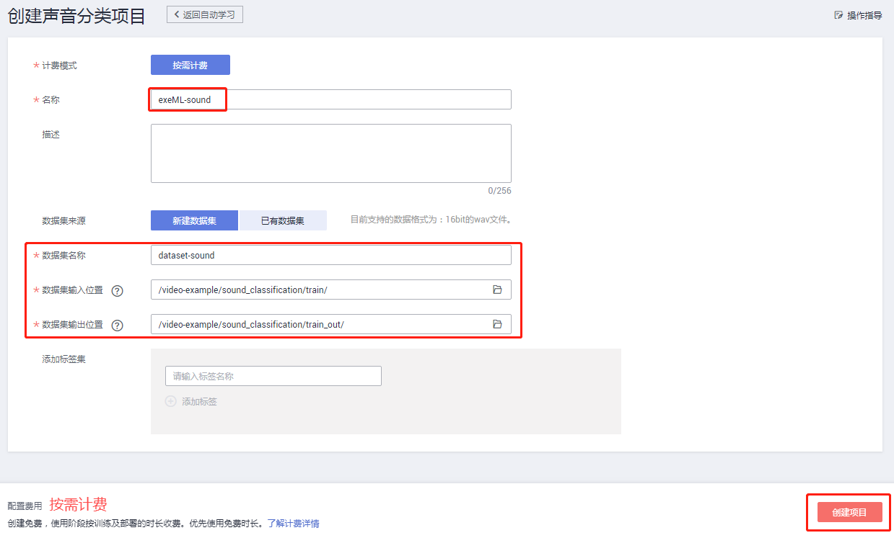

## 动物叫声音频数据上传

进入声音分类项目后，首先进入数据标注界面。点击下图中的“添加音频”按钮：

添加任一个动物文件夹下数据，注意要求“仅支持WAV格式音频文件，单个音频文件不能超过4MB，且单次上传的音频文件总大小不能超过8MB。
”，点击确定：

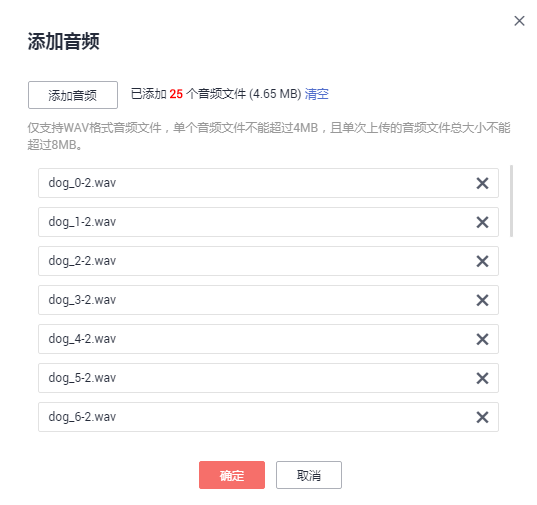

可以看到上一步选取的音频文件已全部上传并显示未标注，此处可以点击播放音频文件：

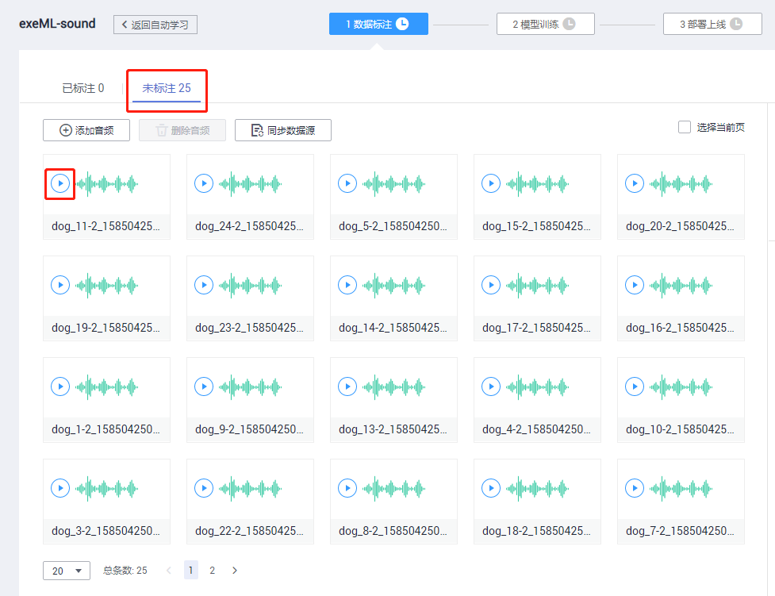

## 动物叫声音频数据标注

在“未标注”页面，批量选中相同类别的音频文件，在右侧添加标签名称，最后点击“确定”按钮。

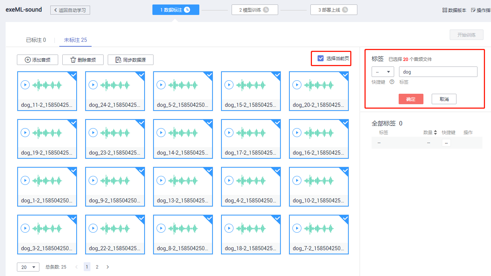

随后可以看到刚才选中的音频文件已标注完成

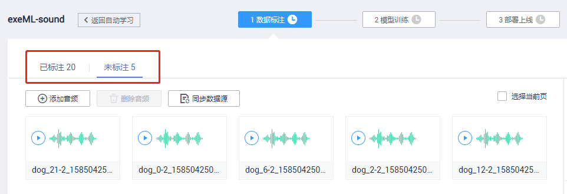

按照同样的方法，将所有训练数据上传并进行标注，直到100个音频数据文件全部标注完，确认每类动物的数量为25，可以点击右侧的标签来查看每个标签对应的文件。

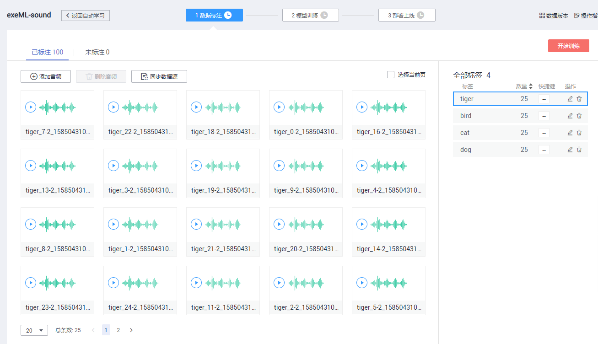

如果发现标签不正确，可以选中音频数据，重新选择标签。

## 模型训练

点击右上角“开始训练”按钮，设置数据集版本名称，可以选择设置训练时长（不同任务类型和数据量需要的训练时长不一样），点击“确定”即可开始训练。

训练任务提交成功，自动跳转模型训练的界面。

大概花1分30秒左右，模型训练完成。可以看到训练时长和训练结果，包括准确率、召回率、精确率、F1值等常用评价指标，还可以看到具体每个类别的评价指标。

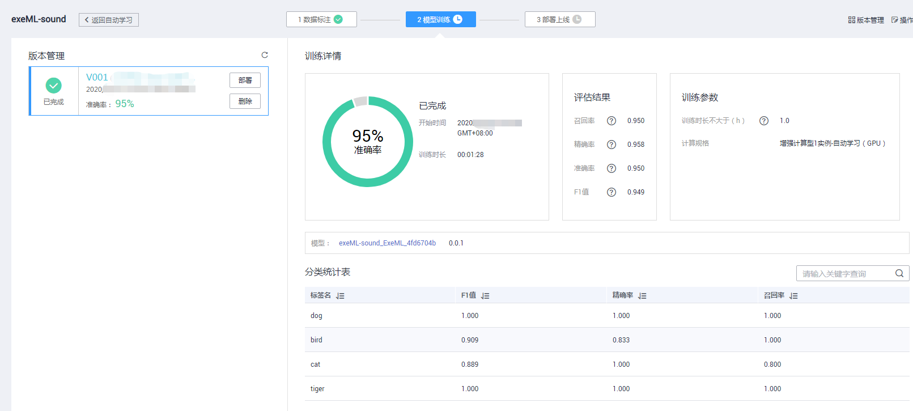

## 模型部署

点击左侧“部署”按钮，将模型部署为一个在线服务：

选择节点计算规格，是否自动停止，点击确定开始部署模型。

部署任务提交成功，自动跳转部署上线的界面。

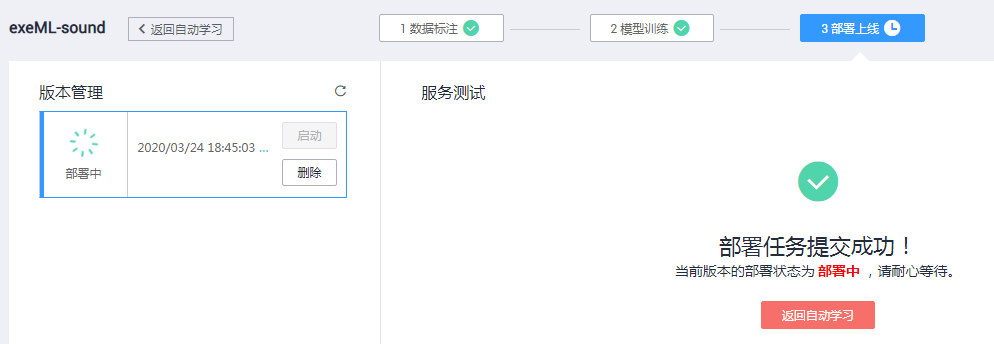

## 服务测试

部署成功后，左侧显示服务状态为“运行中”，此时可以进行在线预测。

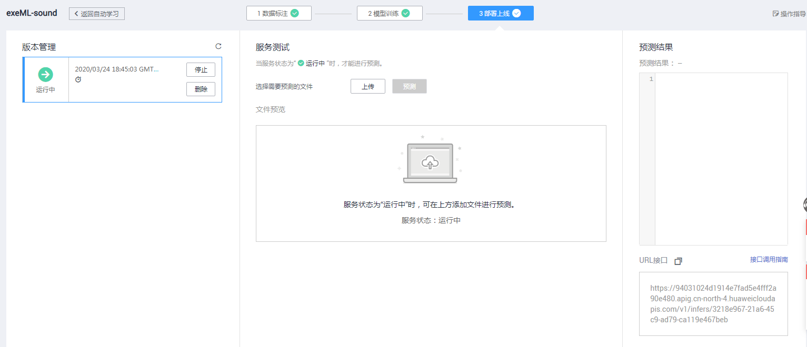

点击“上传”按钮，上传一张本地的测试文件（从测试集`test`目录中挑选）。上传的音频文件可以实时播放。

点击“预测”按钮进行在线预测，右侧可以看到预测结果和URL接口。

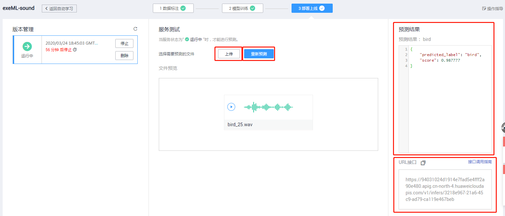

同时，自动学习部署的服务可以在ModelArts控制台的“部署上线” -> “在线服务”中调用。

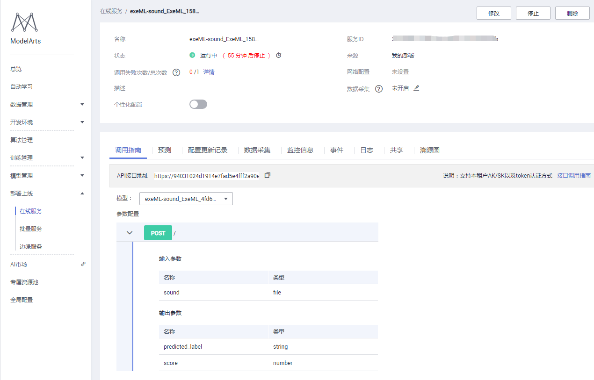

进入“预测”，可以进行测试文件上传，上传的音频文件可以播放，进行在线预测，右侧可以看到预测结果。

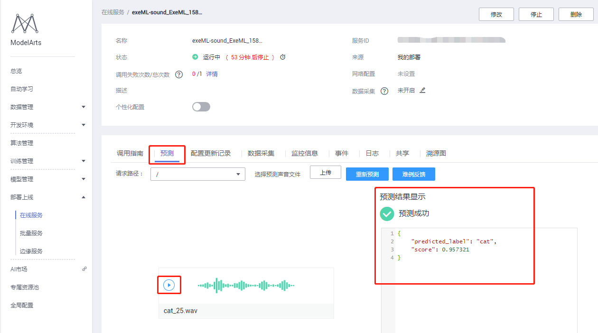

下面是另外两类动物的在线预测结果，可以看到模型的预测效果比较好。

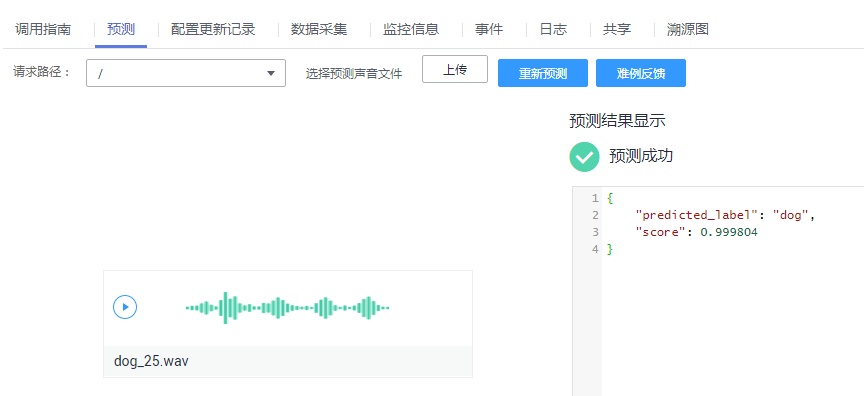

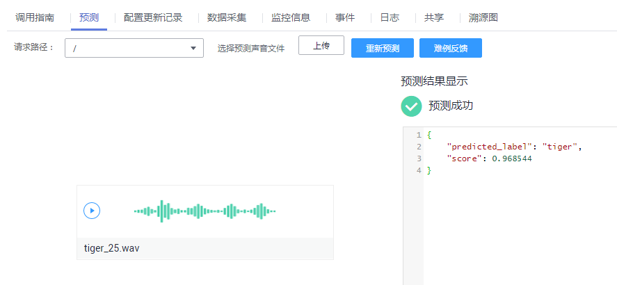

## 关闭在线服务

在使用完部署的服务后，需关闭服务，否则会持续收费。可以通过以下两种方式关闭服务：

1. 在“自动学习” -> “部署上线”中停止在线服务；

2. 在“部署上线” -> “在线服务”中停止在线服务。

当需要使用该在线服务的时候，可以重新启动该在线服务。

至此，完成零代码动物叫声分类。

