# 使用ModelArts自动学习快速构建云宝检测应用

聪明可爱的“云宝”是华为云的吉祥物。本样例将详细介绍怎样用自动学习方法快速构建云宝检测应用。

## 服务配置

如果是第一次使用ModelArts服务，在使用之前需要给服务添加访问密钥，授权作业能够访问华为云存储OBS，若没有添加访问秘钥，则无法创建作业。具体操作步骤如下：

1. **生成访问秘钥**：在用户基本信息>管理我的凭证页面新增访问秘钥，创建后秘钥会下载到本地。

2. **设置ModelArts全局配置**：在ModelArts服务页面，添加访问秘钥，以授权访问OBS，使用ModelArts各项功能。

   

### 1. 生成访问秘钥

登陆华为云控制台访问账号中心，用户新增访问秘钥并下载到本地保存，操作步骤如下：

**步骤 1** &#160; &#160;   通过华为云账号访问华为云控制台，点击控制台右上角用户账号信息，跳转到“用户中心”。请参考图1。

图1 “用户中心”页面

**步骤 2** &#160; &#160; 在“用户中心>基本信息”页面点击“管理我的凭证”，跳转到“我的凭证”页面。请参考图2。

图2 “我的凭证”页面

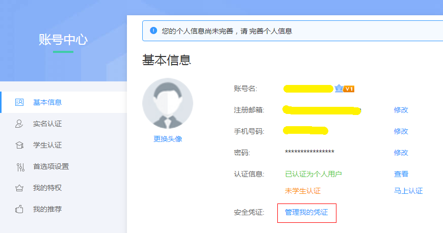

**步骤 3** &#160; &#160; 在“我的凭证”页面切换到“管理访问秘钥”页签，执行“新建访问密钥”操作，输入登陆密码和短信验证码后，密钥会自动生成并下载到本地，文件名为“credentials.csv”。请参考图3。

图3 新增访问秘钥

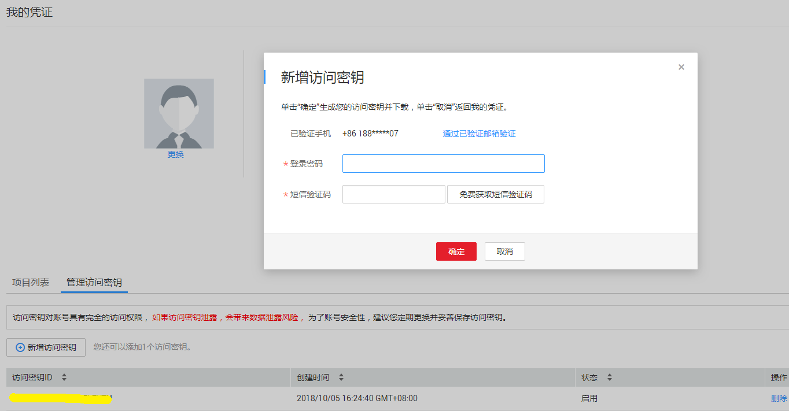

### 2. 设置ModelArts全局配置

登陆ModelArts服务控制台，在“全局配置”中设置全局访问秘钥，具体操作步骤如下：

**步骤 1** &#160; &#160; 登陆ModelArts服务页面，通过左侧导航栏进入到“全局配置”页面。请参考图4。

图4 全局配置界面

**步骤 2** &#160; &#160; 执行“添加访问秘钥”操作，输入“credentials.csv”文件中的“Access Key”和“Secret Access Key”信息，执行确定操作，完成全局秘钥的设置。请参考图5。

图5 添加访问秘钥

## 使用自动学习构建云宝检测应用

本章节介绍在华为云ModelArts平台如何使用自动学习物体检测对预置的云宝数据集进行训练，快速构建云宝物体检测应用。操作步骤分为2部分，分别是：

1.	**准备数据**：在ModelArts市场数据集中找到云宝数据集，并导入OBS。
2.	**自动学习模型训练和部署**：使用自动学习物体检测模型对创建的云宝数据集进行训练并部署。

### 1. 准备数据

通过ModelArts市场预置数据集创建自动学习所需数据集版本，操作步骤如下：

**步骤 1** &#160; &#160; 登录“ModelArts”管理控制台，单击左侧导航栏的“市场”。

**步骤 2** &#160; &#160; 切换到ModelArts市场的“数据集”页面，找到云宝预置数据集“Yunbao-Data-Custom”。

**步骤 3** &#160; &#160; 进入到该预置数据集Yunbao-Data-Custom的详情页面，执行“导入我的数据集操作”，输入自定义的数据集名称与存储路径后（本例输入数据集名称为Yunbao-Auto-Learning，存储路径为/yunbao-ccv/Yunbao-Data-Custom/，注意桶名全局唯一，建议桶名包含随机值以防止桶名重复），点击前往数据集，页面会自动跳转到“数据管理>数据集”页面进行创建。

**步骤 4** &#160; &#160; 在“数据管理>数据集”页面查看直到云宝数据集（Yunbao-Auto-Learning）创建完成，数据详细信息完全加载。

**步骤 5** &#160; &#160; 在数据集目录页面获取创建的云宝数据集的桶信息yunbao-ccv。请参考图6。

图6 数据集

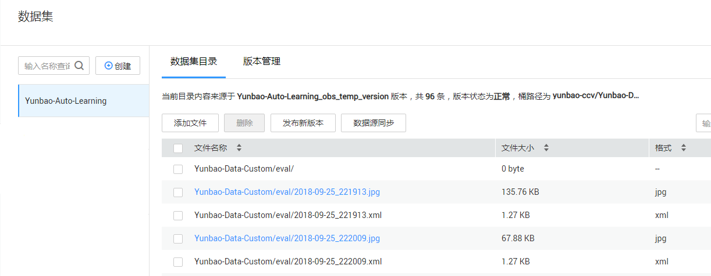

### 2. 自动学习模型训练发布

接下来将使用自动学习>物体检测对云宝数据集进行训练并发布模型，操作步骤如下：

**步骤 1** &#160; &#160; 返回“ModelArts”管理控制台界面。单击左侧导航栏的“自动学习”，进入“自动学习”界面。请参考图7。

图7 自动学习界面

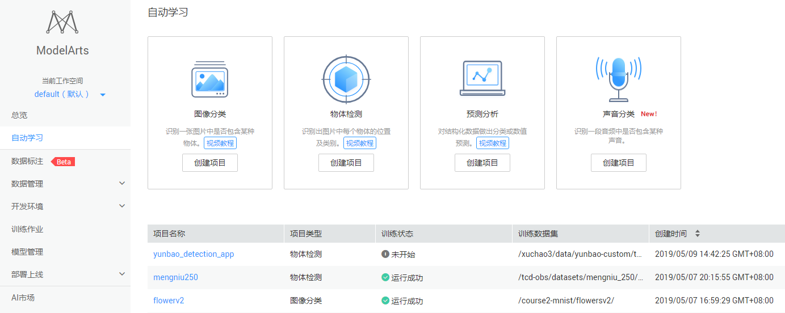

**步骤 2** &#160; &#160; 点击“物体检测”创建项目按钮，创建自动学习>物体检测工程，自定义工程名称（本例输入demo-yb-8826），训练数据选择云宝数据集的OBS路径/yunbao-ccv/Yunbao-Data-Custom/train/（确保目录结构正确，选择到train层，否则会报错），点击“创建项目”完成物体检测工程创建。请参考图8。

图8 创建项目

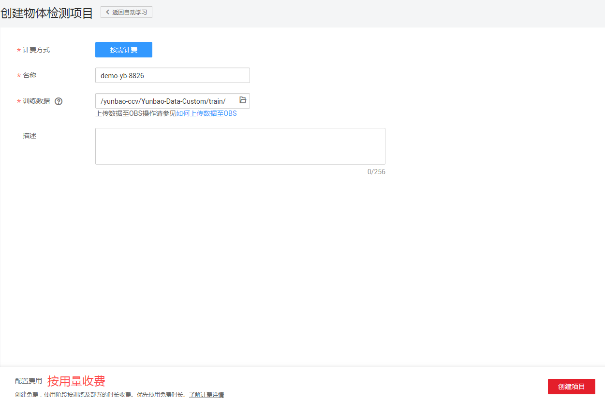

**步骤 3** &#160; &#160; 页面会自动跳转到项目界面，并自动开始同步数据源。最终显示“数据源同步完成”说明数据同步成功。请参考图9。若同步出现问题，可以点击同步数据源按钮再次执行同步数据源操作。

图9 数据源同步

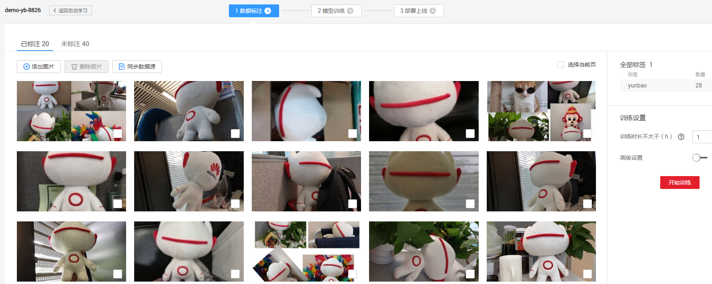

**步骤 4** &#160; &#160; 本次提供的数据集部分数据已经标注，用户可直接使用已经标注的部分进行训练。但如果对模型精度有更高要求，可对未标注的图片进行标注。

首先点击“未标注”页签，可以看到如下界面：

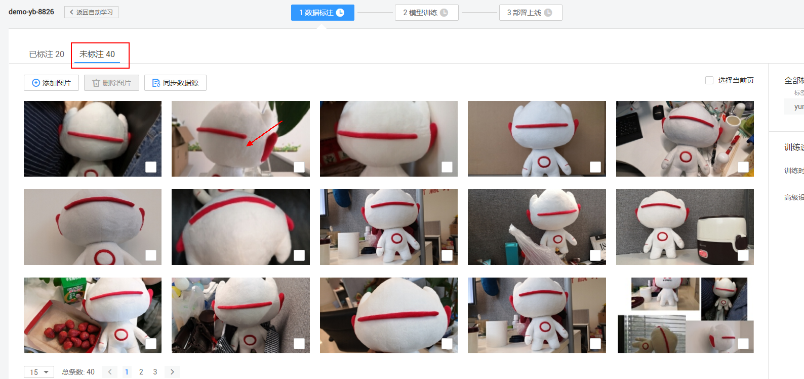

然后点击其中一张图片，进入图片标注界面：

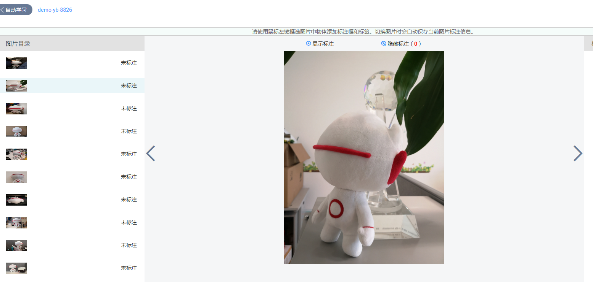

本案例（物体检测技术）使用的标注方法是：使用鼠标左键框选图片中物体添加标注框，然后为标注框添加标签 （yunbao）。看到如下界面说明成功标注了一张图片：

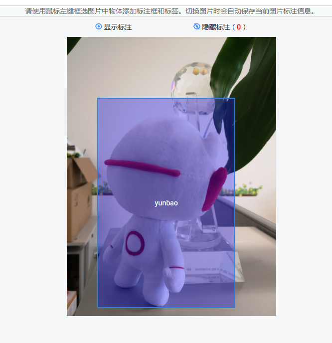

所有图片标注完成后，点击“保存并返回”按钮：

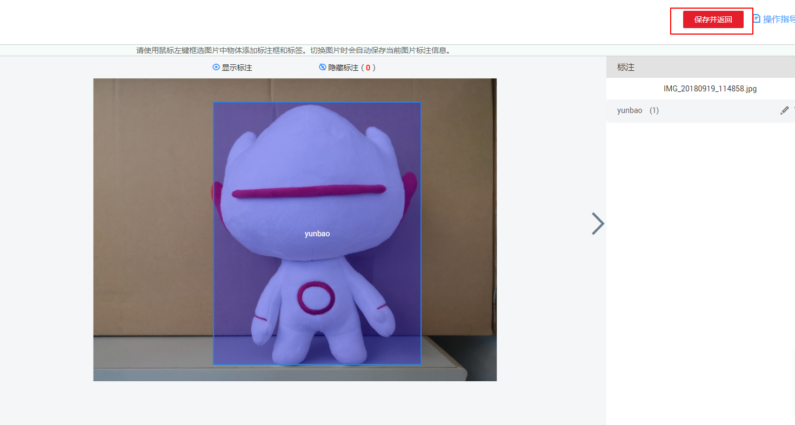

设置训练时长为0.1（h），然后点击“开始训练”按钮，即可启动训练（如果标注地不够准确，并且训练时长短，模型精度可能会降低）：

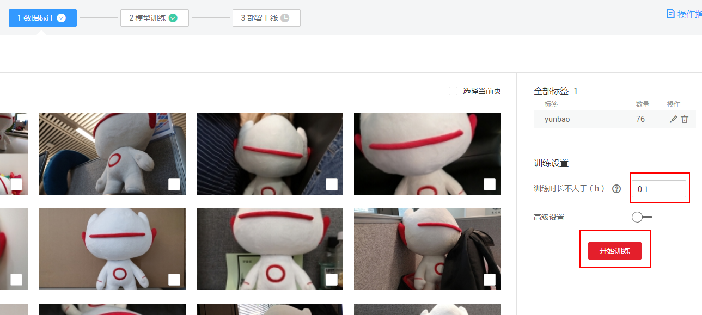

**步骤 5** &#160; &#160; 在“模型训练”页签刷新训练状态，等待模型训练完成（不会超过6分钟）。请参考图11。

图11 模型训练完成

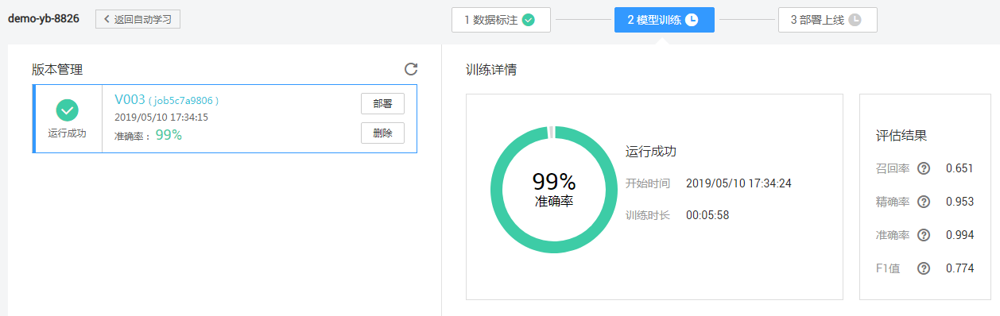

当状态为“已完成”时可点击“部署”按钮，执行物体检测模型部署。请参考图12。

图12 模型部署

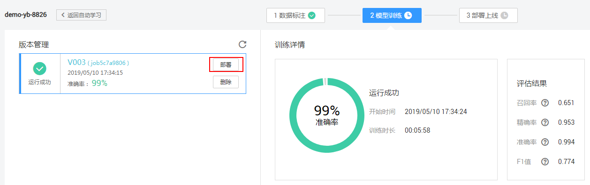

**步骤 6** &#160; &#160; 在“部署上线”页签可上传云宝图片进行模型测试，测试结果可在页面上进行显示，如果觉得模型准确率不满足预期，可在“数据标注”页签中添加图片并进行标注，再次进行模型训练及发布。

首先点击"上传本地图片按钮"添加本地测试图片（位于./data/test目录下），进行预测：

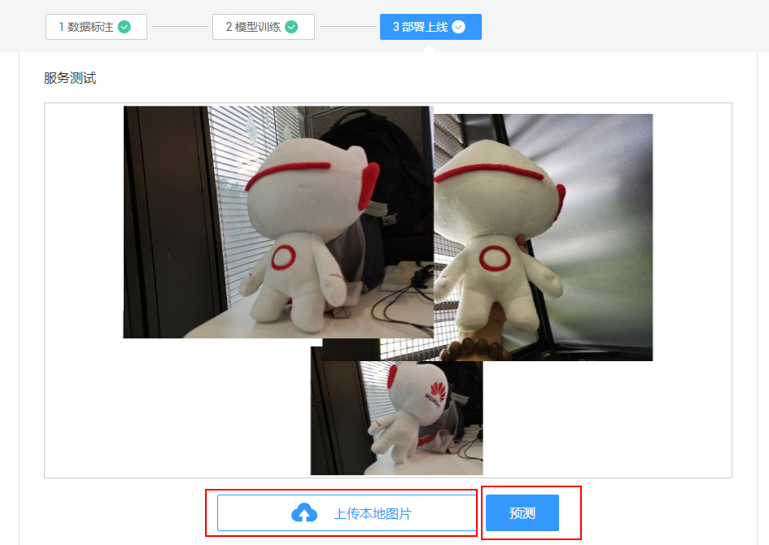

预测结果下图所示：

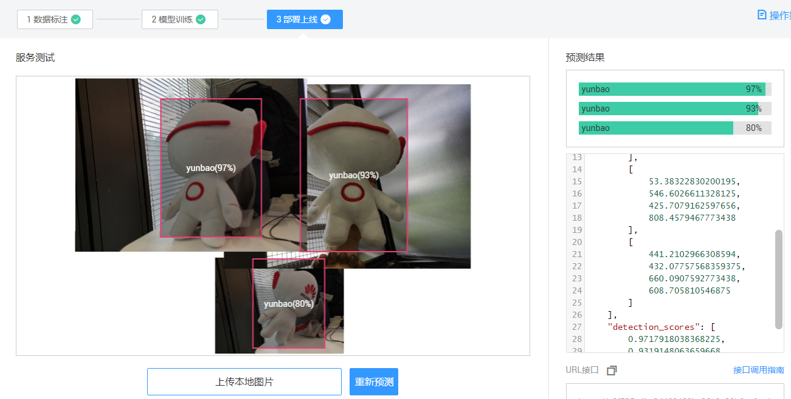

至此，云宝检测应用实验完成。

