# 手势识别案例

## 案例内容
此Codelab将带领开发者体验端云协同开发，首先使用ModelArts开发训练手势识别模型，然后，使用HiLens部署模型到HiLens Kit，并进行手势识别，端到端掌握AI业务全流程开发实践技能。开发技能的流程如图所示：

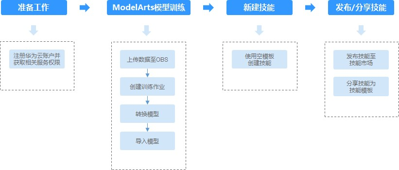

## 案例目标

- 掌握使用ModelArts训练手势识别AI模型。

- 掌握使用HiLens部署模型，展示模型的效果。 

## 您需要什么？

- 一台电脑（Windows）

- 一条网线 

- 谷歌浏览器

- 一台HiLens Kit（如需购买，请在[此处](https://console.huaweicloud.com/hilens/?region=cn-north-4&locale=zh-cn#/hilens/skillMarket/hilensKitPurchase)购买）
## 准备工作
请参照[此链接](https://github.com/huaweicloud/ModelArts-Lab/blob/master/HiLens/Gesture_Recognition/preparation.md)，完成准备工作
### 准备数据    

从[此链接](https://modelarts-labs.obs.cn-north-1.myhuaweicloud.com/codelab/gesture/gesture-data.tar.gz)下载数据到本地，解压。

通过OBS Browser上传数据集文件夹到刚刚创建的OBS桶下，可以参考[此文档](https://support.huaweicloud.com/qs-obs/obs_qs_0002.html) 。
## ModelArts模型训练及转换 
### 创建训练作业    
接下来将通过ModelArts训练作业功能训练AI模型，在此过程中应用ModelArts的预置算法Resnet50训练出一个图像分类模型。
1. 进入[ModelArts管理控制台](https://www.huaweicloud.com/product/modelarts.html)，点击左侧工具栏“**训练管理**”>“**训练作业**”，进入“训练作业”页面。
2. 单击“**创建**”，进入“创建训练作业”页面。
3. 在“创建训练作业”页面，填写训练作业相关参数，然后单击“**下一步**”。
 
   a.	在基本信息区域，“计费模式”和“版本”为系统自动生成，不需修改。请根据界面提示填写“名称”和“描述”。

  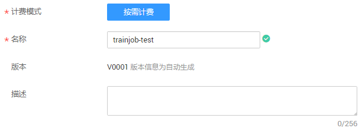

   b.在参数配置区域，选择“数据来源”，设置“算法来源”、“运行参数”、“训练输出位置”和“作业日志路径”.

   * 数据来源：由于导入的数据集已完成标注，因此直接从数据存储位置导入即可。单击“**数据存储位置**”，然后单击文本框右侧的“**选择**”，选择数据集所在的OBS路径，如“/hilens-test1/gesture-data/”。
   * 算法来源：单击“**选择**”，从“预置算法”列表中，选择“**ResNet_v1_50**”算法。
   * 运行参数：选择“ResNet_v1_50”算法后，默认包含“max_epoches”参数，默认值为“100”。针对此案例，建议将“max_epoches”参数值修改为 **“10”** ，1个epoch代表整个数据集训练一遍，此运行参数表示训练10个epoch，“max_epoches”值越大训练时间越长。针对此案例，需增加参数“**export_model = FREEZE_GRAPH_BINARY**”，保存frozen的“.pb”模型，因为转换模型时只支持“.pb”模型。
   * 训练输出位置：从已有的OBS桶中选择模型和预测文件存储路径。使用准备工作中已创建好的“**gesture-data-output**”文件夹。如果没有可用文件夹，您可以单击“**选择**”，在弹出对话框中新建文件夹。
   * 作业日志路径：从已有的OBS桶中选择日志存储路径。使用准备工作中已创建好的“gesture-data-record”文件夹。如果没有可用文件夹，您可以单击“选择”，在弹出对话框中新建文件夹。

   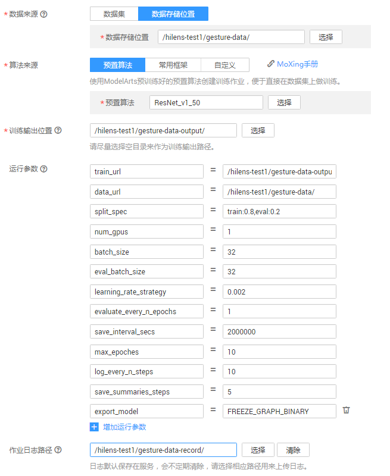

   c.	在资源设置区域，单击资源池文本框右侧的“选择”，选择“公共资源池”和“GPU”；规格分为p100和v100两种，v100规格的GPU的p100规格的GPU更佳，但两者价格不同，请按需选择；“计算节点个数”设置为“1”。  

  
     
   d.	完成信息填写，单击“下一步”。
4. 在“规格确认”页面，确认填写信息无误后，单击“**立即创建**”。
5. 在“训练作业”管理页面，可以查看新建训练作业的状态。训练作业的创建和运行需要一些时间，若max_epoches=10，需要3分钟左右；若max_epoches=50，需要10分钟左右。当状态变更为“运行成功”时，表示训练作业创建完成。
您可以单击训练作业的名称，可进入此作业详情页面，了解训练作业的“配置信息”、“日志”、“资源占用情况”和“评估结果”等信息。在“训练输出位置”所在的OBS路径中，即“/hilens-test1/gesture-data-output/”路径，可以获取到生成的模型文件。

### 转换模型   

1.	进入[ModelArts管理控制台](https://www.huaweicloud.com/product/modelarts.html)，在左侧导航栏中选择“ **模型管理**”>  “**压缩/转换**”，进入模型转换列表页面。
2.	单击左上角的“**创建任务**”，进入任务创建任务页面。
3.	在“创建任务”页面，填写相关信息。
  * 名称：输入“**gesture-data**”。
  *	描述：输入识别手势的简短描述，如：将识别手势技能模型转换为“.om”格式。
  *	转换模板：选择“**TensorFlow frozen graph 转 Ascend**”。
  *	转换输入目录：在OBS路径“/hilens-test1/”下新建文件夹“gesture-convert-input”，把文件夹“gesture-data-output”中输出的训练作业数据中“model.pb”文件放入新建文件夹“gesture-convert-input”中，选择转换输入目录为“hilens-test1/gesture-convert-input”。
  *	转换输出目录：在OBS路径“/hilens-test1/”下新建文件夹“gesture-convert-output”，选择转换输出目录为“hilens-test1/gesture-convert-output”。
  *	高级选项：设置“学习框架类型”为“**3**”，“输入张量形状”为“**images:1,224,224,3**”。
 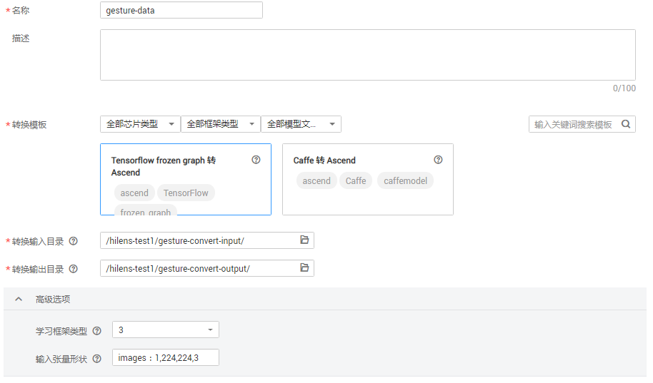

4.	任务信息填写完成后，单击右下角“**立即创建**”。
创建完成后，系统自动跳转至“模型压缩/转换列表”中。刚创建的转换任务将呈现在界面中，其“任务状态”为“初始化”。任务执行过程预计需要几分钟到十几分钟不等，请耐心等待，当“任务状态”变为“成功”时，表示任务运行完成并且模型转换成功。
如果“任务状态”变为“失败”，建议单击任务名称进入详情页面，查看日志信息，根据日志信息调整任务的相关参数并创建新的转换任务。

##  新建技能
### 导入模型    
1.	登录[Huawei HiLens管理控制台](https://console.huaweicloud.com/hilens/)，在左侧导航栏中选择 **“技能开发”** > **“模型管理”**，进入“模型管理”页面。
2.	在“模型管理”页面，单击右上角的 **“导入（转换）模型”**。
3.	在“导入模型”页面，然后参考图3-1填写参数，信息确认无误后单击 **“确定”**完成导入。
 *	名称：输入 **“gesture-recognition”**。
 *	版本：输入 **“1.0.0”**。
 *	描述：输入导入模型的简短描述。
 *	模型来源：单击 **“从ModelArts导入”**，在右侧下拉框中选择 **“OM（从转换任务中获取）”**，然后在下方转换任务列表中勾选之前在ModelArts转换的模型 **“gesture-data”**。
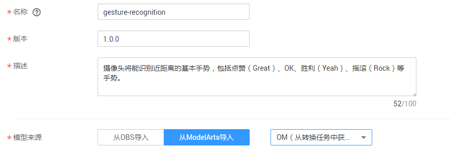

    模型导入后，将进入 **“模型管理”** 页面，您导入的模型可从列表中查看。

### 开始新建技能   
1. 在[Huawei HiLens管理控制台](https://console.huaweicloud.com/hilens/)的左侧导航栏中选择 **“技能开发” > “技能管理”**，进入技能列表。
2. 在“技能管理”页面，单击右上角 **“新建技能”**，进入“创建技能”页面。  
3. 填写基本信息  
在“创建技能”页面，在“技能模板”中选择“使用空模板”后，填写基本信息:  
 *	技能模板：选择 **“使用空模板”**。
 *	名称（英文）：输入 **“Gesture_Recognition”**。
 *	名称（中文）：输入 **“手势识别”**。
 *	版本：输入 **“1.0.0”**。
 *	适用芯片：默认为 **“Ascend310”**。
 *	检验值：输入 **“gesture”**。
 *	应用场景：选择 **“其他”**，文本框中输入 **“手势识别”**。
 *	技能图标：上传技能图片。
 *	技能图片：用来向用户介绍技能的使用或技能的效果，可不上传。
 *	OS平台：选择 **“Linux”**系统。
 *	英文描述：输入技能的英文描述。
 *	描述：输入技能的中文描述。  
 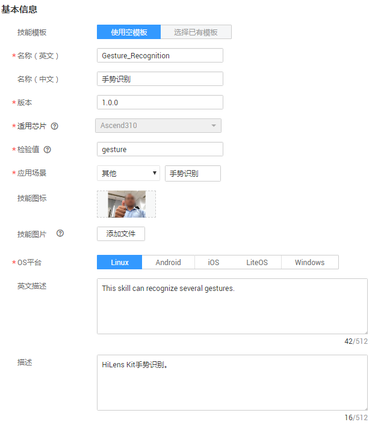  
4. 填写技能内容  
根据您的模型和逻辑代码情况，填写技能内容，详细参数说明如下：
 *	模型：单击加号，您可以在弹出框中，选择导入的模型“gesture-recognition”。
 *	运行时语言：选择“Python3.7”。
 *	代码执行文件：输入“main.py ”。
 *	代码上传方式：选择“在线编辑”，在代码编辑框中直接编辑代码。  
 点击[此链接](https://modelarts-labs.obs.cn-north-1.myhuaweicloud.com/codelab/gesture/gesture_main.py) 将main.py文件下载到本地，将其复制到代码编辑框中。  
 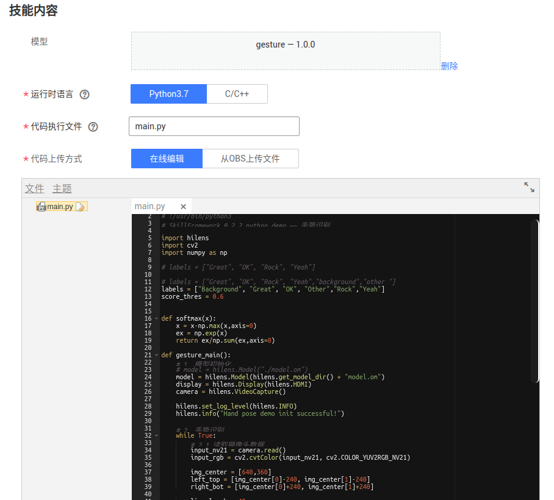  
5. 确认信息并完成新建技能  
上述参数填写完成后，您可以在界面右侧查看其配置参数值，如果某个字段填写错误，在右侧会显示一个小红叉。
确认信息无误后，单击“确定”完成技能创建。

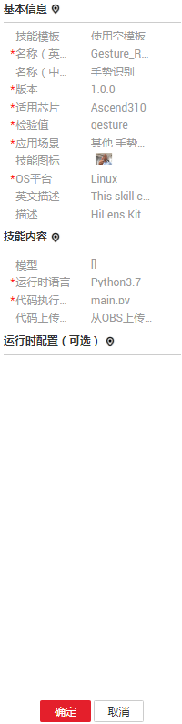

## 部署技能
1. 登录[Huawei HiLens管理控制台](https://console.huaweicloud.com/hilens/)，单击左侧导航栏“技能开发 > 技能管理”，进入“技能管理”页面。
2. 选择需要部署的技能，单击右侧“部署”。
3. 在弹出的部署对话框中，选择需要部署的设备，单击“部署”。
当显示如下类似信息时，表示部署成功。  
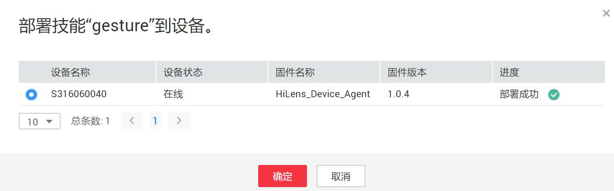  
4. 点击“确定”完成技能部署  
### 启动技能  
登录[Huawei HiLens管理控制台](https://console.huaweicloud.com/hilens/)进入 **“设备管理”** > **“技能管理”**。
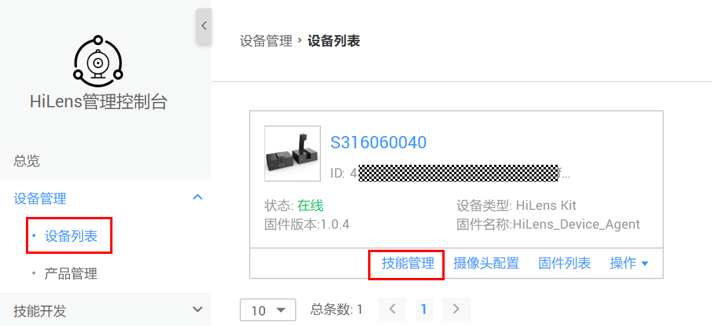

进入技能管理界面，可以看到自己所有技能。将HDMI线连接HiLens Kit和显示屏，点击右侧“**启动**”。

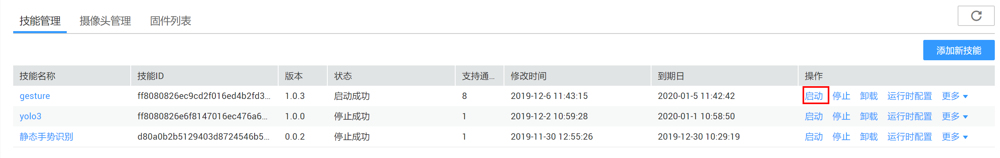

完成启动后，就可以开始使用此技能。使用时，请靠近摄像头，站在画面中央，做出各种手势。摄像头将能识别近距离的基本手势，包括点赞（Great）、OK、胜利（Yeah）、摇滚（Rock）手势。
### 停止技能
为避免技能收费，请及时停止技能。单击左侧导航栏 **“设备管理”** > **“技能管理”**，进入“技能管理”页面。点击技能后面对应的 **“停止”**
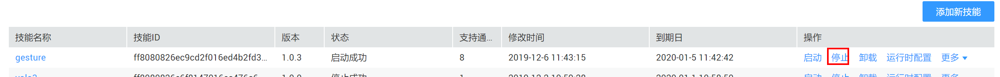

## 注销设备
使用完后为方便其他账号使用，请注销设备。若不将此设备注销，其他用户将无法注册此设备。若此HiLens为您的个人设备，则无需进行此步骤。
### 卸载技能
设备注销时，需先卸载技能。登录[Huawei HiLens管理控制台](https://console.huaweicloud.com/hilens/),依次选择 **“设备管理”**> **“技能管理”**> **“卸载”**。依次卸载所有技能。

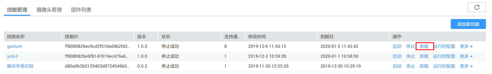

### 注销设备
依次选择 **“设备管理”**> **“注销设备”**，完成设备注销。

## 恭喜你

- 祝贺您，您已经使用华为云完成了端云协用开发任务！

- 您完成了利用ModelArts训练作业训练图像分类AI模型，并通过HiLen Kit部署模型的任务！

### 接下来您可以

### 参考文献

-  https://support.huaweicloud.com/prepare-modelarts/modelarts_08_0001.html 

-  https://support.huaweicloud.com/usermanual-hilens/hilens_02_0001.html 

-  https://support.huaweicloud.com/qs-hilens/hilens_04_0002.html 

-  https://support.huaweicloud.com/qs-obs/obs_qs_0002.html 

