# ModelArts + HiLens 端云协同，开发手势识别AI应用

## 介绍

### 什么是ModelArts?

 ModelArts是面向AI开发者的一站式开发平台，提供海量数据预处理及半自动化标注、大规模分布式训练、自动化模型生成及端-边-云模型按需部署能力，帮助用户快速创建和部署模型，管理全周期AI工作流。 

 "一站式"是指AI开发的各个环节，包括数据处理、算法开发、模型训练、部署都可以在ModelArts上完成。ModelArts底层支持各种异构计算资源，开发者可以根据需要灵活选择使用，而不需要关心底层的技术。 


### 产品优势

- **一站式**

   即使您是一个毫无AI经验的开发者，也可以开"箱"即用。ModelArts平台涵盖AI开发全流程，可灵活使用其中一个到多个功能用于开发工作。

- **易上手**

1. 提供多种预置模型，开源模型想用就用。
2. 模型超参自动优化，简单快速。
3. 零代码开发，简单操作训练出自己的模型。
4. 支持模型一键部署到云、边、端。

- **高性能**

1. 自研MoXing深度学习框架，提升算法开发效率和训练速度。
2. 优化深度模型推理中GPU的利用率，加速云端在线推理。
3. 可生成在Ascend芯片上运行的模型，实现高效端边推理。

### 什么是HiLens 
华为HiLens由具备AI推理能力的HiLens Kit和云上开发平台组成，包括一站式技能开发、设备部署与管理、数据管理、技能市场等，帮助用户开发AI技能并将其推送到端侧计算设备。

### 产品优势
- **端云协同推理**
 1. 端云模型协同，解决网络不稳的场景，节省用户带宽。
 2. 端侧设备可协同云侧在线更新模型，快速提升端侧精度。
 3. 端侧对采集的数据进行本地分析，大大减少上云数据流量，节约存储成本。

- **统一技能开发平台**

    端云协同优化，简洁易用的HiLens Framework，封装基础组件，简化开发者的skill开发工作。
- **跨平台设计**
 1. 支持Ascend芯片以及其他市场主流芯片，可覆盖园区，家庭，商超等主流应用场景。
 2. 针对端侧芯片自动适配和算法优化。

- **丰富的技能市场**
 1. 技能市场预置了多种技能，如人形检测、哭声检测等，用户可以省去开发步骤，直接从技能市场选取所需技能，在端侧上快速部署。
 2. 技能市场的多种模型，针对端侧设备内存小、精度低等不足做了大量算法优化。
 3. 开发者还可通过HiLens管理控制台开发自定义技能并加入技能市场。

## 案例内容
此Codelab将带领开发者体验端云协同开发，首先使用ModelArts开发训练手势识别模型，然后，使用HiLens部署模型到HiLens Kit，并进行手势识别，端到端掌握AI业务全流程开发实践技能。开发技能的流程如图所示：

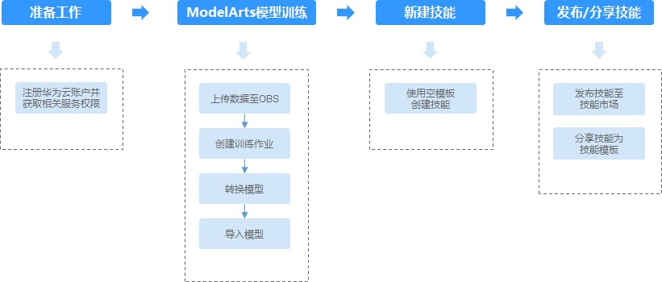

## 案例目标

- 掌握使用ModelArts训练手势识别AI模型。

- 掌握使用HiLens部署模型，展示模型的效果。 


## 您需要什么？

- 一台电脑（Windows）

- 一条网线 

- 谷歌浏览器

- 一台HiLens Kit（如需购买，请在[此处](https://console.huaweicloud.com/hilens/?region=cn-north-4&locale=zh-cn#/hilens/skillMarket/hilensKitPurchase)购买）

## 准备工作

体验手势识别AI应用的开发，需要完成以下准备工作

### 创建华为云账号   Duration：2min

参考[此链接](https://support.huaweicloud.com/prepare-modelarts/modelarts_08_0001.html)，注册华为云账号。

 **注意:** 在使用ModelArts时要及时检查账号状态，避免账号处于欠费或冻结状态时资源被冻结，影响您的使用。 

### 获取访问密钥并完成ModelArts全局配置   Duration：2min

参考[此文档](https://support.huaweicloud.com/prepare-modelarts/modelarts_08_0002.html)完成。

**注意**：访问秘钥文件请妥善保存，使用OBS Browser会用到。


### 完成HiLens基本操作   Duration：20min
1.	将HiLens Kit连接到电脑  
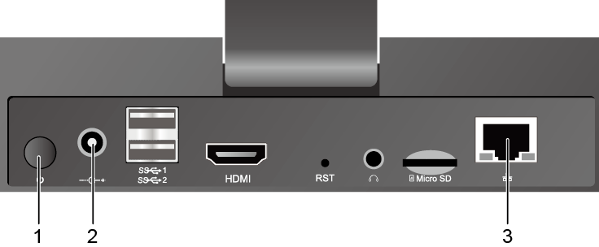  
  
（1）	将DC 12V的电源适配器的端口插入HiLens Kit后面板的电源接口  
（2）	打开HiLens Kit的电源开关（按住开关键1到2秒放开）  
（3）	将网线的一端连接到设备的以太网口上，另一端连接到对端设备的以太网口上。  
正常开机后，如下图显示灯会亮。  
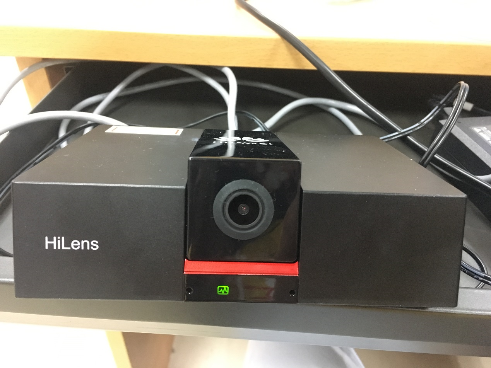 
2. 设置本地IP  
将电脑本地IP修改为和HiLens Kit同一网段，使得本地能SSH登录到HiLens Kit。  
（1）	打开“控制面板”—>“网络和Internet”—>“网络和共享中心”—>“更改适配器设置”  

（2）	鼠标右键“设备连接”，单击“属性”。以“本地连接”为例，右键单击“属性”后，进入本地连接属性。  
设备连接：指HiLens Kit用网线连到电脑后，在电脑的网络连接页面上显示的连接。一般是“本地连接”，如果电脑已有本地连接，设备连接标题可能是“本地连接2”，连接信息一般是“未识别的网络”。  
（3）	点击“属性”—>“网络”，双击“Internet协议版本4（TCP/IPv4）”，设置IP，保证和HiLens Kit的默认IP在一个网段。设备IP默认为 ``192.168.2.111``，本地ip选择192.168.2.1~255（111除外），如下：  
  
（4）	查看HiLens Kit 与电脑是否能够成功通信，需Ping HiLens Kit IP: ``192.168.2.111``。**“如成功ping通HiLens Kit，则进行下一步”**。
 
3. SSH远程连接端侧设备  
打开SSH工具登录到Kit，IP为 ``192.168.2.111``，用户名：``admin``，密码：``Huawei12#$``，然后进入开发者模式，输入``develop``，密码：``Huawei@SYS3``。  
（1）下载安装[mobaXterm](https://mobaxterm.mobatek.net/download.html)  
（2）运行mobaXterm，选择Session，如下图：  
  
（3）在“IES：/->”提示语后执行命令 ``develop``:  
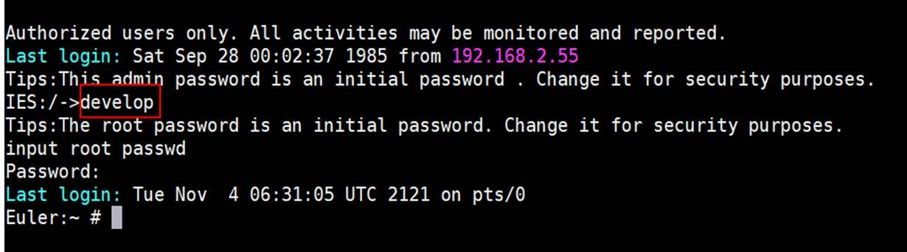  
4. 设置时间  
命令行输入 ``date``，检测HiLens Kit时间与网络时间是否匹配，若不匹配，需要重新设置时间：
```    
    #设置时区为中国时区
    timedatectl set-timezone Asia/Shanghai
    #修改-s后的时间为你当前的时间
    date -s "2019-5-27 16:25:30"
    hwclock -w
    # 查看是否已经同步
    hwclock -r
```
5. 网络连接  
本案例详细介绍HiLens Kit通过WIFI连接网络，其他方式请参考[此文档](https://support.huaweicloud.com/usermanual-hilens/hilens_02_0050.html):  
（1）登录Huawei HiLens智能边缘管理系统
浏览器输入``https://192.168.2.111``，登录Huawei HiLens智能边缘管理系统。用户名为``admin``，密码为``Huawei12#$``  


（2）配置WIFI
单击“网络”，在“网络”页签下，单击“无线网络”，进入“无线网络”配置。选择对应的路由器，单击“连接”，弹出“WIFI连接”对话框，输入正确密码。单击“确定”，完成连接。  
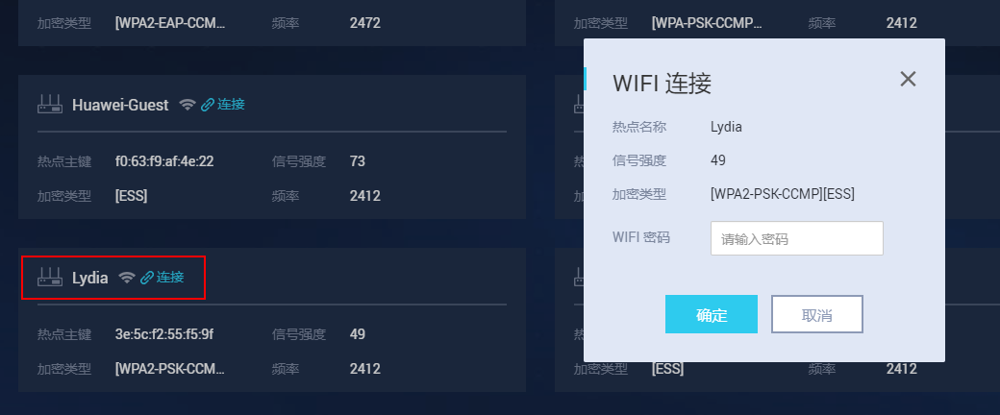  
（3）检测网络  
SSH连接到HiLens Kit，参考本节步骤3：SSH远程连接端侧设备 ，```ping 8.8.8.8``` 或者 ```ping www.baidu.com```，若出现以下信息，说明网络连接成功。  
  
6. 注册设备  
（1）同意授权  
登录Huawei HiLens[管理控制台](https://console.huaweicloud.com/hilens/)，注意，这里region选择“北京四”。如果没有授权HiLens服务，会出现授权弹窗。阅读《华为HiLens服务条款》后，勾选条款，点击 **“同意授权”**
  
（2）登陆HiLens Kit终端  
在检测网络是连接成功状态后，执行以下命令完成设备注册。
```
  hdactl register -u用户名 –d账号名 –n设备名
```
   其中，如果没有IAM账号，则“用户名”和“账号名”一致，都为华为云账号名。如果有IAM账号，则有相应“用户名”和“账号名”。设备名需用户自定义。按回车完成设备注册。
  
  输入注册指令之后，会提示输入密码，此时输入华为云账号密码：
  
（3）注册到HiLens console  
登录Huawei HiLens[管理控制台](https://console.huaweicloud.com/hilens/)，单击左侧导航栏“设备管理>设备列表”，可查看设备状态。注意，这里region选择“北京四”。  

（4）升级固件  
注册完成后，检查固件是否为最新版本。固件版本``1.0.0``为出厂版本，需升级到最新版本，点击 **“设备管理—>设备列表”**，找到你已经注册的设备，点击 **“固件列表”**中，选择最新固件进行升级，如图所示：
   
此时你已经将HiLens Kit与自己的华为云账号关联，请继续完成此次codelab之旅。 

### 下载并登录OBS Browser  

此步骤安装OBS Browser，加下来的内容都需要借助OBS存储数据集，及所需要的模型文件等。

点击[此链接]( https://support.huaweicloud.com/clientogw-obs/zh-cn_topic_0045829056.html )，根据操作系统版本下载相应版本的OBS Browser。

解压OBS Browser压缩包，参考[此文档](https://support.huaweicloud.com/clientogw-obs/zh-cn_topic_0045829058.html) 登录OBS Browser。

**“注意”**：AK SK从访问秘钥文件中获取。

### 创建OBS桶   Duration：2min

**OBS**，即**Object Storage Service**，对象存储服务，是华为云上提供云上储存的服务。在使用ModelArts之前您需要创建一个OBS桶，并在其中创建一个用于存放数据的文件夹。 

登录[OBS管理控制台](https://storage.huaweicloud.com/obs/#/obs/manager/buckets)， 页面右上角单击"**“创建桶”**"，系统弹出如下图所示的对话框，选择"区域"为"**“华北-北京四”**"，输入自定义的桶名称，其他选项保持默认即可，最后点击页面下方"立即创建"按钮即可成功创建。 


### 准备数据   Duration：3min

从[此链接](https://modelarts-labs.obs.cn-north-1.myhuaweicloud.com/codelab/gesture/gesture-data.tar.gz)下载数据到本地，解压。

通过OBS Browser上传数据集文件夹到刚刚创建的OBS桶下，可以参考[此文档](https://support.huaweicloud.com/qs-obs/obs_qs_0002.html) 。
## ModelArts模型训练及转换 
### 创建训练作业   Duration：10min-20min
接下来将通过ModelArts训练作业功能训练AI模型，在此过程中应用ModelArts的预置算法Resnet50训练出一个图像分类模型。
1. 进入[ModelArts管理控制台](https://www.huaweicloud.com/product/modelarts.html)，点击左侧工具栏“**训练管理**”>“**训练作业**”，进入“训练作业”页面。
2. 单击“**创建**”，进入“创建训练作业”页面。
3. 在“创建训练作业”页面，填写训练作业相关参数，然后单击“**下一步**”。
 
   a.	在基本信息区域，“计费模式”和“版本”为系统自动生成，不需修改。请根据界面提示填写“名称”和“描述”。

  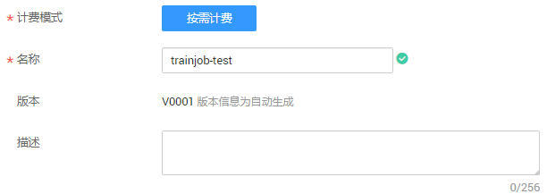

   b.在参数配置区域，选择“数据来源”，设置“算法来源”、“运行参数”、“训练输出位置”和“作业日志路径”.

   * 数据来源：由于导入的数据集已完成标注，因此直接从数据存储位置导入即可。单击“**数据存储位置**”，然后单击文本框右侧的“**选择**”，选择数据集所在的OBS路径，如“/hilens-test1/gesture-data/”。
   * 算法来源：单击“**选择**”，从“预置算法”列表中，选择“**ResNet_v1_50**”算法。
   * 运行参数：选择“ResNet_v1_50”算法后，默认包含“max_epoches”参数，默认值为“100”。针对此案例，建议将“max_epoches”参数值修改为 **“10”** ，1个epoch代表整个数据集训练一遍，此运行参数表示训练10个epoch，“max_epoches”值越大训练时间越长。针对此案例，需增加参数“**export_model = FREEZE_GRAPH_BINARY**”，保存frozen的“.pb”模型，因为转换模型时只支持“.pb”模型。
   * 训练输出位置：从已有的OBS桶中选择模型和预测文件存储路径。使用准备工作中已创建好的“**gesture-data-output**”文件夹。如果没有可用文件夹，您可以单击“**选择**”，在弹出对话框中新建文件夹。
   * 作业日志路径：从已有的OBS桶中选择日志存储路径。使用准备工作中已创建好的“gesture-data-record”文件夹。如果没有可用文件夹，您可以单击“选择”，在弹出对话框中新建文件夹。

   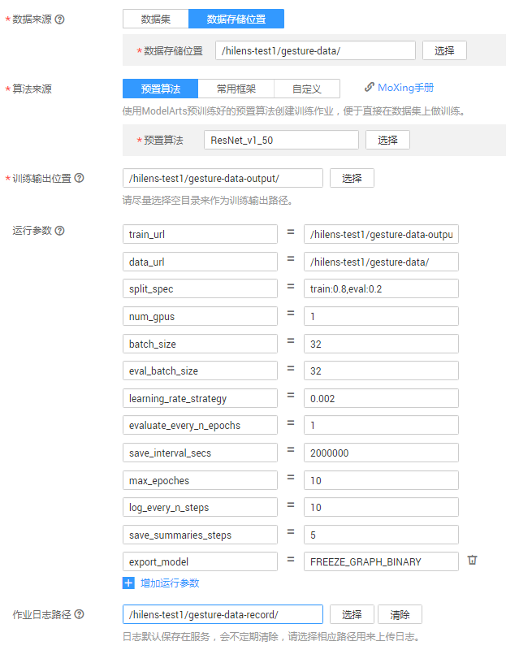

   c.	在资源设置区域，单击资源池文本框右侧的“选择”，选择“公共资源池”和“GPU”；规格分为p100和v100两种，v100规格的GPU的p100规格的GPU更佳，但两者价格不同，请按需选择；“计算节点个数”设置为“1”。  

  
     
   d.	完成信息填写，单击“下一步”。
4. 在“规格确认”页面，确认填写信息无误后，单击“**立即创建**”。
5. 在“训练作业”管理页面，可以查看新建训练作业的状态。训练作业的创建和运行需要一些时间，若max_epoches=10，需要3分钟左右；若max_epoches=50，需要10分钟左右。当状态变更为“运行成功”时，表示训练作业创建完成。
您可以单击训练作业的名称，可进入此作业详情页面，了解训练作业的“配置信息”、“日志”、“资源占用情况”和“评估结果”等信息。在“训练输出位置”所在的OBS路径中，即“/hilens-test1/gesture-data-output/”路径，可以获取到生成的模型文件。

### 转换模型   Duration：3min

1.	进入[ModelArts管理控制台](https://www.huaweicloud.com/product/modelarts.html)，在左侧导航栏中选择“ **模型管理**”>  “**压缩/转换**”，进入模型转换列表页面。
2.	单击左上角的“**创建任务**”，进入任务创建任务页面。
3.	在“创建任务”页面，填写相关信息。
  * 名称：输入“**gesture-data**”。
  *	描述：输入识别手势的简短描述，如：将识别手势技能模型转换为“.om”格式。
  *	转换模板：选择“**TensorFlow frozen graph 转 Ascend**”。
  *	转换输入目录：在OBS路径“/hilens-test1/”下新建文件夹“gesture-convert-input”，把文件夹“gesture-data-output”中输出的训练作业数据中“model.pb”文件放入新建文件夹“gesture-convert-input”中，选择转换输入目录为“hilens-test1/gesture-convert-input”。
  *	转换输出目录：在OBS路径“/hilens-test1/”下新建文件夹“gesture-convert-output”，选择转换输出目录为“hilens-test1/gesture-convert-output”。
  *	高级选项：设置“学习框架类型”为“**3**”，“输入张量形状”为“**images:1,224,224,3**”。
 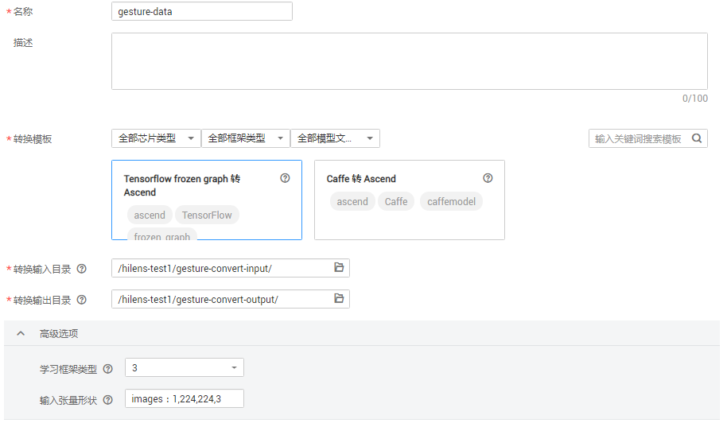

4.	任务信息填写完成后，单击右下角“**立即创建**”。
创建完成后，系统自动跳转至“模型压缩/转换列表”中。刚创建的转换任务将呈现在界面中，其“任务状态”为“初始化”。任务执行过程预计需要几分钟到十几分钟不等，请耐心等待，当“任务状态”变为“成功”时，表示任务运行完成并且模型转换成功。
如果“任务状态”变为“失败”，建议单击任务名称进入详情页面，查看日志信息，根据日志信息调整任务的相关参数并创建新的转换任务。

##  新建技能
### 导入模型   Duration：1min
1.	登录[Huawei HiLens管理控制台](https://console.huaweicloud.com/hilens/)，在左侧导航栏中选择 **“技能开发”** > **“模型管理”**，进入“模型管理”页面。
2.	在“模型管理”页面，单击右上角的 **“导入（转换）模型”**。
3.	在“导入模型”页面，然后参考图3-1填写参数，信息确认无误后单击 **“确定”**完成导入。
 *	名称：输入 **“gesture-recognition”**。
 *	版本：输入 **“1.0.0”**。
 *	描述：输入导入模型的简短描述。
 *	模型来源：单击 **“从ModelArts导入”**，在右侧下拉框中选择 **“OM（从转换任务中获取）”**，然后在下方转换任务列表中勾选之前在ModelArts转换的模型 **“gesture-data”**。
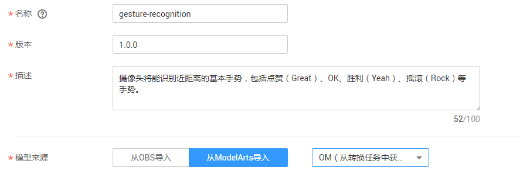

    模型导入后，将进入 **“模型管理”** 页面，您导入的模型可从列表中查看。

### 开始新建技能   Duration：2min
1. 在[Huawei HiLens管理控制台](https://console.huaweicloud.com/hilens/)的左侧导航栏中选择 **“技能开发” > “技能管理”**，进入技能列表。
2. 在“技能管理”页面，单击右上角 **“新建技能”**，进入“创建技能”页面。  
3. 填写基本信息  
在“创建技能”页面，在“技能模板”中选择“使用空模板”后，填写基本信息:  
 *	技能模板：选择 **“使用空模板”**。
 *	名称（英文）：输入 **“Gesture_Recognition”**。
 *	名称（中文）：输入 **“手势识别”**。
 *	版本：输入 **“1.0.0”**。
 *	适用芯片：默认为 **“Ascend310”**。
 *	检验值：输入 **“gesture”**。
 *	应用场景：选择 **“其他”**，文本框中输入 **“手势识别”**。
 *	技能图标：上传技能图片。
 *	技能图片：用来向用户介绍技能的使用或技能的效果，可不上传。
 *	OS平台：选择 **“Linux”**系统。
 *	英文描述：输入技能的英文描述。
 *	描述：输入技能的中文描述。  
 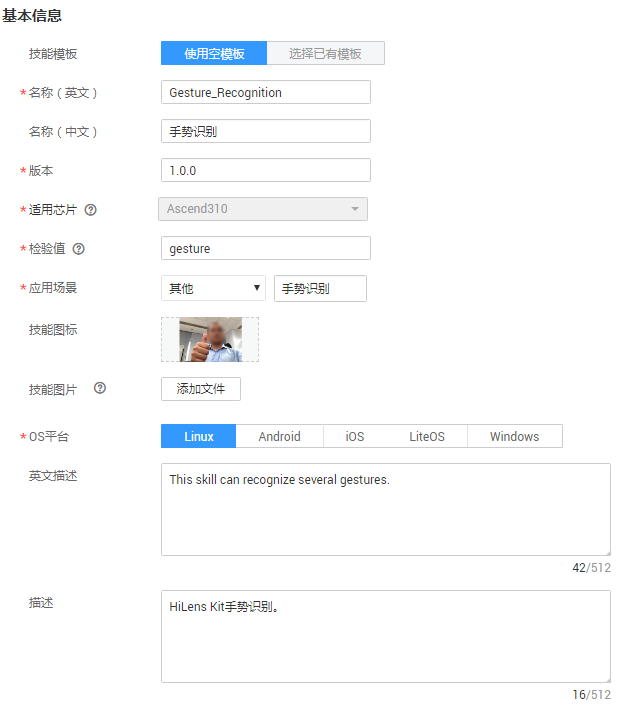  
4. 填写技能内容  
根据您的模型和逻辑代码情况，填写技能内容，详细参数说明如下：
 *	模型：单击加号，您可以在弹出框中，选择导入的模型“gesture-recognition”。
 *	运行时语言：选择“Python3.7”。
 *	代码执行文件：输入“main.py ”。
 *	代码上传方式：选择“在线编辑”，在代码编辑框中直接编辑代码。  
 点击[此链接](https://modelarts-labs.obs.cn-north-1.myhuaweicloud.com/codelab/gesture/gesture_main.py) 将main.py文件下载到本地，将其复制到代码编辑框中。  
 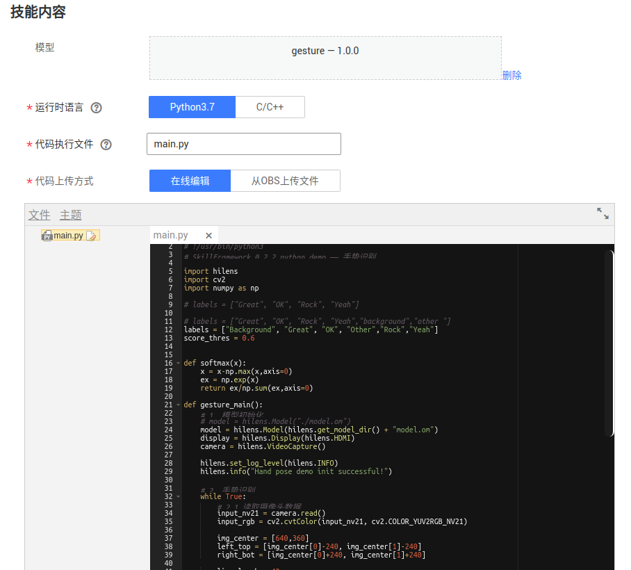  
5. 确认信息并完成新建技能  
上述参数填写完成后，您可以在界面右侧查看其配置参数值，如果某个字段填写错误，在右侧会显示一个小红叉。
确认信息无误后，单击“确定”完成技能创建。

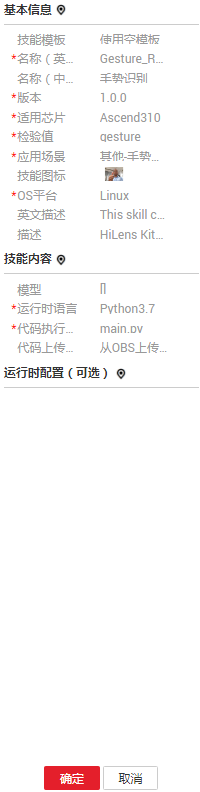

## 部署技能
Duration：5min
1. 登录[Huawei HiLens管理控制台](https://console.huaweicloud.com/hilens/)，单击左侧导航栏“技能开发 > 技能管理”，进入“技能管理”页面。
2. 选择需要部署的技能，单击右侧“部署”。
3. 在弹出的部署对话框中，选择需要部署的设备，单击“部署”。
当显示如下类似信息时，表示部署成功。  
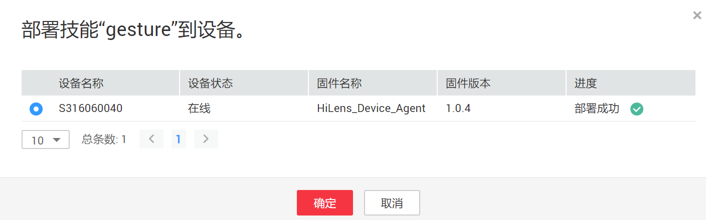  
4. 点击“确定”完成技能部署  
### 启动技能  
登录[Huawei HiLens管理控制台](https://console.huaweicloud.com/hilens/)进入 **“设备管理”** > **“技能管理”**。


进入技能管理界面，可以看到自己所有技能。将HDMI线连接HiLens Kit和显示屏，点击右侧“**启动**”。

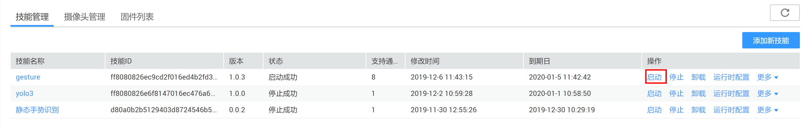

完成启动后，就可以开始使用此技能。使用时，请靠近摄像头，站在画面中央，做出各种手势。摄像头将能识别近距离的基本手势，包括点赞（Great）、OK、胜利（Yeah）、摇滚（Rock）手势。
### 停止技能
为避免技能收费，请及时停止技能。单击左侧导航栏 **“设备管理”** > **“技能管理”**，进入“技能管理”页面。点击技能后面对应的 **“停止”**
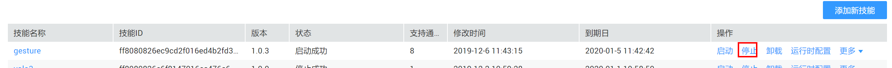

## 注销设备
Duration：5min
使用完后为方便其他账号使用，请注销设备。若不将此设备注销，其他用户将无法注册此设备。若此HiLens为您的个人设备，则无需进行此步骤。
### 卸载技能
设备注销时，需先卸载技能。登录[Huawei HiLens管理控制台](https://console.huaweicloud.com/hilens/),依次选择 **“设备管理”**> **“技能管理”**> **“卸载”**。依次卸载所有技能。

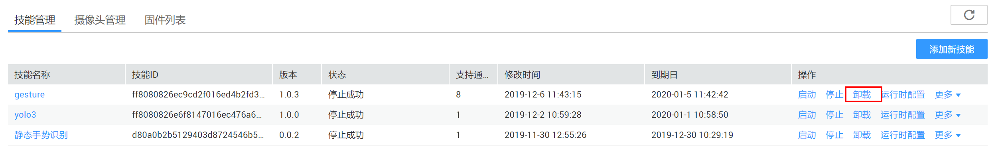

### 注销设备
依次选择 **“设备管理”**> **“注销设备”**，完成设备注销。


## 恭喜你

- 祝贺您，您已经使用华为云完成了端云协用开发任务！

- 您完成了利用ModelArts训练作业训练图像分类AI模型，并通过HiLen Kit部署模型的任务！

### 接下来您可以


### 参考文献

-  https://support.huaweicloud.com/prepare-modelarts/modelarts_08_0001.html 

-  https://support.huaweicloud.com/usermanual-hilens/hilens_02_0001.html 

-  https://support.huaweicloud.com/qs-hilens/hilens_04_0002.html 

-  https://support.huaweicloud.com/qs-obs/obs_qs_0002.html 


