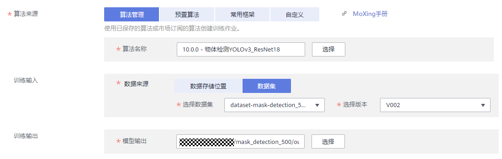
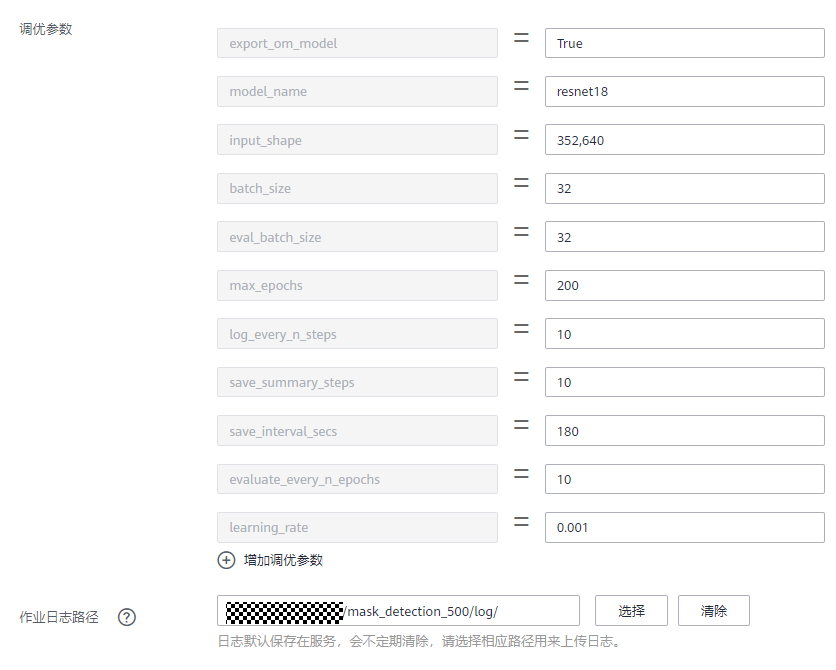
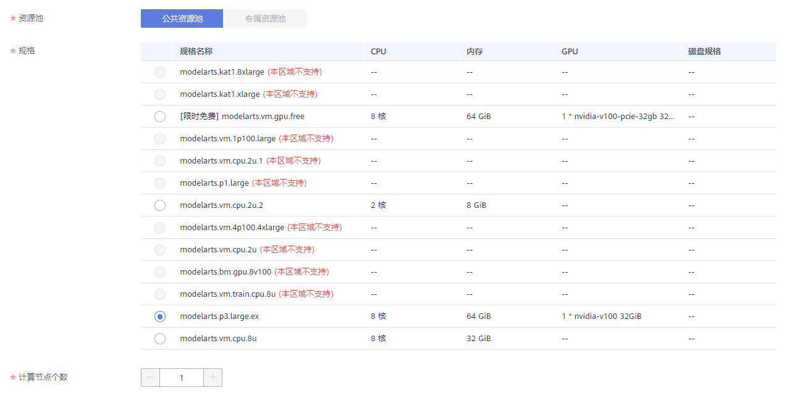
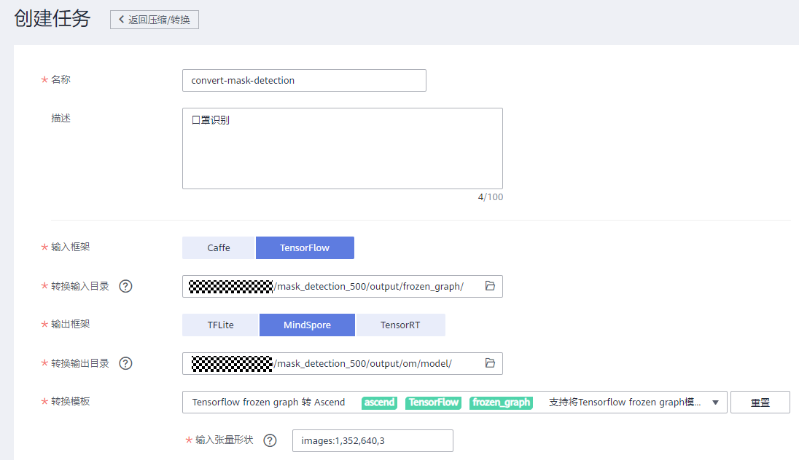

# ModelArts + HiLens 端云协同，开发口罩识别AI应用


## 介绍

### ModelArts 产品优势


- **一站式**

   即使您是一个毫无AI经验的开发者，也可以开"箱"即用。ModelArts平台涵盖AI开发全流程，可灵活使用其中一个到多个功能用于开发工作。

- **易上手**

1. 提供多种预置模型，开源模型想用就用。
2. 模型超参自动优化，简单快速。
3. 零代码开发，简单操作训练出自己的模型。
4. 支持模型一键部署到云、边、端。

- **高性能**

1. 自研MoXing深度学习框架，提升算法开发效率和训练速度。
2. 优化深度模型推理中GPU的利用率，加速云端在线推理。
3. 可生成在Ascend芯片上运行的模型，实现高效端边推理。

### HiLens 产品优势
- **端云协同推理**
 1. 端云模型协同，解决网络不稳的场景，节省用户带宽。
 2. 端侧设备可协同云侧在线更新模型，快速提升端侧精度。
 3. 端侧对采集的数据进行本地分析，大大减少上云数据流量，节约存储成本。

- **统一技能开发平台**

    端云协同优化，简洁易用的HiLens Framework，封装基础组件，简化开发者的skill开发工作。
- **跨平台设计**
 1. 支持Ascend芯片以及其他市场主流芯片，可覆盖园区，家庭，商超等主流应用场景。
 2. 针对端侧芯片自动适配和算法优化。

- **丰富的技能市场**
 1. 技能市场预置了多种技能，如人形检测、哭声检测等，用户可以省去开发步骤，直接从技能市场选取所需技能，在端侧上快速部署。
 2. 技能市场的多种模型，针对端侧设备内存小、精度低等不足做了大量算法优化。
 3. 开发者还可通过HiLens管理控制台开发自定义技能并加入技能市场。

## 案例内容
此案例将带领开发者体验端云协同开发，首先使用ModelArts训练口罩识别模型，然后，使用HiLens部署模型到HiLens Kit，并进行口罩识别，端到端掌握AI业务全流程开发实践技能。开发技能的流程如图所示：


## 案例目标

- 掌握使用ModelArts训练口罩识别AI模型。

- 掌握使用HiLens部署模型，展示模型的效果。 


## 您需要什么？

- 一台电脑（Windows）

- 一条网线，一条HDMI线和一个有HDMI接口的显示屏

- 谷歌浏览器

- 一台HiLens Kit（如需购买，请在[此处](https://console.huaweicloud.com/hilens/?region=cn-north-4&locale=zh-cn#/hilens/skillMarket/hilensKitPurchase)购买）

## 准备工作

体验口罩识别AI应用的开发，需要完成以下准备工作

### 完成ModelArts准备工作

 参考[此文档](https://github.com/huaweicloud/ModelArts-Lab/tree/master/docs/ModelArts准备工作)，完成ModelArts准备工作。包括注册华为云账号、ModelArts全局配置和OBS相关操作。 

### 完成HiLens基本操作

1. 将HiLens Kit连接到电脑 
     
     
   （1）	将DC 12V的电源适配器的端口插入HiLens Kit后面板的电源接口 
   （2）	打开HiLens Kit的电源开关（按住开关键1到2秒放开） 
   （3）	将网线的一端连接到设备的以太网口上，另一端连接到对端设备的以太网口上。 
   正常开机后，如下图显示灯会亮。 
    
2. 设置本地IP 
    将电脑本地IP修改为和HiLens Kit同一网段，使得本地能SSH登录到HiLens Kit。 
    （1）	打开“控制面板”—>“网络和Internet”—>“网络和共享中心”—>“更改适配器设置”  
    （2）	鼠标右键“设备连接”，单击“属性”。以“本地连接”为例，右键单击“属性”后，进入本地连接属性。 
    设备连接：指HiLens Kit用网线连到电脑后，在电脑的网络连接页面上显示的连接。一般是“本地连接”，如果电脑已有本地连接，设备连接标题可能是“本地连接2”，连接信息一般是“未识别的网络”。 
    （3）	点击“属性”—>“网络”，双击“Internet协议版本4（TCP/IPv4）”，设置IP，保证和HiLens Kit的默认IP在一个网段。设备IP默认为 ``192.168.2.111``，本地ip选择192.168.2.1~255（111除外），如下： 
      
    （4）	查看HiLens Kit 与电脑是否能够成功通信，需Ping HiLens Kit IP: ``192.168.2.111``。**“如成功ping通HiLens Kit，则进行下一步”**。
     
    
3. SSH远程连接端侧设备 
    打开SSH工具登录到Kit，IP为 ``192.168.2.111``，用户名：``admin``，密码：``Huawei12#$``，然后进入开发者模式，输入``develop``，密码：`Huawei@SYS3`。 
    （1）下载安装[mobaXterm](https://mobaxterm.mobatek.net/download.html) 
    （2）运行mobaXterm，选择Session，如下图： 
      
    （3）在“IES：/->”提示语后执行命令 `develop`，并输入密码`Huawei@SYS3`: 
      
4. 设置时间 
    命令行输入 ``date``，检测HiLens Kit时间与网络时间是否匹配：

  ```
  # 查看当前时间
  date
  # 回显的时间样例如下所示
  Mon Jan 20 15:15:30 CST 2020
  ```

  其中，如果时区不是`CST`，或者回显的时间和当前网络时间不匹配，需要执行如下两条命令设置时区和时间：

  ```
  #设置时区为中国时区
  timedatectl set-timezone Asia/Shanghai
  #修改-s后的时间为你当前的时间，精确到分钟即可
  date -s "2019-5-27 16:25:30"
  ```

5.	网络连接 
   本案例详细介绍HiLens Kit通过WIFI连接网络，其他方式请参考[此文档](https://support.huaweicloud.com/usermanual-hilens/hilens_02_0050.html): 
   
   （1）登录Huawei HiLens智能边缘管理系统
   浏览器输入``https://192.168.2.111``，登录Huawei HiLens智能边缘管理系统。用户名为``admin``，密码为``Huawei12#$`` 
   

（2）配置WIFI
点击页面顶部的“管理”按钮，然后切换到“网络”页签，在“网络”页签下，单击“无线网络”，进入“无线网络”配置。选择对应的路由器，单击“连接”，弹出“WIFI连接”对话框，输入正确密码。单击“确定”，完成连接。（如果没有可用的WIFI，可以使用手机热点。） 
  （3）检测网络 
SSH连接到HiLens Kit，参考本节步骤3：SSH远程连接端侧设备 ，```ping 8.8.8.8``` 或者 ```ping www.baidu.com```，若出现以下信息，说明网络连接成功。 
  

6. 注册设备 
（1）同意授权 
登录Huawei HiLens[管理控制台](https://console.huaweicloud.com/hilens/?region=cn-north-4#/hilens/allManagement)，注意，这里region选择“北京四”。如果没有授权HiLens服务，会出现授权弹窗。阅读《华为HiLens服务条款》后，勾选条款，点击 **“同意授权”**
  （2）登陆HiLens Kit终端 
在检测网络是连接成功状态后，执行以下命令完成设备注册。
```
hdactl register -u 用户名 -d 账号名 -n 设备名
```
   其中，如果没有IAM账号，则“用户名”和“账号名”一致，都为华为云账号名。如果有IAM账号，则有相应“用户名”和“账号名”。设备名用户自定义。按回车完成设备注册。

 

 输入注册指令之后，会提示输入密码，此时输入华为云账号密码：
  （3）注册到HiLens console 
登录Huawei HiLens[管理控制台](https://console.huaweicloud.com/hilens/?region=cn-north-4#/hilens/allManagement)，单击左侧导航栏“设备管理>设备列表”，可查看设备状态。注意，这里region选择“北京四”。  

（4）升级固件 
注册完成后，检查固件是否为最新版本。固件版本``1.0.0``为出厂版本，需升级到最新版本，点击 **“设备管理 **> **设备列表”**，找到你已经注册的设备，点击“**固件列表**”中，选择最新版本固件进行升级，如图所示：
   

注意：固件升级时，设备会处于离线状态，请等待固件升级成功。

如果固件升级失败，请检查HiLens Kit的时间有没有正确设置。

此时你已经将HiLens Kit与自己的华为云账号关联。 

## 准备数据

### 下载数据集

本案例使用的口罩识别数据集包含500张图片，均已标注已经发布在AI市场，我们从华为云AI市场订阅数据集至ModelArts，然后就可以在ModelArts中使用了。点击[此链接](https://marketplace.huaweicloud.com/markets/aihub/datasets/detail/?content_id=90259354-a047-49ec-8415-f033cc2f3e87)进入下载详情页，下载详情页示例如下：


下载方式：选择ModelArts数据集

目标区域：华北-北京四

目标位置：选择一个OBS路径，作为数据集的存储位置。

名称：自定义

填写好参数后，点击按钮，然后点击按钮。等待数据集状态变为推送成功，即可在[ModelArts数据集列表](https://console.huaweicloud.com/modelarts/?region=cn-north-4#/dataset)中查看到下载的数据集。

等待数据集发布成功。

**注意：该口罩识别数据集只能用于学习用途，不得用于商业用途。**

### 发布数据集

点击进入[ModelArts数据集列表](https://console.huaweicloud.com/modelarts/?region=cn-north-4#/dataset)，找到刚订阅的数据集，点击“发布”按钮，填写训练集比例为0.8，发布数据集。数据集发布之后，才可在训练中使用。


### 数据标注格式解读

数据集发布成功后，点击进入数据集，然后点击“开始标注”按钮，观察数据标注详情。其中一张样例图片的标注详情如下：


数据集共有三种类型的标注框，person（包含头部和肩部）、face和mask。判断一个人有没有戴口罩的方法是，脸部的检测框里面是否有口罩的检测框。person物体的作用是对人做目标跟踪。

## 订阅算法

本实验中，我们从AI市场订阅ModelArts官方发布的物体检测算法`FasterRCNN`来训练模型。

点击进入AI市场[YOLOv3_ResNet18算法主页](https://console.huaweicloud.com/modelarts/?locale=zh-cn&region=cn-north-4#/aiMarket/aiMarketModelDetail/overview?modelId=948196c8-3e7a-4729-850b-069101d6e95c&type=algo)，点击页面右上方的按钮。然后点击页面下方的按钮，再点击按钮，最后点击按钮进入我的订阅页面，可以看到刚刚订阅的算法。点击超链接，进入算法管理页面。

点击“同步”按钮，同步算法，可以点击按钮，刷新状态。当状态变成就绪时，表示同步成功。

## 模型训练

我们在ModelArts中训练模型，并将模型格式转换成可在HiLens Kit上运行的格式。

### 创建训练作业

接下来将通过ModelArts训练作业训练AI模型，使用ModelArts的`yolov3`预置算法训练一个口罩检测模型。

进入[ModelArts管理控制台](https://console.huaweicloud.com/modelarts/?region=cn-north-4#/trainingJobs)，进入ModelArts“训练作业”页面。

单击“**创建**”按钮，进入“创建训练作业”页面。

在“创建训练作业”页面，按照如下指导填写训练作业相关参数。

“计费模式”和“版本”为系统自动生成，不需修改。

名称：自定义

描述：描述信息，可选。


算法来源：算法管理

算法名称：`物体检测-YOLOv3_ResNet18`

训练输入：数据集

选择数据集和版本：选择刚刚发布的口罩数据集及其版本

训练输出：选择一个空的OBS路径，用来存储训练输出的模型。如` /modelarts-course/mask_detection_500/output/ `，该路径需要自己创建。




调优参数：保持默认。我们训练200个epochs，学习率设置为0.001，`epochs`值越大训练时间越长。

作业日志路径：选择一个空的OBS路径，用来存储作业训练日志。如` /modelarts-course/mask_detection_500/log/ `，该路径需要自己创建。



资源池：公共资源池

规格：`CPU：8 核 64GiB GPU：1 * nvidia-p100 16GiB`。也可以选择V100，V100比P100的算力更强，但是更贵。

计算节点：1



完成信息填写，单击“下一步”。

在“规格确认”页面，确认填写信息无误后，单击“**立即创建**”。

在“训练作业”管理页面，可以查看新建训练作业的状态。

如果设置`max_epochs=200`，训练过程需要20分钟左右。当状态变更为“运行成功”时，表示训练作业运行完成。
您可以单击训练作业的名称，可进入此作业详情页面，了解训练作业的“配置信息”、“日志”、“资源占用情况”和“评估结果”等信息。

## 模型转换

进入[ModelArts管理控制台](https://console.huaweicloud.com/modelarts/?region=cn-north-4#/model-switch)，在左侧导航栏中选择“ **模型管理**”>  “**压缩/转换**”，进入模型转换列表页面。

单击左上角的“**创建任务**”，进入任务创建任务页面。

在“创建任务”页面，填写相关信息。

名称：输入“**convert-mask-detection**”。

描述：口罩识别。 

输入框架：TensorFlow

转换输入目录：训练作业的训练输出目录下的`frozen_graph` OBS目录，本案例中是`/modelarts-course/mask_detection_500/output/frozen_graph/`。

输出框架：MindSpore

转换输出目录：训练作业的训练输出目录下的`om/model` OBS目录，本案例中是`/modelarts-course/mask_detection_500/output/om/model/`。

转换模板：选择“**TensorFlow frozen graph 转 Ascend**”。即将TensorFlow的frozen graph格式的模型转换成可在昇腾芯片上推理的格式。

输入张量形状：`images:1,352,640,3`。


任务信息填写完成后，单击右下角“**立即创建**”按钮。等待模型转换任务完成。

##  新建技能
### 导入模型

1.	登录[Huawei HiLens管理控制台](https://console.huaweicloud.com/hilens/?region=cn-north-4#/hilens/allManagement)，在左侧导航栏中选择 **“技能开发”** > **“模型管理”**，进入“模型管理”页面。
2.	在“模型管理”页面，单击右上角的 **“导入（转换）模型”**。
3.	在“导入模型”页面，然后参考图3-1填写参数，信息确认无误后单击 **“确定”**完成导入。
 *	名称：输入 **“mask-detection”**。
 *	版本：输入 **“1.0.0”**。
 *	描述：一段简短的描述。口罩识别模型，用于检测人是否佩戴口罩。
 *	模型来源：单击 **“从ModelArts导入”**，在右侧下拉框中选择 **“OM（从转换任务中获取）”**，然后在下方转换任务列表中勾选之前ModelArts中的模型转换任务 **“convert-mask-detection”**。


    模型导入后，将进入 **“模型管理”** 页面，您导入的模型可从列表中查看。

### 开始新建技能

1. 在Huawei HiLens管理控制台的左侧导航栏中选择 **“技能开发” > “技能管理”**，进入技能列表。
2. 在“技能管理”页面，单击右上角 **“新建技能”**，进入“创建技能”页面。  
3. 填写基本信息 
在“创建技能”页面，在“技能模板”中选择“使用空模板”后，填写基本信息:  
 * 技能模板：选择 **“使用空模板”**。

 * 名称（英文）：输入 **“Mask_Detection”**。

 * 名称（中文）：输入 **“口罩识别”**。

 * 版本：输入 **“1.0.0”**。

 * 适用芯片：默认为 **“Ascend310”**。

 * 检验值：输入 **“mask”**。

 * 应用场景：选择 **“其他”**，文本框中输入 **“口罩识别”**。

 * 技能图标：上传技能图片。可选。

 * 技能图片：用来向用户介绍技能的使用或技能的效果，可不上传。

 * OS平台：选择 “ **Linux**”系统。

 * 英文描述：输入技能的英文描述。

 *	描述：输入技能的中文描述。 
 

   
4. 填写技能内容 
根据您的模型和逻辑代码情况，填写技能内容，详细参数说明如下：
 * 模型：单击加号，您可以在弹出框中，选择导入的模型`mask-detection`。

 * 运行时语言：选择`Python3.7`。

 * 代码执行文件：输入`index.py`。

 * 代码上传方式：选择“在线编辑”，在代码编辑框中直接编辑代码。一共有两个代码源文件，[`index.py`](./src/index.py)和       [`utils.py`](./src/utils.py)，将这两个文件中的代码依次复制到对应的代码编辑框中。`utils.py`文件可以通过代码编辑框左上角的“**文件**” > “**创建同级文件**”来创建，见下图。

  注意：请确保`index.py`红线框中的模型名称和模型转换任务名称保持一致，否则请修改红线框中的模型名称。

  

5. 确认信息并完成新建技能  
上述参数填写完成后，您可以在界面右侧查看其配置参数值，如果某个字段填写错误，在右侧会显示一个小红叉。
确认信息无误后，单击“确定”完成技能创建。

### 技能代码解读

查看`utils.py`文件的代码，可以看出该口罩识别技能的实现逻辑。针对每个人，它会尝试检测出`person`、`face`和`mask`三个检测框。如果`mask`检测框位于`face`检测框的重合度大于一个阈值，就判断已佩戴口罩；如果`mask`检测框位于`face`检测框的重合度小于这个阈值或者没有检测到`mask`检测框，就判断没有佩戴口罩；当即没有检测到`face`，也没有检测到`mask`，就会显示`Unknown`，表示未知。

## 部署技能

### 部署到设备

1. 在[Huawei HiLens管理控制台](https://console.huaweicloud.com/hilens/?region=cn-north-4#/hilens/skillDevelop/projectManagement)，单击左侧导航栏“**技能开发** > **技能管理**”，进入“技能管理”页面。
2. 选择需要部署的技能，单击右侧“部署”。
3. 在弹出的部署对话框中，选择需要部署的设备，单击“部署”。
观察部署进度，等待部署成功。 如果此处部署失败，请检查HiLens Kit的时间有没有正确设置。
  
4. 点击“确定”完成技能部署。
### 启动技能
在[Huawei HiLens管理控制台](https://console.huaweicloud.com/hilens/?region=cn-north-4#/hilens/deviceManagement/deviceManagement/deviceList)，进入 “**设备管理**” > “**设备列表**”。


点击技能管理按钮，可以看到自己所有技能。用HDMI线连接HiLens Kit和显示屏，点击右侧“**启动**”按钮。


完成启动后，就可以开始使用此技能。

### 体验效果

使用时，请让人脸出现在屏幕中，摄像头将能识别人是否佩戴口罩。


### 停止技能

为避免技能持续收费，请及时停止技能。单击左侧导航栏 “**设备管理**” > “**技能管理**”，进入“技能管理”页面。点击技能后面对应的 **“停止”**


此案例到此结束。
