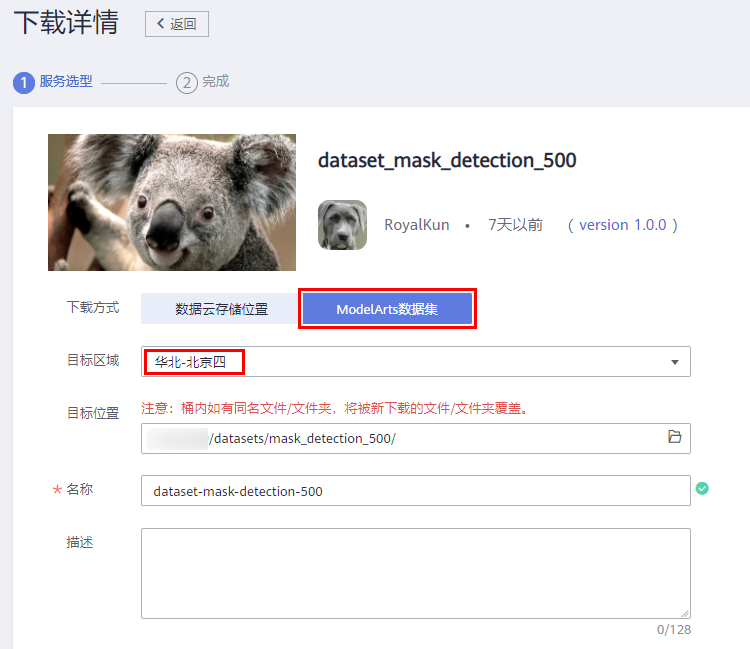
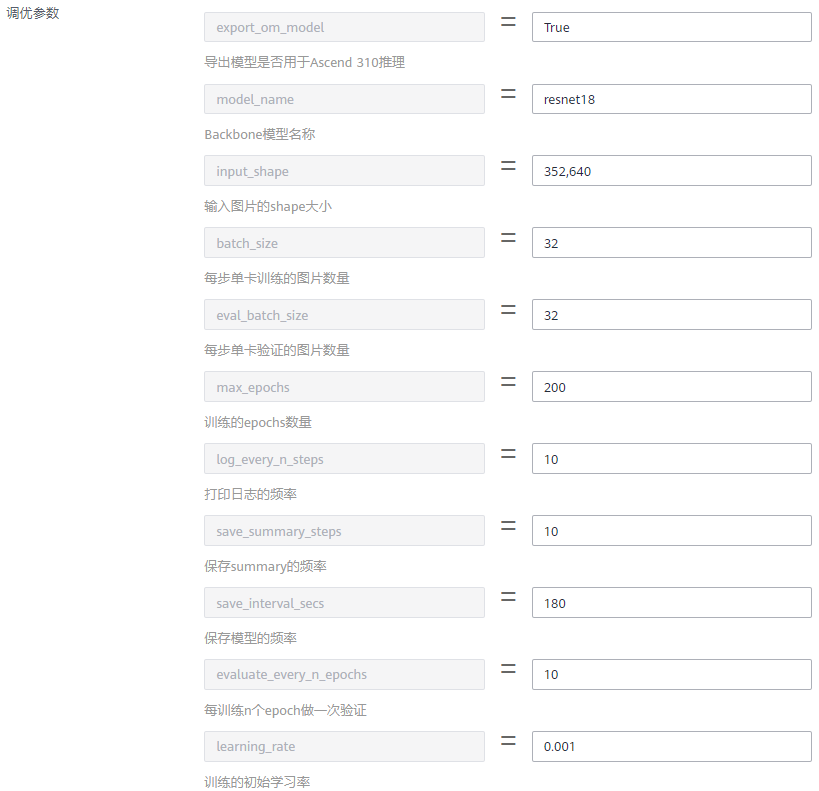

# ModelArts + HiLens 端云协同，开发口罩识别AI应用

## 案例内容
此案例将带领开发者体验端云协同AI应用开发，首先使用ModelArts训练口罩识别模型，然后使用HiLens Studio开发调试AI应用，端到端掌握AI应用全流程开发实践技能。

## 准备工作

体验口罩识别AI应用的开发，需要完成以下准备工作。

### 完成ModelArts准备工作

点击进入<a href="https://console.huaweicloud.com/modelarts/?region=cn-north-4#/authConfig" target="_blank">ModelArts全局配置</a>，点击“访问授权”按钮。在弹出的对话框中，授权方式选择“使用委托”，然后点击“自动创建”按钮，自动生成一个委托，并选择该委托。最后点击“同意授权”按钮。如下图所示：

### 完成HiLens准备工作

点击<a href="https://console.huaweicloud.com/hilens/?region=cn-north-4#/skillDevelop/studioOpening" target="_blank">此链接</a>，完成相关依赖服务的授权。

然后点击<a href="https://console.huaweicloud.com/hilens/?region=cn-north-4#/skillDevelop/studioOpening" target="_blank">此链接</a>，申请HiLens Studio公测。

## 准备数据

### 下载数据集

本案例口罩识别数据集，包含500张已标注的图片。我们从华为云AI市场订阅数据集至ModelArts，然后就可以在ModelArts中使用了。点击<a href="https://marketplace.huaweicloud.com/markets/aihub/datasets/detail/?content_id=90259354-a047-49ec-8415-f033cc2f3e87" target="_blank">此链接</a>进入下载详情页，下载详情页示例如下：

下载方式：选择ModelArts数据集

目标区域：华北-北京四

目标位置：选择一个OBS路径，作为数据集的存储位置。

名称：自定义

填写好参数后，点击按钮，然后点击按钮。等待数据集状态变为推送成功（可以点击右上角按钮刷新状态），即可在<a href="https://console.huaweicloud.com/modelarts/?region=cn-north-4#/dataset" target="_blank">ModelArts数据集列表</a>中查看到下载的数据集。

**注意：该口罩识别数据集只能用于学习用途，不得用于商业用途。**

### 发布数据集

点击进入<a href="https://console.huaweicloud.com/modelarts/?region=cn-north-4#/dataset" target="_blank">ModelArts数据集列表</a>，找到刚订阅的数据集，点击“发布”按钮，填写训练集比例为0.8，发布数据集。数据集发布之后，才可在训练中使用。

### 数据标注格式解读

数据集发布成功后，点击进入数据集，然后点击“开始标注”按钮，观察数据标注详情。其中一张样例图片的标注详情如下：

数据集共有三种类型的标注框，person（包含头部和肩部）、face和mask。判断一个人有没有戴口罩的方法是，脸部的检测框里面是否有口罩的检测框。person物体的作用是对人做目标跟踪。

## 订阅算法

本实验中，我们从AI市场订阅ModelArts官方发布的物体检测算法`FasterRCNN`来训练模型。

点击进入AI市场<a href="https://console.huaweicloud.com/modelarts/?locale=zh-cn&region=cn-north-4#/aiMarket/aiMarketModelDetail/overview?modelId=948196c8-3e7a-4729-850b-069101d6e95c&type=algo" target="_blank">YOLOv3_ResNet18算法主页</a>，点击页面右上方的按钮。然后点击页面下方的按钮，再点击按钮，最后点击按钮进入我的订阅页面，可以看到刚刚订阅的算法。点击超链接，选择华北-北京四区域， 进入算法管理页面。

点击“同步”按钮，同步算法，可以点击按钮，刷新状态。当状态变成就绪时，表示同步成功。

## 模型训练

接下来将通过ModelArts训练作业训练AI模型，使用`YOLOv3`算法训练一个口罩检测模型。

进入<a href="https://console.huaweicloud.com/modelarts/?region=cn-north-4#/trainingJobs" target="_blank">ModelArts管理控制台</a>，进入ModelArts“训练作业”页面。

单击“**创建**”按钮，进入“创建训练作业”页面。

在“创建训练作业”页面，按照如下指导填写训练作业相关参数。

“计费模式”为系统自动生成，不需修改。

名称：自定义。

描述：描述信息，可选。

算法来源：算法管理

算法名称：`物体检测-YOLOv3_ResNet18`，前缀数字是算法版本，无需在意。在弹出的选择框中切换到“市场订阅”页签，选择该算法。如果无法选择，请点击“同步”按钮，然后点击按钮刷新状态。

训练输入：数据集

选择数据集和版本：选择刚刚发布的口罩数据集及其版本

训练输出：选择一个空的OBS路径，用来存储训练输出的模型。如` /modelarts-course/mask_detection_500/output/ `，该路径需要自己创建。

调优参数：按照下图的指导来填写。我们训练200个epochs，`epochs`值越大训练时间越长。注意，最后一个参数`image_library=opencv`需要点击添加按钮新增。

作业日志路径：选择一个空的OBS路径，用来存储作业训练日志。如` /modelarts-course/mask_detection_500/log/ `，该路径需要自己创建。

资源池：公共资源池

规格：`modelarts.p3.large.ex`，机器中包含一张V100的显卡。

计算节点：1

完成信息填写，单击“下一步”。

在“规格确认”页面，确认填写信息无误后，单击“**立即创建**”。

在“训练作业”管理页面，可以查看新建训练作业的状态。

如果设置`max_epochs=200`，训练过程需要15分钟左右。当状态变更为“运行成功”时，表示训练作业运行完成。
您可以单击训练作业的名称，可进入此作业详情页面，了解训练作业的“配置信息”、“日志”、“资源占用情况”等信息。

## 模型转换

接下来将模型格式转换成可在HiLens设备上运行的格式。

进入<a href="https://console.huaweicloud.com/modelarts/?region=cn-north-4#/model-switch" target="_blank">ModelArts管理控制台</a>，在左侧导航栏中选择“ **模型管理**” >  “**压缩/转换**”，进入模型转换列表页面。

单击左上角的“**创建任务**”，进入任务创建任务页面。

在“创建任务”页面，填写相关信息。

名称：输入“**mask-detection**”。注意，此处的名称会作为格式转换生成的模型名称。

描述：可选。

输入框架：TensorFlow

转换输入目录：训练作业的训练输出目录下的`frozen_graph` OBS目录，本案例中是`/modelarts-course/mask_detection_500/output/frozen_graph/`。

输出框架：MindSpore

转换输出目录：训练作业的训练输出目录下的`om/model` OBS目录，本案例中是`/modelarts-course/mask_detection_500/output/om/model/`。

转换模板：选择“**TF-FrozenGragh-To-Ascend-HiLens**”。即将TensorFlow的frozen graph格式的模型转换成可在HiLens上推理的格式。

输入张量形状：`images:1,352,640,3`。

其他参数保持默认。

任务信息填写完成后，单击右下角“**立即创建**”按钮。等待模型转换任务完成。

## 模型部署

接下来，我们将使用HiLens Studio开发模型在端侧的推理代码，并调试。从而完成一个完整的AI应用的开发。

点击进入<a href="https://console.huaweicloud.com/hilens/?region=cn-north-4#/skillDevelop/studioOpening" target="_blank">HiLens Studio</a>，会弹出如下对话框，请参考<a href="https://support.huaweicloud.com/modelarts_faq/modelarts_05_0004.html" target="_blank">此文档</a>添加访问密钥。然后点击“确定”按钮即可。

添加完之后，大概需要等待30秒，进入HiLens Studio 页面。 

### 创建项目

单击“New Project” 按钮， 弹出“选择技能模板”对话框， 选择"Mask_Detection"模板，创建一个口罩识别模板。

按照下图指导填写参数：

然后点击“确定”按钮，创建项目。

点击项目名称进入项目，可以看到HiLens Studio主页：

### 导入模型

依次点击File > Import Models from ModelArts，从ModelArts导入模型，选择刚刚ModelArts中转换生成的模型。

导入的模型会出现在model目录下，见下图。

由于该项目是根据口罩检测模板创建的，所以本案例可以直接复用项目中自带的推理代码。

修改`main.py`代码中的模型名称为真实的模型名称：

### 准备测试数据

test目录用来存放测试视频。环境里面预置了一段测试视频，用户也可以自己上传。

在此实验中，我们使用环境里面预置的测试视频。

### 推理代码解读

查看`utils.py`文件的代码，可以看出该口罩识别技能的实现逻辑。针对每个人，它会尝试检测出`person`、`face`和`mask`三个检测框。如果`mask`检测框位于`face`检测框的重合度大于一个阈值，就判断已佩戴口罩；如果`mask`检测框位于`face`检测框的重合度小于这个阈值或者没有检测到`mask`检测框，就判断没有佩戴口罩；当即没有检测到`face`，也没有检测到`mask`，就会显示`Unknown`，表示未知。

### 启动推理

依次点击Debug > Start Without Debugging，执行推理代码：

可以在右边看到视频的推理结果：

该技能可以检测人是否佩戴口罩。

如果有检测不准确的地方，可能是训练的模型精度不够高，可以尝试训练更长的时间或者添加更多的训练数据。

本次实验结束。

