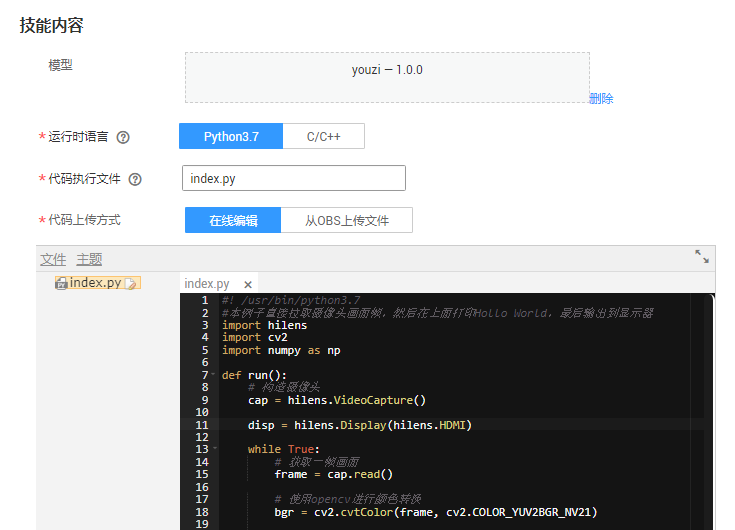

# 停机坪飞机识别

## ModelArts & HiLens 端云协同案例

## 一、应用价值

与道路交通不同的是，航空器在地面运行时难以通过高架、隧道等方式将航班滑行路径分离，由于飞机起降架次的增多，加上恶劣天气的影响，跑道侵入事件已成为民航领域航空器地面安全运行的头等问题，跑道安全事故在民用航空事故中占有很大比例，因此对与在机场跑道和滑行道上运行的航空器、车辆等目标的身份、位置及其动态的掌控程度，很大程度上决定了跑道运行安全的系数。

机场地面运行的航空器和其他载具一般都经由塔台进行统一调度管理，塔台的核心职责是确保航班“安全、有序、高效”运行，塔台管制人员通过“看到-了解-判断-行动”这一决策过程对数量众多的航空器和地面载具进行统一指挥，而“看到”和“了解”这两个过程往往会对管制决策起到决定性作用。

随着机场规模增加，平面布局变得日益复杂化，对于大型机场的塔台而言，单点视野物理受限，以及数字化程度提升的同时，客观上造成屏幕变多、信息量变大，“看到”和“了解”形成了较大的挑战，人的主观能动性很强，但往往难以面面俱到。

基于上述背景，我们设计了跑道侵入防护系统，用于加强跑道侵入事件的防范。“光电盯防子系统”是该系统的重要实时核心，该子系统具备较完整的“基于视频流的航空器目标识别和跟踪”能力，主要工作是将机场平面各个关键点采集到的实时视频流送入基于华为云ModelArts框架的“航空器识别模型”进行处理，识别出画面中飞行器对象的像素坐标等一次参数后，对其进行空间位置换算，以及包括速度、运行方向等在内的二次参数的计算，并在系统运行数据中找到相匹配的航班信息对目标进行信息标记，以AR信息增强的形式呈现在监视器上，让管制员以“抬头显示”的形式在单一屏幕中直观了解到足够全面的动态信息。同时该系统会在后台对所有目标的轨迹和矢量动态数据进行监控和推算，让计算机能够代替或辅助管制人员在全局范围对每一个航班、每一个道口进行实时盯防，提前预知潜在运行风险，从而降低事故发生的概率。

## 二、项目概述

本项目即为该系统的“航空器识别模型”子系统。基于YoloV3和ResNet18模型，能够实现较为准确的目标识别和坐标输出，依托[ModelArts](https://www.huaweicloud.com/product/modelarts.html)训练作业，可以实现的”航空器识别模型“服务，实现从“看到”到“了解”的关键一步。

使用华为云端云协同AI应用开发平台[HiLens](https://www.huaweicloud.com/product/hilens.html)，将ModelArts训练好的模型下发到端侧设备HiLens Kit上，实现端侧实时检测。

本项目基于柚数据提供“ModelArts-Lab挖宝行动”项目，项目地址：[youzidata-机坪跑道航空器识别](https://github.com/huaweicloud/ModelArts-Lab/tree/master/contrib/0.%E6%8C%96%E5%AE%9D%E8%A1%8C%E5%8A%A8/youzidata-%E6%9C%BA%E5%9D%AA%E8%B7%91%E9%81%93%E8%88%AA%E7%A9%BA%E5%99%A8%E8%AF%86%E5%88%AB)。

## 三、具体流程

*本实践需要开通 yolov3_resnet18 模型白名单，如需使用请使用工单联系工作人员。*

#### 步骤1在[对象存储服务OBS](https://www.huaweicloud.com/product/obs.html)中完成；

#### 步骤2-4在[ModelArts](https://www.huaweicloud.com/product/modelarts.html)中完成；

#### 步骤5-7在[HiLens](https://www.huaweicloud.com/product/hilens.html)中完成。

### 1. 准备数据

首先使用[对象存储服务OBS](https://www.huaweicloud.com/product/obs.html)，将获取的数据上传到OBS桶中。

数据包括停机坪图像及标签文件，**文件夹格式及标签文件需严格遵循本实践说明**。

文件夹目录如下：

其中，txt文件为标签文件，文件里的内容格式为：

`
data/00003.jpg 1044,963,1140,1030,0 1293,951,1411,1014,0 1411,946,1496,1014,0
`

`
data/00024.jpg 1039,957,1152,1036,0 1293,940,1417,1014,0
`

说明：

（1）这里的data/00003.jpg内容表示和txt文件的相对路径，可根据用户实际数据集进行修改，但是要保证`input/data/00003.jpg`为桶的绝对路径，`1044,963,1140,1030,0`表示x_min, y_min, x_max, y_max, class_id；

（2）class_id：就是参数class_names里面填写的内容，在本项目中定义为 "plane"，即标签`0`表示plane，用户可根据实际情况进行调整；

（3）训练集train.txt和验证集validate.txt为必须，测试集test.txt非必须。

图像文件示例：

### 2. ModelArts模型训练

通过ModelArts训练作业功能训练AI模型

（1）进入ModelArts管理控制台，点击左侧工具栏“训练管理”→“训练作业”，进入“训练作业”页面。

（2）单击“创建”，进入“创建训练作业”页面。

（3）在“创建训练作业”页面，填写训练作业相关参数，然后单击“下一步”。

a. 在基本信息区域，“计费模式”和“版本”为系统自动生成，不需修改。请根据界面提示填写“名称”和“描述”。

b. 在参数配置区域，选择“数据来源”，设置“算法来源”、“运行参数”、“训练输出位置”和“作业日志路径”。

- 数据来源：单击“数据存储位置”，然后单击文本框右侧的“选择”，选择数据集所在的OBS路径，即前一步创建的路径，在本示例中使用“/youzi/input”。

- 算法来源：单击“选择”，从“预置算法”列表中，选择“yolov3_resnet18”算法。

- 运行参数：
  - finetuning = False
  - load_imagenet_weights = True
  - class_names = plane
  - max_epochs = 200
  - batch_size = 32
  
  
- 训练输出位置：从已有的OBS桶中选择模型和预测文件存储路径。使用准备工作中已创建好的“output”文件夹。如果没有可用文件夹，您可以单击“选择”，在弹出对话框中新建文件夹。

- 作业日志路径：从已有的OBS桶中选择日志存储路径。使用准备工作中已创建好的“log”文件夹。如果没有可用文件夹，您可以单击“选择”，在弹出对话框中新建文件夹。

c. 在资源设置区域，单击资源池文本框右侧的“选择”，选择“公共资源池”和“GPU”；规格分为p100和v100两种，v100规格的GPU的p100规格的GPU更佳，但两者价格不同，请按需选择；“计算节点个数”设置为“1”。

d. 完成信息填写，单击“下一步”。 

（4）在“规格确认”页面，确认填写信息无误后，单击“立即创建”。 

（5）在“训练作业”管理页面，可以查看新建训练作业的状态。训练作业的创建和运行需要一些时间，若使用p100，max_epoches=200，大概需要1小时完成训练。当状态变更为“运行成功”时，表示训练作业创建完成。 您可以单击训练作业的名称，可进入此作业详情页面，了解训练作业的“配置信息”、“日志”、“资源占用情况”和“评估结果”等信息。在“训练输出位置”所在的OBS路径中，即“/youzi/output/”路径，可以获取到生成的模型文件。

### 3.  将模型保存为所需要的pb格式文件：

将第2步生成的ckpt格式模型转换成pb格式模型文件，以满足模型转换要求。

**本步骤的操作，除运行参数设置外，完全与第2步相同。**

（1）进入ModelArts管理控制台，点击左侧工具栏“训练管理”→“训练作业”，进入“训练作业”页面。

（2）单击“创建”，进入“创建训练作业”页面。

（3）在“创建训练作业”页面，填写训练作业相关参数，然后单击“下一步”。

a. 在基本信息区域，“计费模式”和“版本”为系统自动生成，不需修改。请根据界面提示填写“名称”和“描述”。

b. 在参数配置区域，选择“数据来源”，设置“算法来源”、“运行参数”、“训练输出位置”和“作业日志路径”。

- 数据来源：同步骤2。

- 算法来源：同步骤2。

- 运行参数：
  - finetuning = True
  - load_imagenet_weights = False
  - class_names = plane
  - max_epochs = 200
  - batch_size = 32
  - run_mode = save_pb
  - inference_device = 310D  
  
- 训练输出位置：同步骤2。

- 作业日志路径：同步骤2。

c. 资源设置：同步骤2。

d. 完成信息填写，单击“下一步”。 

（4）在“规格确认”页面，确认填写信息无误后，单击“立即创建”。 

（5）在“训练作业”管理页面，可以查看新建训练作业的状态。当状态变更为“运行成功”时，表示作业完成。此时，在“/youzi/output/”路径下生成“models”文件夹，内有模型文件`yolo3_resnet18.pb`和aipp参数文件`aipp.cfg`，用于下一步的模型转换。

### 4. 模型转换

下发到HiLens的模型要求为om格式，因此需要使用ModelArts的模型转换功能将pb格式模型文件转换为om格式模型文件。

（1）进入ModelArts管理控制台，在左侧导航栏中选择“ 模型管理”→“压缩/转换”，进入模型转换列表页面。

（2）单击左上角的“创建任务”，进入任务创建任务页面。

（3）在“创建任务”页面，填写相关信息。

- 名称：自定义名称，在本实践中为“convert-youzi”。

- 描述：自行添加描述。

- 转换模板：选择“**TensorFlow frozen graph 转 Ascend**”。

- 转换输入目录：将上一步中的“/youzi/output/models”文件夹设为转换输入路径。

- 转换输出目录：在OBS路径新建文件夹“om_model”，选择转换输出目录为“/youzi/output/om_model”。

- 高级选项：设置“学习框架类型”为“**3**”，“输入张量形状”为“**images:1,224,224,3**”。

（4）任务信息填写完成后，单击右下角“立即创建”。 创建完成后，系统自动跳转至“模型压缩/转换列表”中。刚创建的转换任务将呈现在界面中，其“任务状态”为“初始化”。模型转换任务执行过程需要几分钟，当“任务状态”变为“成功”时，表示任务运行完成并且模型转换成功。 如果“任务状态”变为“失败”，建议单击任务名称进入详情页面，查看日志信息，根据日志信息调整任务的相关参数并创建新的转换任务。

### 5. 模型导入

（1）登录Huawei HiLens管理控制台，在左侧导航栏中选择 “技能开发” → “模型管理”，进入“模型管理”页面。

（2）在“模型管理”页面，单击右上角的 “导入（转换）模型”。

（3）在“导入模型”页面，填写参数，信息确认无误后单击 “确定”完成导入。

- 自行定义名称、版本和描述，此三个为必填选项

- 模型来源：选择两种方式均可
  
  - 选择“从OBS导入”，选择上一步中om模型的输出路径“/youzi/om_model”为模型地址；

  - 单击 “从ModelArts导入”，在右侧下拉框中选择 “OM（从转换任务中获取）”，然后在下方转换任务列表中勾选之前在ModelArts转换的模型 “convert-youzi”。

（4）模型导入后，将进入 “模型管理” 页面，导入的模型可从列表中查看。

### 6. 创建技能

（1）在Huawei HiLens管理控制台的左侧导航栏中选择 “技能开发” → “技能管理”，进入技能列表。

（2）在“技能管理”页面，单击右上角 “新建技能”，进入“创建技能”页面。

（3）填写基本信息
在“创建技能”页面，在“技能模板”中选择“使用空模板”后，填写基本信息:
- 技能模板：选择 “使用空模板”。
- 名称（英文）：自定义，本实践定义为“Plane_Detection”。
- 名称（中文）：自定义，本实践定义为“停机坪飞机识别”。
- 版本：自定义，本实践定义为“1.0.0”。
- 适用芯片：默认为“Ascend310”。
- 检验值：自定义，本实践定义为“plane”。
- 应用场景：选择 “其他”，文本框中输入 “停机坪飞机识别”。
- 技能图标：上传技能图片。
- 技能图片：用来向用户介绍技能的使用或技能的效果。
- OS平台：选择“Linux”系统。
- 英文描述：输入技能的英文描述。
- 描述：输入技能的中文描述。

（4）填写技能内容
根据您的模型和逻辑代码情况，填写技能内容，详细参数说明如下：
- 模型：单击加号，选择上一步导入的模型。
- 运行时语言：选择“Python3.7”。
- 代码执行文件：输入“index.py ”。
- 代码上传方式：选择“在线编辑”，在代码编辑框中直接编辑代码。

（5）确认信息无误后，单击“确定”完成技能创建。

### 7. 使用技能

（1）部署技能

- 登录Huawei HiLens管理控制台，单击左侧导航栏“技能开发 → 技能管理”，进入“技能管理”页面。

- 选择需要部署的技能，单击右侧“部署”。

- 在弹出的部署对话框中，选择需要部署的设备，单击“部署”。 

- 点击“确定”完成技能部署

（2）启动技能

- 登录Huawei HiLens管理控制台进入 “设备管理” → “技能管理”。 

- 进入技能管理界面，可以看到自己所有技能。将HDMI线连接HiLens Kit和显示屏，点击右侧“启动”。

- 完成启动后，就可以开始使用此技能，即可以对停机坪的飞机进行识别。

（3）停止技能

- 为避免技能收费，请及时停止技能。单击左侧导航栏 “设备管理” → “技能管理”，进入“技能管理”页面。点击技能后面对应的 “停止”.
