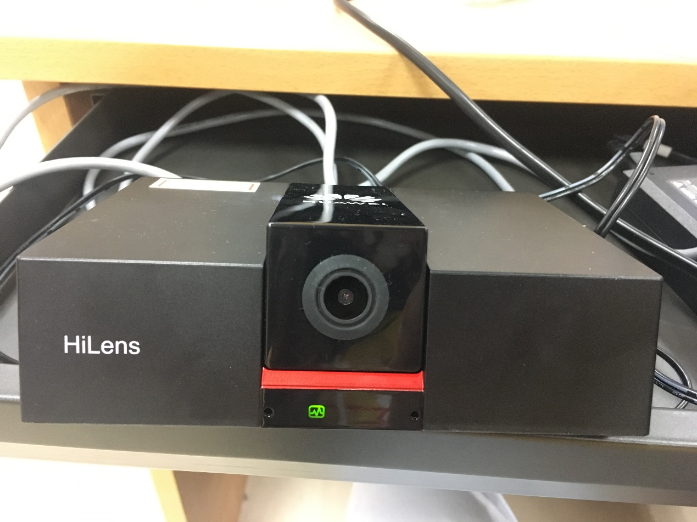
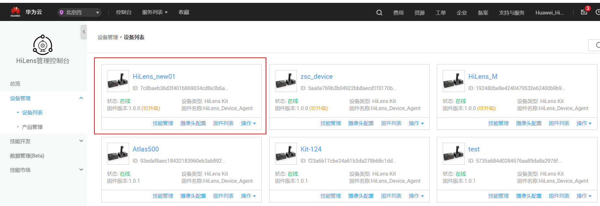

# ModelArts & HiLens 前置工作
# 什么是HiLens 
华为HiLens由具备AI推理能力的HiLens Kit和云上开发平台组成，包括一站式技能开发、设备部署与管理、数据管理、技能市场等，帮助用户开发AI技能并将其推送到端侧计算设备。

## 产品优势
- **端云协同推理**
 1. 端云模型协同，解决网络不稳的场景，节省用户带宽。
 2. 端侧设备可协同云侧在线更新模型，快速提升端侧精度。
 3. 端侧对采集的数据进行本地分析，大大减少上云数据流量，节约存储成本。

- **统一技能开发平台**

    端云协同优化，简洁易用的HiLens Framework，封装基础组件，简化开发者的skill开发工作。
- **跨平台设计**
 1. 支持Ascend芯片以及其他市场主流芯片，可覆盖园区，家庭，商超等主流应用场景。
 2. 针对端侧芯片自动适配和算法优化。

- **丰富的技能市场**
 1. 技能市场预置了多种技能，如人形检测、哭声检测等，用户可以省去开发步骤，直接从技能市场选取所需技能，在端侧上快速部署。
 2. 技能市场的多种模型，针对端侧设备内存小、精度低等不足做了大量算法优化。
 3. 开发者还可通过HiLens管理控制台开发自定义技能并加入技能市场。
 
 
## 准备工作

体验手势识别AI应用的开发，需要完成以下准备工作

### 创建华为云账号    

参考[此链接](https://support.huaweicloud.com/prepare-modelarts/modelarts_08_0001.html)，注册华为云账号。

 **注意:** 在使用ModelArts时要及时检查账号状态，避免账号处于欠费或冻结状态时资源被冻结，影响您的使用。 

### 获取访问密钥并完成ModelArts全局配置    

参考[此文档](https://support.huaweicloud.com/prepare-modelarts/modelarts_08_0002.html)完成。

**注意**：访问秘钥文件请妥善保存，使用OBS Browser会用到。


### 完成HiLens基本操作    
1.	将HiLens Kit连接到电脑  
  
  
（1）	将DC 12V的电源适配器的端口插入HiLens Kit后面板的电源接口  
（2）	打开HiLens Kit的电源开关（按住开关键1到2秒放开）  
（3）	将网线的一端连接到设备的以太网口上，另一端连接到对端设备的以太网口上。  
正常开机后，如下图显示灯会亮。  
 
2. 设置本地IP  
将电脑本地IP修改为和HiLens Kit同一网段，使得本地能SSH登录到HiLens Kit。  
（1）	打开“控制面板”—>“网络和Internet”—>“网络和共享中心”—>“更改适配器设置”  

（2）	鼠标右键“设备连接”，单击“属性”。以“本地连接”为例，右键单击“属性”后，进入本地连接属性。  
设备连接：指HiLens Kit用网线连到电脑后，在电脑的网络连接页面上显示的连接。一般是“本地连接”，如果电脑已有本地连接，设备连接标题可能是“本地连接2”，连接信息一般是“未识别的网络”。  
（3）	点击“属性”—>“网络”，双击“Internet协议版本4（TCP/IPv4）”，设置IP，保证和HiLens Kit的默认IP在一个网段。设备IP默认为 ``192.168.2.111``，本地ip选择192.168.2.1~255（111除外），如下：  
  
（4）	查看HiLens Kit 与电脑是否能够成功通信，需Ping HiLens Kit IP: ``192.168.2.111``。**“如成功ping通HiLens Kit，则进行下一步”**。  
 
3. SSH远程连接端侧设备  
打开SSH工具登录到Kit，IP为 ``192.168.2.111``，用户名：``admin``，密码：``Huawei12#$``，然后进入开发者模式，输入``develop``，密码：``Huawei@SYS3``。  
（1）下载安装[mobaXterm](https://mobaxterm.mobatek.net/download.html)  
（2）运行mobaXterm，选择Session，如下图：  
  
（3）在“IES：/->”提示语后执行命令 ``develop``:  
  
4. 设置时间  
命令行输入 ``date``，检测HiLens Kit时间与网络时间是否匹配，若不匹配，需要重新设置时间：
```    
    #设置时区为中国时区
    timedatectl set-timezone Asia/Shanghai
    #修改-s后的时间为你当前的时间
    date -s "2019-5-27 16:25:30"
    hwclock -w
    # 查看是否已经同步
    hwclock -r
```
5. 网络连接  
本案例详细介绍HiLens Kit通过WIFI连接网络，其他方式请参考[此文档](https://support.huaweicloud.com/usermanual-hilens/hilens_02_0050.html):  
（1）登录Huawei HiLens智能边缘管理系统
浏览器输入``https://192.168.2.111``，登录Huawei HiLens智能边缘管理系统。用户名为``admin``，密码为``Huawei12#$``  


（2）配置WIFI
单击“网络”，在“网络”页签下，单击“无线网络”，进入“无线网络”配置。选择对应的路由器，单击“连接”，弹出“WIFI连接”对话框，输入正确密码。单击“确定”，完成连接。  
  
（3）检测网络  
SSH连接到HiLens Kit，参考本节步骤3：SSH远程连接端侧设备 ，```ping 8.8.8.8``` 或者 ```ping www.baidu.com```，若出现以下信息，说明网络连接成功。  
  
6. 注册设备  
（1）同意授权  
登录Huawei HiLens[管理控制台](https://console.huaweicloud.com/hilens/)，注意，这里region选择“北京四”。如果没有授权HiLens服务，会出现授权弹窗。阅读《华为HiLens服务条款》后，勾选条款，点击 **“同意授权”**
  
（2）登陆HiLens Kit终端  
在检测网络是连接成功状态后，执行以下命令完成设备注册。
```
  hdactl register -u用户名 –d账号名 –n设备名
```
   其中，如果没有IAM账号，则“用户名”和“账号名”一致，都为华为云账号名。如果有IAM账号，则有相应“用户名”和“账号名”。设备名需用户自定义。按回车完成设备注册。
  
  输入注册指令之后，会提示输入密码，此时输入华为云账号密码：
  
（3）注册到HiLens console  
登录Huawei HiLens[管理控制台](https://console.huaweicloud.com/hilens/)，单击左侧导航栏“设备管理>设备列表”，可查看设备状态。注意，这里region选择“北京四”。  

（4）升级固件  
注册完成后，检查固件是否为最新版本。固件版本``1.0.0``为出厂版本，需升级到最新版本，点击 **“设备管理—>设备列表”**，找到你已经注册的设备，点击 **“固件列表”**中，选择最新固件进行升级，如图所示：
   
此时你已经将HiLens Kit与自己的华为云账号关联，请继续完成此次codelab之旅。 

### 下载并登录OBS Browser  

此步骤安装OBS Browser，加下来的内容都需要借助OBS存储数据集，及所需要的模型文件等。

点击[此链接]( https://support.huaweicloud.com/clientogw-obs/zh-cn_topic_0045829056.html )，根据操作系统版本下载相应版本的OBS Browser。

解压OBS Browser压缩包，参考[此文档](https://support.huaweicloud.com/clientogw-obs/zh-cn_topic_0045829058.html) 登录OBS Browser。

**“注意”**：AK SK从访问秘钥文件中获取。

### 创建OBS桶   

**OBS**，即**Object Storage Service**，对象存储服务，是华为云上提供云上储存的服务。在使用ModelArts之前您需要创建一个OBS桶，并在其中创建一个用于存放数据的文件夹。 

登录[OBS管理控制台](https://storage.huaweicloud.com/obs/#/obs/manager/buckets)， 页面右上角单击"**“创建桶”**"，系统弹出如下图所示的对话框，选择"区域"为"**“华北-北京四”**"，输入自定义的桶名称，其他选项保持默认即可，最后点击页面下方"立即创建"按钮即可成功创建。 


