# 基于 YoloV3 的机坪飞机图像识别

## 1. 概述

在之前的挖宝行动中，我们提供了使用ModelArts本身进行训练和应用的方法，在实际的使用中，很多情况下需要使用边缘设备进行进行处理，本文件夹中所述方案将分享利用Hilens接入多路rtsp视频流并进行识别的方案。在本方案中，使用ModelArts训练目标检测模型，Hilens接多路rtsp视频流并进行识别，识别结果以Restful/POST消息输出供用户进行二次开发。

## 2. 应用步骤

#### a. 利用ModelArts训练模型

将准备的训练图片上传到OBS，在ModelArts的数据管理模块进行标定和发布，具体操作本文档中不在明细，可以参考ModelArts官方文档内容：

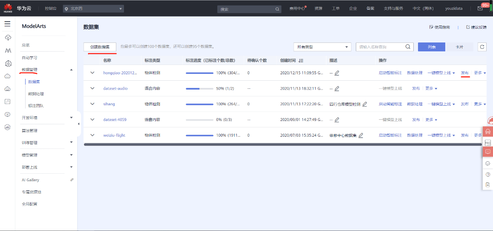

从AI Gallery订阅yolov3_resnet18算法，创建训练作业，训练输入和训练输出参数根据实际情况选择，调优参数可默认。其他参数可以参考下图：

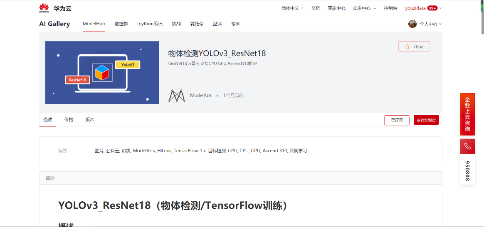

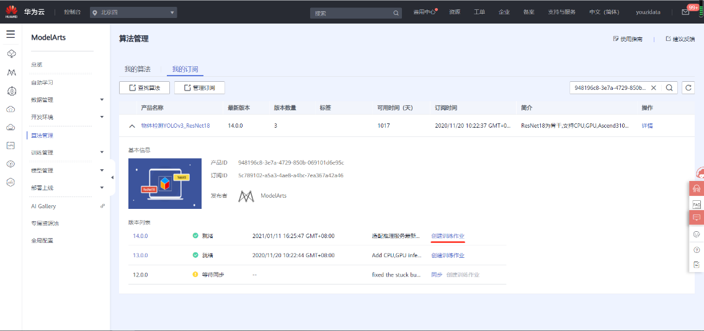

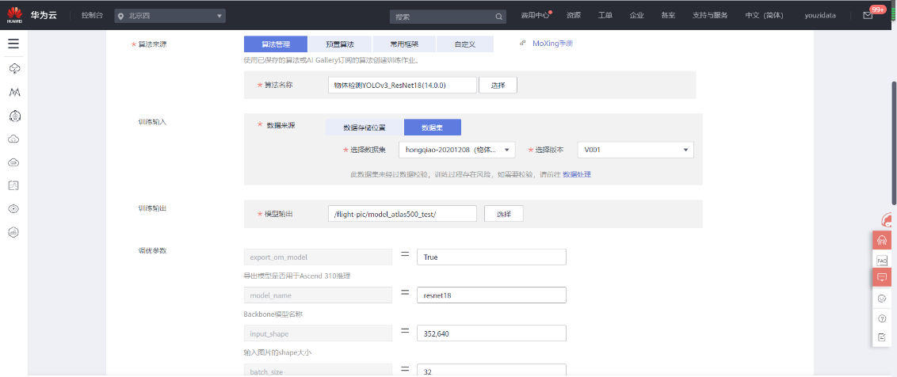

#### b. 利用Hilens studio实现模型转换

进入目标检测模型输出obs路径，进入frozen_graph文件夹，将默认的.cfg文件替换本目录下的aipp_RGB.cfg。

启动Hilens Studio，导入pb模型和aipp_RGB.cfg文件：

在Terminal输入指令“/opt/ddk/bin/aarch64-linux-gcc7.3.0/omg --model=./yolo3_resnet18.pb --input_shape='images:1,352,640,3' --framework=3 --output=./flight_det_yuv --insert_op_conf=./aipp_RGB.cfg”，回车后即刻进行模型转换

将转换得到的flight_det_yuv.om模型下载到本地电脑，用于后续替换技能中的默认模型

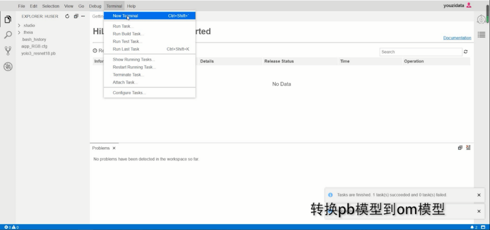

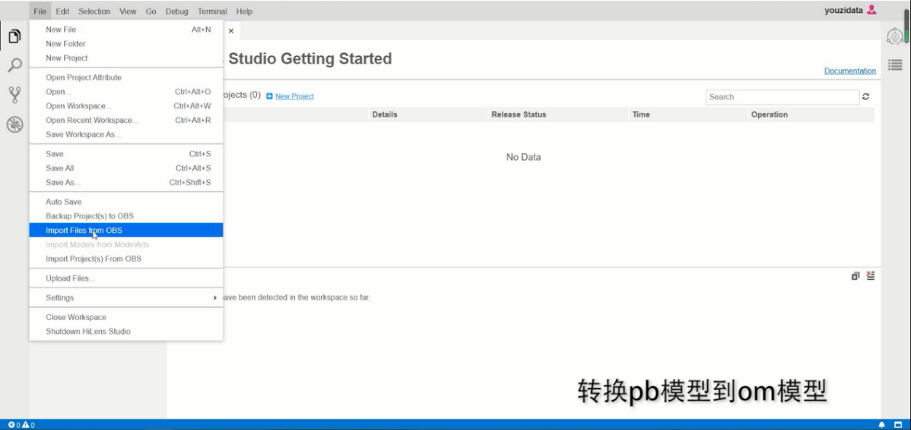

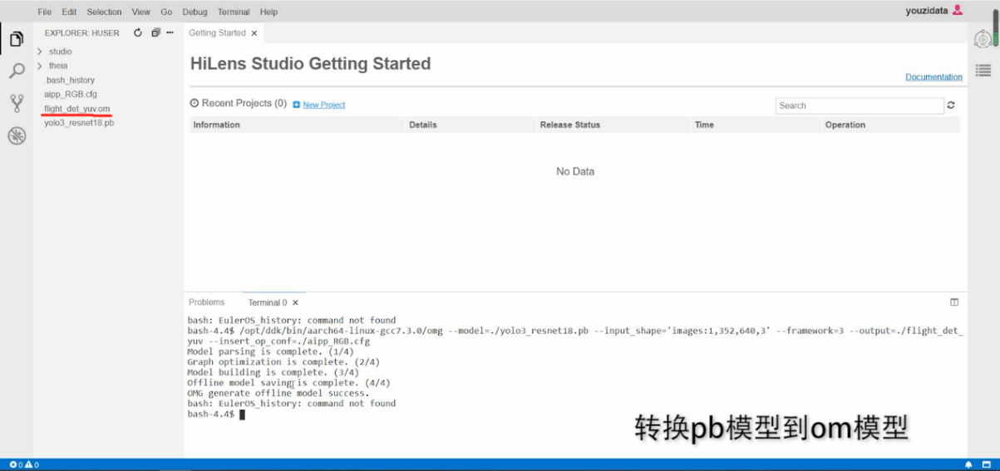

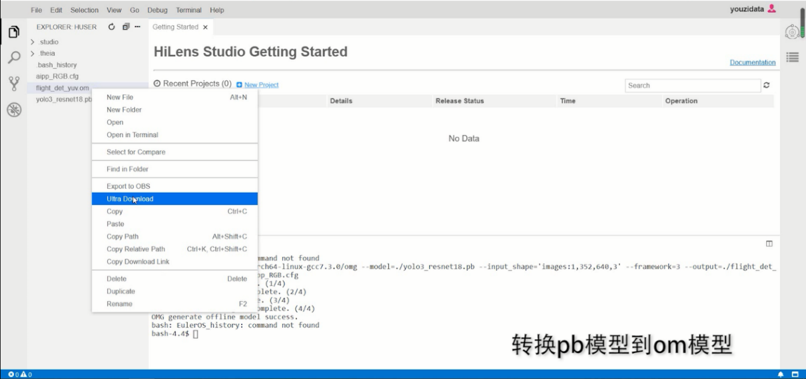

#### c. 安装配置技能

将HiLens Kit固件升级至1.0.7以上，在华为HiLens技能市场（北京四）下载对应技能“飞机识别_柚数据”，如下图

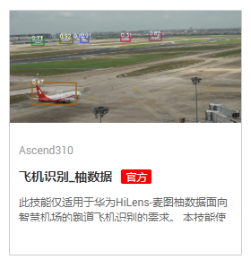

安装后运行前需要进行相关配置，摄像头配置，如下图所示：

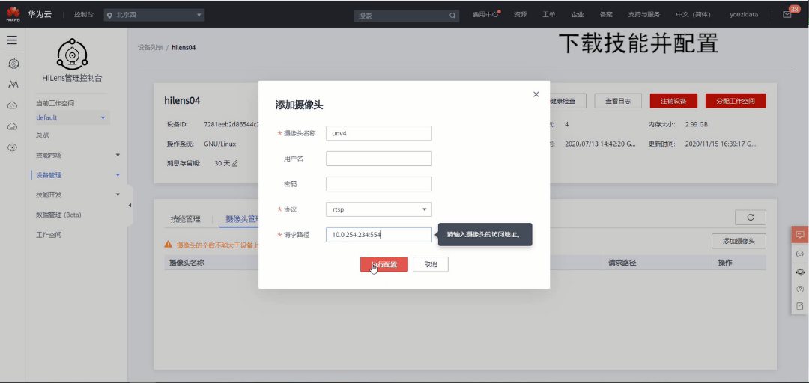

技能配置，如下图所示：

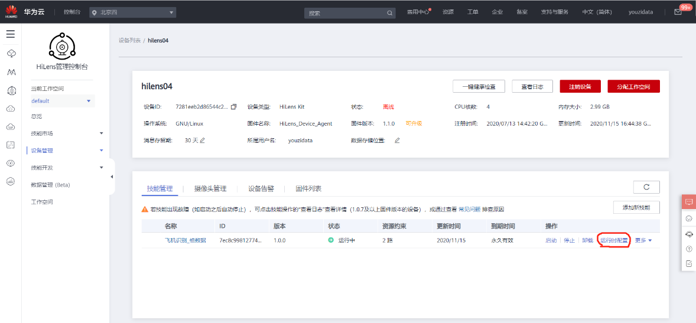

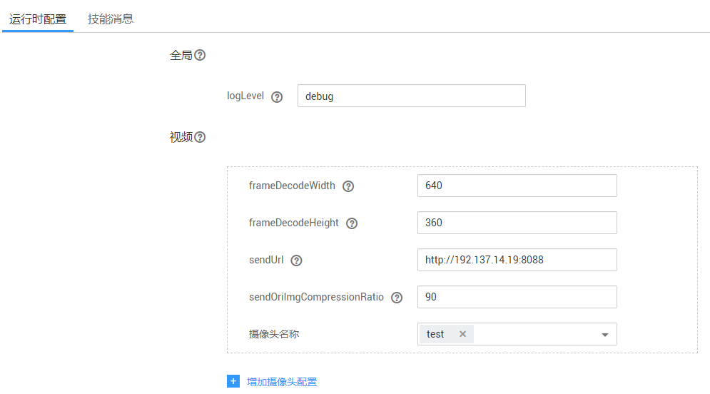

其中：
1. logLevel配置为”debug”可以输出debug及以上级别的日志，包括解码、检测、发送数据等每一步操作的耗时，总的FPS等，适合测试时使用，正式使用可设置为”info”或”error”；
2. frameDecodeWidth和frameDecodeHeight是解码分辨率，可以将原始视频流（如1080p）解码成设定的分辨率，在发送阶段也会以设置的分辨率发送图片，默认（不设置）即为原始分辨率，注意须设置为与原始分辨率等比例的分辨率（如1280x720/960x540/640x360等），且高度必须为32的倍数，宽度必须是2的倍数；
3. sendUrl为接收POST消息的服务器地址（包括端口号），必须是HiLens Kit可以访问的地址；
4. sendOriImgCompressionRatio建议设为90（默认），发送原图时的图片压缩比率；
5. 最多可添加4路网络摄像头。

注意，从hilens发送出来的原图格式为YUV_NV21，如果需要保存和显示必须先做格式转换，接收POST消息的python脚本可参考：flask_server.py

#### d. 更新模型

ssh登录已安装该技能的HiLens Kit，进入/home/hilens/hda/skill目录，可以看到带有“飞机识别_柚数据”字样技能文件夹，进入该文件夹，其结构如下图所示：

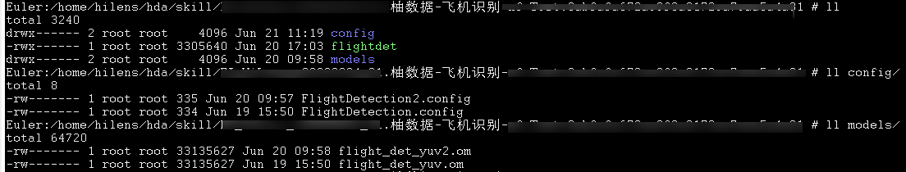

其中models文件夹存放飞机识别om模型（两份除了命名外完全相同的模型，每一份可以处理两路视频的推理），config文件夹存放模型配置文件（同样是两份，每份对应一个模型），其内容如下所示：

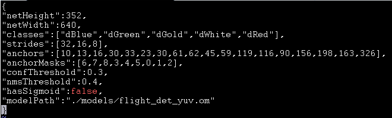

如果模型是使用ModelArts的预置算法yolo3_resnet18训练所得，大部分参数都不需要修改，只需修改模型训练的检测类别classes和最后的模型路径modelPath即可。使用更新后的模型（两份）和配置文件（两份）替换掉原始技能下的相应文件，即可完成技能的更新。

#### e. 部署接受服务

在hilens技能配置的sendUrl对应的服务器上部署接受程序。应用部署后，Hilens会向sendurl不断通过restful接口发送识别信息和得到的图片。具体的飞机识别的json消息体如下表所示：

| 名称       | 类型   | 说明                                                           |
| ---------- | ------ | -------------------------------------------------------------- |
| ori_img_id | String | 原始图UUID                                                     |
| ori_image  | String | 原始图BASE64编码结果                                           |
| time       | Uint64 | 图片解码时间的时间戳，单位为毫秒                               |
| boxes      | List   | 检测到的飞机在背景图中的位置信息，List中每个对象是一个bbox对象 |

bbox格式具体内容

| 字段       | 类型  | 说明                        |
| ---------- | ----- | --------------------------- |
| x          | Int   | 飞机检测框左上角顶点x坐标值 |
| y          | Int   | 飞机检测框左上角顶点y坐标值 |
| h          | Int   | 飞机检测框的宽度            |
| w          | Int   | 飞机检测框的高度            |
| label      | Int   | 飞机检测框的类别            |
| confidence | Float | 飞机检测框的置信度          |

消息体示例：
{ 
  "msg_type": "flight_detection_result",
  "cam_name": "Youzi001_pos2",
  "skill_id": "f5c526eb6c51440c8a0ee5e3cc65f23c",
	"ori_img_id": "0DD1BF0A-634B-11E8-8B0B-407D0FAD9218",
	"ori_image": "4AAQSkZJRgABAQAAAQABAAD/2wBDAAIBAQE...",
	"time": 1527603463,
	"boxes": [{"x":32,"y":379,"w":49,"h":65,"label":0,"confidence":0.90},{"x":302,"y":148,"w":145,"h":54,"label":1,"confidence":0.79}],
}

具体接受服务可以参考程序flask_detected.py

## 3. 开源协议

本程序遵循Apache 2.0开源协议，程序参考ModelArts-Lab相关内容[https://github.com/huaweicloud/ModelArts-Lab.git]
