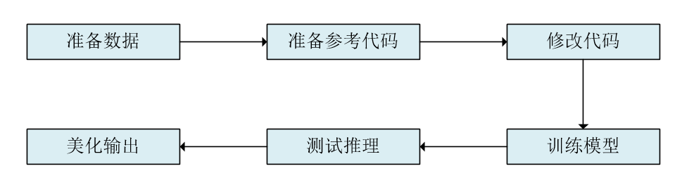
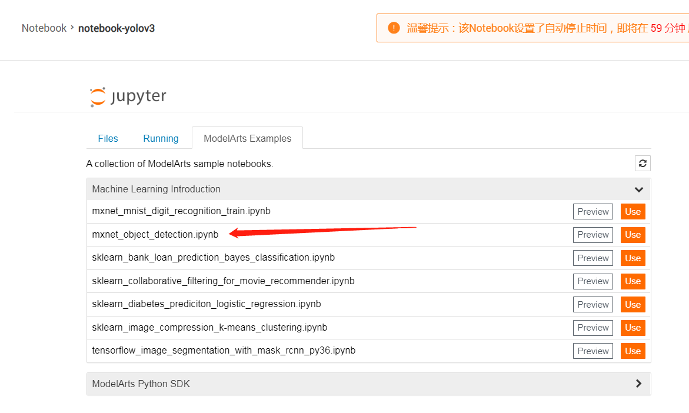
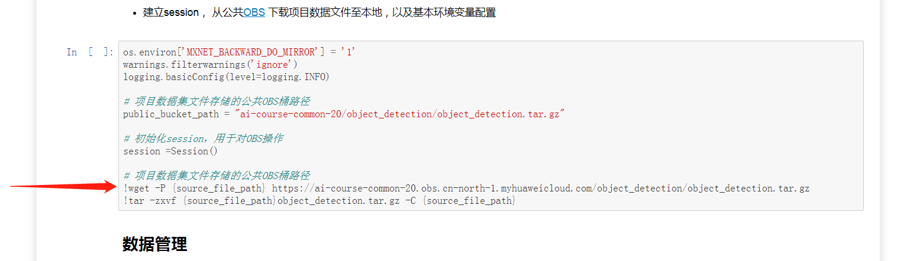

# 基于 YoloV3 的机坪飞机图像识别


[TOC]

已经上传利用hilens接入多路视频的方案，可以参考文件夹下“Hilens接多路视频流方案”内容。

## 1. 应用价值


与道路交通不同的是，航空器在地面运行时难以通过高架、隧道等方式将航班滑行路径分离，由于飞机起降架次的增多，加上恶劣天气的影响，跑道侵入事件已成为民航领域航空器地面安全运行的头等问题，跑道安全事故在民用航空事故中占有很大比例，因此对与在机场跑道和滑行道上运行的航空器、车辆等目标的身份、位置及其动态的掌控程度，很大程度上决定了跑道运行安全的系数。

机场地面运行的航空器和其他载具一般都经由塔台进行统一调度管理，塔台的核心职责是确保航班“安全、有序、高效”运行，塔台管制人员通过“看到-了解-判断-行动”这一决策过程对数量众多的航空器和地面载具进行统一指挥，而“看到”和“了解”这两个过程往往会对管制决策起到决定性作用。

随着机场规模增加，平面布局变得日益复杂化，对于大型机场的塔台而言，单点视野物理受限，以及数字化程度提升的同时，客观上造成屏幕变多、信息量变大，“看到”和“了解”形成了较大的挑战，人的主观能动性很强，但往往难以面面俱到。

基于上述背景，我们设计了跑道侵入防护系统，用于加强跑道侵入事件的防范。“光电盯防子系统”是该系统的重要实时核心，该子系统具备较完整的“基于视频流的航空器目标识别和跟踪”能力，主要工作是将机场平面各个关键点采集到的实时视频流送入基于华为云ModelArts框架的“航空器识别模型”进行处理，识别出画面中飞行器对象的像素坐标等一次参数后，对其进行空间位置换算，以及包括速度、运行方向等在内的二次参数的计算，并在系统运行数据中找到相匹配的航班信息对目标进行信息标记，以AR信息增强的形式呈现在监视器上，让管制员以“抬头显示”的形式在单一屏幕中直观了解到足够全面的动态信息。同时该系统会在后台对所有目标的轨迹和矢量动态数据进行监控和推算，让计算机能够代替或辅助管制人员在全局范围对每一个航班、每一个道口进行实时盯防，提前预知潜在运行风险，从而降低事故发生的概率。

本项目即为该系统的“航空器识别模型”子系统。基于YoloV3模型，能够实现较为准确的目标识别和坐标输出，依托ModelArts训练推理系统，可以实现的”航空器识别模型“服务，实现从“看到”到“了解”的关键一步。

## 2. 开发流程

本项目基于Yolo模型，其主要程序参考华为“ModelArts/开发环境/notebook”，Examples中的mxnet_objection_detection项目构建。

#### a. 基本流程与yolov3

本项目基本流程如图，基本遵循从华为提供的样例代码开始进行修改，并最终调整应用的过程。如开发其它类型基于华为样例代码的工程，同样可以参考本开发流程。开发流程示意图如下：


本项目使用yolov3模型,该模型是经典的目标检测模型。可以实现快速、准确的目标检测。其采用darknet_53作为特征提取网络，并采用多层级检测的方式，实现对大小不同的目标进行快速检测。详细内容可以参考论文原文：	[YOLOv3: An Incremental Improvement](https://arxiv.org/pdf/1804.02767v1.pdf)

#### b. 标注并准备训练数据

模型开发的第一步就是进行数据，由于MA提供的数据准备函数是基于PASCAL VOC 系列数据集的，其中每一张图片对应一个xml标注数据文件。具体可是可以参考[PASCAL VOC](http://host.robots.ox.ac.uk/pascal/VOC/) 系列数据集的描述和详细内容。

标注数据与调整数据集结构是一件非常麻烦的事情，但是ModelArts已经对目标检测的标注提供了完善的数据标注工具支持。本项目也采用ModelArts提供的数据标注工具进行相关工作。具体地说，将采用ModelArts提供的“数据管理/数据集”功能创建“目标检测”数据集以进行标注工作。具体流程可以参考官方[数据管理使用指南](https://support.huaweicloud.com/engineers-modelarts/modelarts_23_0003.html)。

由于后续我们将在notebook中训练，因此得到的数据集还需进一步处理。先标注数据，然后发布数据集，标注数据会保存在`obs://数据集输出位置/dataset-****/annotation/数据版本号/annotations`中，其保存形式为与图片名称相同的xml格式文件。将xml标注文件与对应的图像文件放在同一文件夹中，则可以构筑本项目所需数据集。为方便起见，图像与标注文件文件夹仍保存在obs中的同一文件夹中。

除了单纯的提取数据之外，还可以根据个人需求进行简单的数据加工，比如重新改写标注名称等等。由于本项目中无需额外处理，因此具体方法不再赘述。

#### c. 获得参考代码

参考代码有两个来源，一个是华为提供的notebook example中的notebook代码，另一个是notebook中需要下载的库代码，本小节将描述两个代码具体的获得办法。

参考notebook代码可以在ModelArts Jupyter Notebook下通过Examples中的mxnet_objection_detection打开。具体位置如图：


而其他的参考代码获得方法则略有不同。我们可以在notebook文件中看到，该notebook正常运行需要通过wget下载代码，该代码即为我们需要的参考代码。位置如图：


在公网也可以正常下载，可以使用如下命令直接下载然后解压缩获得参考代码:`wget https://ai-course-common-20.obs.cn-north-1.myhuaweicloud.com/object_detection/object_detection.tar.gz`

#### d. 修改数据准备代码，加载数据

方便起见，notebook代码和其他参考代码放到一个文件中进行使用，且都存储于obs上。其他参考代码主要用于提供python库包，所以不用修改，修改内容集中在notebook代码中。修改内容较为繁杂，具体修改内容可以通过对比本项目提供的notebook文件和原始notebook参考代码来确定。这里仅就其中较为关键的部分进行说明。

参考下图新建notebook，然后使用“mxnet_object_detection.ipynb”作为基础代码，以进行修改。


**修改文件读取方式，加载其他代码和文件**
MA的初始工作目录是`/home/ma-user/work`，所有文件操作都是基于本地系统的，不能直接使用obs中的程序与数据，因此需要修改数据读取方式。在notebook开始位置添加代码：

```python
import moxing as mox
mox.file.shift('os', 'mox')
```

执行后，即可使得python在大部分文件操作中支持obs系统，比如从obs中复制文件到本地系统：

```python
shutil.copytree("s3://youziyolo/youzi/src","./src")
```

其中`s3://`为obs文件路径前缀。

notebook原始代码中有修改本地工作目录的内容。在本项目中本地工作目录工作位置不用修高，保持`/home/ma-user/work`即可。此外，本项目中所有的代码在一开始就已经上传到obs中了，无需用wget下载对应代码，而是通过从obs中复制的方法获得代码和数据。可以参考如下代码（自行操作使需要根据个人指定的obs路径进行修改）：

```python

shutil.copytree("s3://youziyolo/youzi/src","./src")           # 程序源代码
shutil.copytree("s3://youziyolo/youzi/model","./model")       # 预训练模型
shutil.copytree("s3://youziyolo/youzi/data/raw","./rawdata")  # 原始数据
```

**基本变量修改**

在notebook中有一节是基本变量设定。这里需要修改的内容有：

```python
NUM_GPUS = 1         # 设定使用的gpu数量
BATCH_SIZE = 16      # 设定训练batch_size
NUM_CLASSES = 1      # 根据实际情况设置分类数量
NUM_EXAMPLES =  58   # 设定训练的样本数量
```

**准备训练和测试数据**

本项目中的数据没有区分训练和测试数据，因此需要在数据准备的过程进行分类。

第一个注意点事删除src目录下的index文件，index文件保存标签数据，因为自带的index文件中有“云宝”的标签，因此需要删除掉。在数据准备的过程中会重新生成。

`get_data_iter()`函数要添加两个参数`val_file=None,split_spec=0.8`，这样函数将同时返回训练集和测试集，比例为 0.8:0.2 。

最后可以通过`len(train_data._dataset.label_cache)`和`len(val_data._dataset.label_cache)`来查看数据集的数量是否正确分配。

#### e. 修改训练代码，进行训练

**初始化使用gpu**

原始notebook代码中初始化过程使用的是纯cpu计算，这里我们要改成gpu计算。mxnet的gpu初始化代码如下:

```python
devs = mx.cpu() if NUM_GPUS is None or NUM_GPUS == 0 else [
        mx.gpu(int(i)) for i in range(NUM_GPUS)]
```

根据NUM_GPUS的数量进行初始化。当为0的时候，则使用cpu进行初始化环境。

**加载基础网络**

其他训练配置代码无需修改。不过加载基础网络这部分可以特别说明一下。除了原始的预训练darknet_53以外，还可以根据需求加载已经训练过的的darknet_53网络。

加载参数的函数为`mx.model.load_checkpoint(model_prefix, epoch)`。其中model_prefix为路径前缀，epoch则为需要加载模型对应的训练epoch。比如如果要加载`\home\ma-user\work\basemodel-0000.params`，则，`mx.model.load_checkpoint("\home\ma-user\work\basemodel", 0)`可以正确加载模型。

**每epoch评估训练结果**

原始代码中只有训练代码，但完善的训练程序应当可以每轮或每n轮通过测试集对训练结果进行评估。这里添加的代码是从src目录中train_yolov3.py文件中提取的。主要是添加`Yolo_eval`类，并通过`epoch_end_callback.append()`进行回调。具体代码较长，可以参考本项目提供的notebook文件中`5.评估训练结果`部分内容。

这里要注意的一个bug是，因为评估过程中会用到数据准备过程中生成的index文件，如果原始的index文件没有删除，会导致测试的过程中的标签和index文件中标签不匹配，导致计算失败。因此，如果修改了原始数据中的标签类型或者数量，那么请一定要删除index文件，以避免评估过程失败。

**开始训练**

正确配置后就可以开始训练，执行训练代码即可。通常mAP会逐渐提高，可以到80%-90%。此时可以进行推理测试阶段。

#### f. 推理测试与优化显示

推理部分内容相对比较简单，这里对其中的关键点进行描述。

**图片读取**

由于之前已经修改了文件打开方式，因此可以直接使用obs中的图像数据，方便推理过程。比如：

```
file_name = r"s3://youziyolo/youzi/data/flight_test1.jpg"
```

**读取模型并测试**

推理过程同样需要加载模型，这里要注意加载的模型为训练后的模型。其中epoch可以设置为不同值，以观察训练对于目标识别的直观影响。之后顺序执行即可看到推理结果。

**优化显示**

本项目中的图片为4k图片，为实现最佳的显示效果，要扩大figsize。这里使用`plt.figure(figsize=(32,18))`来显示图片，效果较好。

置信度的显示也要适当调整，这里置信度显示的参数调整为`fontScale=1.5, thickness=3`，可以使得置信度文字清晰可见。


## 3. 程序介绍

本程序采用yoloV3进行航空器目标识别，参考华为“ModelArts/开发环境/notebook”，Examples中的mxnet_objection_detection项目构建。

由于本程序使用了华为提供的moxing和Modelarts包,因此所有程序和数据应部署于华为obs上以供ModelArts使用。本程序的训练和推断都通过ModelArts提供的训练和推断功能加以展示。

本程序所涉及2k图像数据为自行采集数据，标注是通过华为ModelArts标注系统完成并导出的。本数据集使用遵循Apache 2.0 开源协议。

本程序修改自 Huawei ModelArts 提供的mxnet_objection_detection图像检测项目。所有程序遵循Apache 2.0 开源协议。

#### 目录结构介绍

**文档所述的主程序为mxnet_yolov3.ipynb, 位于src目录下.**

本文档所述目录结构如下，其中仅在百度云数据程序整合包中存在的部分用斜体表示：

├── *data    数据目录*

│   ├──*raw 原始数据与标注内容目录*

│   ├──*flight_test1.jpg 用于推理测试的图片*

│   ├──*flight_test2.jpg 用于推理测试的图片*

├── md_img    md图片文件目录

├── *model*       模型目录 

│   ├── *fine_tune-0000.params    迁移学习后模型参数，可以直接使用*

│   ├── *fine_tune-symbol.json   迁移学习后模型symbol，可直接使用*

│   ├── darknet_53-0000.params  预制模型参数

│   └── darknet_53-symbol.json   预制模型symbol

├── README.md

└── src    源代码目录

   ├── data       数据处理package目录

   ├── symbol   symbol生成package目录

   ├── utils   工具package目录

   ├── [mxnet_yolov3.ipynb](./src/mxnet_yolov3.ipynb)   **主程序文件，用于训练程序和进行推理测试**

   ├── train_yolov3_moxing.py   用于MA训练任务的独立程序

   ├── train_yolov3.py   用于MA训练任务的独立程序

   └── yolov3_service.py  用于MA推理部署的独立程序


## 4. 程序与数据部署

本部分基于已经给出的程序进行描述，与开发过程有一定不同，可以相互参考使用。


#### a. 数据获取

鉴于本程序所用数据包较大，为方便实践，本程序的数据和代码打包在一起，存储于百度云上：

链接：https://pan.baidu.com/s/1pEf1VeME-Grh3lHFFxtxZw&shfl=sharepset 
提取码：kkt7 

其中程序结构与挖宝行动中提交代码相同。本代码包中多出数据资源以及fine_tune训练后的模型，这两部分文件较大因此没有上传到git上。本代码包所包含所有内容皆遵循Apache 2.0 开源协议。


#### b. 数据上传

建议将本程序打包上传到华为的obs系统中，然后进行后续的训练和推测。之所以采用obs保存代码和文件是基于如下几个理由：

1. 华为obs可以支持文件版本化，对于模型和数据来说可以更加方便的进行版本管理。
2. obs的文件可被多个虚拟就/docker同时访问，可以有效进行文件在多服务器上保存和管理。
3. ModelArts与obs做了深度整合，在训练模型获取文件等等方面，ModelArts操作obs比操作其他外部文件更加方便。

为实现上传文件到obs，首先需要建立obs桶，桶是obs的最大存储单元，类似于根目录。本文档所用obs采用默认设置即可。不过需要注意服务器区域的选择。后续ModelArts需要选择同样的服务器区域才能访问同一区域的obs。本文档中所选区域为“华北-北京一”。桶的名字自行设定即可，本文档中采用“youziyolo”作为桶名。

然后将解压缩的文件，上传到obs中。进入obs控制台-〉对象存储-〉右下方点击桶的名字，这里是youziyolo-〉对象-〉上传对象，然后将目录上传即可。

注意这里一次上传只能上传100个文件，数据文件夹文件较多，分多次上传即可。


## 5. 训练与评估

训练可以采用两种方式，一种是使用ModelArts中的“开发环境/Notebook”进行训练，另一个方法是通过“训练管理/训练作业”进行训练。Notebook训练在研发阶段中比较方便。才用训练作业的方法，更适合使用自动化的方法。本程序同时支持两种训练方法，这里重点说明Notebook中如何进行训练和评估，后续会简述如何使用训练作业进行训练

#### a.  新建Notebook服务器

选择 开发环境-〉Notebook-〉创建，新建一个Notebook服务器，这里存储位置建议选择obs中的/youziyolo/youzi，这样可以直接使用在obs上保存的notebook。如果只是推理可以使用cpu，如果需要进行训练推荐使用gpu，否则训练速度会非常慢


#### b. 运行程序进行训练

创建成功后，打开/youziyolo/youzi/src/mxnet_yolov3.ipynb，按序运行程序至开始训练即可，notebook文件中。这里有几点需要注意。

1. 程序中“/youziyolo” 是本文档所使用的obs桶名称，在自行测试的过程中，请修改youziyolo为自己的桶名称，否则会因为无法正确访问桶而报错。

2. 本文档提供的预训练模型有两个，一个是基于imagenet进行预训练的darknet_53，使用该预训练模型需要花较长时间进行训练才能够达到较好的识别效果。另一个是已经训练好的可以识别机场飞机的模型，名字为fine_tune。该模型无需训练或者仅需少量训练即可实现有效识别。可以通过调整 “base_model_prefix” 参数进行切换。

3. 为了更好的整合obs系统，强烈推荐使用

   ```python
   import moxing as mox
   mox.file.shift('os', 'mox')
   ```

   使用该方法，可以使大部分python的文件处理支持obs，obs路径采用“s3://bucket-name/dir/file”的格式使用，极大的方便训练过程中文件的读取存储。

4. 本程序没有严格区分训练集和测试集，而是从原始数据及中以8:2的数量随机选取训练集和测试集用例。比例可以在使用get_data_iter()函数读取数据集的过程中修改split_spec参数以调整训练集和测试集的比例。

#### c. 验证训练结果

本程序使用标准的mAP验证模型的性能，在每一个训练轮之后进行一次模型验证工作，其验证结果格式类似：

```json
[('飞机', 0.80242209311072232), ('mAP', 0.80242209311072232)]
```

表示飞机标签的mAP为0.8，由于只有一个标签，因此总的mAP也是0.8。

本程序所提供的fine tune后的模型是在darknet_53预训练模型基础之上进行迁移训练，共训练了200 epochs，batch_size=16，在单卡p100上花费5小时45分钟训练得到的。结果mAP如上述所示，为0.8。

#### d. 采用“训练管理/训练作业”进行训练

本文档所述程序也可以采用“训练管理/训练作业”方式进行训练，该方法易于通过ModelArts进行版本管理，并且适合多参数测试并发训练。但该训练方法较为复杂，需要对训练代码进行适当调整，以适配训练管理的功能。本程序提供了相关代码，核心代码与notebook相同。由于笔者也尚未完全吃透该功能，因此，本部分代码仅为想尝试训练作业功能的开发者提供参考。

在youziyolo obs下创建logs文件和output/model文件夹。然后创建训练任务后，各个参数可以参考如下图：


然后启动训练即可，其结果将会保存 obs:/your-buckt/output/model/ 下。


## 6.预测测试

训练完成后即可进行测试，本测试是在notebook中进行，在notebook中“模型推理测试”有详细的代码注释和流程说明，可以进行参考。按序进行及可获得推理显示结果。这里仅就几个注意点进行说明：

1. 测试模型可以采用训练后的模型 yolov3_flight，也可以采用model目录下提供的fine_tune模型，都能够实现正确的识别。如果采用训练作业所产生的模型，请先将作业训练所输出的模型复制到工作目录，可以使用如下语句：

```python
shutil.copytree("s3://youziyolo/output/model/model/fine_tune-0000.params","./") 
shutil.copytree("s3://youziyolo/output/model/model/fine_tune-symbol.json","./") 
```

​        然后将加载模型的代码修改为
```python
load_epoch = 0
_, arg_params, aux_params = mx.model.load_checkpoint("./fine_tune", load_epoch)
```

​        即可实现使用训练作业产生的模型进行推理测试。

2. 本场景原始图片较大，因此在显示图片的时候请设置 plt.figure(32,18)，否则图片会非常不清晰，影响结果观察。

预测结果如下，图中方框颜色无实际意义，仅用来辅助观察。方框上的数字为置信度。


# 开源协议

本程序遵循Apache 2.0开源协议，程序参考ModelArts-Lab相关内容[https://github.com/huaweicloud/ModelArts-Lab.git]
