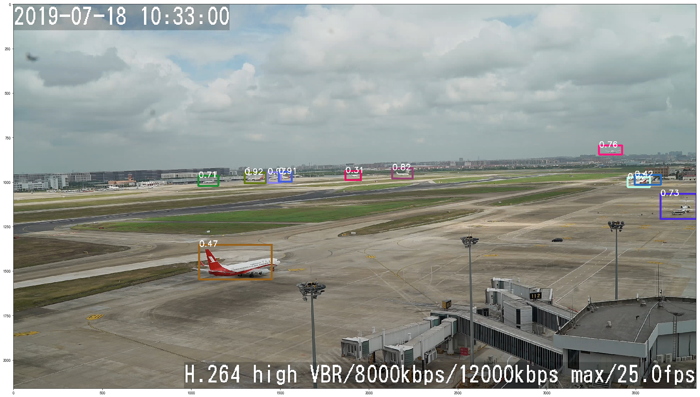

# 基于 YoloV3 的机坪飞机图像识别

[TOC]


## 1. 应用价值

长期以来，机场塔台指挥以及机坪指挥中，都是通过人眼直接观察以确定飞机在机场或跑道上的位置以进行指挥。然而这存在很多问题，比如发生大雾天等不良天象时难以进行观察并进行有效的指挥，又如仅通过肉眼观察，可能对相对较远的实际的飞机位置缺乏可靠的判断，导致潜在的安全隐患等等。因此，在机场这种广纵深高像素的场景中，急需一种快速有效的识别航空器的手段，以进行航空器位置的分析或者视觉增强。本程序就旨在利用 YoloV3 实现飞机的在机坪的实时高速识别。本程序所述场景具有较高的商业应用价值。


## 2. 程序介绍

本程序采用yoloV3进行航空器目标识别，

参考华为“ModelArts/开发环境/notebook”，Examples中的mxnet_objection_detection项目构建。

由于本程序使用了华为提供的moxing和Modelarts包,因此所有程序和数据应部署于华为obs上以供ModelArts使用。本程序的训练和推断都通过ModelArts提供的训练和推断功能加以展示。

本程序所涉及2k图像数据为自行采集数据，标注是通过华为ModelArts标注系统完成并导出的。本数据集使用遵循Apache 2.0 开源协议。

本程序修改自 Huawei ModelArts 提供的mxnet_objection_detection图像检测项目。所有程序遵循Apache 2.0 开源协议。

### a. 目录结构介绍

**文档所述的主程序为mxnet_yolov3.ipynb, 位于src目录下.**

本文档所述目录结构如下，其中仅在百度云数据程序整合包中存在的部分用斜体表示：

├── *data    数据目录*

│   ├──*raw 原始数据与标注内容目录*

│   ├──*flight_test1.jpg 用于推理测试的图片*

│   ├──*flight_test2.jpg 用于推理测试的图片*

├── md_img    md图片文件目录

├── *model*       模型目录 

│   ├── *fine_tune-0000.params    迁移学习后模型参数，可以直接使用*

│   ├── *fine_tune-symbol.json   迁移学习后模型symbol，可直接使用*

│   ├── darknet_53-0000.params  预制模型参数

│   └── darknet_53-symbol.json   预制模型symbol

├── README.md

└── src    源代码目录

   ├── data       数据处理package目录

   ├── symbol   symbol生成package目录

   ├── utils   工具package目录

   ├── [mxnet_yolov3.ipynb](./src/mxnet_yolov3.ipynb)   **主程序文件，用于训练程序和进行推理测试**

   ├── train_yolov3_moxing.py   用于MA训练任务的独立程序

   ├── train_yolov3.py   用于MA训练任务的独立程序

   └── yolov3_service.py  用于MA推理部署的独立程序


## 3. 程序与数据部署

### a. 数据获取

鉴于本程序所用数据包较大，为方便实践，本程序的数据和代码打包在一起，存储于百度云上：

链接：https://pan.baidu.com/s/1pEf1VeME-Grh3lHFFxtxZw&shfl=sharepset 
提取码：kkt7 

其中程序结构与挖宝行动中提交代码相同。本代码包中多出数据资源以及fine_tune训练后的模型，这两部分文件较大因此没有上传到git上。本代码包所包含所有内容皆遵循Apache 2.0 开源协议。


### b. 数据上传

建议将本程序打包上传到华为的obs系统中，然后进行后续的训练和推测。之所以采用obs保存代码和文件是基于如下几个理由：

1. 华为obs可以支持文件版本化，对于模型和数据来说可以更加方便的进行版本管理。
2. obs的文件可被多个虚拟就/docker同时访问，可以有效进行文件在多服务器上保存和管理。
3. ModelArts与obs做了深度整合，在训练模型获取文件等等方面，ModelArts操作obs比操作其他外部文件更加方便。

为实现上传文件到obs，首先需要建立obs桶，桶是obs的最大存储单元，类似于根目录。本文档所用obs采用默认设置即可。不过需要注意服务器区域的选择。后续ModelArts需要选择同样的服务器区域才能访问同一区域的obs。本文档中所选区域为“华北-北京一”。桶的名字自行设定即可，本文档中采用“youziyolo”作为桶名。

然后将解压缩的文件，上传到obs中。进入obs控制台-〉对象存储-〉右下方点击桶的名字，这里是youziyolo-〉对象-〉上传对象，然后将目录上传即可。

注意这里一次上传只能上传100个文件，数据文件夹文件较多，分多次上传即可。


## 4. 训练与评估

训练可以采用两种方式，一种是使用ModelArts中的“开发环境/Notebook”进行训练，另一个方法是通过“训练管理/训练作业”进行训练。Notebook训练在研发阶段中比较方便。才用训练作业的方法，更适合使用自动化的方法。本程序同时支持两种训练方法，这里重点说明Notebook中如何进行训练和评估，后续会简述如何使用训练作业进行训练

### a.  新建Notebook服务器

选择 开发环境-〉Notebook-〉创建，新建一个Notebook服务器，这里存储位置建议选择obs中的/youziyolo/youzi，这样可以直接使用在obs上保存的notebook。如果只是推理可以使用cpu，如果需要进行训练推荐使用gpu，否则训练速度会非常慢


### b. 运行程序进行训练

创建成功后，打开/youziyolo/youzi/src/mxnet_yolov3.ipynb，按序运行程序至开始训练即可，notebook文件中。这里有几点需要注意。

1. 程序中“/youziyolo” 是本文档所使用的obs桶名称，在自行测试的过程中，请修改youziyolo为自己的桶名称，否则会因为无法正确访问桶而报错。

2. 本文档提供的预训练模型有两个，一个是基于imagenet进行预训练的darknet_53，使用该预训练模型需要花较长时间进行训练才能够达到较好的识别效果。另一个是已经训练好的可以识别机场飞机的模型，名字为fine_tune。该模型无需训练或者仅需少量训练即可实现有效识别。可以通过调整 “base_model_prefix” 参数进行切换。

3. 为了更好的整合obs系统，强烈推荐使用

   ```python
   import moxing as mox
   mox.file.shift('os', 'mox')
   ```

   使用该方法，可以使大部分python的文件处理支持obs，obs路径采用“s3://bucket-name/dir/file”的格式使用，极大的方便训练过程中文件的读取存储。

4. 本程序没有严格区分训练集和测试集，而是从原始数据及中以8:2的数量随机选取训练集和测试集用例。比例可以在使用get_data_iter()函数读取数据集的过程中修改split_spec参数以调整训练集和测试集的比例。

### c. 验证训练结果

本程序使用标准的mAP验证模型的性能，在每一个训练轮之后进行一次模型验证工作，其验证结果格式类似：

```json
[('飞机', 0.80242209311072232), ('mAP', 0.80242209311072232)]
```

表示飞机标签的mAP为0.8，由于只有一个标签，因此总的mAP也是0.8。

本程序所提供的fine tune后的模型是在darknet_53预训练模型基础之上进行迁移训练，共训练了200 epochs，batch_size=16，在单卡p100上花费5小时45分钟训练得到的。结果mAP如上述所示，为0.8。

### d. 采用“训练管理/训练作业”进行训练

本文档所述程序也可以采用“训练管理/训练作业”方式进行训练，该方法易于通过ModelArts进行版本管理，并且适合多参数测试并发训练。但该训练方法较为复杂，需要对训练代码进行适当调整，以适配训练管理的功能。本程序提供了相关代码，核心代码与notebook相同。由于笔者也尚未完全吃透该功能，因此，本部分代码仅为想尝试训练作业功能的开发者提供参考。

在youziyolo obs下创建logs文件和output/model文件夹。然后创建训练任务后，各个参数可以参考如下图：


然后启动训练即可，其结果将会保存 obs:/your-buckt/output/model/ 下。

## 5.预测测试

训练完成后即可进行测试，本测试是在notebook中进行，在notebook中“模型推理测试”有详细的代码注释和流程说明，可以进行参考。按序进行及可获得推理显示结果。这里仅就几个注意点进行说明：

1. 测试模型可以采用训练后的模型 yolov3_flight，也可以采用model目录下提供的fine_tune模型，都能够实现正确的识别。如果采用训练作业所产生的模型，请先将作业训练所输出的模型复制到工作目录，可以使用如下语句：

```python
shutil.copytree("s3://youziyolo/output/model/model/fine_tune-0000.params","./") 
shutil.copytree("s3://youziyolo/output/model/model/fine_tune-symbol.json","./") 
```

​        然后将加载模型的代码修改为
```python
load_epoch = 0
_, arg_params, aux_params = mx.model.load_checkpoint("./fine_tune", load_epoch)
```

​        即可实现使用训练作业产生的模型进行推理测试。

2. 本场景原始图片较大，因此在显示图片的时候请设置 plt.figure(32,18)，否则图片会非常不清晰，影响结果观察。

预测结果如下，图中方框颜色无实际意义，仅用来辅助观察。方框上的数字为置信度。



# 开源协议

本程序遵循Apache 2.0开源协议，程序参考ModelArts-Lab相关内容[https://github.com/huaweicloud/ModelArts-Lab.git]
