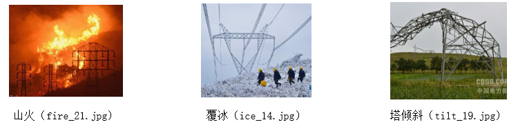
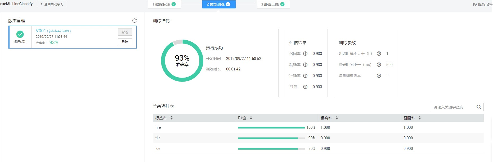
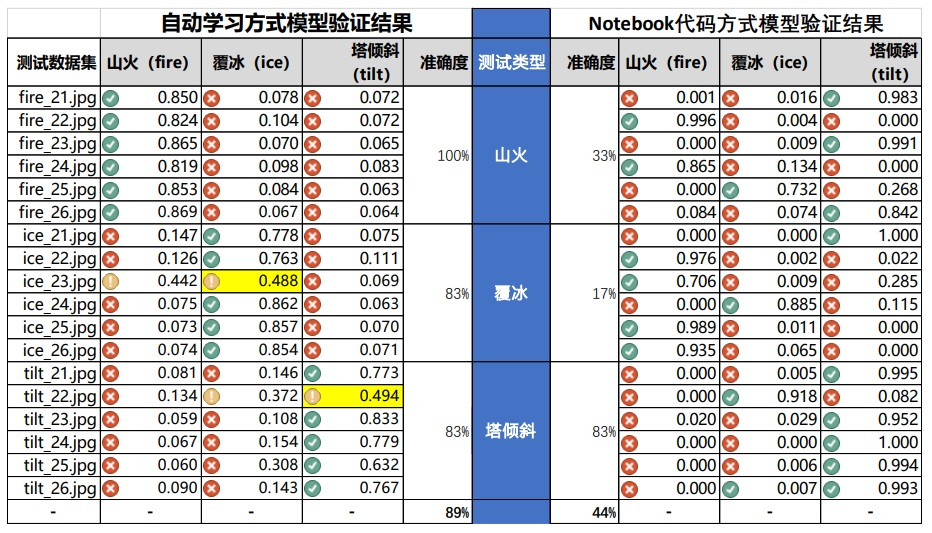

# 智慧线路---基于ModelArts的输电线路智能巡检
输电线路是电力可靠供应的重要保障,但是由于运行线路长、分布范围广、环境复杂等因素，导致覆冰、山火、塔倾、异物悬挂等危害输电线路安全运行的事件时有发生,严重影响居民的正常生活和企业的安全生产。传统人工巡线的方式耗时耗力,并且受到地理环境和气候变化的严重制约。无人机巡检和铁塔安装摄像头等视频巡检方式给输电线路的智能化巡检带来了福音，但是由于上述视频巡检方式图像采集数据量大，靠人工对异常图像进行分类识别工作量大、效率低，现有图像分类识别工具因硬件要求高、使用门槛高、模型调参复杂等因素，让运维专业人员望而生畏，也限制了智能化技术的应用。

华为ModelArts作为一站式AI开发平台，提供全流程的AI开发服务，海量数据处理、大规模分布式训练、端·边·云模型按需部署，运维管理，帮助用户快速创建和部署模型、管理全周期 AI 工作流，满足不同开发层次的需要，降低AI开发和使用门槛，实现系统的平滑、稳定、可靠运行。

本案例基于ModelArts的自动学习模块，通过图像分类和物体检测实现对采集数据（无人机或固定摄像头拍摄的图片）进行分类，降低运维人员的工作量，提高线路巡检效率，实现对输电线路的智能化巡检。

详细文档参见 [基于ModelArts的输电线路智能巡检.pdf](基于ModelArts的输电线路智能巡检.pdf)

## 数据集

- dataset\classification\train：训练样本，包括山火（fire）、覆冰（ice）和塔倾斜（tilt）三类图片，每类20张。
- dataset\classification\test：测试样本，包括山火（fire）、覆冰（ice）和塔倾斜（tilt）三类图片，每类6张。

将上述数据集导入OBS桶中（建议使用OBS Browser客户端，更快、更方便），以备下一步模型训练时使用。

## 模型训练
采用两种方式：自动学习方式和Notebook代码方式。
### 自动学习方式
- 创建项目：基于ModelArts的自动学习模块，创建【图像分类】项目，训练数据选择上一步对应数据集的OBS地址。
- 数据标注：分别按照山火（fire）、覆冰（ice）和塔倾斜（tilt）对三类图片进行标注。 
- 模型训练：数据标注完毕，点击【开始训练】，系统自动对模型进行训练。
 
- 部署上线：点击【部署】按钮，把模型部署上线。

### Notebook代码方式
- 基于Notebook创建代码方式进行模型训练和评估。详见LineClassfication.Ipynb。

## 模型评估
两种方式的模型评估结果如下图所示。

从对比结果可以看出，ModelArts提供的自动学习方式明显优于Notebook代码方式的结果（当然也和参数选择有关系），同时说明，ModelArts的自动学习工具针对**小样本**、**低像素**和**不规则**图像数据的分类处理优势明显。