#  口罩检测模型开发指导文档 

## 介绍

Duration: 1 mins 

### 1. 本文档目标

- 指导开发者使用已标注好的口罩检测数据集，利用华为云ModelArts的一键部署上线功能训练得到一个口罩检测模型
- 指导开发者在ModelArts Notebook中使用ModelArts SDK部署测试模型，可进行批量图片测试和单个视频的测试。

### 2. 您需要准备什么？

- 一台电脑（Windows，Mac或Linux操作系统）
- 谷歌浏览器

## 3. 准备工作

Duration: 10 mins

进行口罩检测模型的开发，需要完成以下准备工作

### 3.1 创建华为云账号

参考[此文档](https://support.huaweicloud.com/prepare-modelarts/modelarts_08_0001.html)，注册华为云账号。

 **注意:** 在使用ModelArts时要及时检查账号状态，避免账号处于欠费或冻结状态时资源被冻结，影响您的使用。 

### 3.2 下载安装OBS Browser

[点此链接](https://support.huaweicloud.com/clientogw-obs/zh-cn_topic_0045829056.html) 前往下载地址，选择相应的系统版本进行下载，下载完成后解压，双击打开解压后文件夹中的obs.exe

下载安装完成后，依次完成下面3个步骤：

（1）使用OBS Browser，需[创建访问密钥（AK和SK）](https://support.huaweicloud.com/clientogw-obs/zh-cn_topic_0045829057.html)，用于身份鉴权。

（2）OBS Browser添加账号步骤请参见[账号管理](https://support.huaweicloud.com/clientogw-obs/zh-cn_topic_0045829120.html)。

（3）OBS Browser的系统配置，请参见[系统配置](https://support.huaweicloud.com/clientogw-obs/zh-cn_topic_0045829119.html)。

### 3.3 获取访问密钥并完成ModelArts全局配置

参考[此文档](https://support.huaweicloud.com/prepare-modelarts/modelarts_08_0002.html) 获取访问密钥并完成ModelArts全局配置。

**注意**：访问秘钥文件请妥善保存，后面的步骤会用到。

### 3.4 下载口罩检测数据集

[点此链接](https://modelarts-labs-bj4.obs.cn-north-4.myhuaweicloud.com/case_zoo/mask_detect/datasets/mask_detect_datasets.zip) 下载口罩检测数据集，将得到mask_detect_datasets.zip，解压得到mask_detect_datasets，其中的train目录是训练集，test是测试集

3.5 上传数据集至OBS

（1）按照下图操作创建一个OBS桶，点击 添加桶 -》输入桶名（确保桶名符合命名规则）-》确定

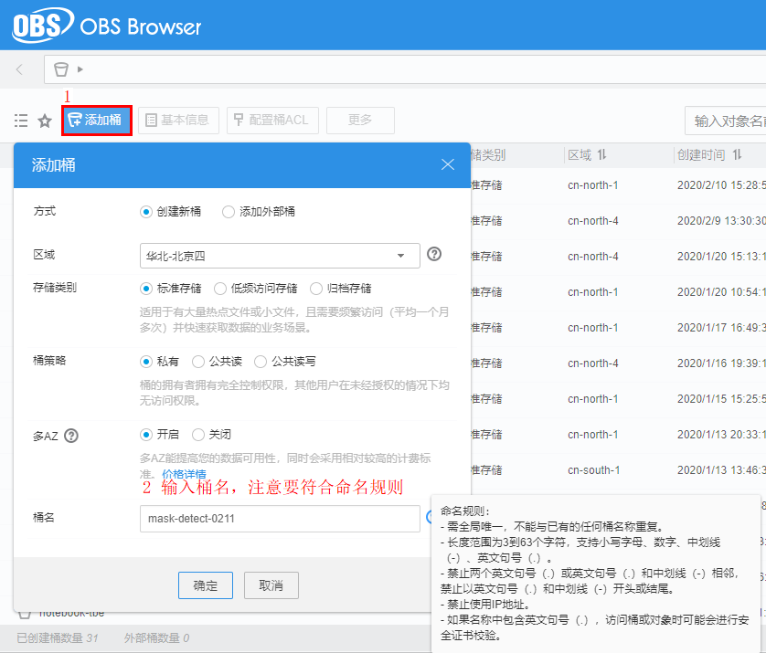

（2）按照下图上传数据集文件夹，点击 上传-》选择文件夹，选定前面解压的mask_detect_datasets目录 -》确定

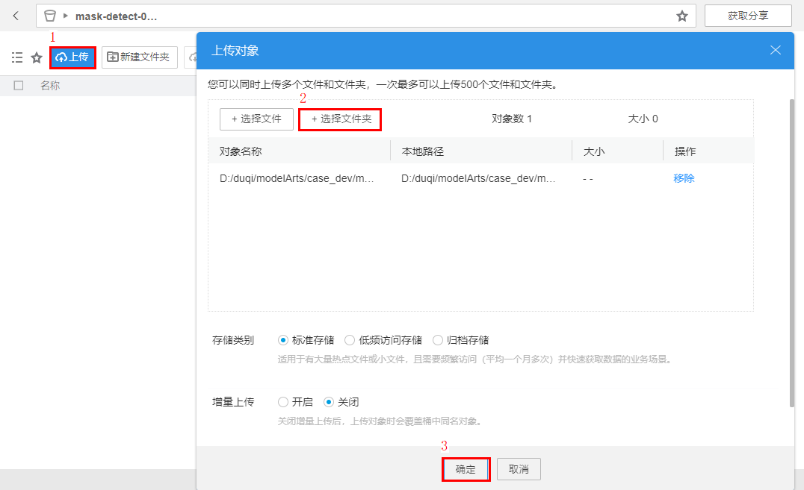

**至此，准备工作完成。**

### 4 ModelArts训练口罩检测模型

[点此链接](https://console.huaweicloud.com/modelarts/?region=cn-north-4#/manage/dashboard)前往ModelArts北京四区域的控制台页面

（1）按照下图创建数据集

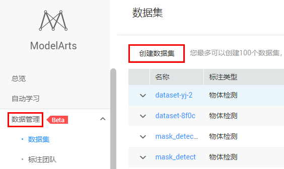

（2）按照下图中步骤指定数据输入位置

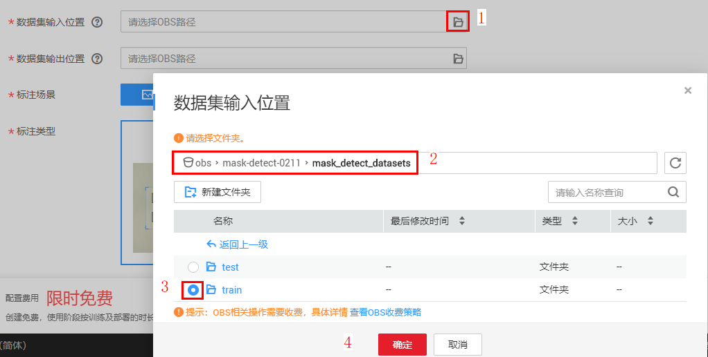

（3）按照下图中步骤指定数据输出位置

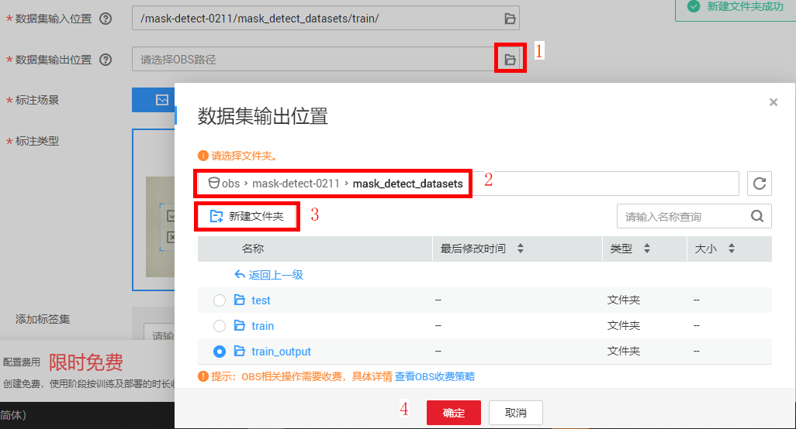

（4）按照下图中步骤选择物体检测，点击创建

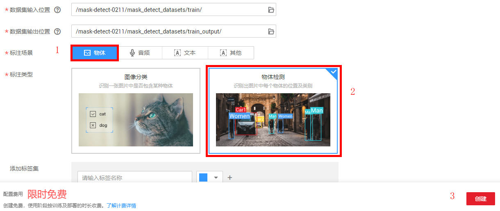

（5）等待数据集自动导入

点击创建后，ModelArts会自动从OBS中导入已经标注好的数据集，导入时间根据数据集大小而定，可以手动刷新页面查看最新的导入进度，如下图所示，等待进度达到100%。

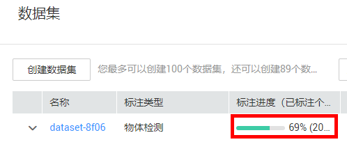

（6）创建一键部署上线任务

按照下图点击 一键部署上线 -》任务创建

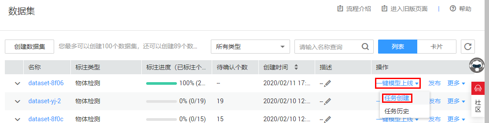

（7）配置作业参数

按照下图修改作业名称，选择预置算法，设置算法参数。本案例直接使用默认的预置算法、默认的算法参数即可，

直接使用默认的配置也可以得到较好的模型训练效果。

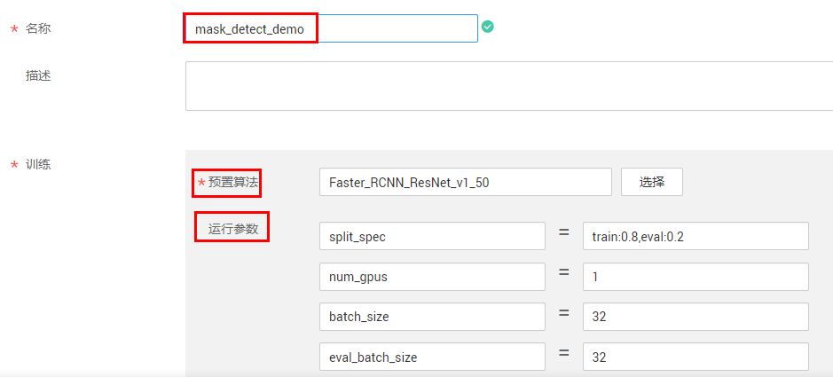

（8）指定训练输出位置

按照下图选择训练输出位置

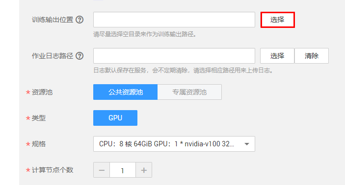

按照下图步骤新建一个train_output目录

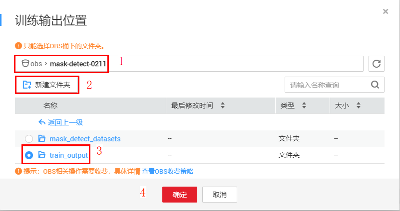

（9）指定作业日志路径

按照下图选择作业日志路径

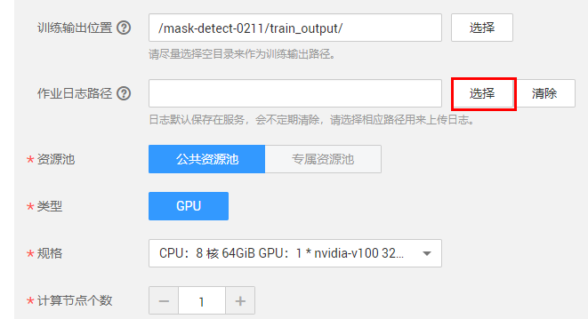

按照下图步骤新建一个train_log目录

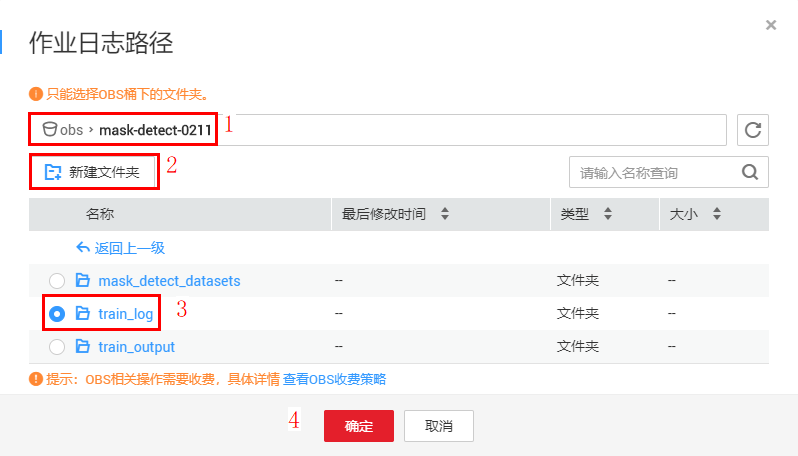

（10）参数配置完成，如下图所示，点击下一步，提交

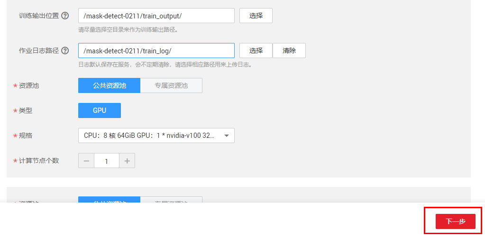

（11）等待作业训练完成，预计总耗时需30分钟左右

如果在等待过程中退出了该网页，可以按照下图 数据集-》一键模型上线-》任务历史，重新进入任务页面查看任务详情：

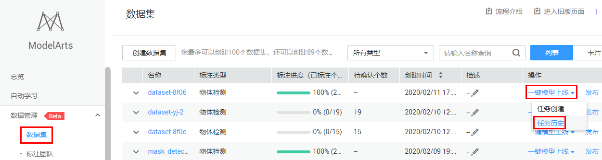

（12）测试在线服务

一键部署上线任务完成之后，将会创建一个在线服务，这个在线服务是将模型进行了部署，并可以通过在线API的形式获取到模型的预测能力。

按照下图找到以"mask_detect_demo"前缀为名的服务名称，这个前缀就是我们创建一键部署任务时取的名字

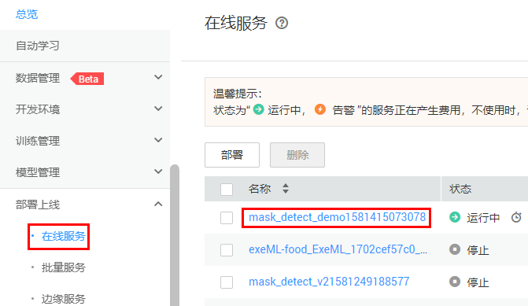

点击服务名称进入到在线服务详情页面，如下图所示，依次点击预测-》上传-》预测，即可以实现一张图片的预测，由于该在线服务默认是用CPU部署，所以预测较慢一些，使用GPU部署可以加快预测。

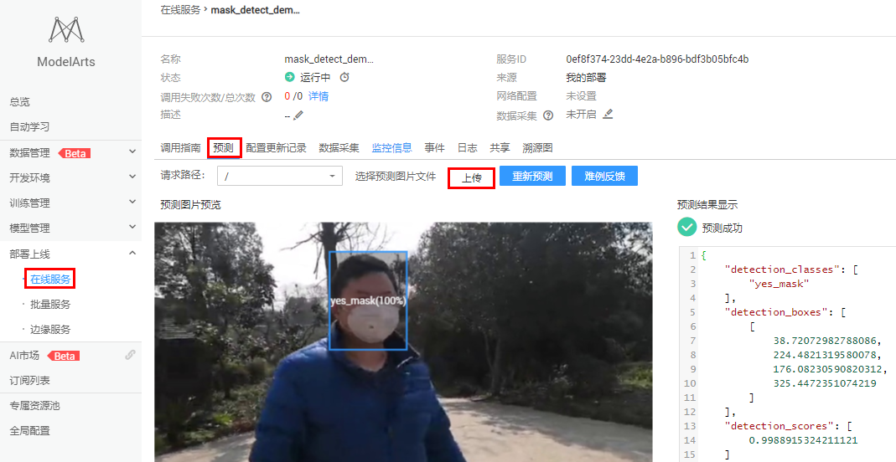

### 5 Notebook中进一步测试模型

为了进一步地测试模型的能力，我们可以在ModelArts开发环境Notebook中来做批量图片的预测和视频的预测。

ModelArts Notebook是专用于做开发调试的工具，它提供了业界通用的AI引擎和做AI开发常用的一些python环境，在上面可以执行自定义的代码。

（1）创建Notebook

按照下图创建Notebook

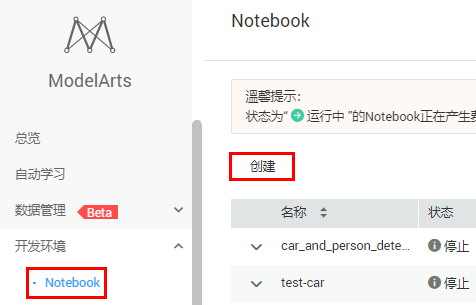

再按照下图进行配置，选择GPU -》P100，下一步，提交，大约两分钟后创建好。

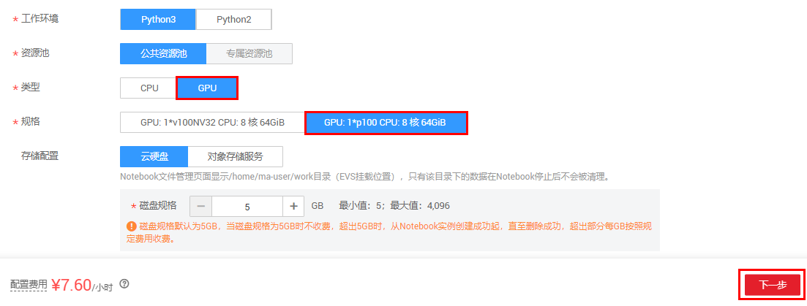

点击Notebook名称进入到Notebook，进去将看到空的工作空间。

（2）下载批量图片测试脚本和视频脚本，上传到Notebook

[点此链接](https://modelarts-labs-bj4.obs.cn-north-4.myhuaweicloud.com/case_zoo/mask_detect/script_tools.zip)下载需要的脚本，解压后得到如下三个脚本：

（a）test_images.ipynb ，批量测试图片的脚本

（b）test_videos.ipynb，测试视频的脚本

（c）predictor.py，运行以上两个脚本需要的依赖脚本

按照下图点击upload，依次将下面三个文件上传到Notebook。

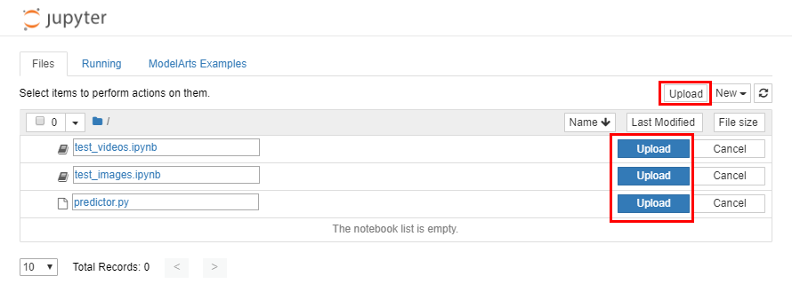

（3）上传测试数据

按照下面两张图新建一个test目录

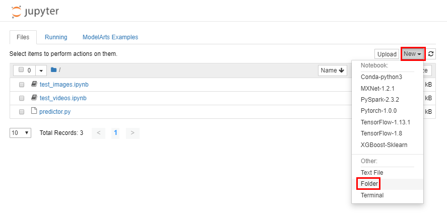

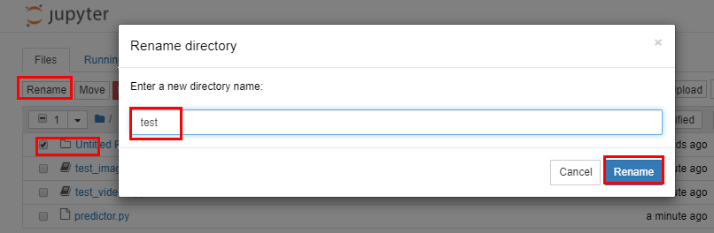

找到前面解压的mask_detect_datasets\test目录，将其中的数据按照同样的方法上传上去。

（4）打开test_images.ipynb 和 test_videos.ipynb脚本

按照下图点击打开两个测试脚本

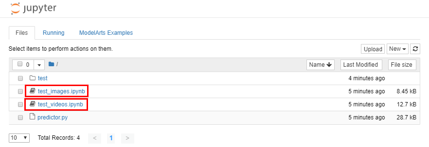

按照下图中步骤运作 test_images.ipynb

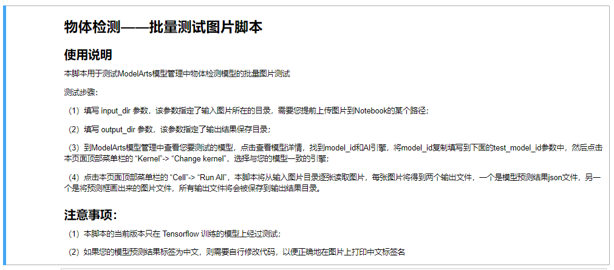

按照下图中步骤运作 test_videos.ipynb

### 6 关闭在线服务

案例完成后，为了防止继续扣费，需要把在线服务停止掉，按照下图，点击“停止”按钮即可。在线服务停止后可以重新启动。

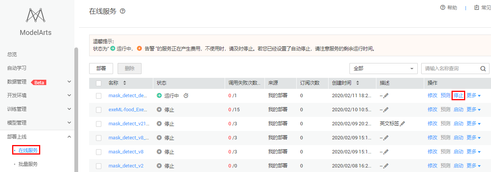

### 7 清除OBS资源

OBS存储会持续收费，案例完成后，为了防止继续扣费，可以把OBS存储资源清除。

清除方法：登录[OBS管理控制台](https://storage.huaweicloud.com/obs/#/obs/manager/buckets)，找到您在前面步骤新建的桶，比如“mask-detect-0211”，点击桶名进入概览页面，点击左侧导航栏的“对象”，选中您需要删除的文件夹，点击删除。

## 恭喜您

恭喜您，您已经使用ModelArts完成了口罩检测模型的开发测试任务！ 

### 接下来您可以

- 使用更多的训练集来重新创建一个一键部署上线任务；
- 选择不同的预置算法和算法参数来调试一个更好的模型。

### 参考文献

-  https://support.huaweicloud.com/tg-modelarts/modelarts_15_0001.html 

-  https://support.huaweicloud.com/browsertg-obs/obs_03_1000.html

