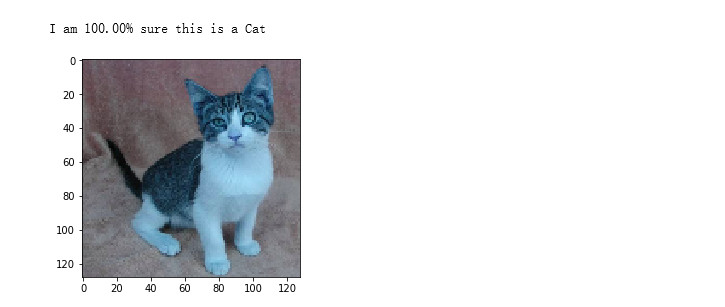

## 猫狗识别大战实践经验分享
#### 猫狗识别大战是图像识别领域经典的案例，本次案例主要基于ModelArts人工智能平台，利用VGG模型对猫狗图片进行训练并进行保存，对测试图片进行预测。
#### 部分代码如下：
####导入依赖库
```python
### 导入依赖库
import os, cv2, random
import numpy as np

# 画图工具
import matplotlib.pyplot as plt
import seaborn as sns
%matplotlib inline

from keras.layers import Input, Dense
from keras.optimizers import RMSprop
from keras.callbacks import Callback, EarlyStopping, TensorBoard
from keras.applications.vgg16 import VGG16
from keras.models import Model
from keras.utils import np_utils

from sklearn.model_selection import train_test_split
from sklearn.metrics import accuracy_score

from keras import backend as K
K.set_image_data_format('channels_last') # 数据格式data_format设置为 NHWC
```

####下载数据集
```python
#下载数据压缩包，解压，然后清理压缩包。
from modelarts.session import Session
session = Session()

if not os.path.exists('./data'):
    session.download_data(
    bucket_path="modelarts-labs/notebook/DL_image_recognition/image_recognition.tar.gz",
    path="./image_recognition.tar.gz")

    # 使用tar命令解压资源包
    !tar xf ./image_recognition.tar.gz

    # 清理压缩包
    !rm -f ./image_recognition.tar.gz
    
```

####读取数据集，将数据加载到内存中，并对数据进行预处理。
```python
### 读取数据集

#读取数据集，并把图像resize到 128 * 128 大小。
DATA_DIR = './data/' # 数据集路径

ROWS = 128
COLS = 128
CHANNELS = 3

image_file_names = [DATA_DIR+i for i in os.listdir(DATA_DIR)] 
dogs = [DATA_DIR+i for i in os.listdir(DATA_DIR) if 'dog' in i]
cats = [DATA_DIR+i for i in os.listdir(DATA_DIR) if 'cat' in i]

# 数据洗牌
random.shuffle(image_file_names)

def read_image(file_path):
    img = cv2.imread(file_path, cv2.IMREAD_COLOR) # 彩色模式读取图像
    return cv2.resize(img, (ROWS, COLS), interpolation=cv2.INTER_CUBIC)

def prep_data(image_file_names):
    count = len(image_file_names)
    data = np.ndarray((count, ROWS, COLS, CHANNELS), dtype=np.uint8)
    
    for i, image_file in enumerate(image_file_names):
        image = read_image(image_file)
        data[i] = image
        if i%1000 == 0: print('Processed {} of {}'.format(i, count))
    
    return data

# 读取图片至内存
images = prep_data(image_file_names)
```

####给图片打标签  和 切分数据
```python
#我们根据图片名称包含的字符串给图片打标签。我们用0表示cat，1表示dog。
num_train_samples = len(image_file_names)
num_classes = 2
labels = []

index = 0
for filename in image_file_names:
    if 'dog' in filename:
        labels.append(1)
    elif 'cat' in filename:
        labels.append(0)
        
# 把类别标签转换为onehot编码
labels = np_utils.to_categorical(labels, num_classes)
```
```python
### 切分数据集

#（train_data，train_label）是训练数据，（test_data，test_label）是测试数据。测试数据占25%。
train_data, test_data, train_label, test_label = train_test_split(images, labels, test_size=0.25, random_state=10)
```
####查看猫狗样本图片
```python
### 查看猫狗的样本图片

#这些图片是经过尺寸调整后的图片
#%%
def show_cats_and_dogs(idx):
    cat = read_image(cats[idx])
    dog = read_image(dogs[idx])
    pair = np.concatenate((cat, dog), axis=1)
    plt.figure(figsize=(10,5))
    plt.imshow(pair)
    plt.show()
    
for idx in range(0,3):
    show_cats_and_dogs(idx)
```


#### 构建神经网络
####Keras是一个非常简单易用的，适合新手入门的深度学习引擎。接下来，我们使用Keras搭建一个VGG16卷积神经网络。
```python
##设置超参
batch_size = 32 # 批大小
learning_rate = 1e-4 # 设置学习率为1e-4
```

```python
##设置优化器
optimizer = RMSprop(lr=learning_rate) # 优化器使用 RMSprop 
objective = 'binary_crossentropy' # loss 函数使用交叉熵

```
```python
def load_model():
    # 这是一个模型参数随机初始化的模型，如果想要加载imagenet预训练模型，可以设置 weights='imagenet'
    base_model = VGG16(include_top=False, weights=None, input_shape=(ROWS, COLS, CHANNELS), pooling='avg')
    
    # 修改base_model的模型输出层
    prediction_layer = Dense(2, activation='softmax')(base_model.output)
    
    # 组装成新的模型
    model = Model(inputs=base_model.input, outputs=prediction_layer)
    
    # 模型编译
    model.compile(loss=objective, optimizer=optimizer, metrics=['accuracy'])
    return model
model = load_model()
```
#### 模型结构概览
####可以查看到刚刚搭建的神经网络结构的详情。
```python
model.summary()
```

####模型训练
####在模型训练过程中，为了防止过拟合，我们使用了early stopping策略，当val_loss在连续3个epoch不再减少的情况下，就停止训练。
####可以看到训练日志输出，其中会打印Loss（损失函数）和acc（精确度）信息。
```python
epochs = 10 # 训练轮数

# early stopping策略
early_stopping = EarlyStopping(monitor='val_loss', patience=3, verbose=1, mode='auto')   

def run_train():
    
    # 开始训练
    history = model.fit(
        train_data, 
        train_label, 
        batch_size=batch_size, 
        epochs=epochs,
        validation_split=0.25,  # 训练数据中，抽取25%的数据作为验证数据
        verbose=2,
        shuffle=True,
        callbacks=[early_stopping]) 
    return history

history = run_train()
```


####保存模型
####训练好的模型可以保存起来，永久使用。
```python
OUTPUT = 'output'

if not os.path.exists(OUTPUT):
    os.mkdir(OUTPUT)

model.save(os.path.join(OUTPUT, 'model.h5'))
```
#### 可视化训练过程
####将Loss随epoch的变化趋势使用折线图展示
```python
loss = history.history['loss']
val_loss = history.history['val_loss']

plt.xlabel('Epochs')
plt.ylabel('Loss')
plt.title('VGG-16 Loss Trend')
plt.plot(loss, 'blue', label='Training Loss')
plt.plot(val_loss, 'green', label='Validation Loss')
plt.xticks(range(0, epochs)[0::2])
plt.legend()
plt.show()
```


####将accurary随epoch的变化趋势使用折线图展示
```python
acc = history.history['acc']
val_acc = history.history['val_acc']

plt.xlabel('Epochs')
plt.ylabel('acc')
plt.title('VGG-16 acc Trend')
plt.plot(acc, 'blue', label='Training acc')
plt.plot(val_acc, 'green', label='Validation acc')
plt.xticks(range(0, epochs)[0::2])
plt.legend()
plt.show()
```


####样本数据预测
####预测测试集
```python
predictions = model.predict(test_data, verbose=0)
#直观展示10个样本数据的预测结果
for i in range(0,10):
    p = predictions[i]
    
    if round(p[1]) == 1: 
        print('I am {:.2%} sure this is a Dog'.format(p[1]))
    else: 
        print('I am {:.2%} sure this is a Cat'.format(1 - p[1]))
        
    plt.imshow(test_data[i])
    plt.show()
```





#### 评估模型准确度
####通过测试集的预测结果，计算模型的准确度。
```python
predictions_test_array = []
test_label_array = []

# 将onehot编码的数据进行格式转换
for p in predictions:
    if round(p[1]) == 1:
        predictions_test_array.append(1)
    else:
        predictions_test_array.append(0)
        
for t in test_label:
    if int(t[1]) == 1:
        test_label_array.append(1)
    else:
        test_label_array.append(0)
        
acc = accuracy_score(test_label_array, predictions_test_array)
print('训练得到的猫狗识别模型的准确度是：%f' % acc)
```
####训练得到的猫狗识别模型的准确度是：0.910880