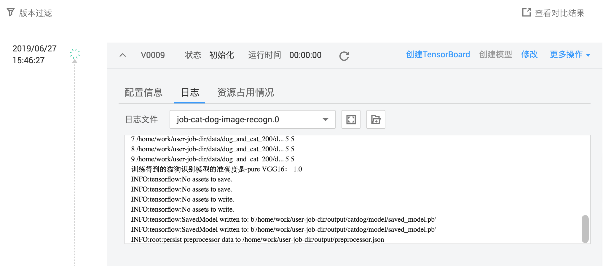
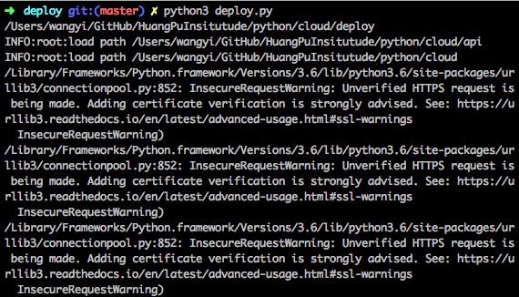

## 猫狗识别扩展案例

### 内容

本案例包含了部署在ModelArts上所必须的项目文件，代码入口，以及部署工具。本案例提供了一个针对猫狗识别可达到95%以上精度的案例模型Vgg16，并且易于扩展其他模型到训练作业上

## 准备工作

将获得的`cat_and_dog_XX.tar.gz` 文件放到本目录下的`data`。我已经在`data`里面存放了，在部分数据预训练得到的预训练模型参数。在本地训练执行：

> cd codes && sh train.sh

会自动解压数据包, 训练模型，并创建`output`文件夹，用于序列化的存放模型架构(proto文件)和参数。

代码在ModelArts`作业训练`执行时，会将输出文件同步到OBS对应的作业版本号下`models`文件夹。此位置比较重要，线上部署时，会根据这个位置读取由keras转换的tensorflow模型开始进行部署。

## 部署

首先参考[脚本](https://github.com/yiakwy/SpatialPerceptron/blob/master/scripts/install_modelarts_sdk.sh)，安装ModelArts SDK。

修改`cloud/deploy/deploy.py`中对象存储，桶名称和目标路径\(和训练作业输出路径下`model`目录一致\)。

> cd codes && sh deploy.sh

即可将本地依赖代码文件拷贝到OBS推理入口文件所在文件夹。
