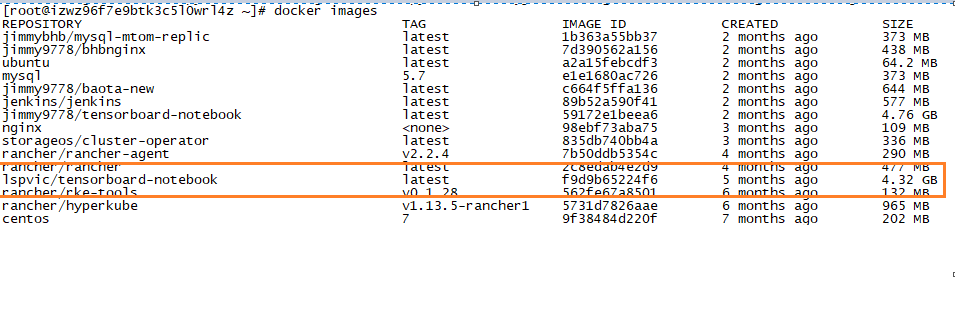
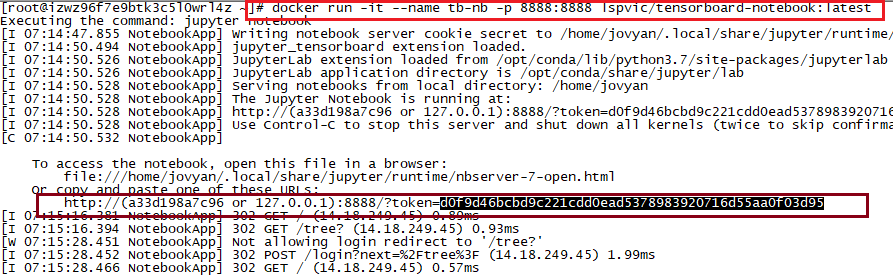
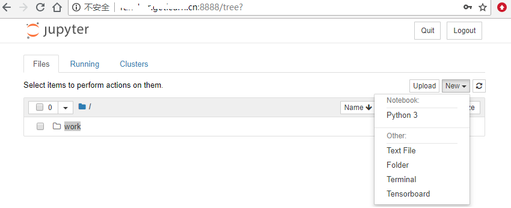
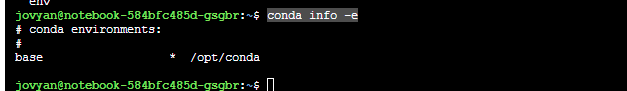
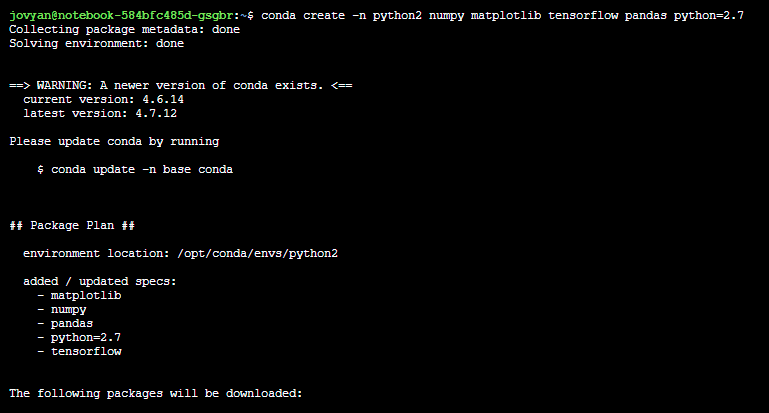
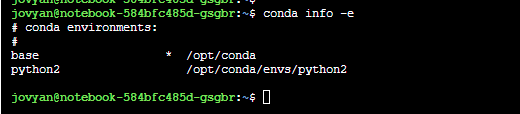
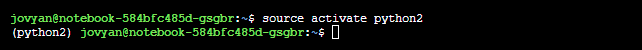
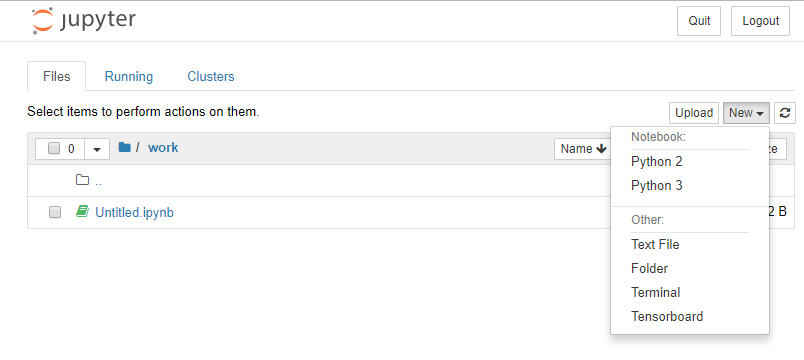
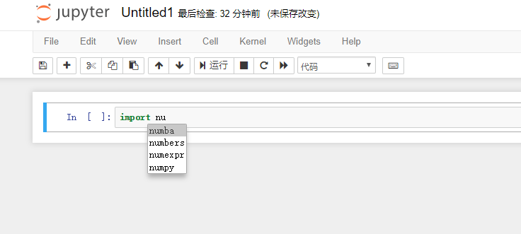

## 华为云博客链接地址:https://bbs.huaweicloud.com/blogs/125750
为了方便notebook集成环境在以后更好的移植，本安装步骤以Linux下docker容器为基础环境，以下为安装步骤：
### 1、docker环境安装:
   首先确保环境下已经安装了docker，具体安装步骤在此不做说明，各位自己去网上查找。
### 2、下载lspvic/tensorboard-notebook镜像:
   通过命令：docker pull lspvic/tensorboard-notebook 下载镜像，成功后通过docker images查看该镜像如图：
    
   该镜像以python3为基础内核开发环境，并已经集成好了tensorboard
### 3、启动lspvic/tensorboard-notebook容器:
   镜像下载下来后，需要运行该容器，该容器在端口8888执行，因此按照如下命令执行：docker run -it -name tb-nb -p 8888:8888 lspvic/tensorboard-notebook:latest  让容器在后台运行，并指定8888端口访问该容器，如下图：
    
   此时容器已经启动起来，在浏览器上直接访问即可，如图：
    
   此时可看到notebook环境已搭建好，点击New，可看到Python3环境已经安装好，并且系统已经集成了Tensorboard环境，接下来我们就继续集成python2环境。
### 4、python2环境集成:
   1)、进入容器tb-nb，执行命令：conda info -e查看容器默认进入的环境，如图：
    
   2)、创建python2虚拟环境：
   执行命令：conda create -n python2 numpy matplotlib tensorflow pandas python=2.7 创建python2.7环境，虚拟环境名为python2,同时必须安装依赖包numpy matplotlib tensorflow pandas，如图：
    
   安装完成后，此时通过conda info -e再次查看系统虚拟环境，此时多了python2  /opt/conda/envs/python2 虚拟环境，如图： 
    
   3）、使用激活python2虚拟环境：执行命令：source activate python2进入python2虚拟环境，如图：
    
   安装python2的内核并应用，执行如下命令：
   python2 -m pip install ipykernel 
   python2 -m ipykernel install --user 
   4)、将该容器打包成新的镜像：并用该新的镜像重新生成容器，然后访问容器即可看到py2和py3同时有了，如图： 
    
### 5、notebook代码自动提示功能：安装nbextensions和nbextensions_configurator:
   进入容器，执行如下3条指令，成功后，采用上面容器打包镜像命令，生成新镜像，此时nbextensions功能可以显示，并在nbextensions中选中Hinterland功能即可有代码自动功能 
   pip install --user jupyter_contrib_nbextensions 
   jupyter_contrib_nbextension install --user 
   jupyter contrib nbextension install --user --skip-running-check 

   pip install --user jupyter_nbextensions_configurator 
   jupyter nbextensions_configurator enable --user 
再次启动新的镜像容器后，打开notebook编辑环境，选择python2或python3的时候，输入import num + Tab键即可显示代码提示，如图： 
    
通过以上几步，可让notebook自动集成了：python2、python3环境，并同时支持代码提示功能和tensorboard日志分析功能.
