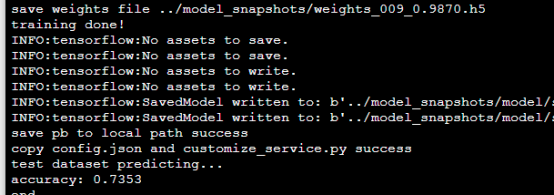
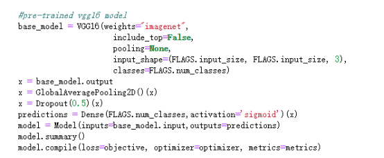
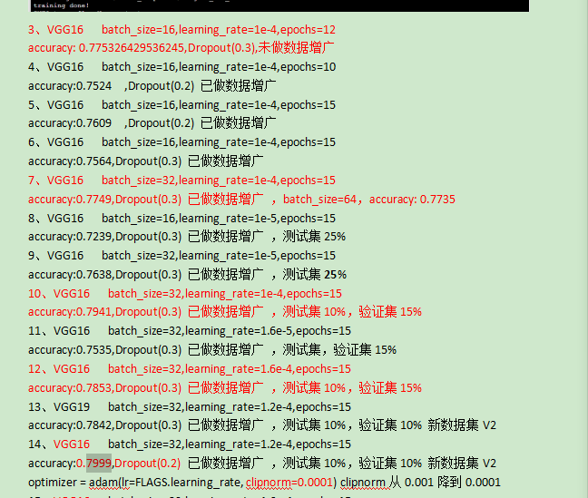
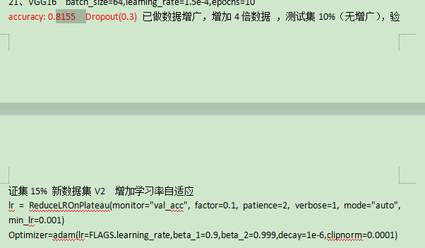
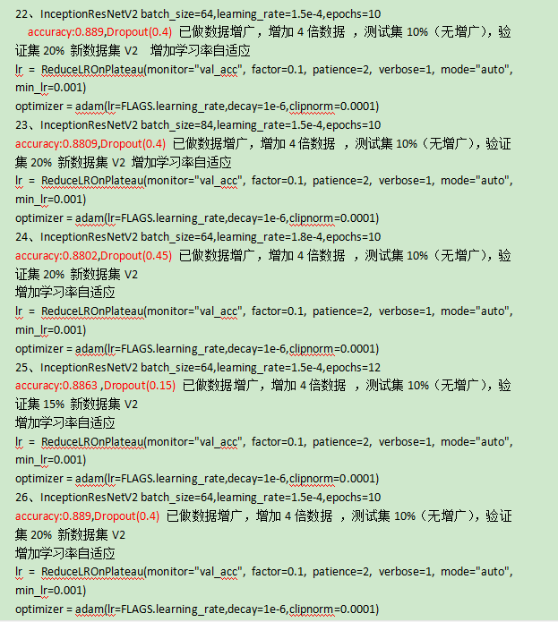

# 华为云垃圾分类大赛模型调优心得分享
赛事链接如下[https://developer.huaweicloud.com/competition/competitions/1000007620/introduction]
## 探索历程
### 1、参加比赛背景及时间:
   本次华为组织的垃圾分类比赛时间在7月份已经公布，但是由于本人学习AI时间不长，最近3个月才紧跟华为云modelArts实战营进行学习，很多理论和原理不是很清楚，因此一直在忙于学习高等数学、概率论及CNN相关知识及原理，没及时关注本次垃圾分类大赛，直到8月28日才通过实战营同学口中得知本次垃圾分类大赛，因为各种原因和想法，最后才在9月2号开始报名垃圾分类比赛及下载代码、调优模型，直到9月10日最后一次提交，真正训练调优时间大概为4-5天时间，集中调优为周末2天，一个人调优从最初Baseline代码中的最初模型69%精度提高到最后9月10号调整到89.1%左右，排名131，虽然对自己的成绩还算满意，但一直觉得不知道该如何去写这个心得分享，因此一直没动手写，今天突然看到决赛亚军的分享心得，觉得有必要自己对本次调优过程也写下自己的分享。
### 2、Baseline从头开始
首先，由于时间紧迫，报名后加紧学些比赛规则、流程，然后从官方下载代码，数据集，大概看了下数据集为数量，并将数据集按9：1分成训练集和测试集，并按照官方提供的基本代码跑了一次（基本参数：ResNet50,batch_size=32,learning_rate=1e-4,epochs=10），在训练中，数据集和验证集的进度都非常高，达到98%以上，但最后对测试集进行验证模型好坏，得到进度缺只有69%左右，思考后觉得是不是数据集太少，模型复杂，导致容易出现过拟合问题，然后将模型采用熟悉的VGG16并采用Dropout防止过拟合，最后训练进度提升到73%，如下图：

 
### 2. 如何在现有数据集基础上提高模型精度
#### 2.1 调整参数
   在初步采用ResNet50和VGG16模型做了对比后，发现VGG16模型能达到73%的精度，比ResNet50模型精度有提高，于是初步采用了该模型做参数调优，基本围绕：
   Dropout(0.3)、batch_size、learning_rate、epochs几个参数进行调优。
#### 2.2 数据增广
   由于本次数据集只有1.9W张图，除掉10%的测试集和10%的验证集，训练集样本并不多，因此考虑对数据进行增广，但由于对图像处理技术不熟悉，只知道通过数据增广可以丰富特征的表达能力，因此采用modelArts实战营前期的数据增广部分对数据做随机剪切和变换，测试，发现数据提升不是很明显，后面又通过对训练数据的一张图片采用数据增广方法提升到7-8张，从而将训练数据提升到10-15W左右，再次进行训练能将模型提升到79.9%，如下图：
   
#### 2.2 采用自适应学习率变化
   在模型进度达到79.9%后调整各项参数，很难让进度提升，后面在代码中增加自适应学习率方式，如下 
   lr = ReduceLROnPlateau(monitor="val_acc", factor=0.1, patience=2, verbose=1, mode="auto", min_lr=0.001) 
   Optimizer=adam(lr=FLAGS.learning_rate,beta_1=0.9,beta_2=0.999,decay=1e-6,clipnorm=0.0001) 
   最后发现可以提升该模型到81.5%，如图：
    
#### 2.3 调整模型
   本次调优在相同参数下，更换模型有：ResNet50、VGG16、VGG19、Inception、Xception、InceptionResNetV2等，训练后发现，采用InceptionResNetV2模型，可以提升精度到88%以上，最终采用了InceptionResNetV2融合模型，训练结果如下： 
 
#### 2.2 赛后思考
  本次比赛由于只有个人，加上经验不足，时间短（一周时间，实际全力投入2天），基本上全部用上实战营前几期的知识，因此主要还是重在参与，尽快提升AI的熟悉程度，本次比赛熟悉了超参数调优；防过拟合处理；数据增广；模型选择；自适应学习率变化等手段最总让模型进度提升到89.1%，比赛名次在130名左右，基本满意，遗憾的是差点上90%。今天终于等到决赛亚军的模型分享心得，从中学到了不少大牛的调优过程和方法，对图像数据分布的观察、预处理等手段由于不熟悉及时间问题，我们没来得及处理，另外对部分知识不熟悉，只是利用前期几期的学习知识进行调优，这也是导致我们的精度不能很少的上升的关键原因。通过本次学习和交流分享，让以后加强AI各方面的熟悉和提升应用技巧。
   感谢本次华为云团队组织的比赛，给我们一个提升的机会。本次分享只是写出本次比赛的调优过程，有部分理解的地方可能不对，请批评指正。

