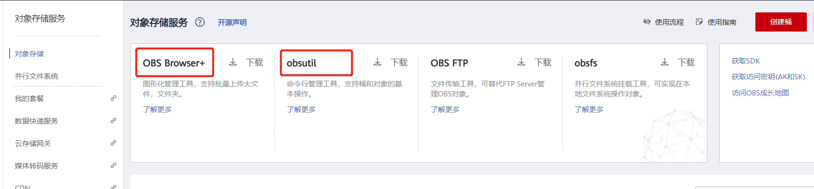
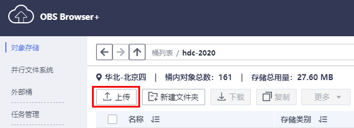

# ModelArts准备工作
本文档适用于初次使用ModelArts的用户。使用ModelArts之前，需要做如下工作：注册华为云账号、完成ModelArts全局配置、以及熟悉OBS相关操作。

## 1. 注册华为云账号

参考[此文档](https://support.huaweicloud.com/prepare-modelarts/modelarts_08_0001.html)，注册华为云账号。

## 2.  完成ModelArts全局配置

参考[此文档](https://support.huaweicloud.com/prepare-modelarts/modelarts_08_0007.html)，完成ModelArts全局配置。

## 3. OBS相关操作

### 3.1 创建OBS桶

**OBS**，即**Object Storage Service**，对象存储服务，是华为云提供云上数据储存的服务，在使用ModelArts之前您需要创建一个OBS桶。 

登录[OBS管理控制台](https://storage.huaweicloud.com/obs/#/obs/manager/buckets)， 单击页面右上角"**创建桶**"按钮，将进入如下图所示页面：


区域，选择“华北-北京四”，

数据冗余存储策略，选择“单AZ存储”，

桶名称，输入一个自定义的桶名，注意需确保该桶名在华为云上全局唯一（ModelArts所有实验文档中需要填写桶名的地方，都需要替换为您自己创建的桶名），

其它参数保持默认值即可 ，点击右下角的“立即创建”，将进入桶列表页面。

### 3.2 OBS客户端安装

对象存储服务中提供了两种工具用于访问管理OBS，供用户使用。OBS Browser+是一款用于访问和管理对象存储服务的图形化工具，obsutil是一款用于访问管理OBS的命令行工具，**如果是首次使用OBS客户端，建议先使用OBS Browser+，可以更快上手。**




#### 3.2.1 使用OBS Browser+

#### （1）安装并登录OBS Browser+

点击[此链接](https://support.huaweicloud.com/browsertg-obs/obs_03_1003.html)，根据操作系统版本下载相应版本的OBS Browser+，解压后，点击`exe`文件进行安装。

参考[此文档](https://support.huaweicloud.com/browsertg-obs/obs_03_1004.html)，使用**AK方式**登录OBS Browser+。下载得到的名为“credentials.csv”的文件就是您的华为云账号的密钥文件，文件中Access Key Id的值即为AK，Secret Access Key的值即为SK，请妥善保管该文件，华为云的很多服务都需要用到AK和SK。

#### （2）新建OBS文件夹的方法

使用OBS客户端可以在OBS新建文件夹。打开OBS Browser+，点击进入一个OBS桶，然后点击“新建文件夹”按钮，即可新建文件夹。


#### （3）上传数据至OBS的方法

使用OBS客户端可以上传文件或者文件夹至OBS。打开OBS Browser+，点击进入一个OBS桶，然后点击“上传”按钮，即可上传本地文件夹或者文件至OBS桶。




### 3.2.2 使用obsutil（可选步骤）

#### （1）安装并配置obsutil

参考[此文档](https://support.huaweicloud.com/utiltg-obs/obs_11_0005.html)，完成obsutil的安装和配置。

注意：如果您的电脑访问外网需网络代理，则需要给obsutil也配置代理才可以访问OBS，请参考[此文档](https://support.huaweicloud.com/utiltg-obs/obs_11_0068.html)进行配置。

#### （2）创建OBS桶的方法

```
obsutil mb obs://bucket_name -location=cn-north-4
```

#### （3）创建OBS文件夹的方法

在指定桶内创建文件夹

```
obsutil mkdir obs://bucket_name/folder 
```

#### （4）上传数据到OBS的方法

上传文件

```
obsutil cp local_file_url/dataset_file obs://bucket_name/folder -f 
```

上传文件夹

```
obsutil cp local_folder_url/dataset obs://bucket_name/folder -r -f
```

