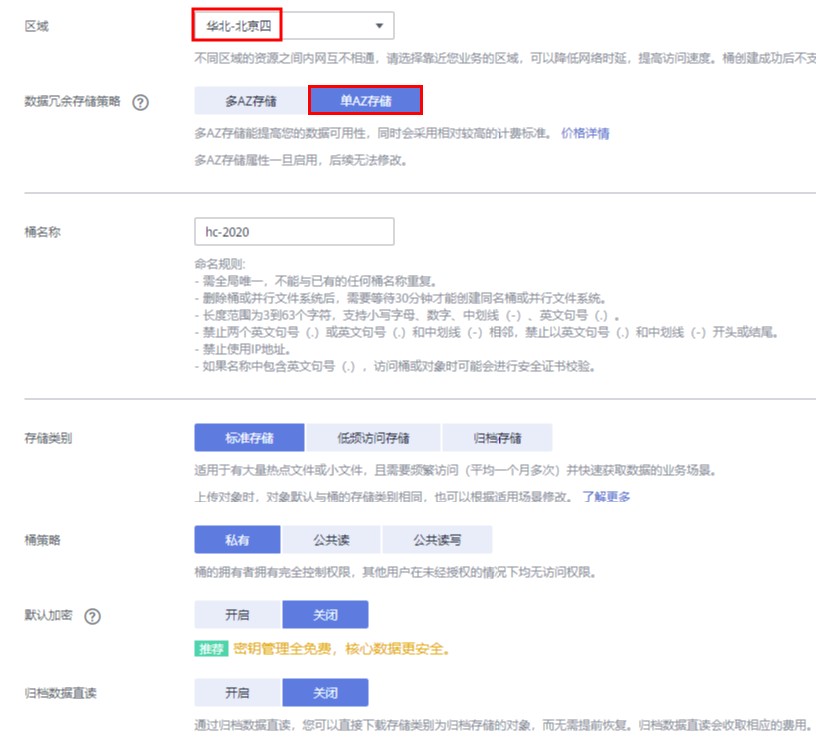

# ModelArts准备工作
本文档适用于初次使用ModelArts的用户。使用ModelArts之前，需要做如下工作：注册华为云账号、完成ModelArts全局配置、以及熟悉OBS相关操作。

## 注册华为云账号

### 注册账号

参考[此链接](https://support.huaweicloud.com/prepare-modelarts/modelarts_08_0001.html)，注册华为云账号。

### 实名认证

参考[此链接](https://support.huaweicloud.com/usermanual-account/zh-cn_topic_0133456714.html)，完成实名认证，推荐使用扫码认证。

## 完成ModelArts全局配置

参考[此文档](https://support.huaweicloud.com/prepare-modelarts/modelarts_08_0007.html)，完成ModelArts全局配置。

## OBS操作

### 创建OBS桶

**OBS**，即**Object Storage Service**，对象存储服务，是华为云提供云上数据储存的服务。在使用ModelArts之前您需要创建一个OBS桶。 

登录[OBS管理控制台](https://storage.huaweicloud.com/obs/#/obs/manager/buckets)， 单击页面右上角"**创建桶**"按钮，将进入如下图所示页面：

区域，选择“华北-北京四”，

数据冗余存储策略，选择“单AZ存储”，

桶名称，输入一个自定义的桶名，注意需确保该桶名在华为云上全局唯一（ModelArts所有实验文档中需要填写桶名的地方，都需要替换为您自己创建的桶名），

其它参数保持默认值即可 ，点击右下角的“立即创建”，将进入桶列表页面。

### 新建OBS文件夹

可以在[OBS桶列表](https://storage.huaweicloud.com/obs/#/obs/manager/buckets)中，找到创建的OBS桶并进入，然后进入对象页面，点击“新建文件夹”按钮即可新建文件夹，文件夹名称无需考虑华为云全局唯一，点击“确定”按钮即可完成文件夹创建。  

