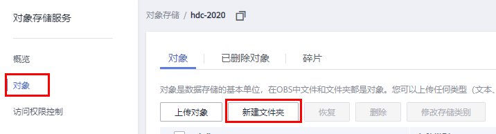

# ModelArts准备工作
本文档适用于初次使用ModelArts的用户。使用ModelArts之前，需要做如下工作：注册华为云账号、完成ModelArts全局配置、以及熟悉OBS相关操作。

## 注册华为云账号

### 注册账号

参考[此链接](https://support.huaweicloud.com/prepare-modelarts/modelarts_08_0001.html)，注册华为云账号。

### 实名认证

参考[此链接](https://support.huaweicloud.com/usermanual-account/zh-cn_topic_0133456714.html)，完成实名认证，推荐使用扫码认证。

## 生成访问密钥并完成ModelArts全局配置

参考[此文档](https://support.huaweicloud.com/prepare-modelarts/modelarts_08_0002.html)，生成访问密钥，并完成ModelArts全局配置。

**注意**：访问密钥文件请妥善保存，使用OBS客户端会用到。

## OBS操作

### 创建OBS桶

**OBS**，即**Object Storage Service**，对象存储服务，是华为云提供云上数据储存的服务。在使用ModelArts之前您需要创建一个OBS桶。 

登录[OBS管理控制台](https://storage.huaweicloud.com/obs/#/obs/manager/buckets)， 单击页面右上角"**创建桶**"按钮。

系统弹出如下图所示的对话框，选择"区域"为"华北-北京四"，输入自定义的桶名称，其他选项保持默认即可，最后点击页面下方"立即创建"按钮。 

### 新建OBS文件夹

可以在[OBS桶列表](https://storage.huaweicloud.com/obs/#/obs/manager/buckets)中，找到创建的OBS桶并进入，然后进入对象页面，点击“新建文件夹”按钮即可新建文件夹。

