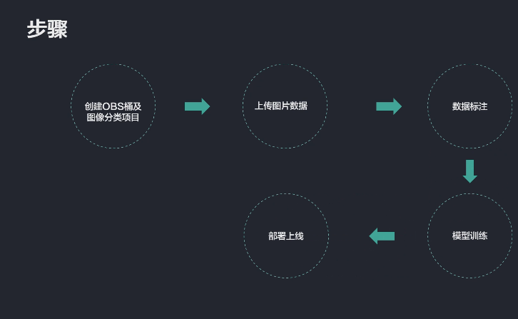
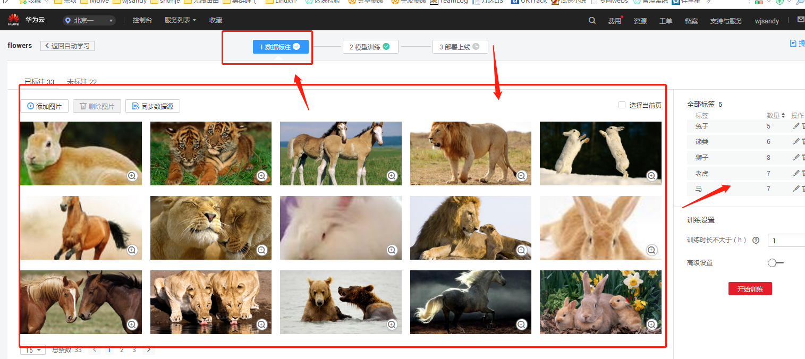
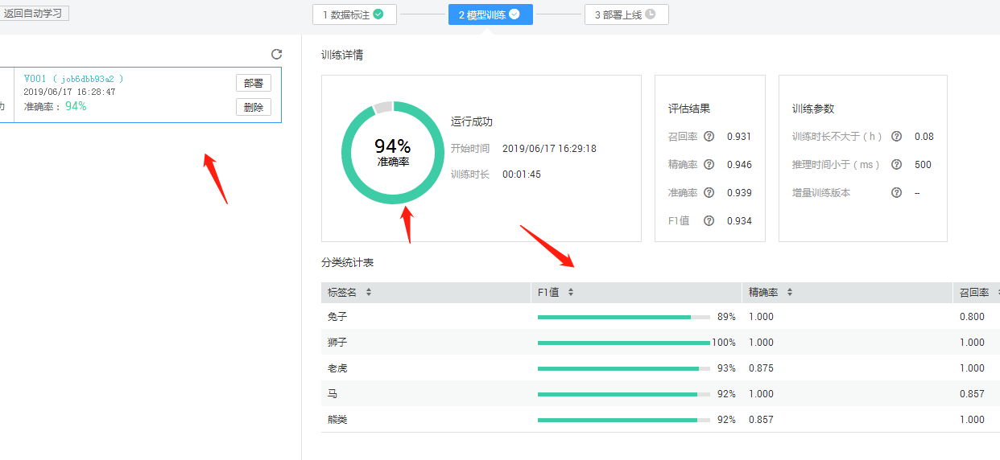
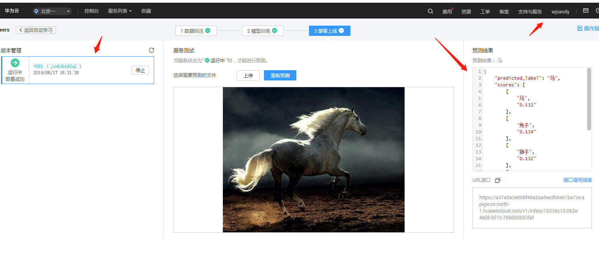
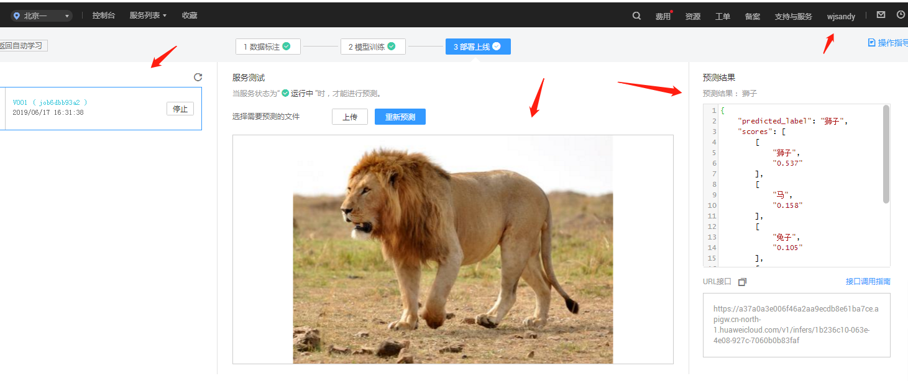
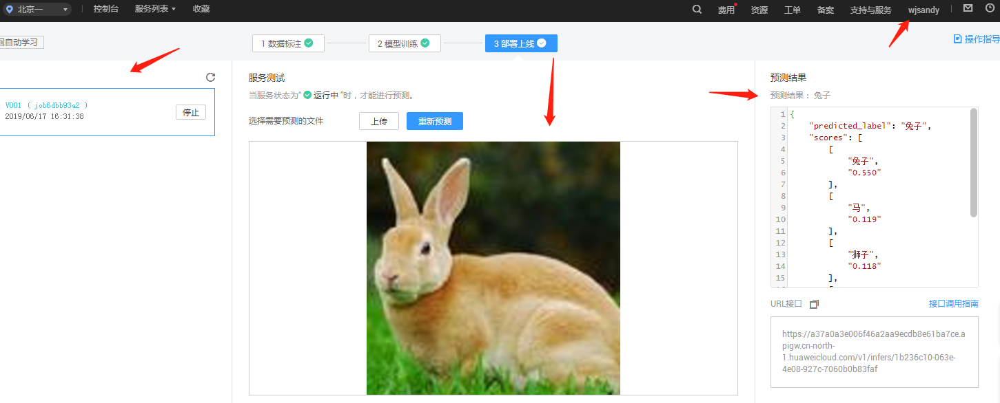
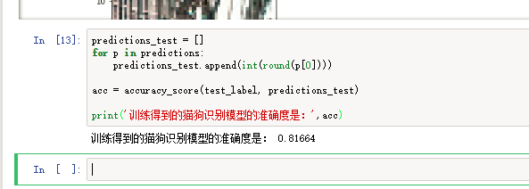

## ModelArts Lab文档集：包含各种技术文档、API介绍等

第一步，创建OSB桶后，用到OBSBrowser工具--添加相应的AK-SK密钥后-上传说图片数据--------动物-植物-（美女-大老婆-小老婆）也行！

第二步，我这上传的是动物类，狮子，马，熊，兔子，老虎

第三步，机器学习，一个个标注分类，图片分类也多，提供样例越多，越训练学习分辨成功率越高！

第四步-部署上线后就可以上传让机器学习识别了，以下是我上传后机器识别的效果

第五，大家可以再用python获取下Notebook案例！祝君好运！

同学们，来学习吧，有积分好礼送哦！点我送你一程

积分获得礼品
完成5个积分获得level1礼包

完成10个积分获得level2礼包

完成15个积分获得level3礼包

完成20个积分获得level4礼包  

完成25个积分获得level5礼包(必须要有一个与实际应用结合的高价值案例) 

完成30个积分获得level6礼包(必须要有一个与实际应用结合的高价值案例) 

礼包
Level1礼包 : ModelArts纪念T恤 + 自拍杆或蓝牙小音箱 + 2张华为云ModelArts满减代金券

Level2礼包 : 华为荣耀手环(价值500左右) + 4张满减代金券

Level3礼包 : 机械键盘或华为手表(价值1000左右) + 6张满减代金券

Level4礼包 : 华为手表(价值2000左右） + 8张满减代金券

Level5礼包 : 华为手机(价值3000左右） + 10张满减代金券

Level6礼包 : 华为旗舰手机或华为matebook电脑(价值5000以上) + 15张满减代金券