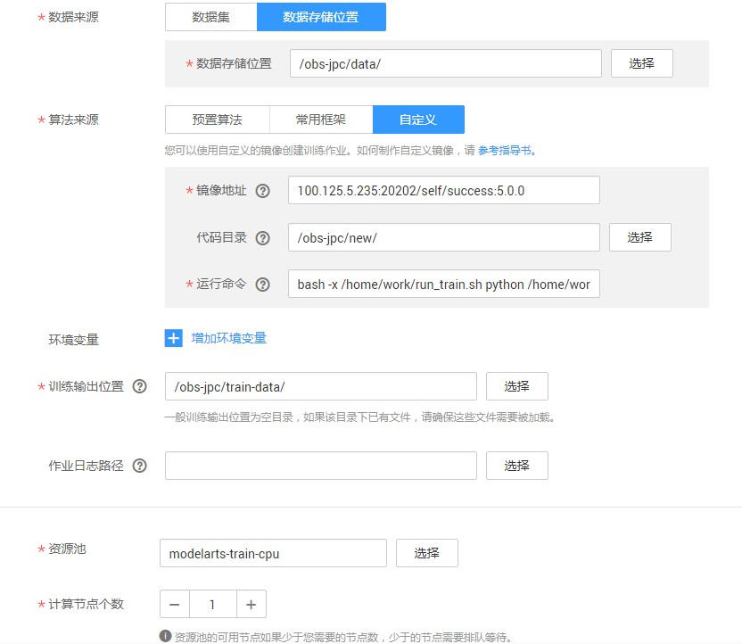
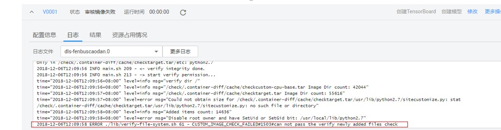
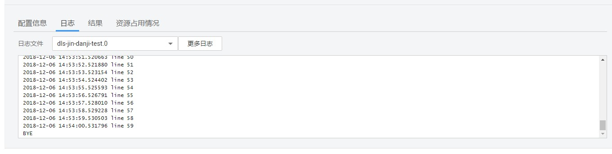
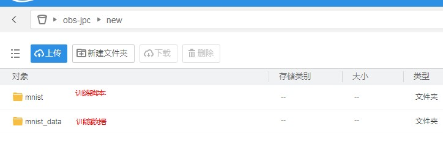
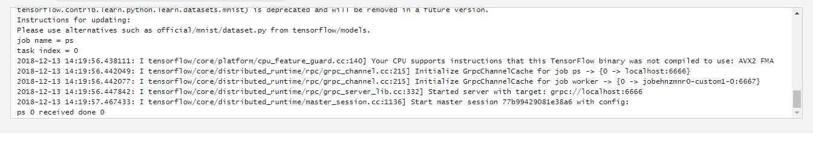
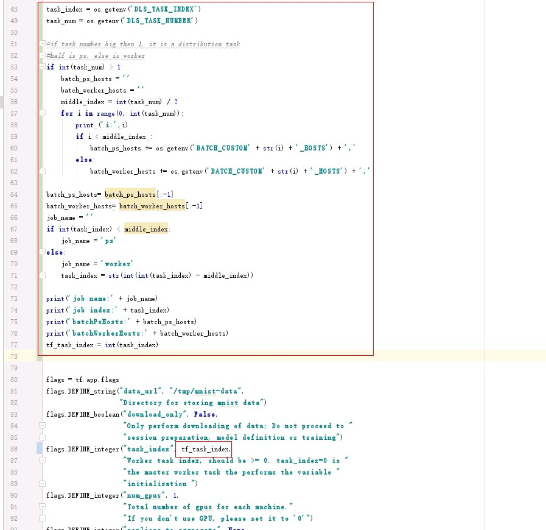

# 自定义镜像训练功能操作指南

## 1 自定义镜像概述

ModelArts 提供了多种预置引擎，但是当用户对深度学习引擎、开发库有特殊需求的场景的时候，预置引擎已经不能满足用户需求。此时用户可以使用 ModelArts 自定义镜像这个功能来达到自定义运行引擎的目的。

ModelArts 底层采用容器技术，自定义镜像指的是用户自行制作容器镜像并在 ModelArts 上运行。自定义镜像功能支持自由文本形式的命令行参数和环境变量，因此灵活性比较高，便于支持任意计算引擎的作业启动需求。

文中出现的英文缩略词意思分别为：SWR--华为云容器镜像服务，OBS--华为云对象存储服务。

## 2 自定义镜像功能使用步骤

ModelArts中使用自定义功能步骤如下：

1. 制作自定义镜像。
2. 传自定义镜像到华为云 SWR。
3. 在 ModelArts 上使用自定义镜像训练功能。

### 2.1 制作自定义镜像

制作自定义镜像时，需要往镜像中添加一些必要的深度学习库及用户编写的脚本等。


自定义镜像有如下约束：
```
1. 自定义镜像必须基于 ModelArts 官方提供的基础镜像。
2. 自定义镜像中不能包含恶意代码。
3. 基础镜像中的部分内容不能改变，包括`/bin`、`/sbin`、`/usr`、`/lib(64)`下的所有文件，`/etc`下的部分重要配置文件，以及`$HOME`下的 DLS 小工具。
4. 不得新增属主为`root`且权限包含`setuid`或`setgid`位的文件。
5. 自定义镜像不能超过9.5G。
```

基础镜像中有一些必要的工具，用户需要基于ModelArts官方提供的基础镜像来制作自定义镜像。


基础镜像基础组件：
```
run_train.sh:训练启动脚本，调用加解密工具，下载代码目录，日志输出，执行训练命令。
dls-key-client、dls-decryptor：加解密工具。
dls-dns-fixer：DNS工具。
dls-pipe：日志工具。
dls-downloader：OBS下载工具。
ip-mapper：IP转换工具。
```
各个基础镜像包含的其他公共库:

见[Dockerfile](custom-base/)。


ModelArts 会更新基础镜像，基础镜像更新后，对于兼容性更新，用户还可以继续使用旧的镜像；对于不兼容性更新，基于旧版本制作的自定义镜像将不能再 ModelArts 上运行，但已经审核过的自定义镜像可以继续使用。

当用户发现自定义镜像审核不通过，并且审核日志中报镜像不匹配的时候，就需要去更新基础镜像。附录中会列出各个基础镜像。

用户可以通过如下**两种方式制定自定义镜像**：

1. 编写[Dockerfile](https://docs.docker.com/engine/reference/builder/)文件，采用SWR的[镜像构建功能](https://support.huaweicloud.com/usermanual-swr/swr_01_0009.html)，可以参考文末的单机例子。

2. 在自己电脑搭建`Docker`环境，也可以在华为云上的[申请一台ECS](https://support.huaweicloud.com/qs-ecs/zh-cn_topic_0092494193.html)来搭建`Docker`环境。请参考[SWR 使用指导](https://support.huaweicloud.com/usermanual-swr/swr_01_0009.html)将基础镜像pull到本地，并制作自定义镜像。

**推荐使用第一种方法**，这种方法比较简单，但是需要有`Dockerfile`基础。

### 2.2 上传自定义镜像到华为云SWR

用户制作完成镜像后，请参考[SWR 使用指导](https://support.huaweicloud.com/usermanual-swr/swr_01_0009.html)将镜像上传到自己的SWR仓库中。

### 2.3 在ModelArts中使用自定义镜像创建作业

#### 2.3.1 创建自定义镜像训练用户作业

如下图，在“算法来源”中选择“自定义”。

​                                                  

其中：

- 镜像地址：镜像上传到 SWR 后生成的地址。

- 代码目录：用户存放训练代码的 OBS 路径（非必须）。

- 运行命令：镜像启动后的运行命令，基本格式为：

```
bash /home/work/run_train.sh  {UserCommand}
bash /home/work/run_train.sh  [python/bash/..] {file_location} {file_parameter}
```

采用这种形式，“代码目录”配置后，`run_train.sh`将代码目录下载到容器的`/home/work/user-job-dir`目录中。如：

训练代码启动脚本在OBS路径：`obs://obs/app/train.py`，创建作业时选择OBS代码路径为：`/obs/app/`， `app`目录会下载到`/user-job-dir`下，运行命令就可以设置为：

```
bash /home/work/run_train.sh  python /home/work/user-job-dir/app/train.py {python_file_parameter}
```

自定义镜像让用户对使用ModelArts有最大的灵活性，用户可以不采用`bash /home/work/run_train.sh {command}`形式，把所需的东西全放在镜像，直接让容器执行某些指令。即启动命令完全自定义，例如 `bash /home/work/my_own_story.sh {command}` 形式，用户可以随意调参。

- 容器启动后，除了用户在“环境变量”中自行增加的环境变量外，其它加载的环境变量如下：

`DLS_TASK_INDEX` : 当前容器索引，容器从0开始编号。当节点数大于 1 时，即在分布式作业中，用户可以根据这个值来确定当前容器运行的算法逻辑。

`DLS_TASK_NUMBER`：容器总数。对应 “计算节点数个数”。

`DLS_APP_URL`：代码目录。对应UI上“代码目录”配置，会加上协议名。比如，可直接使用`$DLS_APP_URL/*.py`来读取obs下的文件。

`DLS_DATA_URL`：数据集位置。对应UI上“数据来源”，会加上协议名。

`DLS_TRAIN_URL`：训练输出位置。对应UI上“数据输出位置”，会加上协议名。

`BATCH_TASK_CURRENT_HOST_IP`：节点 IP。例如 `192.168.47.186`。

`BATCH_TASK_CURRENT_INSTANCE`：节点 hostname。例如 `jobdc558870-xxx-0-ac4-931-b6rqt`。

`BATCH_JOB_ID`：训练作业 ID。例如 `jobdc558870`。

`BATCH_{jobName}.0_HOSTS`：当节点数为 1 时，即 **单机作业** 的场景下，该环境变量存在。value 格式为 `hostname:port`。

`BATCH_CUSTOM"$i"_HOSTS`：当节点数大于 1 时，即 **分布式作业** 的场景下，该系列环境变量存在。value 格式为 `hostname:port`。一个容器可以看到同一个作业中所有容器的HOSTS，根据索引的不同，分别为`BATCH_CUSTOM0_HOSTS`, `BATCH_CUSTOM1_HOSTS`, ...。

用户可以根据需求来确认在自己训练脚本的python中要不要使用这些环境变量，也可以通过运行命令中的`{python_file_parameter}`传入相关参数。

- 资源池：当用户选择有 `GPU` 的资源池时，默认会挂载节点本地 NVMe SSD 硬盘目录到 `/cache` 目录，用户可以使用 `/cache` 目录来储存临时文件。

- 网络类型：

    - 非 8 卡规格的资源池的网络类型是 **容器网络** 类型，训练作业可以使用 eth0 网卡通信。

    - 8 卡规格的资源池的网络类型是 **主机网络** 类型。8 卡规格的资源池部署了 IB 网络，支持训练作业使用 RDMA/GDR 等技术进行高速通信。另外训练作业也可以使用 ib0 网卡进行 IPoIB 通信。

- 训练作业标签：

    - batch-job-id: ${BATCH_JOB_ID}：本次训练作业的所有容器均带有该标签

#### 2.3.2 自定义镜像训练作业运行

用户上传自定义镜像到 SWR 后，在创建自定义镜像作业时，默认已经授权 ModelArts 去获取镜像运行。自定义审核镜像第一次运行的时候，先审核镜像，审核内容请参见自定义镜像约束内容，审核失败的原因见于日志，用户根据日志做相应的修改。

​          

镜像审核成功后，后台就会开始启动用户自定义镜像容器，开始跑自定义镜像训练作业，用户可根据日志来查看训练情况。

​          

审核成功后，再次使用相同镜像创建训练作业的时候，不会再次审核。

## 3 自定义镜像创建训练作业配置示例

例子所需的文件，在 [GitHub 同级目录](mnist/)中。例子中的，分布式和单机的区别主要在于脚本和运行命令不一样，使用的镜像都为同一个。

例子为mnist训练数据，训练数据可于[mnist官网](http://yann.lecun.com/exdb/mnist/)下载。[mnist_softmax.py](mnist/mnist_softmax.py)为单机脚本。[mnist_replica_kill.py](mnist/mnist_replica_kill.py)为分布式脚本。

### 3.1 单机训练实例

1. 下载基础镜像，安装 tensorflow 深度学习库，然后把镜像 push 到 SWR。也可以采用[Dockerfile](mnist/Dockerfile)在SWR上构建。

2.  将`mnist_softmax.py`和训练数据上传至 OBS，现将脚本和数据都放在代码目录下，以便直接下载到容器中。

​       

3. 创建自定义镜像训练作业，数据存储位置和训练输出位置用不到，可以随意填写；

   镜像地址填写刚上传镜像的 SWR_URL。

   运行命令：

   ```
   bash /home/work/run_train.sh python /home/work/user-job-dir/new/mnist/mnist_softmax.py --data_url /home/work/user-job-dir/new/mnist_data；
   ```

   其中，`/home/work/user-job-dir/new/mnist/mnist_softmax.py`为下载下来训练脚本的位置，`--data_url /home/work/user-job-dir/new/mnist_data`为数据的位置，因为已经把数据放在代码目录中，容器已经下载了代码目录，所以直接使用本地的。

4. 自定义镜像审核成功后，后台会直接执行自定义镜像训练作业。

5. 如此，程序执行成功。

​       

### 3.2 分布式训练运行实例

1. 分布式例子和单机的例子不同的点在于需要修改python文件。对`DLS_TASK_INDEX`和`DLS_TASK_NUMBER`进行处理，来适配脚本所需参数，来决定当前容器的功能。当前脚本的功能是将前两个容器作为`ps`，后两个容器作为`worker`。

​       

2. 其中，运行命令为:

```
bash /home/work/run_train.sh python /home/work/user-job-dir/new/mnist/mnist_replica_kill.py --data_url /home/work/user-job-dir/new/mnist_data
```

3. 节点选多个，其他步骤和单机一样。

4. 执行结果如下。

​          


## 4 附录

- 基础镜像：

```
swr.cn-north-1.myhuaweicloud.com/eiwizard/custom-cpu-base:1.2
swr.cn-north-1.myhuaweicloud.com/eiwizard/custom-gpu-cuda92-base:1.2
swr.cn-north-1.myhuaweicloud.com/eiwizard/custom-gpu-cuda9-base:1.2
swr.cn-north-1.myhuaweicloud.com/eiwizard/custom-gpu-cuda8-base:1.2
swr.cn-north-1.myhuaweicloud.com/eiwizard/custom-cpu-inner-moxing-cp27:1.2
swr.cn-north-1.myhuaweicloud.com/eiwizard/custom-gpu-cuda8-inner-moxing-cp27:1.2
swr.cn-north-1.myhuaweicloud.com/eiwizard/custom-gpu-cuda9-inner-moxing-cp27:1.2
swr.cn-north-1.myhuaweicloud.com/eiwizard/custom-gpu-cuda9-inner-moxing-cp36:1.2
根据个人需求选择对应的gpu、cuda、moxing和python版本.
```

- `moxing`可以方便用户使用OBS以及`tensorflow`和`mxnet`等深度学习库的使用，可以参考[例子](<https://github.com/huawei-clouds/modelarts-example>).

- [ModelArts训练API接口](<https://support.huaweicloud.com/api-modelarts/modelarts_03_0045.html>)，[EndPoint](<https://developer.huaweicloud.com/endpoint>)。

---

**一些改进建议请提ISSUE。**

