# 费用相关FAQ
1. <B>ModelArts云资源包</B>包含三种资源：(1)GPU资源、(2) CPU资源、(3) 自动学习资源；只要其中一个资源包用完，即使仍有其他种类资源包，若持续使用已用完的资源包类型，仍会按照使用量扣费，可在<资源>下查看<我的套餐>，了解各类资源包使用情况。

2. 案例实践中所使用的存储资源（OBS 或 EVS）不包含在上述 “ModelArts新手资源包” 中，可能涉及到费用。每个案例涉及的存储资源所需费用小于1元。
   * 对象存储服务 OBS 标准存储价格：0.0990元/GB/月
   * 云硬盘 EVS 超高 IO 收费：0.0014元/GB/小时
      * Notebook 案例使用的EVS 资源，磁盘规格默认为 5GB，当磁盘规格为 5GB 时不收费，超出 5GB 时，从 Notebook 实例创建成功起，直至删除成功，超出部分每 GB 按照规定费用收费
3. 实验完成后，请<b>手动停止</b>占用云资源的服务，如：停止 “开发环境” 中所创建的 Notebook 以及 “部署上线”-“在线服务” 中所部署的模型，以避免因持续占用云资源导致资源包无谓消耗和欠费发生。需使用时，再启动即可。
4. 公有云的按需使用，都是后付费模式，也就是说，先使用再付费，一个小时会出一次话单，比如：2019.6.24 04:00~05:00 这段时间使用的费用，在 05:00 时刻采集完成后，才会出话单，进行扣费。
5. 在 “总览” 页中，请确保各个服务皆为 “<b>0 计费中</b>”，如下图所示：

<b> 此外注意 TensorBoard 的服务关闭，关闭方法： 进入 ModelArts控制台--训练作业--TensorBoard --停止 </b>
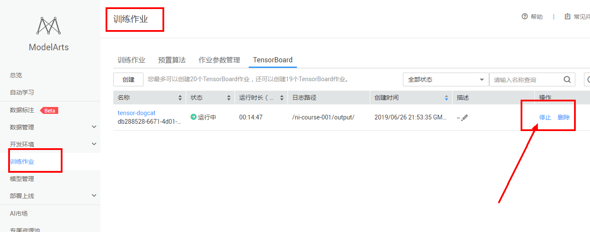

# ModelArts使用FAQs
* [领取的资源包在哪里可以查看](#领取的资源包在哪里可以查看)
* [自动学习训练失败原因是什么？](#自动学习训练失败原因是什么)
* [ModelArts是否支持Keras?](#modelarts是否支持keras)
* [如何将Keras格式的模型转换为TensorFlow格式的模型](#如何将Keras格式的模型转换为TensorFlow格式的模型)
* [创建Notebook时存储配置选择EVS和OBS有什么区别?](#创建notebook时存储配置选择evs和obs有什么区别)
* [使用pip install时出现没有空间的错误](#使用pip-install时出现没有空间的错误)
* [Notebook中Upload之后文件上传到哪里了?](#notebook中upload之后文件上传到哪里了)
* [Terminal中如何进入跟当前实例Notebook kernel一样的python环境](#terminal中如何进入跟当前实例notebook-kernel一样的python环境)
* [运行训练代码出现内存不够问题并导致实例崩溃](#运行训练代码出现内存不够问题并导致实例崩溃)
* [Notebook出现保存文件失败](#notebook出现保存文件失败)
* [如何下载GitHub代码库中的单个目录或文件](#如何下载github代码库中的单个目录或文件)
* [Notebook运行生成的文件如何保存到OBS](#notebook运行生成的文件如何保存到obs)
* [如何在Notebook中安装Python依赖](#如何在notebook中安装python依赖)
* [Notebook中调测好的代码如何用于训练作业](#notebook中调测好的代码如何用于训练作业)
* [是否支持在本地安装MoXing](#是否支持在本地安装moxing)
* [在GitHub网站上打开ipynb文件很缓慢或打开失败](#在github网站上打开ipynb文件很缓慢或打开失败)
* [Notebook卡死_无法执行代码](#notebook卡死_无法执行代码)
* [如何上传本地文件至Notebook](#如何上传本地文件至Notebook)
* [代码中自动下载Keras预训练模型速度缓慢或者失败怎么办](#代码中自动下载Keras预训练模型速度缓慢或者失败怎么办)
* [如何选择ModelArts训练作业的各个路径参数](#如何选择ModelArts训练作业的各个路径参数)

## 领取的资源包在哪里可以查看
在华为云领取的资源包，可以在资源->我的套餐里面查看，如下图所示：

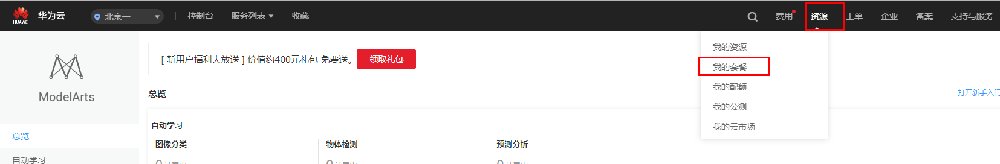

## 自动学习训练失败原因是什么？
自动学习项目存储图片数据的OBS路径下，不允许存放文件夹，同时文件的名称中不允许存在特殊字符(特殊字符集：['~', '`', '@', '#', '$', '%', '^', '&', '*', '{', '}', '[', ']', ':', ';', '+', '=', '<', '>', '/'])。如果违反了以上两点规则之一，就会训练失败。

## ModelArts是否支持Keras?

Keras是一个用Python编写的高级神经网络API，它能够以TensorFlow、CNTK或Theano作为后端运行。ModelArts支持tf.keras，创建AI引擎为TensorFlow的Notebook后，可执行!pip list查看tf.keras的版本。
TensorFlow Keras指南请参考：https://www.tensorflow.org/guide/keras?hl=zh-cn

## 如何将Keras格式的模型转换为TensorFlow格式的模型
Keras保存的模型格式是`.h5`，ModelArts推理支持的TensorFlow模型的格式是`.pb`，可以通过Python脚本将Keras模型转换为TensorFlow模型，用于ModelArts推理。Python脚本见[dog_and_cat_train.py](../train_inference/image_recognition/codes/dog_and_cat_train.py)中的`save_model_to_serving`函数。其中，`model`是Keres模型对象, `export_path`是TensorFlow模型的输出位置。

## 创建Notebook时“存储配置”选择EVS和OBS有什么区别？

  * 选择EVS的实例
    用户在Notebook实例中的所有文件读写操作都是针对容器中的内容，与OBS没有任何关系。重启该实例，内容不丢失。
    EVS磁盘规格默认为5GB，最小为5G，最大为500G。磁盘会挂载到`~\work`目录下。
    当磁盘规格为5GB时不收费，超出5GB时，从Notebook实例创建成功起，直至删除成功，超出部分每GB按照规定费用收费。计费详情https://www.huaweicloud.com/price_detail.html#/modelarts_detail。
  * 选择OBS的实例
    用户在Notebook实例中的所有文件读写操作都是针对所选择的OBS路径下的内容，即新增，修改，删除等都是对相应的OBS路径下的内容来进行的操作，跟当前实例空间没有关系。
    如果用户需要将内容同步到实例空间，需要选中内容，单击Sync OBS按钮来实现将选中内容同步到当前容器空间。

## 使用pip install时出现没有空间的错误

* 问题现象
在Notebook实例中，使用pip install时，出现“No Space left...”的错误。
* 解决办法
建议使用pip install  --no-cache **  命令安装，而不是使用pip install **。加上“--no-cache”参数，可以解决很多此类报错

## Notebook中Upload之后文件上传到哪里了？

* 针对这个问题，有两种情况：
如果您创建的Notebook使用OBS存储实例时单击“upload”后，数据将直接上传到该Notebook实例对应的OBS路径下，即创建Notebook时指定的OBS路径。
如果您创建的Notebook不使用OBS存储单击“upload”后，数据将直接上传至当前实例容器中，即在“terminal”中的“~/work”目录下。

## Terminal中如何进入跟当前实例Notebook kernel一样的python环境？

如果您习惯于使用Notebook terminal来运行代码，那么需要切换到和对应Notebook kernel一样的python环境。
* 如果使用单独的AI引擎创建的Notebook实例。
1. 运行conda info -e命令查看当前实例下的python虚拟环境。
2. 获取对应的虚拟环境之后，运行source activate **命令激活对应的python环境，然后您可以正常使用此python环境。
3. 使用结束后，您可以运行source deactivate **命令退出该环境。
* 如果您使用Multi-Engine创建的Notebook实例（即一个Notebook可创建基于多种AI引擎的kernel）。
  在teminal的用户目录下，有一个“README”文件，此文件详细说明了如何切换不同的python环境。

## 运行训练代码出现内存不够问题并导致实例崩溃

在Notebook实例中运行训练代码，如果数据量太大或者训练层数太多，亦或者或者其他原因，导致出现“内存不够”问题，最终导致该容器实例崩溃。
出现此问题后，如果您重新打开此Notebook，系统将自动重启Notebook，来修复实例崩溃的问题。此时只是解决了崩溃问题，如果重新运行训练代码仍将失败。如果您需要解决“内存不够”的问题，建议您创建一个新的Notebook，使用更高规格的资源池，比如GPU或专属资源池来运行此训练代码。

## Notebook出现保存文件失败
如果当前Notebook还可以运行代码，但是无法保存，保存时会提示“save error”错误。
大多数原因是华为云WAF安全拦截导致的，当前页面，即用户的输入或者代码运行的输出有一些字符被华为云拦截，认为有安全风险。出现此问题时，请提交工单，联系专业的工程师帮您核对并处理问题。

## 如何下载GitHub代码库中的单个目录或文件
将单个目录或文件的上层目录地址进行复制，打开网页http://kinolien.github.io/gitzip/ ，粘贴到搜索框中，点击search，即可选择对应的目录或文件进行下载。比如，要将ModelArts-Lab代码库notebook案例中的DL_image_recognition目录下载下来，则复制该目录的上层目录地址：https://github.com/langziwuqing/ModelArts-Lab/tree/master/notebook ，按以上方法操作，可以得到如下图所示的下载页面。
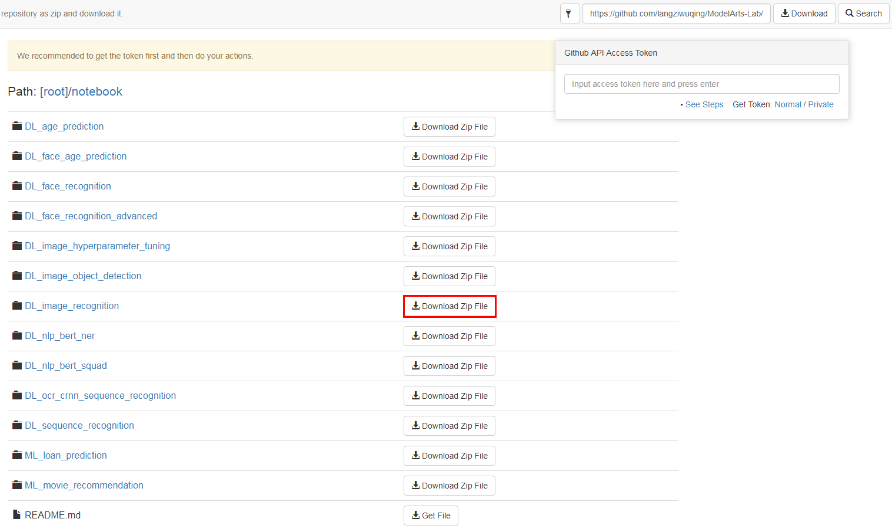

如果只是下载单个纯文本或图片文件，还有另外一种方法。打开要下载的文件，如下图所示，点击图中红框处的Raw或者Download按钮（这两个按钮的功能是一样的，并且不会同时存在），然后右键"另存为"，即可保存文件到本地。注意，这种方法不适用于下载含有图片或特殊格式的*.md文件或*.ipynb文件，因为使用这种方式下载将只得到纯文本，会丢失原文件中的图片或特殊格式，推荐使用上面介绍的第一种方法将*.md文件或*.ipynb文件所在的目录整个下载下来。之所以要下载整个目录，是因为*.md文件或*.ipynb文件中的图片是单独存储在其他目录中的。
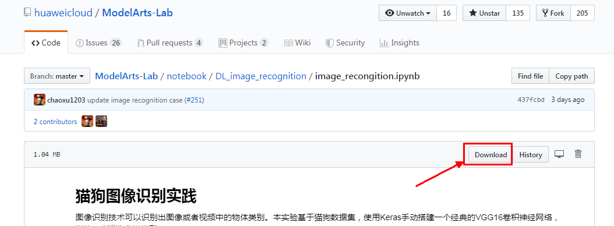

## Notebook运行生成的文件如何保存到OBS
使用ModelArts SDK可以上传Notebook本地的文件和文件夹（如果文件夹中的文件较多，建议将文件夹打成压缩包后再上传）至OBS，使用方法见[ModelArts官方帮助文档](https://support.huaweicloud.com/sdkreference-modelarts/modelarts_04_0126.html)

## 如何在Notebook中安装Python依赖
可以使用`pip install`命令安装即可，但是要注意在对应的Python虚拟环境中安装，有两种方式。
* 第一种（推荐），在ipynb开发环境中安装
直接在ipynb开发环境中使用：`!pip install <package_name>`安装，如下图：
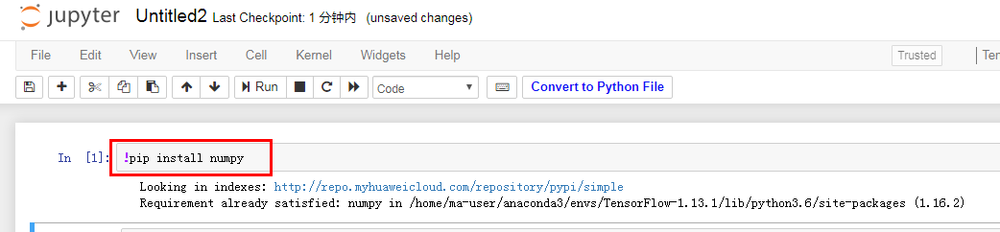

* 第二种，在terminal中安装
打开Notebook terminal，使用`conda env list`命令列举所有的Python虚拟环境，然后使用`source activate <env_name>`命令进入一个Python虚拟环境，最后使用`pip install <package_name>`命令安装。如下图所示：
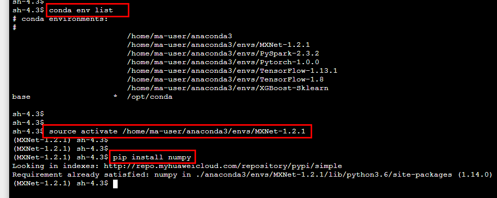

## Notebook中调测好的代码如何用于训练作业
在Notebook中调测好训练代码之后，需要将当前ipynb转化为Python文件，才能用于ModelArts训练作业。
单击当前ipynb页面上方的“Convert to Python File”，即可生成用于ModelArts训练作业的启动文件（.py文件）。如下图所示：
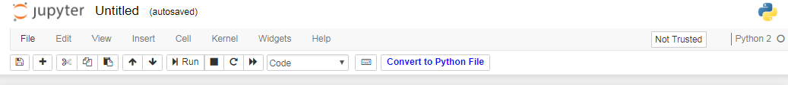

## 是否支持在本地安装MoXing
不支持，目前MoXing只支持在ModelArts里面使用

## 在GitHub网站上打开ipynb文件很缓慢或打开失败
这是由于网络问题和GitHub网站本身的问题导致的，有如下两种解决办法：
1. 刷新网页；
2. 如果刷新网页仍然无效，则可以打开 https://nbviewer.jupyter.org/ ，在如下搜索框中粘贴ipynb文件的地址，如：https://github.com/huaweicloud/ModelArts-Lab/blob/master/notebook/DL_image_recognition/image_recongition.ipynb ，回车，即可查看ipynb文件。
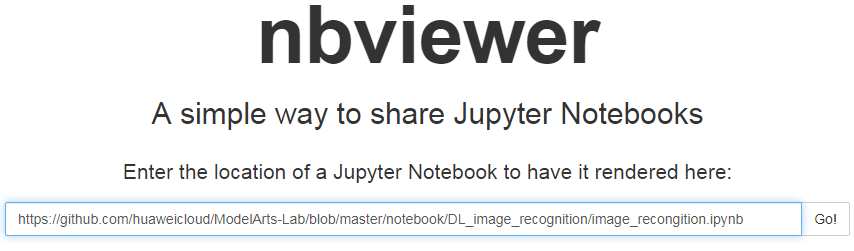

## Notebook卡死_无法执行代码
按如下步骤依次进行排查处理：
1. 如果只是cell的执行过程卡死或执行时间过长，如下图中的第2个和第3个cell，导致第4个cell无法执行，但整个notebook页面还有反应，其他cell也还可以点击，则直接点击下图中红色方框处的”interrupt the kernel”按钮，即可停止所有cell的执行，同时会保留当前notebook中的所有变量空间；
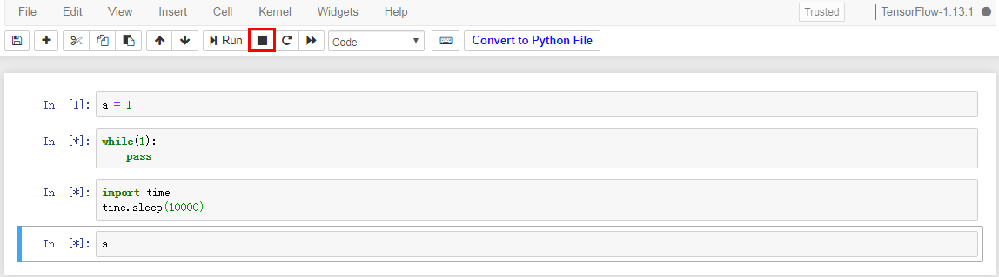

2. 如果整个notebook页面也已经卡死，点击任何地方都无反应，则关闭notebook页面，关闭modelArts管理控制台页面，如下图所示，再重新打开管理控制台页面，再打开原来的notebook，此时的notebook仍会保留卡死之前的所有变量空间；
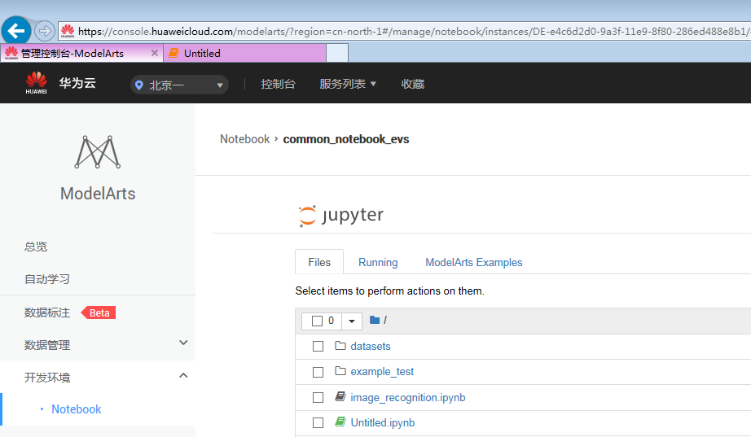

3. 如果按第2步执行后重新打开的notebook仍然卡死，则打开modelArts管理控制台页面的notebook列表页面，将对应的notebook虚拟机停止、启动，再打开原来的notebook。
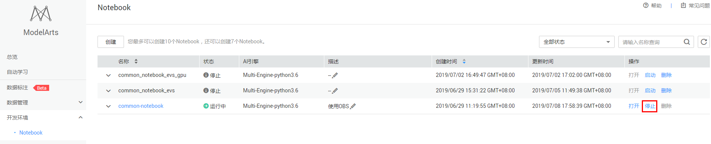

4. 如果打开Notebook后无法执行代码，在一些情况下是本地网络不稳定导致和服务端无法快速建立websocket连接，建议重新刷新notebook网页以触发主动重连,重连后可以正常使用。

## 如何上传本地文件至Notebook
1. 如果是小尺寸（小于10MB）的文件，可以直接点击Notebook的Upload按钮，上传本地文件，会将文件直接上传到Notebook本地的`~/work`目录下。
Upload按钮如下：
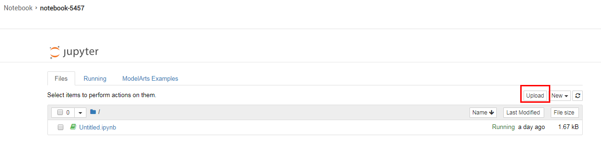

2. 如果是大尺寸的文件，可以使用OBS客户端将文件先上传至OBS，然后使用ModelArts SDK从OBS下载文件至Notebook本地。

OBS是华为云的数据存储服务。

使用OBS客户端上传文件至OBS的方法可以参考[此文档](https://support.huaweicloud.com/qs-obs/obs_qs_0002.html)。

使用ModelArts SDK从OBS下载文件至Notebook本地可以参考[此文档](https://support.huaweicloud.com/sdkreference-modelarts/modelarts_04_0127.html)。

3. 如果是文件夹，建议将文件夹压缩成一个压缩包，然后使用方法2上传，最后在terminal中解压压缩包。

## 代码中自动下载Keras预训练模型速度缓慢或者失败怎么办
当执行代码`base_model = VGG16(weights='imagenet', include_top=False)`时，如果本地没有下载过相应的预训练模型，Keras就会自动去网络上下载。如果自动下载的速度慢或者失败，可以将预训练模型放到Notebook本地路径`~/.keras/models/`下来解决。原理是Keras会先从本地路径`~/.keras/models/`下寻找预训练模型，如果找到，就会直接加载本地的预训练模型，而不会从网络下载。有以下两种方式将模型文件放到Notebook本地：
1. 进入Notebook terminal，然后切换到`~/.keras/models/`路径下，使用`wget <URL>`命令从网上下载预训练模型至Notebook本地（推荐）。

部分预训练模型的URL如下：
* https://github.com/fchollet/deep-learning-models/releases/download/v0.1/vgg16_weights_tf_dim_ordering_tf_kernels_notop.h5
* https://github.com/fchollet/deep-learning-models/releases/download/v0.1/vgg19_weights_tf_dim_ordering_tf_kernels_notop.h5
* https://github.com/fchollet/deep-learning-models/releases/download/v0.1/resnet50_weights_tf_dim_ordering_tf_kernels_notop.h5

其他预训练模型的URL可以从该网址查找https://github.com/fchollet/deep-learning-models/releases 。

2. 从网上下载预训练模型至本地，然后上传至OBS，最后从OBS下载至Notebook本地。

可以从https://github.com/fchollet/deep-learning-models/releases 网址找到所有Keras官方预训练模型的下载链接。部分预训练模型的下载链接见方法1。

上传文件至OBS，然后从OBS下载至Notebook本地的方法参考[此FAQ](#如何上传本地文件至notebook)

## 如何选择ModelArts训练作业的各个路径参数
提交训练作业需要先将代码和数据上传到OBS上，然后训练作业会运行OBS上的代码，并读取OBS上数据进行训练，最后将生成的模型保存到OBS上。其中，读取OBS数据和保存模型文件至OBS这两个操作都需要在训练代码中编程实现。

创建训练作业的部分参数如下图：
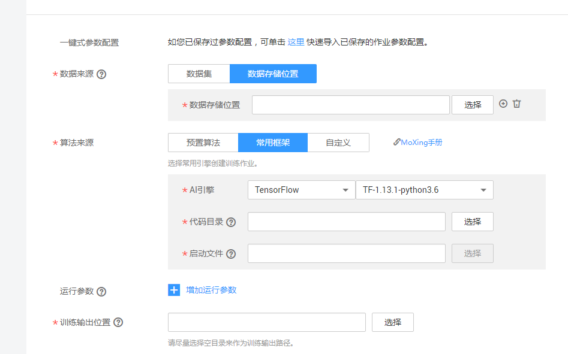

* 数据存储位置：存放训练数据的OBS路径，将数据集都放到这个路径下
* 代码目录：存放训练代码的OBS路径，将训练代码全都放到这个路径下
* 启动文件：代码目录下的一个代码文件OBS路径，作为主启动文件
* 训练输出位置：OBS路径，保证这个路径是一个空路径，用于保存程序运行中生成的模型文件和其他有用的文件

其中，数据存储位置和代码目录两个路径是输入数据路径，训练输出位置是输出数据的路径。我们在规划路径的时候，**最好保证这个三个OBS路径相互独立，互相之间没有包含和重合关系，否则可能会导致训练作业运行失败**。

