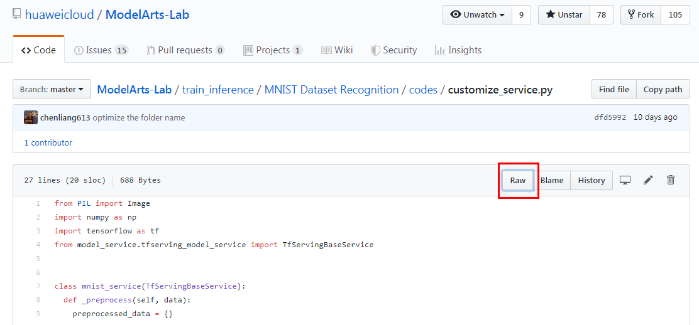

费用相关FAQ

1.	“新用户ModelArts云资源包” （包含20小时 CPU、10小时GPU、10小时自动学习，三种资源，只要其中一个资源用完，即使仍有其他种类资源，若持续使用已用完的资源，仍会按照使用量扣费。

2.	案例实践中所使用的存储资源（OBS 或 EVS）不包含在上述 “新用户 ModelArts 产品资源包” 中，可能涉及到费用。每个案例涉及的存储资源所需费用小于1元。

	* 对象存储服务 OBS 标准存储价格：0.0990元/GB/月
	* 云硬盘 EVS 超高 IO 收费：0.0014元/GB/小时（Notebook 案例使用之 EVS 资源，磁盘规格默认为 5GB，当磁盘规格为 5GB 时不收费，超出 5GB 时，从 Notebook 实例创建成功起，直至删除成功，超出部分每 GB 按照规定费用收费）

3.	实验完成后，请手动停止占用云资源的服务，如：停止 “开发环境” 中所创建的 Notebook 以及 “部署上线”-“在线服务” 中所部署的模型，以避免因持续占用云资源导致资源包无谓消耗和欠费发生。需使用时，再启动即可。

4. 在“总览”页中，请确保各个服务皆为“0计费中”。

# ModelArts使用FAQs
* [自动学习训练失败原因是什么？](#自动学习训练失败原因是什么)
* [ModelArts是否支持Keras?](#ModelArts是否支持Keras)
* [创建Notebook时存储配置选择EVS和OBS有什么区别?](#创建Notebook时存储配置选择EVS和OBS有什么区别)
* [使用pip install时出现没有空间的错误](#使用pip-install时出现没有空间的错误)
* [Notebook中Upload之后文件上传到哪里了?](#Notebook中Upload之后文件上传到哪里了)
* [Terminal中如何进入跟当前实例Notebook kernel一样的python环境](#Terminal中如何进入跟当前实例Notebook-kernel一样的python环境)
* [运行训练代码出现内存不够问题并导致实例崩溃](#运行训练代码出现内存不够问题并导致实例崩溃)
* [Notebook出现保存文件失败](#Notebook出现保存文件失败)
* [如何下载github代码库里面的单个文件](#如何下载github代码库里面的单个文件)

## 自动学习训练失败原因是什么？
自动学习项目存储图片数据的OBS路径下，不允许存放文件夹，同时文件的名称中不允许存在特殊字符(特殊字符集：['~', '`', '@', '#', '$', '%', '^', '&', '*', '{', '}', '[', ']', ':', ';', '+', '=', '<', '>', '/'])。如果违反了以上两点规则之一，就会训练失败。

## ModelArts是否支持Keras?

Keras是一个用Python编写的高级神经网络API，它能够以TensorFlow、CNTK或Theano作为后端运行。ModelArts支持tf.keras，创建AI引擎为TensorFlow的Notebook后，可执行!pip list查看tf.keras的版本。
TensorFlow Keras指南请参考：https://www.tensorflow.org/guide/keras?hl=zh-cn

## 创建Notebook时“存储配置”选择EVS和OBS有什么区别？

  * 选择EVS的实例
    用户在Notebook实例中的所有文件读写操作都是针对容器中的内容，与OBS没有任何关系。重启该实例，内容不丢失。
    EVS磁盘规格默认为5GB，最小为5G，最大为500G。
    当磁盘规格为5GB时不收费，超出5GB时，从Notebook实例创建成功起，直至删除成功，超出部分每GB按照规定费用收费。计费详情https://www.huaweicloud.com/price_detail.html#/modelarts_detail。
  * 选择OBS的实例
    用户在Notebook实例中的所有文件读写操作都是针对所选择的OBS路径下的内容，即新增，修改，删除等都是对相应的OBS路径下的内容来进行的操作，跟当前实例空间没有关系。
    如果用户需要将内容同步到实例空间，需要选中内容，单击Sync OBS按钮来实现将选中内容同步到当前容器空间。
 

## 使用pip install时出现没有空间的错误

* 问题现象
在Notebook实例中，使用pip install时，出现“No Space left...”的错误。
* 解决办法
建议使用pip install  --no-cache **  命令安装，而不是使用pip install **。加上“--no-cache”参数，可以解决很多此类报错

## Notebook中Upload之后文件上传到哪里了？

* 针对这个问题，有两种情况：
如果您创建的Notebook使用OBS存储实例时单击“upload”后，数据将直接上传到该Notebook实例对应的OBS路径下，即创建Notebook时指定的OBS路径。
如果您创建的Notebook不使用OBS存储单击“upload”后，数据将直接上传至当前实例容器中，即在“terminal”中的“~/work”目录下。

## Terminal中如何进入跟当前实例Notebook kernel一样的python环境？

如果您习惯于使用Notebook terminal来运行代码，那么需要切换到和对应Notebook kernel一样的python环境。
* 如果使用单独的AI引擎创建的Notebook实例。
1. 运行conda info -e命令查看当前实例下的python虚拟环境。
2. 获取对应的虚拟环境之后，运行source activate **命令激活对应的python环境，然后您可以正常使用此python环境。
3. 使用结束后，您可以运行source deactivate **命令退出该环境。
* 如果您使用Multi-Engine创建的Notebook实例（即一个Notebook可创建基于多种AI引擎的kernel）。
  在teminal的用户目录下，有一个“README”文件，此文件详细说明了如何切换不同的python环境。

## 运行训练代码出现内存不够问题并导致实例崩溃

在Notebook实例中运行训练代码，如果数据量太大或者训练层数太多，亦或者或者其他原因，导致出现“内存不够”问题，最终导致该容器实例崩溃。
出现此问题后，如果您重新打开此Notebook，系统将自动重启Notebook，来修复实例崩溃的问题。此时只是解决了崩溃问题，如果重新运行训练代码仍将失败。如果您需要解决“内存不够”的问题，建议您创建一个新的Notebook，使用更高规格的资源池，比如GPU或专属资源池来运行此训练代码。

## Notebook出现保存文件失败
如果当前Notebook还可以运行代码，但是无法保存，保存时会提示“save error”错误。
大多数原因是华为云WAF安全拦截导致的，当前页面，即用户的输入或者代码运行的输出有一些字符被华为云拦截，认为有安全风险。出现此问题时，请提交工单，联系专业的工程师帮您核对并处理问题。

## 如何下载github代码库里面的单个文件
在github中，打开要下载的文件（源代码或者图片等），右击`Raw`按钮，然后点击"链接另存为"，保存文件到本地，如下图所示：

