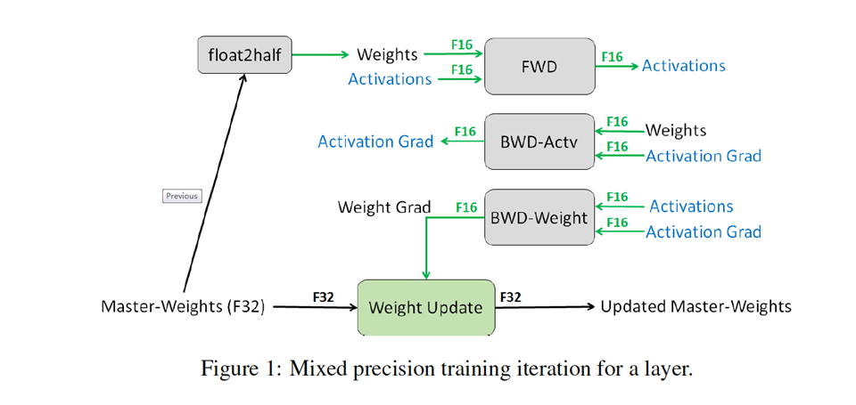

### 1.5. 进阶：迁移学习 resnet50-flowers

进阶案例，载入预训练的resnet50，在flowers数据集上做迁移学习，并使用新特性加速训练

#### 1.5.1. 载入预置模型

下载resnet50预训练模型：http://download.tensorflow.org/models/resnet_v1_50_2016_08_28.tar.gz

模型解压后为：`/tmp/model/resnet_v1_50.ckpt`

使用预训练的模型在flowers数据集上做迁移学习，但是并不是模型的每一层都需要载入预置模型中的参数。由于预置模型是在ImageNet上训练的得到，ImageNet的分类数量为1000，而flowers的分类数量为5，所以模型最后一层logits分类层是不需要载入参数的。

获取模型元信息，并获取网络最后一层名字空间的统配符，利用MoXing-TensorFlow的内置超参`checkpoint_exclude_patterns`，使得载入预训练模时，忽略指定层的参数。除了忽略logits分类层，这里还需要忽略checkpoint中的global_step参数，因为需要从第0步开始训练。

```python
exclude_list = ['global_step']
model_meta = mox.get_model_meta(flags.model_name)
exclude_list.append(model_meta.default_logits_pattern)
checkpoint_exclude_patterns = ','.join(exclude_list)
mox.set_flag('checkpoint_exclude_patterns', checkpoint_exclude_patterns)
```

在`mox.run`中，执行参数`checkpoint_path`为`/tmp/model/resnet_v1_50.ckpt`

```python
  mox.run(input_fn=input_fn,
          model_fn=model_fn,
          optimizer_fn=optimizer_fn,
          run_mode=mox.ModeKeys.TRAIN,
          log_dir=flags.train_url,
          checkpoint_path='/tmp/model/resnet_v1_50.ckpt',
          max_number_of_steps=sys.maxint)
```

#### 1.5.2. 使用更快的训练，性能提升

在`mox.get_model_fn`中，传入`data_format='NCHW'`和`batch_norm_fused=True`，在GPU上的训练将会更快

```python
mox_model_fn = mox.get_model_fn(
  name=flags.model_name,
  run_mode=mode,
  num_classes=data_meta.num_classes,
  weight_decay=0.00004,
  data_format='NCHW',
  batch_norm_fused=True)
```

使用多进程读取数据集，在`mox.ImageClassificationRawDataset`中加入参数`reader_class=mox.AsyncRawGenerator`

```python
dataset = mox.ImageClassificationRawDataset(data_meta,
                                            batch_size=flags.batch_size,
                                            num_epochs=20,
                                            augmentation_fn=data_augmentation_fn,
                                            reader_class=mox.AsyncRawGenerator)
```

#### 1.5.3. 使用fp16+fp32混合精度

训练过程中每层的权重都存成FP32格式（Mater-Weights），每次训练时都会将FP32的权重降精度至FP16（ a master copy），前向输出和后向梯度都使用FP16进行计算，更新时将FP16的梯度累加到FP32的Mater-Weight上。

<div align=center></div>

相关论文：https://arxiv.org/abs/1710.03740

在前向计算之前，先将`images`转换成fp16，再强制使用fp32来存储参数变量

```python
images = tf.cast(images, tf.float16)
with mox.var_scope(force_dtype=tf.float32):
  logits, _ = mox_model_fn(images)
```

此时logits也会成为fp16，但是在计算正确率的方法`tf.nn.in_top_k`中只能使用float32的tensor，所以在这个API中，先将logits转换成fp32再做计算（但是loss计算一定要使用fp16的logits，这样才能使得反向传播时计算仍然是使用fp16的）

```python
logits_fp32 = tf.cast(logits, tf.float32)
accuracy = tf.reduce_mean(tf.cast(tf.nn.in_top_k(logits_fp32, labels, 1), tf.float32))
```

通常在使用混合精度的场景下，需要对loss进行缩放来减少精度损失，设置MoXing-TensorFlow的内置超参`loss_scale`

```python
mox.set_flag('loss_scale', 1024.0)
```

在Nvidia-Tesla-K80设备上混合精度没有明显的性能提升，但是在Nvidia-Tesla-V100上会有2-3倍的性能提升

#### 1.5.4. 导出TF-Serving预测模型

关于TensorFlow-Serving的详细文档请参考：https://www.tensorflow.org/serving

MoXing-TensorFlow中可以导出一份用于TF-Serving的预测模型，可以被TF-Serving使用

在model_fn的返回值`mox.ModelSpec`中指定参数`export_spec`中传入一个`mox.ExportSpec`的实例，其中`inputs_dict`用于指定输入节点，outputs_dict用于指定输出节点，模型的版本号能够自适应自增。

```python
def model_fn(inputs, mode, **kwargs):
  ...
  export_spec = mox.ExportSpec(inputs_dict={'images': images},
                               outputs_dict={'logits': logits_fp32})

  return mox.ModelSpec(loss=loss,
                       log_info={'loss': loss, 'accuracy': accuracy},
                       export_spec=export_spec)
```

在ModelArts中使用模型预测相关文档可以参考：[此案例](../../offical_examples/Using_TensorFlow_to_Create_a_MNIST_Dataset_Recognition_Application)

完整代码请参考：[mox_flowers_advanced.py](scripts/mox_flowers_advanced.py)

执行训练：

```shell
python mox_flowers_advanced.py \
--data_url=/tmp/tensorflow/flower_photos \
--train_url=/tmp/flowers \
--checkpoint_url=/tmp/model/resnet_v1_50.ckpt \
--num_gpus=4
```

使用 4 * Nvidia-Tesla-K80 运行时间大约为：334秒，在训练集上的训练精度约为：95%
