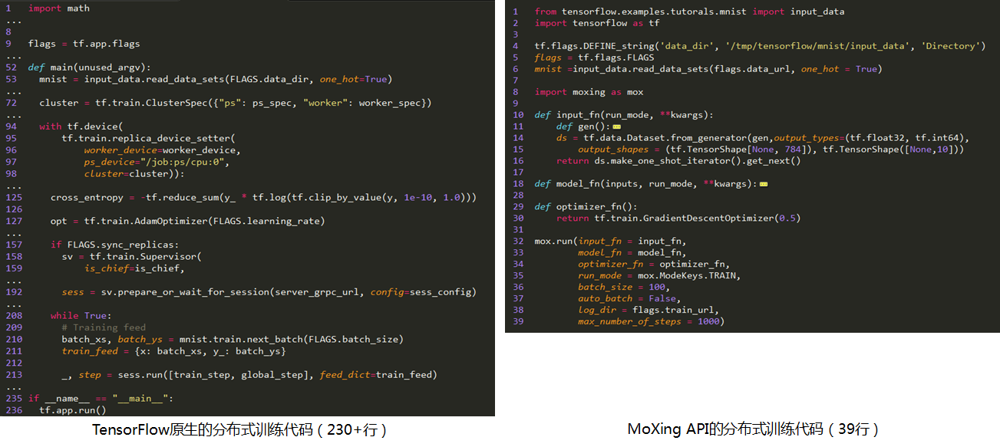
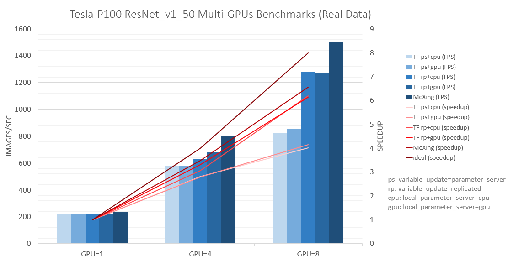
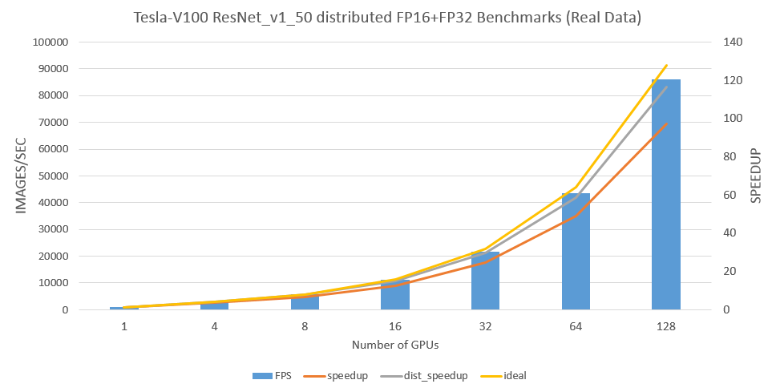

## 1.1 MoXing 介绍与性能测试

### 1.1.1. 什么是MoXing

MoXing是华为云ModelArts团队自研的分布式训练加速框架，它构建于开源的深度学习引擎TensorFlow、MXNet、PyTorch、Keras之上。
相对于TensorFlow和MXNet原生API而言，MoXing API让模型代码的编写更加简单，允许用户只需要关心数据输入(input_fn)和模型构建(model_fn)的代码，即可实现任意模型在多GPU和分布式下的高性能运行，降低了TensorFlow和MXNet的使用门槛。另外，MoXing-TensorFlow还将支持自动超参选择和自动模型结构搜索，用户无需关心超参和模型结构，做到模型全自动学习。

### 1.1.2. MoXing API与原生API对比

下面以手写体数字识别模型代码为例，对分别基于MoXing API与原生API编写的代码进行对比。为了展示清晰，将mnist_softmax.py做了简化，TensorFlow官方代码和使用MoXing的代码对比如图2-1所示，从图中对比可以看出，基于MoXing开发的模型分布式训练代码更简洁。

TensorFlow原生API与MoXing API分布式训练MNIST代码对比
<div align=center></div>

- TensorFlow官方提供的训练手写体数字识别模型代码的源码链接为https://github.com/tensorflow/tensorflow/blob/master/tensorflow/tools/dist_test/python/mnist_replica.py。
- 采用MoXing API编写的具体代码如下

```python
from tensorflow.examples.tutorials.mnist import input_data
import tensorflow as tf

tf.flags.DEFINE_string('data_url', '/tmp/tensorflow/mnist/input_data', 'Directory for storing input data')
tf.flags.DEFINE_string('train_url', '/tmp/tensorflow/mnist/output_log', 'Directory for output logs')
flags = tf.flags.FLAGS
mnist = input_data.read_data_sets(flags.data_url, one_hot=True)

import moxing.tensorflow as mox


def input_fn(run_mode, **kwargs):
  def gen():
    while True:
      yield mnist.train.next_batch(100)

  ds = tf.data.Dataset.from_generator(gen, output_types=(tf.float32, tf.int64),
                                      output_shapes=(tf.TensorShape([None, 784]), tf.TensorShape([None, 10])))
  return ds.make_one_shot_iterator().get_next()


def model_fn(inputs, run_mode, **kwargs):
  x, y_ = inputs
  W = tf.get_variable(name='W', initializer=tf.zeros([784, 10]))
  b = tf.get_variable(name='b', initializer=tf.zeros([10]))
  y = tf.matmul(x, W) + b
  cross_entropy = tf.reduce_mean(
    tf.nn.softmax_cross_entropy_with_logits(labels=y_, logits=y))
  return mox.ModelSpec(loss=cross_entropy, log_info={'loss': cross_entropy})


def optimizer_fn():
  return tf.train.GradientDescentOptimizer(0.5)


mox.run(input_fn=input_fn,
        model_fn=model_fn,
        optimizer_fn=optimizer_fn,
        run_mode=mox.ModeKeys.TRAIN,
        log_dir=flags.train_url,
        max_number_of_steps=1000)
```

### 1.1.3. ModelArts服务模型训练性能测试：

----------

- 环境：ModelArts服务
- TensorFlow: 1.4.0
- GPU: Tesla-P100
- 使用resnet_v1_50模型

<div align=center></div>

单机多卡吞吐量测试结果（真实数据）：

|FPS|TensorFlow-benchmarks||||MoXing|
|:---:|:---:|:---:|:---:|:---:|:---:|
||parameter_server+cpu|parameter_server+gpu|replicated+cpu|replicated+gpu|replicated_host+gpu|
|GPU=1|222.66|223.61|222.71|222.64|235.03|
|GPU=4|578.02|577.2|630.8|681.89|798.54|
|GPU=8|826.99|855.19|1278.25|1268.17|1505.26|

|Speedup|TensorFlow-benchmarks||||MoXing|
|:---:|:---:|:---:|:---:|:---:|:---:|
||parameter_server+cpu|parameter_server+gpu|replicated+cpu|replicated+gpu|replicated_host+gpu|
|GPU=1|1|1|1|1|1
|GPU=4|0.700155046|0.699161781|0.764087407|0.825972673|0.869036218
|GPU=8|0.500866079|0.517945395|0.774171471|0.768066525|0.81907322

单机多卡吞吐量测试结果（假数据）：

|FPS|TensorFlow-benchmarks||||MoXing|
|:---:|:---:|:---:|:---:|:---:|:---:|
||parameter_server+cpu|parameter_server+gpu|replicated+cpu|replicated+gpu|replicated_host+gpu|
|GPU=1|222.66|223.61|222.71|222.64|235.03
|GPU=4|711.76|687.82|786.55|786.09|887.79
|GPU=8|1385.24|1272.67|1424.61|1424.9|1649.58

|Speedup|TensorFlow-benchmarks||||MoXing|
|:---:|:---:|:---:|:---:|:---:|:---:|
||parameter_server+cpu|parameter_server+gpu|replicated+cpu|replicated+gpu|replicated_host+gpu|
|GPU=1|1|1|1|1|1
|GPU=4|0.795760476|0.768995125|0.87937704|0.878862752|0.944336893
|GPU=8|0.774361612|0.71143397|0.796369796|0.796531908|0.877324171

----------

- 环境：ModelArts服务
- TensorFlow: 1.8.0
- GPU: 8xP100 & 8xV100
- 混合精度：FP16计算+FP32存储
- 使用脚本: distributed_imagenet_benchmarks.py

<div align=center></div>

|node|GPUs|batch/sec|batch_size|FPS|speedup|dist_speedup|
|:---:|:---:|:---:|:---:|:---:|:---:|:---:|
|1|1|3.458988719|256|885.5011121|1|1|
|1|4|3.044783236|1024|3117.858033|0.880252433|1|
|1|8|2.8840776|2048|5906.590924|0.833792138|1|
|2|16|2.711127837|4096|11104.77962|0.783792044|0.940032902|
|4|32|2.663784904|8192|21821.72594|0.770105115|0.923617626|
|8|64|2.648736077|16384|43396.89188|0.765754471|0.918399726|
|16|128|2.624302388|32768|85993.14064|0.758690647|0.909927801|


### 1.1.4. ModelArts服务数据读取吞吐量测试

- 环境：ModelArts服务
- TensorFlow: 1.8.0
- GPU: Tesla-V100
- 使用脚本: dataset_benchmarks.py

<div align=center></div>

数据集读取方法：

- 图像数据为3671张图像，总大小为222.082MB，从OBS读取图像数据。
- 若读取的是纯图像文件，则采取64子进程的方法并行读取，若读取的是tfrecord，则采用cycle_length为32的parallel_interleave方式读取（TF-1.8之后的特性）
- 读取分为without cache和with cache，即是否利用tf.data.Dataset模块利用本地缓存（读取第一个epoch时在容器内挂载的SSD中缓存数据，从第二个epoch之后直接从SSD读取数据，而不是从OBS）。
- 读取类型分为三种。bytes: 仅读取图像数据字节流，不进行解码。images：读取图像数据并进行解码，如果做cache则缓存解码后数据。tfrecord：读取tfrecord文件，并进行解码，如果做cache则缓存解码后数据。解码后数据较原图像占用空间会增大5-10倍。
- 在计算8xP100和8xV100对数据读取性能需求时，采用resnet_v1_50模型，在8xP100中的吞吐量按1500 images/sec计算，在8xV100中的吞吐量按3100 images/sec计算

|without cache|with cache|without cache|with cache|without cache|with cache|8xV100-FP16|
|:---:|:---:|:---:|:---:|:---:|:---:|:---:|
|619.64 |863.76 |375.15 |402.57 |139.06 |683.51 |383.35 |