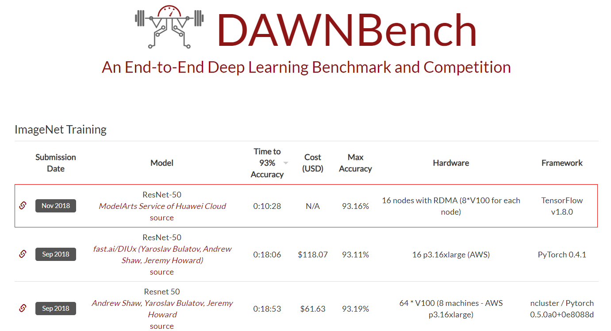
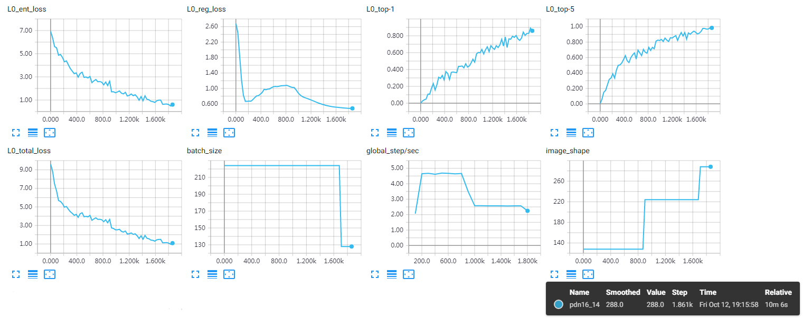
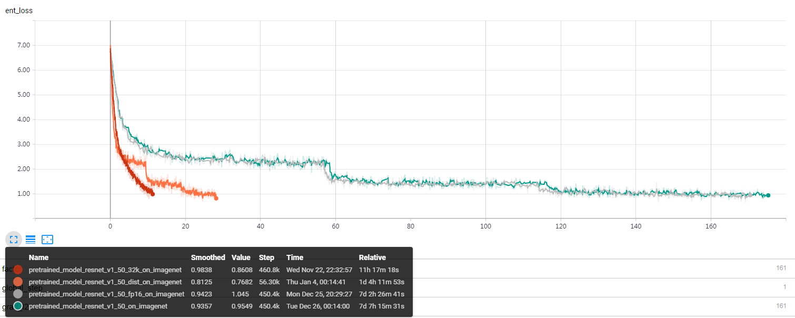
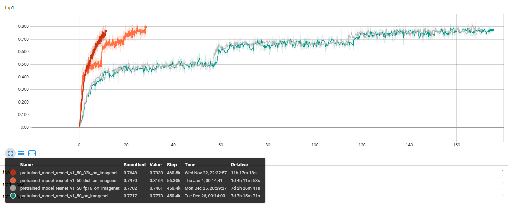
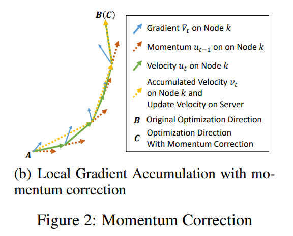
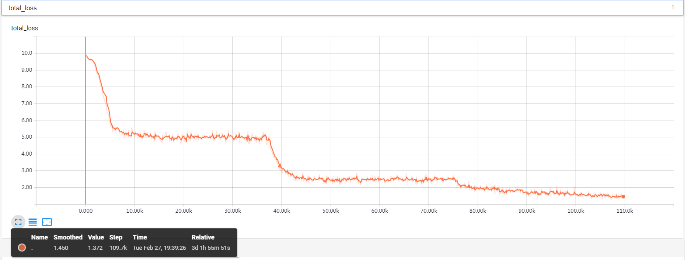
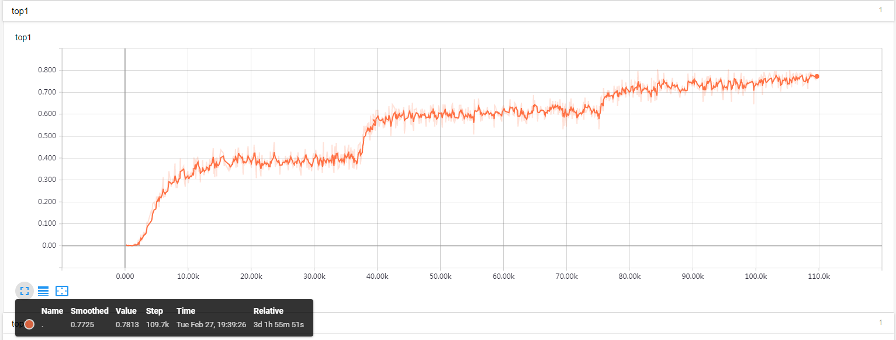
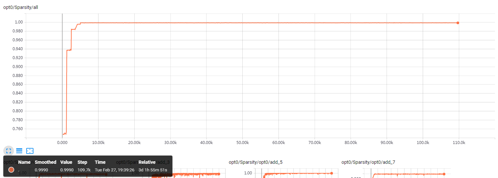
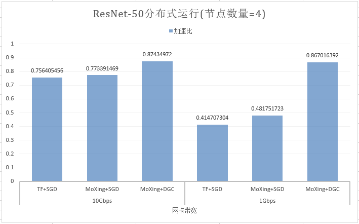

### 1.7 MoXing-更多案例

#### 1.7.1 MoXing实现10分钟训练ImageNet

<div align=center></div>

<div align=center></div>

参考链接：[https://dawn.cs.stanford.edu/benchmark/](https://dawn.cs.stanford.edu/benchmark/)

[参考代码](https://github.com/huawei-clouds/modelarts-example/blob/e31f0499f3ab32cef4131abd7774de5746c92bbc/ImageNet-10min/fast_imagenet_dym_node_16.py)

#### 1.7.2 MoXing实现LARS训练ResNet-50

> [Large Batch Training of Convolutional Networks](https://arxiv.org/abs/1708.03888)

使用MoXing中的LARS Optimizer可以实现batch_size=32k分布式训练ResNet-50。另外，MoXing中还提供了FP-16模式（只需在运行脚本时添加--use_fp16=True）即可。

损失值曲线：


正确率曲线：


- 绿色线条为单机版ResNet-50收敛曲线，使用4个GPU（2个NVIDIA-K80显卡）
- 灰色线条为在绿色线条同等下，使用FP-16时的收敛曲线，精度几乎没有影响。
- 橙色线条为使用MoXing分布式训练一个ResNet-50模型的收敛曲线，使用了8个节点，每个节点使用4个GPU（2个NVIDIA-K80显卡），每个GPU的batch_szie为64。根据[Accurate, Large Minibatch SGD: Training ImageNet in 1 Hour](https://arxiv.org/abs/1706.02677)的理论，学习率在开始训练阶段为0.1~0.8的Warm Up。
- 红色线条为使用MoXing中LARS特性实现的batch_size=32k的ResNet-50收敛曲线，使用16个节点，每个节点使用4个GPU（2个NVIDIA-K80显卡），每个节点的batch_size为512。从图中发现，使用16个节点的LARS收敛时间的2倍比8节点的收敛时间的短，是因为在应用LARS的同时还应用了周期为8的Batch Gradient Descent，减少了通信频率，增加了加速比。

<a href="#lars">[参考代码]</a>

#### 1.7.3 MoXing实现DGC训练ResNet-50

> [Deep Gradient Compression: Reducing the Communication Bandwidth for Distributed Training](https://arxiv.org/abs/1712.01887)



损失值曲线：


正确率曲线：


学习率曲线：


梯度稀疏度变化取消：


深度梯度压缩的梯度稀疏度在前5个epoch时是由75%逐渐上升到99.9%，所以在前5个epoch时，分布式加速比并一定比普通的分布式训练高，但是从第5个epoch之后，加速比则有显著提升，同时模型精度也没有下降。

从第5个epoch之后DGC在分布式运行中的加速比表现：




<a href="#dgc">[参考代码]</a>


#### 1.7.4 LARS训练ResNet-50 
<a name="lars" id="lars"></a>

```python
import tensorflow as tf
import moxing.tensorflow as mox

slim = tf.contrib.slim

tf.flags.DEFINE_string('data_format',
                       default='NHWC', help='NHWC or NCHW')
tf.flags.DEFINE_integer('num_classes',
                        default=1000, help='number of classes')
tf.flags.DEFINE_string('dataset_name',
                       default=None, help='dataset name')
tf.flags.DEFINE_string('data_url',
                       default=None, help='dataset dir')
tf.flags.DEFINE_string('model_name',
                       default=None, help='model_name')
tf.flags.DEFINE_string('run_mode',
                       default='train', help='run_mode')
tf.flags.DEFINE_string('log_dir',
                       default=None, help='train_dir or eval_dir')
tf.flags.DEFINE_string('checkpoint_path',
                       default=None, help='ckpt path')
tf.flags.DEFINE_integer('batch_size',
                        default=None, help='batch size')
tf.flags.DEFINE_integer('max_number_of_steps',
                        default=None, help='max_number_of_steps')
tf.flags.DEFINE_integer('log_every_n_steps',
                        default=None, help='log_every_n_steps')
tf.flags.DEFINE_integer('save_summaries_steps',
                        default=None, help='save_summary_steps')
tf.flags.DEFINE_integer('save_interval_secs',
                        default=None, help='save_model_secs')

flags = tf.flags.FLAGS

is_training = (flags.run_mode == mox.ModeKeys.TRAIN)
data_format = flags.data_format
num_classes = flags.num_classes

dataset_meta = mox.get_dataset_meta(flags.dataset_name)
model_meta = mox.get_model_meta(flags.model_name)
split_name_train, split_name_eval = dataset_meta.splits_to_sizes.keys()
split_name = split_name_train if is_training else split_name_eval


def input_fn(run_mode, **kwargs):
  dataset = mox.get_dataset(name=flags.dataset_name, split_name=split_name,
                            dataset_dir=flags.data_url, capacity=flags.batch_size * 20)
  image, label = dataset.get(['image', 'label'])
  data_augmentation_fn = mox.get_data_augmentation_fn(
    name=flags.model_name, run_mode=run_mode,
    output_height=224, output_width=224)
  image = data_augmentation_fn(image)
  label -= 1
  return image, label


def model_fn(inputs, run_mode, **kwargs):
  images, labels = inputs
  mdoel_fn = mox.get_model_fn(
    name=flags.model_name,
    run_mode=run_mode,
    num_classes=num_classes,
    weight_decay=0.0001,
    data_format=data_format,
    batch_norm_fused=True,
    batch_renorm=False)
  logits, _ = mdoel_fn(images)
  labels_one_hot = slim.one_hot_encoding(labels, num_classes)
  loss = tf.losses.softmax_cross_entropy(
    logits=logits, onehot_labels=labels_one_hot,
    label_smoothing=0.0, weights=1.0)
  
  accuracy_top_1 = tf.reduce_mean(tf.cast(tf.nn.in_top_k(logits, labels, 1), tf.float32))
  accuracy_top_5 = tf.reduce_mean(tf.cast(tf.nn.in_top_k(logits, labels, 5), tf.float32))
  # 32K weight decay should be inside LARS optimizer, but we still summary it.
  regularization_losses = mox.get_collection(tf.GraphKeys.REGULARIZATION_LOSSES)
  regularization_loss = tf.add_n(regularization_losses)
  log_info = {'ent_loss': loss,
              'reg_loss': regularization_loss,
              'top1': accuracy_top_1,
              'top5': accuracy_top_5}
  return mox.ModelSpec(loss=loss, log_info=log_info)


def config_lr(global_step, warm_up_steps, init_learning_rate,
              end_learning_rate, total_steps):
  def warm_up_lr(global_step, warm_up_steps, init_learning_rate,
                 end_learning_rate, name=None):
    with tf.name_scope(name, "warm_up_lr",
                       [init_learning_rate, global_step,
                        end_learning_rate]):
      init_learning_rate = tf.convert_to_tensor(init_learning_rate,
                                                name="init_learning_rate")
      end_learning_rate = tf.convert_to_tensor(end_learning_rate,
                                               name="end_learning_rate")
      dtype = init_learning_rate.dtype
      global_step = tf.cast(global_step, dtype)
      warm_up_steps = tf.cast(warm_up_steps, dtype)
      diff = end_learning_rate - init_learning_rate
      p = global_step / warm_up_steps
      return init_learning_rate + diff * p
  
  def lr_warm_up_fn():
    return warm_up_lr(global_step, warm_up_steps, init_learning_rate,
                      end_learning_rate)
  
  def lr_decay_fn():
    return tf.train.polynomial_decay(learning_rate=end_learning_rate,
                                     global_step=global_step,
                                     decay_steps=total_steps,
                                     end_learning_rate=0.0001, power=2)
  
  return tf.cond(tf.less(global_step, warm_up_steps), lr_warm_up_fn,
                 lr_decay_fn)


def optimizer_fn():
  num_samples = 1281167  # ImageNet
  total_batch_size = 32768
  num_workers = len(mox.get_flag('worker_hosts').split(',')) if is_training else 1
  global_step = tf.train.get_or_create_global_step()
  num_batches = int(total_batch_size / num_workers / flags.batch_size / mox.get_flag('num_gpus'))
  tf.logging.info('Batch Gradients Prior = %d' % num_batches)
  
  # https://people.eecs/berkeley.edu/~youyang/publications/batch/32k_logs/resnet50_32k_2.log
  warm_up_steps = 200  # epoch = 5
  total_steps = 3600  # epoch = 92
  
  init_learning_rate = 2.0
  end_learning_rate = 29.0
  # Notice that global_step inside config_lr is the times that BDP is taken and apply to the
  # global variables. But the global step inside mox.run (sync_replicas=Flase) is increased
  # each step including apply to the BDP accumlator.
  if mox.get_flag('sync_replicas'):
    lr_global_step = tf.floor(global_step / (num_batches))
  else:
    lr_global_step = tf.floor(global_step / (num_batches * num_workers))
  lr = config_lr(global_step=lr_global_step, warm_up_steps=warm_up_steps,
                 init_learning_rate=init_learning_rate,
                 end_learning_rate=end_learning_rate,
                 total_steps=total_steps)
  
  base_opt = mox.get_optimizer_fn('momentum', learning_rate=lr, momentum=0.9)()
  lars_opt = mox.get_optimizer_wrapper_fn('lars', base_opt, ratio=0.001, weight_decay=0.0001)()
  bdp_lars_opt = mox.get_optimizer_wrapper_fn('batch_gradients', lars_opt,
                                              num_batches=num_batches, sync_on_apply=True)()
  
  return bdp_lars_opt


if __name__ == '__main__':
  if flags.run_mode == 'train':
    mox.run(input_fn=input_fn,
            model_fn=model_fn,
            optimizer_fn=optimizer_fn,
            batch_size=flags.batch_size,
            run_mode=mox.ModeKeys.TRAIN,
            log_dir=flags.log_dir,
            max_number_of_steps=flags.max_number_of_steps,
            log_every_n_steps=flags.log_every_n_steps,
            save_summary_steps=flags.save_summaries_steps,
            save_model_secs=flags.save_interval_secs)
  
  elif flags.run_mode == 'evaluation':
    imagenet_eval_samples = 50000
    total_batch_size = flags.batch_size * mox.get_flag('num_gpus')
    max_number_of_steps = int(imagenet_eval_samples / total_batch_size)
    mox.run(input_fn=input_fn,
            model_fn=model_fn,
            optimizer_fn=optimizer_fn,
            batch_size=125,
            run_mode=mox.ModeKeys.EVAL,
            log_dir=flags.log_dir,
            max_number_of_steps=max_number_of_steps,
            checkpoint_path=flags.checkpoint_path)
```

运行参数：

```shell
--batch_size=64
--max_number_of_steps=28800
--log_every_n_steps=1
--num_gpus=4
--save_summaries_steps=4
--save_interval_secs=300
--run_mode=train
--clone_on_cpu=False
--data_format=NCHW
--dataset_name=imagenet
--model_name=resnet_v1_50
--sync_replicas=False
--log_dir=${LOG_DIR}
--data_url=${DATASET_DIR}
--ps_hosts=${PS_HOSTS}
--worker_hosts=${WORKER_HOSTS}
--job_name=${JOB_NAME}
--task_index=${TASK_INDEX}
```

#### 1.7.5 DGC训练ResNet-50
<a name="dgc" id="dgc"></a>

以下代码可以训练一个任意的MoXing内置模型，只需要添加上一些运行参数，即可将DGC应用起来。

```python
import tensorflow as tf
import moxing.tensorflow as mox
import math

slim = tf.contrib.slim

tf.flags.DEFINE_string('data_format', 
             default='NHWC', help='NHWC or NCHW')
tf.flags.DEFINE_string('data_url', 
             default=None, help='dataset dir')
tf.flags.DEFINE_string('model_name', 
             default=None, help='model_name')
tf.flags.DEFINE_string('run_mode', 
             default='TRAIN', help='run_mode')
tf.flags.DEFINE_string('train_url', 
             default=None, help='train_dir')
tf.flags.DEFINE_string('eval_url', 
             default=None, help='eval_dir')
tf.flags.DEFINE_string('checkpoint_url', 
             default=None, help='ckpt path')
tf.flags.DEFINE_integer('batch_size', 
             default=None, help='batch size')
tf.flags.DEFINE_integer('max_epochs',
             default=None, help='Max number of epoches to train')
tf.flags.DEFINE_integer('log_every_n_steps', 
             default=10, help='log_every_n_steps')
tf.flags.DEFINE_integer('save_summaries_steps', 
             default=10, help='save_summary_steps')
tf.flags.DEFINE_integer('save_interval_secs', 
             default=60, help='save_model_secs')
tf.flags.DEFINE_string('dataset_name', 
             default='imagenet', help='Name of dataset.')
tf.flags.DEFINE_float('weight_decay', 
             default=0.0001, help='Weight decay')
tf.flags.DEFINE_float('momentum',  default=0,
             help='Set 0 to use `SGD` opt, >0 to use momentum opt')
tf.flags.DEFINE_string('learning_rate_strategy',
             default='30:0.1,60:0.01,80:0.001,90:0.0001', help='')
tf.flags.DEFINE_string('lr_warmup_strategy', default='linear', help='linear or exponential')

flags = tf.flags.FLAGS

def main():
  data_format = flags.data_format
  num_workers = len(mox.get_flag('worker_hosts').split(','))
  
  # Get some metadata
  is_training = (flags.run_mode == mox.ModeKeys.TRAIN)
  dataset_meta = mox.get_dataset_meta(flags.dataset_name)
  model_meta = mox.get_model_meta(flags.model_name)
  split_name_train, split_name_eval = dataset_meta.splits_to_sizes.keys()
  split_name = split_name_train if is_training else split_name_eval
  total_samples_train, total_samples_eval = dataset_meta.splits_to_sizes.values()
  total_samples = total_samples_train if is_training else total_samples_eval
  image_size = model_meta.default_image_size
  labels_offset = model_meta.default_labels_offset
  num_classes = dataset_meta.num_classes - labels_offset
  
  log_dir = flags.train_url if is_training else flags.eval_url
  save_summary_steps = flags.save_summaries_steps if is_training else None
  save_model_secs = flags.save_interval_secs if is_training else None
  
  if (is_training):
    total_batch_size = flags.batch_size * mox.get_flag('num_gpus') * num_workers
    if mox.get_flag('sync_replicas'):
      max_number_of_steps = int(math.ceil(flags.max_epochs * total_samples / total_batch_size))
    else:
      max_number_of_steps = int(
        math.ceil(flags.max_epochs * total_samples * num_workers / total_batch_size))
  else:
    assert num_workers == 1
    total_batch_size = flags.batch_size * mox.get_flag('num_gpus')
    max_number_of_steps = int(math.ceil(total_samples / total_batch_size))
  
  def input_fn(run_mode, **kwargs):
    dataset = mox.get_dataset(name=flags.dataset_name, split_name=split_name,
                              dataset_dir=flags.data_url, capacity=flags.batch_size * 20)
    image, label = dataset.get(['image', 'label'])
    data_augmentation_fn = mox.get_data_augmentation_fn(
      name=flags.model_name, run_mode=run_mode,
      output_height=image_size, output_width=image_size)
    image = data_augmentation_fn(image)
    label -= labels_offset
    return image, label
  
  def model_fn(inputs, run_mode, **kwargs):
    images, labels = inputs
    mox_mdoel_fn = mox.get_model_fn(
      name=flags.model_name,
      run_mode=run_mode,
      num_classes=num_classes,
      weight_decay=flags.weight_decay,
      data_format=data_format,
      batch_norm_fused=True,
      batch_renorm=False,
      image_height=image_size,
      image_width=image_size)
    logits, end_points = mox_mdoel_fn(images)
    labels_one_hot = slim.one_hot_encoding(labels, num_classes)
    loss = tf.losses.softmax_cross_entropy(
      logits=logits, onehot_labels=labels_one_hot,
      label_smoothing=0.0, weights=1.0)
    if 'AuxLogits' in end_points:
      aux_loss = tf.losses.softmax_cross_entropy(
        logits=end_points['AuxLogits'], onehot_labels=labels_one_hot,
        label_smoothing=0.0, weights=0.4, scope='aux_loss')
      loss += aux_loss
    accuracy_top_1 = tf.reduce_mean(tf.cast(tf.nn.in_top_k(logits, labels, 1), tf.float32))
    accuracy_top_5 = tf.reduce_mean(tf.cast(tf.nn.in_top_k(logits, labels, 5), tf.float32))
    regularization_losses = mox.get_collection(tf.GraphKeys.REGULARIZATION_LOSSES)
    regularization_loss = tf.add_n(regularization_losses)
    total_loss = loss + regularization_loss
    log_info = {'ent_loss': loss,
                'reg_loss': regularization_loss,
                'total_loss': total_loss,
                'top1': accuracy_top_1,
                'top5': accuracy_top_5}
    top_5_confidence, top_5_label = tf.nn.top_k(tf.nn.softmax(logits), k=5)
    top_5_label += labels_offset
    export_spec = mox.ExportSpec(inputs_dict={'images': images},
                                 outputs_dict={'logits': logits,
                                               'labels': top_5_label,
                                               'confidences': top_5_confidence})
    return mox.ModelSpec(loss=total_loss, log_info=log_info, export_spec=export_spec)
   
  def optimizer_fn():
    lr = config_lr()
    if flags.momentum > 0:
      opt = mox.get_optimizer_fn('momentum', learning_rate=lr, momentum=flags.momentum)()
    else:
      opt = mox.get_optimizer_fn('sgd', learning_rate=lr)()
    return opt
  
  def config_lr():
    num_workers = len(mox.get_flag('worker_hosts').split(','))
    num_gpus = mox.get_flag('num_gpus')
    steps_per_epoch = int(math.ceil(total_samples / (flags.batch_size * num_gpus * num_workers)))
    global_step = tf.train.get_or_create_global_step()
    if mox.get_flag('sync_replicas'):
      lr_global_step = global_step
    else:
      lr_global_step = tf.cast(tf.floor(global_step / num_workers), tf.int64)
    stage_lrs = flags.learning_rate_strategy.split(',')
    if len(stage_lrs) == 1:
      return float(stage_lrs[0].strip().split(':')[1])
    lr_boundaries = []
    lr_values = []
    warmup_begin, warmup_end, warmup_steps = None, None, None
    for i in range(len(stage_lrs)):
      lr_epoch, lr_value = stage_lrs[i].strip().split(':')
      if '->' in lr_value:
        if i != 0:
          raise ValueError('Warmup learning rate is only supported in the first stage.')
        warmup_begin, warmup_end = lr_value.split('->')
        warmup_begin = float(warmup_begin)
        warmup_end = float(warmup_end)
        warmup_steps = int(lr_epoch) * steps_per_epoch
      else:
        lr_boundaries.append(int(lr_epoch) * steps_per_epoch)
        lr_values.append(float(lr_value))
    
    def piecewise_lr():
      return tf.train.piecewise_constant(
                lr_global_step,
                boundaries=lr_boundaries[:-1],
                values=lr_values)
    
    if warmup_steps is None:
      lr = piecewise_lr()
    else:
      if flags.lr_warmup_strategy == 'linear':
        diff = warmup_end - warmup_begin
        p = lr_global_step / warmup_steps
        warmup_lr = tf.cast(warmup_begin + diff * p, tf.float32)
      elif flags.lr_warmup_strategy == 'exponential':
        diff = warmup_end / warmup_begin
        warmup_lr = tf.train.exponential_decay(warmup_begin, lr_global_step, warmup_steps, diff)
      else:
        raise ValueError('lr_warmup_strategy should be given when use warmup learning rate')
      lr = tf.cond(tf.greater(lr_global_step, warmup_steps),
                   true_fn=piecewise_lr,
                   false_fn=lambda: warmup_lr)
    return lr
  
  mox.run(input_fn=input_fn,
          model_fn=model_fn,
          optimizer_fn=optimizer_fn,
          run_mode=flags.run_mode,
          batch_size=flags.batch_size,
          log_dir=log_dir,
          max_number_of_steps=max_number_of_steps,
          log_every_n_steps=flags.log_every_n_steps,
          save_summary_steps=save_summary_steps,
          save_model_secs=save_model_secs,
          checkpoint_path=flags.checkpoint_url,
          export_model=mox.ExportKeys.TF_SERVING)


if __name__ == '__main__':
  main()
```


运行参数：

```shell
--model_name=resnet_v1_50
--batch_size=64
--max_epochs=90
--save_summaries_steps=60
--save_interval_secs=600
--dataset_name=imagenet
--data_format=NCHW
--learning_rate_strategy='5:0.001->0.4,30:0.4,60:0.04,80:0.004,90:0.0004'
--lr_warmup_strategy=exponential
--num_gpus=4
--run_mode=TRAIN
--variable_update=distributed_replicated_dgc
--dgc_sparsity_strategy=0.75,0.9375,0.984375,0.996,0.999
--dgc_momentum_type=vanilla
--dgc_momentum=0.9
--dgc_momentum_factor_masking=True
--dgc_total_samples=1281167
--log_every_n_steps=10
--momentum=0
--train_url=${TRAIN_URL}
--data_url=${DATA_URL}
--ps_hosts=${PS_HOSTS}
--worker_hosts=${WORKER_HOSTS}
--job_name=${JOB_NAME}
--task_index=${TASK_INDEX}
```
