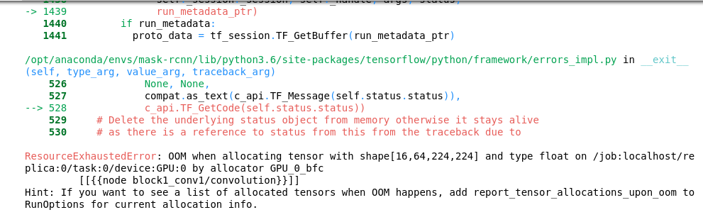
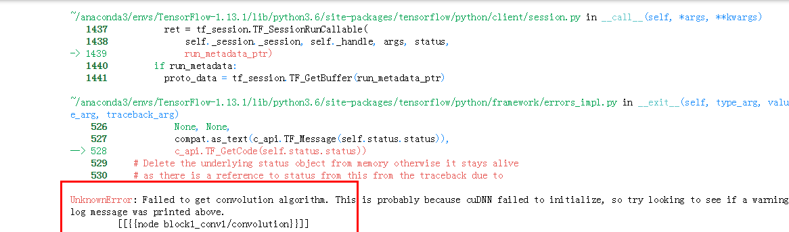

# 图像分类模型参数&网络调优

基于第一期[图像分类Notebook任务](../DL_image_recognition/image_recongition.ipynb)，本页面包含了图像分类任务的参数调优和网络优化的相关技巧。

### 数据集

猫狗二分类数据集（25000张图片）

### 主要模型

VGG16, VGG19, ResNet

### 实验环境

本期实践主要使用基于TensorFlow的Keras框架，与第二期环境一致，具体创建过程可以参考[第一期：图像分类Notebook任务](https://github.com/huaweicloud/ModelArts-Lab/blob/master/notebook/DL_image_recognition/image_recongition.ipynb)中的相关步骤。

### 实践案例

[0. epochs和callbacks](./00_epoch_callbacks.ipynb)：介绍训练轮数，拟合问题以及Keras模型训练时的Callback回调函数

[1. 学习率和优化器](./01_lr_opt.ipynb)：介绍学习率和不同优化器在模型训练中的实践

[2. 数据增广](02_data_augumentation.ipynb)：使用Keras DataGenerator预处理数据，实现数据增广

[3. 使用预训练权重](03_pretrained_weights.ipynb)：使用预训练的参数权重文件进行迁移学习

### 注意事项

本次实践涉及不同参数、模型结构的反复调整，内容较多，因此分成多个ipynb文件。Keras开始模型训练后，会一次性分配几乎全部显存，而ipynb文件在Cell执行后，所占用的显存资源不会主动释放。在相同环境下同时运行多个Notebook案例，可能导致显存OOM(Out of Memory)或者cudnn库无法初始化的错误，如下图所示。因此建议开发者逐步完成案例实践内容，完成一个案例后，主动关闭运行的ipynb文件(在创建的Notebook任务running页关闭已完成的ipynb文件)，再开始下一个实践。

> 未及时释放资源导致显存不足而产生的两种错误

