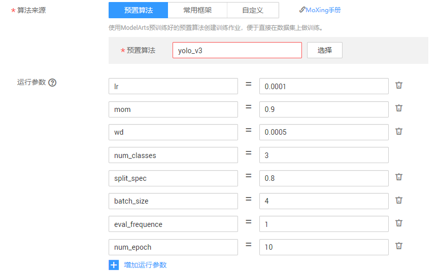
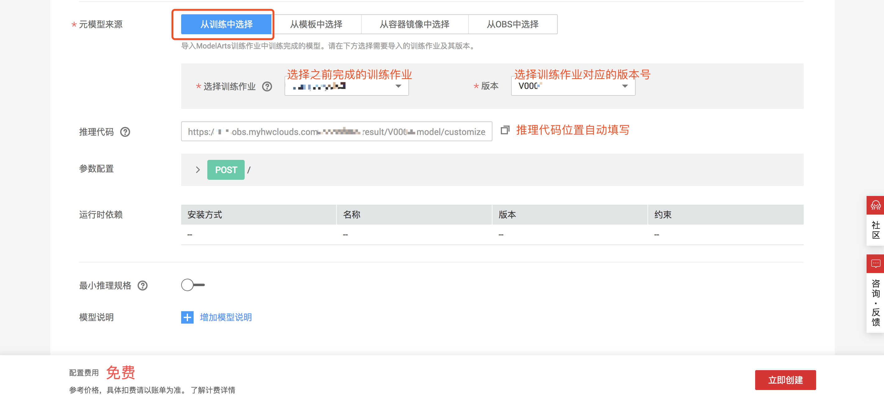

# 古画物体识别-使用ModelArts的预置算法yolov3

YOLO场景运用：
YOLO作为一个one-stage目标检测算法，在速度和准确度上都有杰出的表现。

除了在运行环境中进行算法的定义和运行，通过训练作业中的预置算法同样可以进行YOLO的训练。下面描述了利用ModelArts中的yolov3预置算法对古画数据进行的训练过程。

## 第一步：准备数据

古画数据存储在桶obs://gg-image/task/all-labeled/下，大家可以下载并上传到自己的桶中；同时在桶obs://gg-image/task/test/下保存了部分测试图片，大家保存在本地即可，在部署完成后可以使用来测试。

OBS基础操作，详细步骤参考下面文档，如果已经有OBS使用基础请跳过这个步骤：
https://support.huaweicloud.com/qs-obs/obs_qs_0002.html

## 第二步：创建训练任务

首先，进入训练任务界面，点击创建

然后根据需求进行作业参数定义：
训练作业名称需自定义

在预置算法列表中选择`yolo_v3`

数据来源选择在第一步中存储的数据位置

模型参数设置参考文档及个人需求进行定义：

https://support.huaweicloud.com/engineers-modelarts/modelarts_23_0045.html

图片中的参数仅供参考，请根据具体情况进行定义。

选择一个空文件夹作为训练结果的输出路径，完成训练作业的定义。

## 第三步：查看训练情况

- 通过训练日志
可以通过训练时候的日志查看训练情况，训练日志可以进行在线查看和下载。
- 
- 创建TensorBoard
点击创建TensorBoard，可以看到训练信息的图表展示。

更多训练情况查询请参考：

https://support.huaweicloud.com/engineers-modelarts/modelarts_23_0048.html

## 第四步：导入模型
进入模型管理界面，点击导入

接下来我们将之前训练得到的模型进行导入和部署。
模型名称需自定义

除了将训练中的模型进行导入之外，ModelArts还提供了多种模型导入方式，如从模板中选择，从容器景象中选择，从OBS中选择。例子中为从训练中导入，其他的具体操作方式参考文档：

https://support.huaweicloud.com/engineers-modelarts/modelarts_23_0054.html

## 第五步：部署服务
ModelArts提供了在线部署服务，可以对模型进行在线推理。首先进入在线部署界面，点击部署：

选择需要部署的模型及版本：部署名称需自定义

完成部署服务之后，可以点击预测->上传测试图片进行测试：

