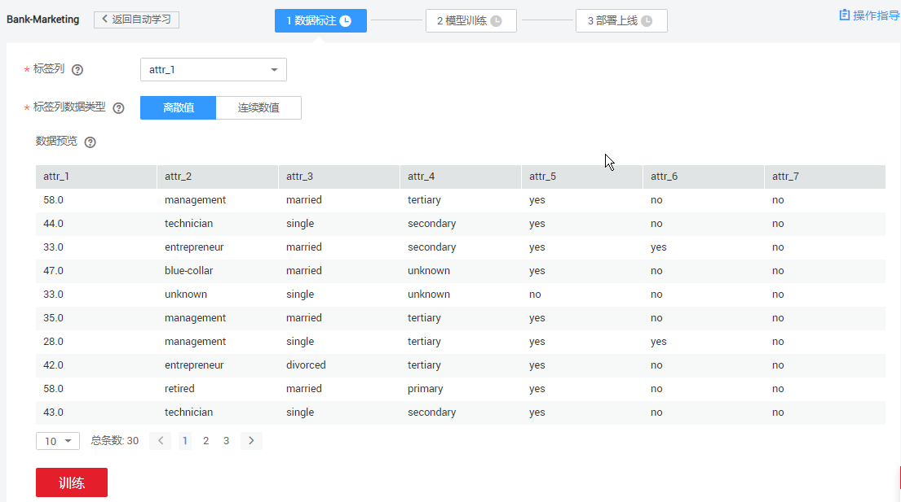
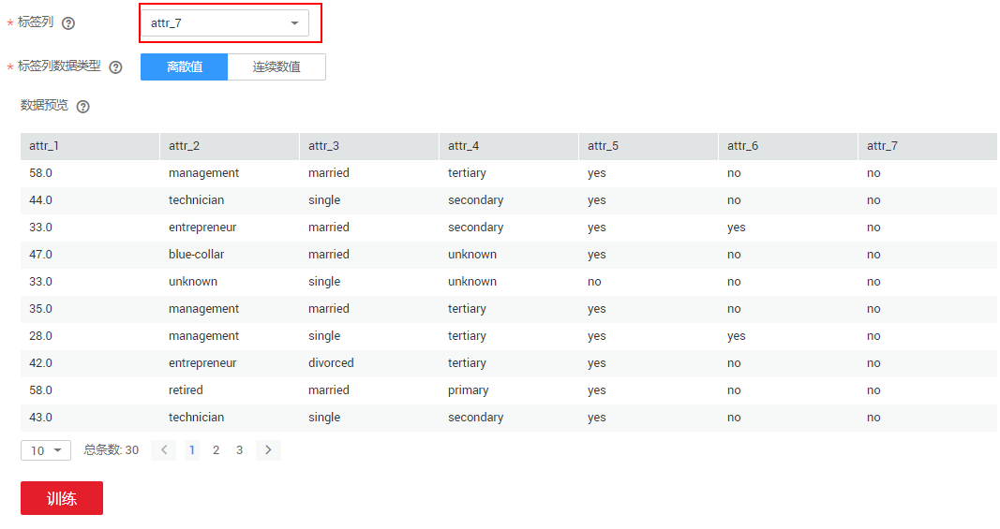
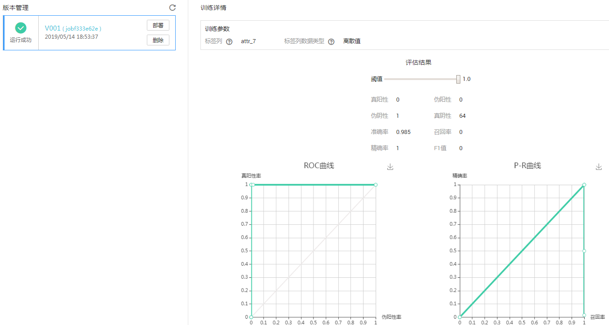
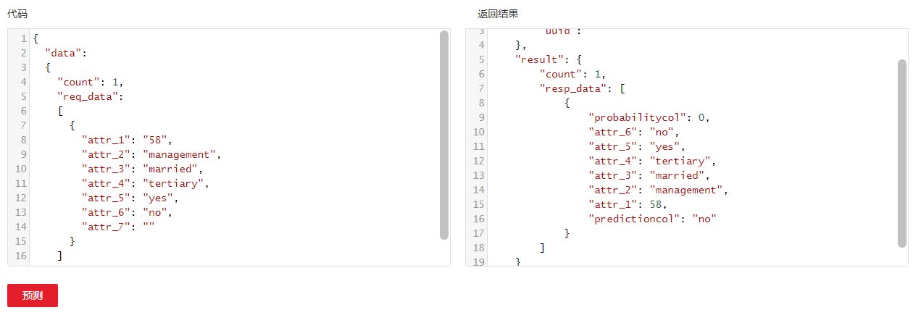

# 银行存款预测（使用自动学习实现预测分析）<a name="modelarts_10_0002"></a>

银行中常见一种业务：根据客户特征（年龄、工作类型、婚姻状况、文化程度、是否有房贷和是否有个人贷款），预测客户是否愿意办理定期存款业务。

现在您可以使用ModelArts平台上的自动学习功能，预测某个客户是否会办理存款业务。自动学习功能的使用流程如下所示：

1.  **[准备数据](#section126521956192619)**：下载数据集并上传至华为云OBS中。
2.  **[创建预测分析项目](#section785182617387)**：基于已有的数据集，创建预测分析项目。
3.  **[训练模型](#section51394177278)**：预览数据并选择训练目标，然后启动模型训练。
4.  **[部署模型](#section99271627142716)**：将训练好的模型部署为在线服务，并测试预测结果。

## 准备数据<a name="section126521956192619"></a>

本示例使用的数据集来自UCI的Machine Learning Repository，数据集介绍请参见[Bank Maketing Data Set](https://archive.ics.uci.edu/ml/datasets/Bank+Marketing)。数据集的基本信息可参见[表1](#table45666040)和[表2](#table40920274)，您可以从Github获取数据集并上传至OBS中。

**表 1**  数据源的具体字段及意义

<a name="table45666040"></a>
<table><thead align="left"><tr id="row48398424"><th class="cellrowborder" valign="top" width="15.25%" id="mcps1.2.5.1.1"><p id="p27958252"><a name="p27958252"></a><a name="p27958252"></a>字段名</p>
</th>
<th class="cellrowborder" valign="top" width="17.4%" id="mcps1.2.5.1.2"><p id="p50025933"><a name="p50025933"></a><a name="p50025933"></a>含义</p>
</th>
<th class="cellrowborder" valign="top" width="17.46%" id="mcps1.2.5.1.3"><p id="p25568738"><a name="p25568738"></a><a name="p25568738"></a>类型</p>
</th>
<th class="cellrowborder" valign="top" width="49.89%" id="mcps1.2.5.1.4"><p id="p57801875"><a name="p57801875"></a><a name="p57801875"></a>描述</p>
</th>
</tr>
</thead>
<tbody><tr id="row50454834"><td class="cellrowborder" valign="top" width="15.25%" headers="mcps1.2.5.1.1 "><p id="p60309786"><a name="p60309786"></a><a name="p60309786"></a>attr_1</p>
</td>
<td class="cellrowborder" valign="top" width="17.4%" headers="mcps1.2.5.1.2 "><p id="p53254482"><a name="p53254482"></a><a name="p53254482"></a>年龄</p>
</td>
<td class="cellrowborder" valign="top" width="17.46%" headers="mcps1.2.5.1.3 "><p id="p18645762"><a name="p18645762"></a><a name="p18645762"></a>Int</p>
</td>
<td class="cellrowborder" valign="top" width="49.89%" headers="mcps1.2.5.1.4 "><p id="p33911763"><a name="p33911763"></a><a name="p33911763"></a>表示客户的年龄。</p>
</td>
</tr>
<tr id="row36770415"><td class="cellrowborder" valign="top" width="15.25%" headers="mcps1.2.5.1.1 "><p id="p25613652"><a name="p25613652"></a><a name="p25613652"></a>attr_2</p>
</td>
<td class="cellrowborder" valign="top" width="17.4%" headers="mcps1.2.5.1.2 "><p id="p61439917"><a name="p61439917"></a><a name="p61439917"></a>职业</p>
</td>
<td class="cellrowborder" valign="top" width="17.46%" headers="mcps1.2.5.1.3 "><p id="p10577379"><a name="p10577379"></a><a name="p10577379"></a>String</p>
</td>
<td class="cellrowborder" valign="top" width="49.89%" headers="mcps1.2.5.1.4 "><p id="p51461341"><a name="p51461341"></a><a name="p51461341"></a>表示客户所从事的职业。</p>
</td>
</tr>
<tr id="row60498887"><td class="cellrowborder" valign="top" width="15.25%" headers="mcps1.2.5.1.1 "><p id="p1462819"><a name="p1462819"></a><a name="p1462819"></a>attr_3</p>
</td>
<td class="cellrowborder" valign="top" width="17.4%" headers="mcps1.2.5.1.2 "><p id="p51379511"><a name="p51379511"></a><a name="p51379511"></a>婚姻情况</p>
</td>
<td class="cellrowborder" valign="top" width="17.46%" headers="mcps1.2.5.1.3 "><p id="p990892"><a name="p990892"></a><a name="p990892"></a>String</p>
</td>
<td class="cellrowborder" valign="top" width="49.89%" headers="mcps1.2.5.1.4 "><p id="p13153450"><a name="p13153450"></a><a name="p13153450"></a>表示客户是否结婚或已离异。</p>
</td>
</tr>
<tr id="row51272187"><td class="cellrowborder" valign="top" width="15.25%" headers="mcps1.2.5.1.1 "><p id="p59406488"><a name="p59406488"></a><a name="p59406488"></a>attr_4</p>
</td>
<td class="cellrowborder" valign="top" width="17.4%" headers="mcps1.2.5.1.2 "><p id="p47196242"><a name="p47196242"></a><a name="p47196242"></a>教育情况</p>
</td>
<td class="cellrowborder" valign="top" width="17.46%" headers="mcps1.2.5.1.3 "><p id="p64799248"><a name="p64799248"></a><a name="p64799248"></a>String</p>
</td>
<td class="cellrowborder" valign="top" width="49.89%" headers="mcps1.2.5.1.4 "><p id="p14247739"><a name="p14247739"></a><a name="p14247739"></a>表示客户受教育的程度。</p>
</td>
</tr>
<tr id="row61120788"><td class="cellrowborder" valign="top" width="15.25%" headers="mcps1.2.5.1.1 "><p id="p51836813"><a name="p51836813"></a><a name="p51836813"></a>attr_5</p>
</td>
<td class="cellrowborder" valign="top" width="17.4%" headers="mcps1.2.5.1.2 "><p id="p38032294"><a name="p38032294"></a><a name="p38032294"></a>房产情况</p>
</td>
<td class="cellrowborder" valign="top" width="17.46%" headers="mcps1.2.5.1.3 "><p id="p60716935"><a name="p60716935"></a><a name="p60716935"></a>String</p>
</td>
<td class="cellrowborder" valign="top" width="49.89%" headers="mcps1.2.5.1.4 "><p id="p19124697"><a name="p19124697"></a><a name="p19124697"></a>表示客户名下是否有房产。</p>
</td>
</tr>
<tr id="row37904547"><td class="cellrowborder" valign="top" width="15.25%" headers="mcps1.2.5.1.1 "><p id="p50369505"><a name="p50369505"></a><a name="p50369505"></a>attr_6</p>
</td>
<td class="cellrowborder" valign="top" width="17.4%" headers="mcps1.2.5.1.2 "><p id="p53398115"><a name="p53398115"></a><a name="p53398115"></a>贷款情况</p>
</td>
<td class="cellrowborder" valign="top" width="17.46%" headers="mcps1.2.5.1.3 "><p id="p30280082"><a name="p30280082"></a><a name="p30280082"></a>String</p>
</td>
<td class="cellrowborder" valign="top" width="49.89%" headers="mcps1.2.5.1.4 "><p id="p36767573"><a name="p36767573"></a><a name="p36767573"></a>表示客户名下是否有贷款。</p>
</td>
</tr>
<tr id="row62472706"><td class="cellrowborder" valign="top" width="15.25%" headers="mcps1.2.5.1.1 "><p id="p27124415"><a name="p27124415"></a><a name="p27124415"></a>attr_7</p>
</td>
<td class="cellrowborder" valign="top" width="17.4%" headers="mcps1.2.5.1.2 "><p id="p49593988"><a name="p49593988"></a><a name="p49593988"></a>存款情况</p>
</td>
<td class="cellrowborder" valign="top" width="17.46%" headers="mcps1.2.5.1.3 "><p id="p57690106"><a name="p57690106"></a><a name="p57690106"></a>String</p>
</td>
<td class="cellrowborder" valign="top" width="49.89%" headers="mcps1.2.5.1.4 "><p id="p42387016"><a name="p42387016"></a><a name="p42387016"></a>表示客户名下是否有存款。</p>
</td>
</tr>
</tbody>
</table>

**表 2**  数据集样本数据

<a name="table40920274"></a>
<table><thead align="left"><tr id="row31235064"><th class="cellrowborder" valign="top" width="14.285714285714285%" id="mcps1.2.8.1.1"><p id="p47012257"><a name="p47012257"></a><a name="p47012257"></a>attr_1</p>
</th>
<th class="cellrowborder" valign="top" width="14.285714285714285%" id="mcps1.2.8.1.2"><p id="p49896507"><a name="p49896507"></a><a name="p49896507"></a>attr_2</p>
</th>
<th class="cellrowborder" valign="top" width="14.285714285714285%" id="mcps1.2.8.1.3"><p id="p15085294"><a name="p15085294"></a><a name="p15085294"></a>attr_3</p>
</th>
<th class="cellrowborder" valign="top" width="14.285714285714285%" id="mcps1.2.8.1.4"><p id="p13949281"><a name="p13949281"></a><a name="p13949281"></a>attr_4</p>
</th>
<th class="cellrowborder" valign="top" width="14.285714285714285%" id="mcps1.2.8.1.5"><p id="p56149948"><a name="p56149948"></a><a name="p56149948"></a>attr_5</p>
</th>
<th class="cellrowborder" valign="top" width="14.285714285714285%" id="mcps1.2.8.1.6"><p id="p51851944"><a name="p51851944"></a><a name="p51851944"></a>attr_6</p>
</th>
<th class="cellrowborder" valign="top" width="14.285714285714285%" id="mcps1.2.8.1.7"><p id="p39257932"><a name="p39257932"></a><a name="p39257932"></a>attr_7</p>
</th>
</tr>
</thead>
<tbody><tr id="row17777075"><td class="cellrowborder" valign="top" width="14.285714285714285%" headers="mcps1.2.8.1.1 "><p id="p30656991"><a name="p30656991"></a><a name="p30656991"></a>58</p>
</td>
<td class="cellrowborder" valign="top" width="14.285714285714285%" headers="mcps1.2.8.1.2 "><p id="p188376"><a name="p188376"></a><a name="p188376"></a>management</p>
</td>
<td class="cellrowborder" valign="top" width="14.285714285714285%" headers="mcps1.2.8.1.3 "><p id="p15258501"><a name="p15258501"></a><a name="p15258501"></a>married</p>
</td>
<td class="cellrowborder" valign="top" width="14.285714285714285%" headers="mcps1.2.8.1.4 "><p id="p27979087"><a name="p27979087"></a><a name="p27979087"></a>tertiary</p>
</td>
<td class="cellrowborder" valign="top" width="14.285714285714285%" headers="mcps1.2.8.1.5 "><p id="p51713565"><a name="p51713565"></a><a name="p51713565"></a>yes</p>
</td>
<td class="cellrowborder" valign="top" width="14.285714285714285%" headers="mcps1.2.8.1.6 "><p id="p28049240"><a name="p28049240"></a><a name="p28049240"></a>no</p>
</td>
<td class="cellrowborder" valign="top" width="14.285714285714285%" headers="mcps1.2.8.1.7 "><p id="p57395943"><a name="p57395943"></a><a name="p57395943"></a>no</p>
</td>
</tr>
<tr id="row46801442"><td class="cellrowborder" valign="top" width="14.285714285714285%" headers="mcps1.2.8.1.1 "><p id="p32820427"><a name="p32820427"></a><a name="p32820427"></a>44</p>
</td>
<td class="cellrowborder" valign="top" width="14.285714285714285%" headers="mcps1.2.8.1.2 "><p id="p41208892"><a name="p41208892"></a><a name="p41208892"></a>technician</p>
</td>
<td class="cellrowborder" valign="top" width="14.285714285714285%" headers="mcps1.2.8.1.3 "><p id="p49585950"><a name="p49585950"></a><a name="p49585950"></a>single</p>
</td>
<td class="cellrowborder" valign="top" width="14.285714285714285%" headers="mcps1.2.8.1.4 "><p id="p57039000"><a name="p57039000"></a><a name="p57039000"></a>secondary</p>
</td>
<td class="cellrowborder" valign="top" width="14.285714285714285%" headers="mcps1.2.8.1.5 "><p id="p56756307"><a name="p56756307"></a><a name="p56756307"></a>yes</p>
</td>
<td class="cellrowborder" valign="top" width="14.285714285714285%" headers="mcps1.2.8.1.6 "><p id="p33858167"><a name="p33858167"></a><a name="p33858167"></a>no</p>
</td>
<td class="cellrowborder" valign="top" width="14.285714285714285%" headers="mcps1.2.8.1.7 "><p id="p58156970"><a name="p58156970"></a><a name="p58156970"></a>no</p>
</td>
</tr>
<tr id="row53650690"><td class="cellrowborder" valign="top" width="14.285714285714285%" headers="mcps1.2.8.1.1 "><p id="p50738642"><a name="p50738642"></a><a name="p50738642"></a>33</p>
</td>
<td class="cellrowborder" valign="top" width="14.285714285714285%" headers="mcps1.2.8.1.2 "><p id="p16189318"><a name="p16189318"></a><a name="p16189318"></a>entrepreneur</p>
</td>
<td class="cellrowborder" valign="top" width="14.285714285714285%" headers="mcps1.2.8.1.3 "><p id="p36266375"><a name="p36266375"></a><a name="p36266375"></a>married</p>
</td>
<td class="cellrowborder" valign="top" width="14.285714285714285%" headers="mcps1.2.8.1.4 "><p id="p51895228"><a name="p51895228"></a><a name="p51895228"></a>secondary</p>
</td>
<td class="cellrowborder" valign="top" width="14.285714285714285%" headers="mcps1.2.8.1.5 "><p id="p42763917"><a name="p42763917"></a><a name="p42763917"></a>yes</p>
</td>
<td class="cellrowborder" valign="top" width="14.285714285714285%" headers="mcps1.2.8.1.6 "><p id="p41325284"><a name="p41325284"></a><a name="p41325284"></a>yes</p>
</td>
<td class="cellrowborder" valign="top" width="14.285714285714285%" headers="mcps1.2.8.1.7 "><p id="p59013670"><a name="p59013670"></a><a name="p59013670"></a>no</p>
</td>
</tr>
<tr id="row61360988"><td class="cellrowborder" valign="top" width="14.285714285714285%" headers="mcps1.2.8.1.1 "><p id="p4184108"><a name="p4184108"></a><a name="p4184108"></a>47</p>
</td>
<td class="cellrowborder" valign="top" width="14.285714285714285%" headers="mcps1.2.8.1.2 "><p id="p3368477"><a name="p3368477"></a><a name="p3368477"></a>blue-collar</p>
</td>
<td class="cellrowborder" valign="top" width="14.285714285714285%" headers="mcps1.2.8.1.3 "><p id="p4411222"><a name="p4411222"></a><a name="p4411222"></a>married</p>
</td>
<td class="cellrowborder" valign="top" width="14.285714285714285%" headers="mcps1.2.8.1.4 "><p id="p21764736"><a name="p21764736"></a><a name="p21764736"></a>unknown</p>
</td>
<td class="cellrowborder" valign="top" width="14.285714285714285%" headers="mcps1.2.8.1.5 "><p id="p18113219"><a name="p18113219"></a><a name="p18113219"></a>yes</p>
</td>
<td class="cellrowborder" valign="top" width="14.285714285714285%" headers="mcps1.2.8.1.6 "><p id="p57884614"><a name="p57884614"></a><a name="p57884614"></a>no</p>
</td>
<td class="cellrowborder" valign="top" width="14.285714285714285%" headers="mcps1.2.8.1.7 "><p id="p58142129"><a name="p58142129"></a><a name="p58142129"></a>no</p>
</td>
</tr>
<tr id="row53517117"><td class="cellrowborder" valign="top" width="14.285714285714285%" headers="mcps1.2.8.1.1 "><p id="p39919257"><a name="p39919257"></a><a name="p39919257"></a>33</p>
</td>
<td class="cellrowborder" valign="top" width="14.285714285714285%" headers="mcps1.2.8.1.2 "><p id="p12234352"><a name="p12234352"></a><a name="p12234352"></a>unknown</p>
</td>
<td class="cellrowborder" valign="top" width="14.285714285714285%" headers="mcps1.2.8.1.3 "><p id="p51458476"><a name="p51458476"></a><a name="p51458476"></a>single</p>
</td>
<td class="cellrowborder" valign="top" width="14.285714285714285%" headers="mcps1.2.8.1.4 "><p id="p7387061"><a name="p7387061"></a><a name="p7387061"></a>unknown</p>
</td>
<td class="cellrowborder" valign="top" width="14.285714285714285%" headers="mcps1.2.8.1.5 "><p id="p61481074"><a name="p61481074"></a><a name="p61481074"></a>no</p>
</td>
<td class="cellrowborder" valign="top" width="14.285714285714285%" headers="mcps1.2.8.1.6 "><p id="p13911116"><a name="p13911116"></a><a name="p13911116"></a>no</p>
</td>
<td class="cellrowborder" valign="top" width="14.285714285714285%" headers="mcps1.2.8.1.7 "><p id="p53058602"><a name="p53058602"></a><a name="p53058602"></a>no</p>
</td>
</tr>
<tr id="row7765374"><td class="cellrowborder" valign="top" width="14.285714285714285%" headers="mcps1.2.8.1.1 "><p id="p25015582"><a name="p25015582"></a><a name="p25015582"></a>35</p>
</td>
<td class="cellrowborder" valign="top" width="14.285714285714285%" headers="mcps1.2.8.1.2 "><p id="p12996279"><a name="p12996279"></a><a name="p12996279"></a>management</p>
</td>
<td class="cellrowborder" valign="top" width="14.285714285714285%" headers="mcps1.2.8.1.3 "><p id="p46065648"><a name="p46065648"></a><a name="p46065648"></a>married</p>
</td>
<td class="cellrowborder" valign="top" width="14.285714285714285%" headers="mcps1.2.8.1.4 "><p id="p40329969"><a name="p40329969"></a><a name="p40329969"></a>tertiary</p>
</td>
<td class="cellrowborder" valign="top" width="14.285714285714285%" headers="mcps1.2.8.1.5 "><p id="p45502051"><a name="p45502051"></a><a name="p45502051"></a>yes</p>
</td>
<td class="cellrowborder" valign="top" width="14.285714285714285%" headers="mcps1.2.8.1.6 "><p id="p61787501"><a name="p61787501"></a><a name="p61787501"></a>no</p>
</td>
<td class="cellrowborder" valign="top" width="14.285714285714285%" headers="mcps1.2.8.1.7 "><p id="p38731704"><a name="p38731704"></a><a name="p38731704"></a>no</p>
</td>
</tr>
</tbody>
</table>

1.  从github下载[ModelArts-Lab](https://github.com/huaweicloud/ModelArts-Lab)工程，并在“ModelArts-Lab“工程中的“\\ModelArts-Lab-master\\offical\_examples\\Using\_ModelArts\_to\_Create\_a\_Bank\_Marketing\_Application\\data“目录下获取训练数据文件“train.csv“。
2.  将“train.csv“文件上传至OBS，例如“test-modelarts/bank-marketing“。OBS上传文件的操作指导，请参见[上传文件](https://support.huaweicloud.com/usermanual-obs/zh-cn_topic_0045829661.html)。

## 创建预测分析项目<a name="section785182617387"></a>

1.  在ModelArts管理控制台，在左侧导航栏中选择“自动学习“。
2.  在“自动学习“页面，单击“预测分析“区域的“创建项目“。
3.  进入“创建预测分析项目“页面，然后设置项目“名称“，并选择“训练数据“所在的OBS路径，本示例中，数据集路径为“test-modelarts/bank-marketing/train.csv“。最后，单击“创建项目“完成操作。系统自动跳转至自动学习数据标注主页面，如[图1](#fig123571019194213)所示。

    **图 1**  创建预测分析项目<a name="fig123571019194213"></a>  
    


## 训练模型<a name="section51394177278"></a>

1.  在“数据标注“页面中，预览数据并选择训练目标。此处训练目标是客户是否会办理存款（即“attr\_7“），该列目标结果是“离散值“。训练目标选择完成后，单击“训练“。

    **图 2**  选择训练目标<a name="fig4685166184510"></a>  
    

2.  训练作业需要一些时间，请您耐心等待。在模型训练页面中，左侧的训练作业状态变为“运行成功“时，表示训练作业已结束，且右侧“训练详情“将展现此训练作业相关的详细信息。

    **图 3**  训练结束<a name="fig17303144395713"></a>  
    


## 部署模型<a name="section99271627142716"></a>

1.  在“模型训练“页面，在“版本管理“区域，单击“部署“，系统开始部署服务并自动跳转至“部署上线“页面。
2.  在“版本管理“区域，当状态变为“运行中“时，表示服务已部署完成。您可以在预测区域，测试服务。

    **图 4**  测试模型<a name="fig52331989710"></a>  
    

    测试代码如下所示，如下示例预测结果为“"predictioncol": "no"“，表示此用户不会办理存款。

    ```
    {
      "data": 
      {
        "count": 1,
        "req_data": 
    	[
          {
            "attr_1": "58",
            "attr_2": "management",
            "attr_3": "married",
            "attr_4": "tertiary",
            "attr_5": "yes",
            "attr_6": "no",
            "attr_7": ""
          }
        ]
      }
    }
    ```


