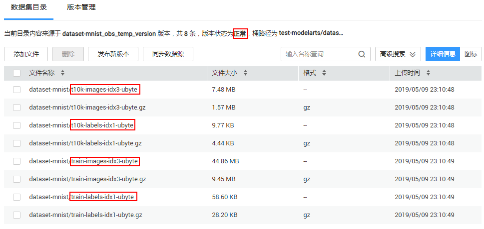
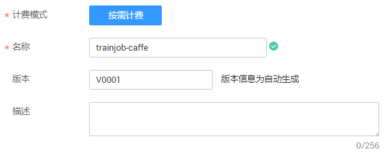
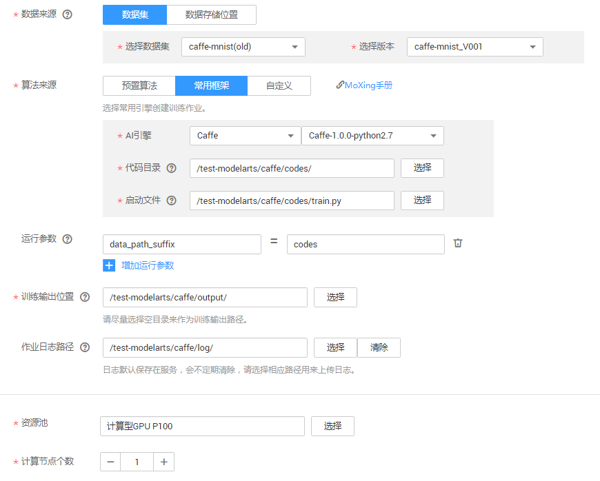

# 使用Caffe实现手写数字识别<a name="modelarts_10_0011"></a>

本章节介绍在ModelArts平台如何使用Caffe实现MNIST数据集的手写数字图像识别应用。

使用Caffe实现手写数字图像识别样例的操作流程如下所示。

1.  **[准备数据](#section2509659163212)**：数据集格式转换，然后上传至OBS桶中。
2.  **[编写模型](#section1128061013338)**：编写训练脚本，并编写prototxt文件定义网络结构和配置网络训练时各种参数，然后上传至OBS桶中。
3.  **[训练模型](#section715011268333)**：使用ModelArts服务，新建训练作业进行模型训练。

如果您了解MXNet引擎，且想基于此示例进行更多操作，请参见[进阶使用说明](#section17506103785011)了解更多。

## 准备数据<a name="section2509659163212"></a>

在ModelArts的“AI市场“中，默认提供了MNIST数据集，且名称为“Mnist-Data-Set“，您可以将数据集从“AI市场“导入到您的数据集中，以便用于模型训练和构建。

1.  登录ModelArts管理控制台，在左侧菜单栏中选择“AI市场“，进入AI市场主页。
2.  单击“数据集“页签进入数据集管理页面，找到MNIST数据集“Mnist-Data-Set“，单击数据集所在区域进入详情页面。

    **图 1**  找到MNIST数据集<a name="zh-cn_topic_0169506907_fig179701440141516"></a>  
    

3.  在详情页面中，单击“导入至我的数据集“。
4.  在“导入至我的数据集“对话框中，填写数据集“名称“及“存储路径“。名称可自行定义，存储路径选择已创建的OBS桶及文件夹，可参考图中示例，填写完成后单击“确定“。

    **图 2**  导入至我的数据集<a name="zh-cn_topic_0169506907_fig20316170162710"></a>  
    

5.  操作完成后，您可以前往“数据管理\>数据集“页面，查看数据导入情况。数据集的导入需要一定时间，大概几分钟，请耐心等待。

    在“数据集目录“中，当数据集版本状态为“正常“时，表示数据集已导入成功，您可以使用此数据集开始模型构建。数据集导入后，此示例数据将被拷贝至已设置好的OBS路径下。

    导入的MNIST数据集中，其中“.gz“文件为相同名称文件的压缩件，本次不会使用，本示例仅使用未压缩前的文件内容，包含的内容如下所示。

    -   “t10k-images-idx3-ubyte“：验证集，共包含10000个样本。
    -   “t10k-labels-idx1-ubyte“：验证集标签，共包含10000个样本的类别标签。
    -   “train-images-idx3-ubyte“：训练集，共包含60000个样本。
    -   “train-labels-idx1-ubyte“：训练集标签，共包含60000个样本的类别标签。

    **图 3**  数据集导入成功<a name="zh-cn_topic_0169506907_fig62924842420"></a>  
    


## 编写模型<a name="section1128061013338"></a>

数据完成准备后，您需要基于Caffe接口编写模型及其相关的配置文件。在本示例中，ModelArts提供了已编写好的训练脚本和相关配置文件。

-   “train.py“：训练脚本。
-   “lenet\_solver.prototxt“：配置训练时参数的prototxt文件。
-   “lenet\_train\_test.prototxt“：定义网络结构的prototxt文件。

1.  从github下载[ModelArts-Lab](https://github.com/huaweicloud/ModelArts-Lab)工程，解压缩文件，并在“ModelArts-Lab“工程的“ModelArts-Lab-master\\offical\_examples\\Using\_Caffe\_to\_Create\_a\_MNIST\_Dataset\_Recognition\_Application\\codes“目录下获取“train.py“、“lenet\_solver.prototxt“和“lenet\_train\_test.prototxt“文件。

    其中“train.py“存储在“codes“目录下，“lenet\_solver.prototxt“和“lenet\_train\_test.prototxt“存储在“train“目录下。

2.  将获取的文件上传至OBS中。例如“/test-modelarts/caffe/codes/“。

    > **说明：**   
    >由于配置文件和训练脚本已编写了绝对路径，建议您直接上传的OBS文件夹必须以“codes“命名。如果需要使用其他目录，请参考[进阶使用说明](#section17506103785011)指导修改对应配置文件。  


## 训练模型<a name="section715011268333"></a>

最后，利用已经上传的数据集和训练程序脚本完成模型训练，训练结束后，将在指定目录生成模型。

1.  在ModelArts管理控制台，进入“训练作业“页面，单击左上角的“创建“。
2.  在“创建训练作业“页面，参考[图4](#fig54731540185512)和[图5](#fig1647364017555)填写相关信息，然后单击“下一步“。

    “算法来源“：选择的代码目录必须包含“lenet\_solver.prototxt“和“lenet\_train\_test.prototxt“文件，且必须使用命名为“codes“文件目录。

    “运行参数“：“data\_path\_suffix“用于指定代码目录的最后一级目录名称，本示例为“data\_path\_suffix=codes“。

    “资源池“：由于训练时间较长，建议选择GPU资源池。

    **图 4**  创建训练作业-基本信息<a name="fig54731540185512"></a>  
    

    **图 5**  创建训练作业-详细参数<a name="fig1647364017555"></a>  
    

3.  在“规格确认“页面，确认训练作业的参数信息，确认无误后单击“立即创建“。
4.  在训练作业管理页面，当训练作业变为“运行成功“时，即完成了模型训练过程。如有问题，可单击作业名称，进入作业详情界面查看训练作业日志信息。

    系统将生成的模型存储在此训练输出位置下的final文件夹中，您可以在前往OBS查看生成的模型文件。本示例中，生成的模型存储在“/test-modelarts/caffe/output/final“目录下。

    > **说明：**   
    >训练作业需要花费一些时间，预计十几分钟。当训练时间超过一定时间（如1个小时），请及时手动停止，释放资源。否则会导致欠费，尤其对于使用GPU训练的模型项目。  


## 进阶使用说明<a name="section17506103785011"></a>

-   **Caffe执行命令解析**

    本示例通过python脚本调用caffe编译后的二进制文件启动训练作业，Caffe编译后的二进制文件路径为“/home/work/caffe/bin/caffe.bin“，对应文件“train.py“中代码如下。

    ```
    ```python
    cmd = '/home/work/caffe/bin/caffe.bin train  -solver {}'.format(solver_file)
    if gpu_nums:
    gpus = ','.join('%s' %id for id in range(gpu_nums))
    cmd += ' -gpu {}'.format(gpus)
    print('cmd: ' + cmd)
    os.system(cmd)
    ```
    ```

    其中“solver\_file“参数指定prototxt文件“lenet\_train\_test.prototxt“，“gpu\_nums“指定GPU显卡的数目，如果是CPU模式，则不添加该参数。

-   **代码和数据集下载说明**

    在运行Caffe代码时，需要配置某些文件的路径，例如在“lenet\_solver.prototxt“中配置了“lenet\_train\_test.prototxt“文件的路径，推荐使用绝对路径。ModelArts在代码运行时，会先将代码下载到容器中运行，其中容器可以理解为本地的Linux运行环境（以下说明中，将容器本地地址简称为本地路径）。因此，在配置文件路径时，需要配置为容器中的路径。

    -   **代码下载**

        在本示例中，代码文件存储在OBS路径“/test-modelarts/caffe/codes/“，而训练作业运行过程时，ModelArts会自动将代码下载至“/home/work/user-job-dir/codes/“目录下。

        OBS路径与容器本地路径对应关系如下所示，其中本地路径“/home/work/user-job-dir“为固定目录，“codes“对应OBS目录的最后一级目录名称。

        OBS代码路径结构

        ```
        test-modelarts
            |-caffe
                |-codes
                    |-train.py
                    |-lenet_solver.prototxt
                    |-lenet_train_test.prototxt
        ```

        本地代码路径结构

        ```
        home
            |-work
                |-user-job-dir         # "/home/work/user-job-dir"为固定路径，不会改变。
                    |-codes            # “代码目录”改变时，该级目录名称会根据OBS的最后一级目录名称相应改变
                        |-train.py
                        |-lenet_solver.prototxt
                        |-lenet_train_test.prototxt
        ```

    -   数据集下载

        在示例中选择的数据集OBS路径为“s3://test-modelarts/dataset-mnist“，平台不会自动下载数据集，需要用户调用“mox.file.copy\_parallel“下载数据集，对应“train.py“中相关代码如下所示。

        ```
        # 1. 创建本地数据集目录
        local_dataset_url = args.data_local_path
        if not os.path.exists(local_dataset_url):
        os.makedirs(local_dataset_url)
        print('local_dataset_url: ' + local_dataset_url)
        
        # 2. 检查数据集的OBS路径是否存在并下载
        if mox.file.exists(data_url):
        print("data obs url exists")
        mox.file.copy_parallel(src_url=data_url, dst_url=local_dataset_url)
        ```

        其中本地数据集目录对应参数“data\_local\_path“，默认值为“/home/work/dataset“。由于本地“/home/work“目录下存储空间有限，对于较大的数据集建议下载到“/cache“目录下。


-   **prototxt文件中固定路径**

    本示例在prototxt文件中填写某些固定路径，因此在填写参数时，需要注意和prototxt文件中路径的对应关系。

    -   **lenet\_train\_test.prototxt文件路径配置**

        在“lenet\_solver.prototxt“文件中，参数“net“对应的值为“lenet\_train\_test.prototxt“文件的本地路径。本示例的本地代码路径为“/home/work/user-job-dir/codes“，因此“lenet\_train\_test.prototxt“文件的本地路径“/home/work/user-job-dir/codes/lenet\_train\_test.prototxt“。

        ```
        # The train/test net protocol buffer definition
        net: "/home/work/user-job-dir/codes/lenet_train_test.prototxt"
        ```

        如果将“prototxt“文件上传到数据集的OBS路径下，并调用“mox.file.copy\_parallel“下载到“/home/work/dataset“路径下，则“lenet\_solver.prototxt“文件中配置如下所示。

        ```
        # The train/test net protocol buffer definition
        net: "/home/work/dataset/lenet_train_test.prototxt"
        ```

    -   **数据集的路径配置**

        在“lenet\_train\_test.prototxt“文件中，需要对训练集和测试集的数据集路径进行配置。而数据集需要用户调用“mox.file.copy\_parallel“下载，在本示例中“data\_local\_path“采用默认值“/home/work/dataset“，则数据集被下载到“/home/work/dataset“目录下。

        数据集OBS路径结构：

        ```
        test-modelarts
            |-caffe
                |-caffe_mnist_data
                    |-mnist_train_lmdb
                    ...
                    |-mnist_test_lmdb
                    ...
        ```

        数据集本地路径结构：

        ```
        home
            |-work
                |-dataset
                    |-mnist_train_lmdb
                    ...
                    |-mnist_test_lmdb
                    ...
        ```

        “lenet\_train\_test.prototxt“文件中数据集的路径配置，如下所示。

        ```
        name: "LeNet"
        layer {
          name: "mnist"
          type: "Data"
          top: "data"
          top: "label"
          include {
            phase: TRAIN
          }
          transform_param {
            scale: 0.00390625
          }
          data_param {
            source: "/home/work/dataset/mnist_train_lmdb" # 训练集数据路径
            batch_size: 1024
            backend: LMDB
          }
        }
        layer {
          name: "mnist"
          type: "Data"
          top: "data"
          top: "label"
          include {
            phase: TEST
          }
          transform_param {
            scale: 0.00390625
          }
          data_param {
            source: "/home/work/dataset/mnist_test_lmdb" # 测试集数据路径
            batch_size: 512
            backend: LMDB
          }
        }
        ... ...
        ```

    -   **本地保存模型路径**

        在“lenet\_solver.prototxt“中配置模型的保存路径和保存模型文件的名称，本示例中本地保存模型的路径为“/home/work/lenet\_mnist/“，模型名称为“mnist\_lenet“，代码如下所示。

        ```
        snapshot_prefix: "/home/work/lenet_mnist/mnist_lenet"
        ```

        将模型保存到OBS，需要用户调用“mox.file.copy\_parallel“将本地保存模型拷贝到OBS中，因此在调用API执行拷贝时，参数“model\_local\_path“要和模型的本地保存路径相对应，即和“lenet\_solver.prototxt“中“snapshot\_prefix“指定路径相对应，相关代码如下所示。

        ```
        # 定义保存模型函数，默认10分钟保存一次，可以通过interval参数设置保存间隔
        def save_inter_model(src_url, dst_url, interval=10):
          save_num = 1
          while True:
            time.sleep(interval * 60)
            model_dst_url = os.path.join(dst_url, str(save_num))
            print("copy inter model from {} to {}".format(str(src_url), str(model_dst_url)))
            mox.file.copy_parallel(src_url=src_url, dst_url=model_dst_url)
            save_num = save_num + 1
        
        # 启动单独进程，将训练过程中保存模型，拷贝到OBS中。方便在精度满足要求时，可以停止训练
        inter_save_process = multiprocessing.Process(target=save_inter_model, args=(model_local_output, model_obs_output, 1))
        inter_save_process.start()
        
        # 执行训练过程
        cmd = '/home/work/caffe/bin/caffe.bin train  -solver {}'.format(solver_file)
        if gpu_nums:
          gpus = ','.join('%s' %id for id in range(gpu_nums))
          cmd += ' -gpu {}'.format(gpus)
        print('cmd: ' + cmd)
        os.system(cmd)
        
        # 停止训练过程中拷贝操作的进程
        inter_save_process.terminate()
        
        # 将训练结束后最终得到的模型保存到OBS中
        model_obs_output = os.path.join(model_obs_output, "final")
        print("model_obs_output: " + model_obs_output)
        if not mox.file.exists(model_obs_output):
          mox.file.make_dirs(model_obs_output)
        mox.file.copy_parallel(src_url=model_local_output, dst_url=model_obs_output)
        ```

    -   **CPU模式下运行**

        本示例使用GPU资源池进行模型训练。您也可以选择CPU资源池，但是相对而言，CPU的训练速度将会慢很多。如果选择CPU训练模型，需要将“lenet\_solver.prototxt“文件中“solver\_mode“改成“CPU“。


