# 找云宝（使用自动学习实现物体检测应用）

针对业务开发者，ModelArts提供了自动学习功能，无需关注模型开发、参数调整等开发细节，仅需三步（数据标注、自动训练、部署上线），即可完成一个AI开发项目。

本章节提供了一个“找云宝”样例（“云宝”是华为云的吉祥物），帮助您快速熟悉ModelArts自动学习的使用过程。此样例为“物体检测”类别项目，通过预置的云宝图像数据集，自动训练并生成检测模型，同时将生成的模型部署为在线服务。部署完成后，用户可通过在线服务识别输入图片是否包含云宝。

开始使用样例前，请仔细阅读[准备工作](#zh-cn_topic_0168474773_section12968454194113)罗列的要求，提前完成准备工作。使用自动学习功能完成模型构建的步骤如下所示：

-   [步骤1：准备数据，从市场导入数据管理](#zh-cn_topic_0168474773_section1620725194417)
-   [步骤2：创建物体检测项目](#zh-cn_topic_0168474773_section112002574416)
-   [步骤3：数据标注](#zh-cn_topic_0168474773_section42202510442)
-   [步骤4：自动训练，生成模型](#zh-cn_topic_0168474773_section192312513442)
-   [步骤5：将模型部署上线为在线服务](#zh-cn_topic_0168474773_section42462514414)
-   [步骤6：测试服务](#zh-cn_topic_0168474773_section1178563331)

## 准备工作

-   已注册华为云账号，且在使用ModelArts前检查账号状态，账号不能处于欠费或冻结状态。
-   获取此账号的“AK/SK“，并在ModelArts全局配置中填写此信息，完成配置。详细操作指导请参见[获取访问密钥并完成ModelArts配置](https://support.huaweicloud.com/prepare-modelarts/modelarts_08_0002.html)。
-   登录OBS服务，创建桶和文件夹，用于存放样例数据集。创建名称为“test-modelarts“OBS桶，名称为“dataset-yunbao“文件夹。

    创建OBS桶和文件夹的操作指导请参见[创建桶](https://support.huaweicloud.com/usermanual-obs/zh-cn_topic_0045829050.html)和[新建文件夹](https://support.huaweicloud.com/usermanual-obs/zh-cn_topic_0045829103.html)。由于ModelArts在“华北-北京一“区域下使用，为保证数据能正常访问，请务必在“华北-北京一“区域下创建OBS桶。

## 步骤1：准备数据，从市场导入数据管理

由于ModelArts在“AI市场“中提供了云宝的示例数据集，命名为“Yunbao-Data-Custom“，因此，本文的操作示例使用此数据集进行模型构建。您需要执行如下操作，将数据集从市场导入到您的数据集中，以便用于模型训练和构建。

如果您想使用自己的数据集，可跳过此步骤，直接将数据上传至OBS文件夹中，并在[步骤2：创建物体检测项目](#zh-cn_topic_0168474773_section112002574416)操作中直接选择此目录即可。

1.  登录[ModelArts管理控制台](https://console.huaweicloud.com/modelarts/?region=cn-north-1#/manage/dashboard)，在左侧菜单栏中选择“AI市场“，进入AI市场主页。
2.  单击“数据集“页签进入数据集管理页面，找到云宝数据集“Yunbao-Data-Custom“，单击数据集所在区域进入详情页面。

    **图 1**  找到云宝数据集  
    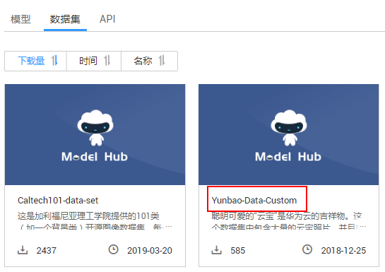

3.  在详情页面中，单击“导入至我的数据集“。

    为避免数据重复或覆盖，建议将一个数据集导入一个文件夹中。

4.  在“导入至我的数据集“对话框中，填写数据集“名称“及“存储路径“。名称可自行定义，存储路径选择[准备工作](#zh-cn_topic_0168474773_section12968454194113)中已创建的OBS桶及文件夹。填写完成后单击“确定“。

    **图 2**  导入至我的数据集  
    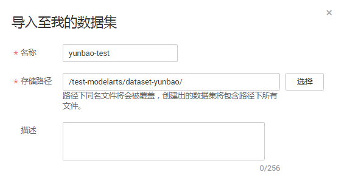

5.  （可选）如果您的OBS未开启多版本控制功能，此处将弹出“多版本控制“对话框，提示您启用。由于ModelArts创建数据集时，必须开启OBS的多版本控制功能。单击“确定“启用多版本控制功能。

    **图 3**  启用多版本控制  
    

6.  操作完成后，您可以前往“数据管理\>数据集“页面，查看数据导入情况。数据集的导入需要一定时间，大概几分钟，请耐心等待。

    在“数据集目录“中，当数据集版本状态为“正常“时，表示数据集已导入成功，您可以使用此数据集开始模型构建。数据集导入后，此示例数据将被拷贝至步骤[4](#zh-cn_topic_0168474773_li113453011212)中的OBS路径下。

    **图 4**  数据集导入成功  
    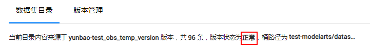

    导入的数据集分为2个子目录，分别为“eval“和“train“。“train“存储的数据用于模型训练，“eval“存储的数据可用于模型的预测。

## 步骤2：创建物体检测项目

1.  在ModelArts管理控制台，单击左侧导航栏“自动学习“。
2.  在“物体检测“方框中单击“创建项目“，在“创建物体检测项目“页面中，填写“项目名称“，选择训练数据，云宝数据集OBS路径为“/test-modelarts/dataset-yunbao/train/“。

    > **说明：**   
    >云宝数据集有“eval“和“train“两个目录，请选择“train“目录下的数据进行训练，否则会提示“OBS存在非法数据的错误“，导致无法创建项目。  

    **图 5**  创建物体检测项目  
    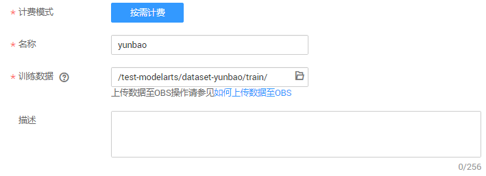

3.  单击“创建项目“，完成物体检测项目创建。项目创建成功后，页面自动跳转至“自动学习“页面，并自动执行数据源同步操作。

## 步骤3：数据标注

数据标注，针对物体检测项目，即在已有数据集图像中，标注出物体位置，并为其打上标签。标注好的数据用于模型训练。云宝数据集中，已标注部分数据，还有部分数据未标注，您可以选择未标注数据进行试用。

1.  在自动学习页面，单击项目名称，进入自动学习模型构建的主页面。

    自动学习项目创建时，会自动执行数据源同步操作。由于数据源同步需要一定时间，如果出现同步失败，可单击“同步数据源“手动执行。

2.  在“数据标注“页面单击“未标注“页签，此页面展示所有未标注的图片数据。单击任意一张图片，进入图片标注界面。
3.  用鼠标框选图片中的云宝所在区域，然后在弹出的对话框中输入标签名称，例如此示例中的“yunbao“，按“Enter“键完成此图片的添加。标注完成后，左侧图片目录中此图片的状态将显示为“已标注“。

    您可以在左侧图片目录中，选择其他图片，重复上述操作继续进行图片标注。如果一张图片有多个云宝，您可以标注多处。建议将数据集中所有图片都标注完成，这样能得到一个效果比较好的模型。

    **图 6**  物体检测图片标注  
    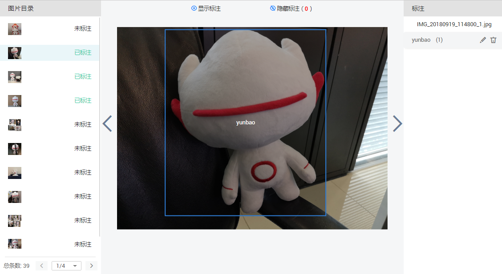

4.  当图片目录中所有图片都完成标注后，单击右上角“保存并返回“进入数据标注页面。您可以在“已标注“页签下查看已完成标注的图片，并通过右侧的标签信息，了解当前已完成的标签名称和标签数量。

## 步骤4：自动训练，生成模型

1.  完成数据标注后，在“数据标注“页面设置训练参数，首次训练建议训练时长不要超过1小时，后面可以根据训练精度调整训练时长。也可单击“高级设置“，对推理时间和训练版本进行设置。

    由于本示例为首次训练，训练时长小于1小时，不开启高级设置。

    **图 7**  设置训练参数  
    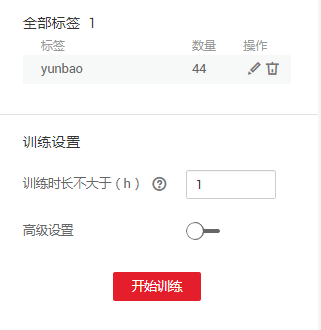

2.  单击“开始训练“，开始模型的自动训练。训练时间相对较长，建议您耐心等待。如果关闭或退出此页面，系统仍然在执行训练操作。

    训练完成后，您可以在界面中查看训练详情，如“准确率“、“评估结果“、“训练参数“、“分类统计表“等

    **图 8**  开始模型训练  
    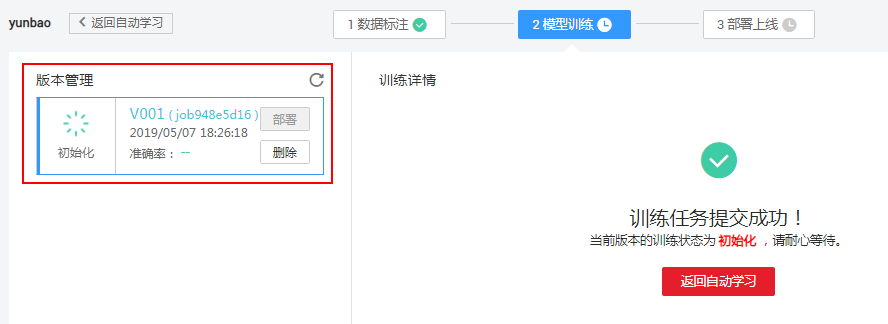

## 步骤5：将模型部署上线为在线服务

1.  在“模型训练“页签中，待训练状态变为“运行成功“，单击“版本管理“区域中的“部署“，开始将物体检测模型部署上线至在线服务。

    **图 9**  开始部署上线  
    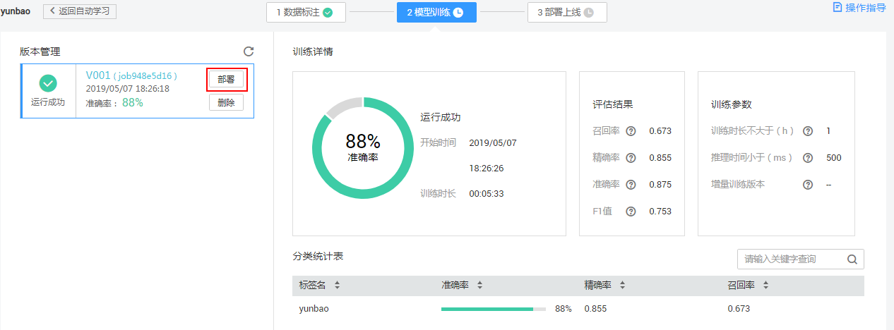

2.  启动部署上线后，系统自动跳转至部署上线页面。此页面将呈现模型部署上线的进度和状态。

    部署上线将耗费较多时间，请您耐心等待。部署完成后，版本管理区域的状态将变更为“部署成功“。

    **图 10**  部署上线过程  
    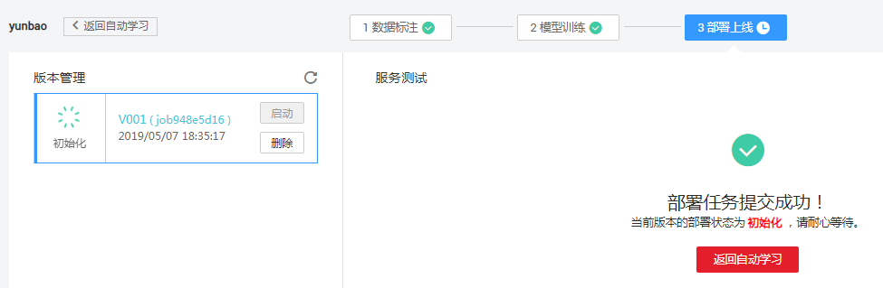

## 步骤6：测试服务

模型部署完成后，您可添加图片进行测试。

1.  在“部署上线“界面，选择状态为“部署成功“的服务版本，在“服务测试“区域单击“上传“。

    **图 11**  上传图片  
    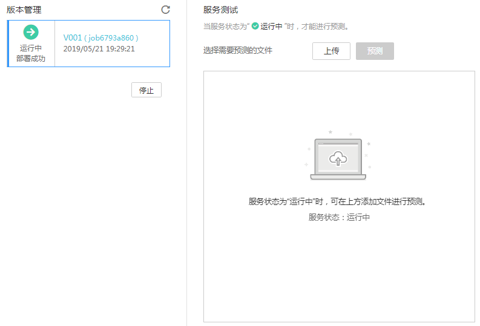

2.  从本地环境选择一张图片，此图片中包含云宝。然后单击“预测“进行测试。

    预测完成后，右侧“预测结果“区域输出标签名称“yunbao“，以及位置坐标和检测的评分。预测结果中，“detection\_boxes“表示物体所在位置坐标，“detection\_scores“表示检测评分，表示坐标内图像是云宝的概览评分。

    如模型准确率不满足预期，可在“数据标注“步骤中添加图片并进行标注，重新进行模型训练及部署上线。

    > **说明：**   
    >由于“运行中“的在线服务将持续耗费资源，如果不需再使用此在线服务，建议在版本管理区域，单击“停止“，即可停止在线服务的部署，避免产生不必要的费用。如果需要继续使用此云宝检测的服务，可单击“启用“恢复。  

    **图 12**  测试结果  
    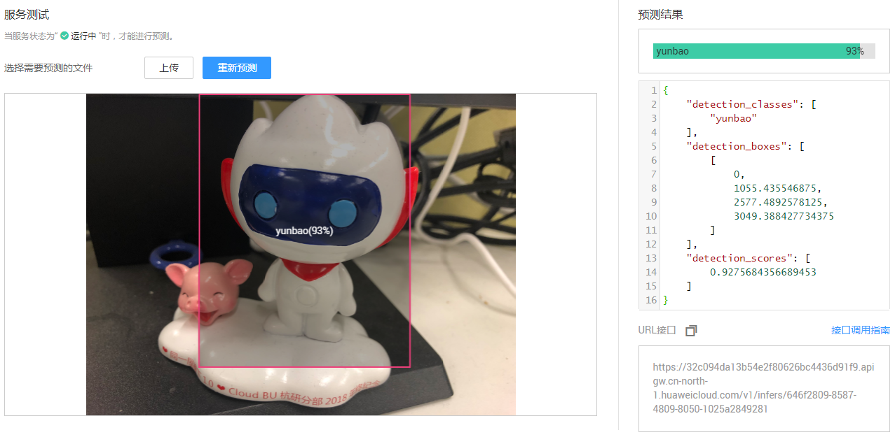

