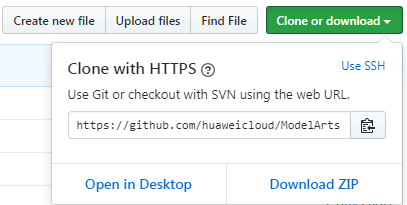
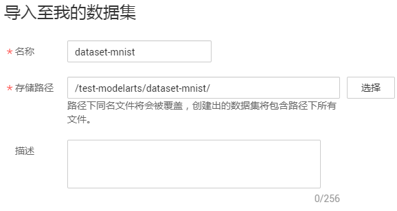
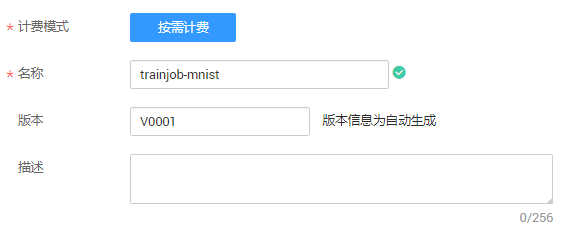
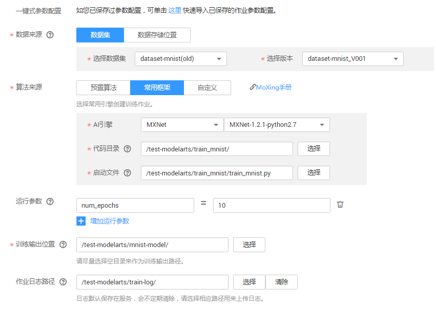
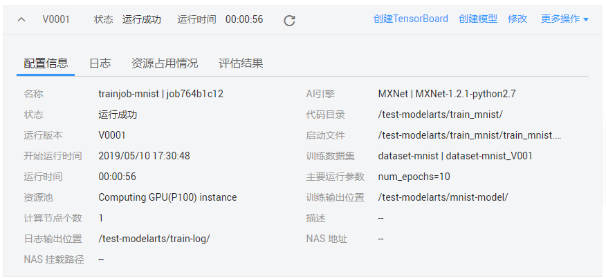
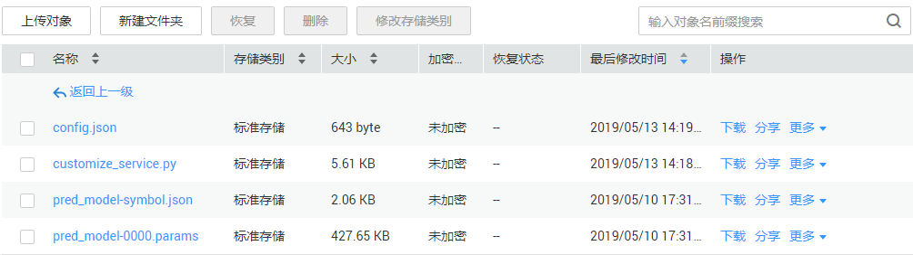
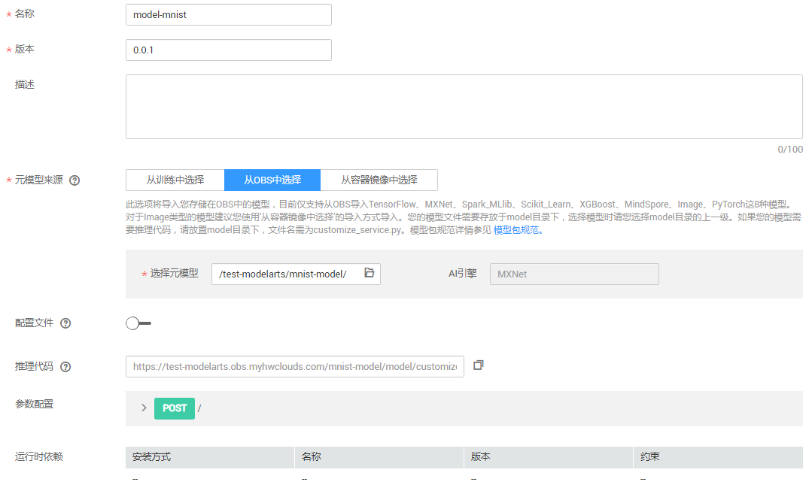
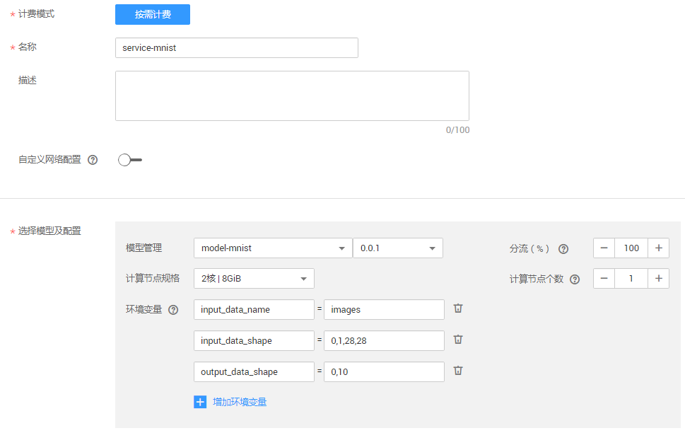

# 使用MXNet实现手写数字识别

ModelArts为AI工程师提供了一站式AI开发全流程管理能力，AI工程师可以从数据准备、模型开发、模型训练、模型部署，一站式完成整个AI过程。兼容业界主流引擎，兼容用户习惯，同时，提供了自研的MoXing深度学习框架，提升算法开发效率和训练速度。

本章节提供了使用MXNet实现手写数字图像识别应用的示例，帮助您快速梳理ModelArts的AI开发全流程。

MNIST是一个手写体数字识别数据集，常被用作深度学习的入门样例。本示例将针对MNIST数据集，使用MXNet原生接口编写的模型训练脚本（ModelArts默认提供），在ModelArts中完成模型训练，并将此模型部署为在线服务。部署完成后，用户可通过在线服务识别输入图片中的数字。

开始使用样例前，请仔细阅读[准备工作](#zh-cn_topic_0168474775_section12968454194113)罗列的要求，提前完成准备工作。本示例模型构建的步骤如下所示：

-   [步骤1：准备数据](#zh-cn_topic_0168474775_section1620725194417)
-   [步骤2：训练模型](#zh-cn_topic_0168474775_section10578162455118)
-   [步骤3：编写推理代码和配置文件，并上传至模型所在路径](#zh-cn_topic_0168474775_section4777204621417)
-   [步骤4：导入模型](#zh-cn_topic_0168474775_section11162185717358)
-   [步骤5：部署上线](#zh-cn_topic_0168474775_section5256839360)
-   [步骤6：测试服务](#zh-cn_topic_0168474775_section83221114133613)
-   [步骤7：清除相应资源，避免产生费用](#zh-cn_topic_0168474775_section411272110528)

## 准备工作

-   已注册华为云账号，且在使用ModelArts前检查账号状态，账号不能处于欠费或冻结状态。
-   获取此账号的“AK/SK“，并在ModelArts全局配置中填写此信息，完成配置。详细操作指导请参见[获取访问密钥并完成ModelArts配置](https://support.huaweicloud.com/prepare-modelarts/modelarts_08_0002.html)。
-   已在OBS服务中创建桶和文件夹，用于存放样例数据集以及模型。如下示例中，请创建命名为“test-modelarts“的桶，并创建如[表1](#zh-cn_topic_0168474775_table2061005120337)所示的文件夹。

    创建OBS桶和文件夹的操作指导请参见[创建桶](https://support.huaweicloud.com/usermanual-obs/zh-cn_topic_0045829050.html)和[新建文件夹](https://support.huaweicloud.com/usermanual-obs/zh-cn_topic_0045829103.html)。由于ModelArts在“华北-北京一“区域下使用，为保证数据能正常访问，请务必在“华北-北京一“区域下创建OBS桶。

    **表 1**  文件夹列表

    
    <table><thead align="left"><tr id="zh-cn_topic_0168474775_row1860945116333"><th class="cellrowborder" valign="top" width="31.180000000000003%" id="mcps1.2.3.1.1">
文件夹名称

    </th>
    <th class="cellrowborder" valign="top" width="68.82000000000001%" id="mcps1.2.3.1.2">
用途

    </th>
    </tr>
    </thead>
    <tbody><tr id="zh-cn_topic_0168474775_row06099518334"><td class="cellrowborder" valign="top" width="31.180000000000003%" headers="mcps1.2.3.1.1 ">
“dataset-mnist”

    </td>
    <td class="cellrowborder" valign="top" width="68.82000000000001%" headers="mcps1.2.3.1.2 ">
用于存储数据集。

    </td>
    </tr>
    <tr id="zh-cn_topic_0168474775_row1660955118338"><td class="cellrowborder" valign="top" width="31.180000000000003%" headers="mcps1.2.3.1.1 ">
“train_mnist”

    </td>
    <td class="cellrowborder" valign="top" width="68.82000000000001%" headers="mcps1.2.3.1.2 ">
用于存储训练脚本。

    </td>
    </tr>
    <tr id="zh-cn_topic_0168474775_row11609185115337"><td class="cellrowborder" valign="top" width="31.180000000000003%" headers="mcps1.2.3.1.1 ">
“mnist-model”

    </td>
    <td class="cellrowborder" valign="top" width="68.82000000000001%" headers="mcps1.2.3.1.2 ">
用于存储训练输出的模型和预测文件。

    </td>
    </tr>
    <tr id="zh-cn_topic_0168474775_row13610151153318"><td class="cellrowborder" valign="top" width="31.180000000000003%" headers="mcps1.2.3.1.1 ">
“train-log”

    </td>
    <td class="cellrowborder" valign="top" width="68.82000000000001%" headers="mcps1.2.3.1.2 ">
用于存储训练作业的日志。

    </td>
    </tr>
    </tbody>
    </table>

-   针对此示例，ModelArts提供了部署上线需使用的训练脚本、推理代码和配置文件。请获取示例文件并上传OBS指定路径，详细请参见[表2](#zh-cn_topic_0168474775_table8311142123817)。

    1.  在Github的[ModelArts-Lab](https://github.com/huaweicloud/ModelArts-Lab)工程中，单击“Clone or download“，然后在如下页面中单击“Download Zip“，下载工程。

        **图 1**  下载ModelArts-Lab  
        

    2.  下载完成后，解压缩“ModelArts-Lab-master.zip“文件，然后在“\\ModelArts-Lab-master\\offical\_examples\\Using\_MXNet\_to\_Create\_a\_MNIST\_Dataset\_Recognition\_Application\\codes“目录中获取到训练脚本“train\_mnist.py“、推理代码“customize\_service.py“和配置文件“config.json“，并上传至对应OBS路径。上传文件至OBS的操作指导请参见[上传文件](https://support.huaweicloud.com/usermanual-obs/zh-cn_topic_0045829661.html)。

    **表 2**  上传示例文件至OBS

    
    <table><thead align="left"><tr id="zh-cn_topic_0168474775_row173128427385"><th class="cellrowborder" valign="top" width="28.342834283428342%" id="mcps1.2.4.1.1">
文件名称

    </th>
    <th class="cellrowborder" valign="top" width="20.282028202820282%" id="mcps1.2.4.1.2">
描述

    </th>
    <th class="cellrowborder" valign="top" width="51.375137513751376%" id="mcps1.2.4.1.3">
上传至如下OBS路径中

    </th>
    </tr>
    </thead>
    <tbody><tr id="zh-cn_topic_0168474775_row193121442183816"><td class="cellrowborder" valign="top" width="28.342834283428342%" headers="mcps1.2.4.1.1 ">
“train_mnist.py”

    </td>
    <td class="cellrowborder" valign="top" width="20.282028202820282%" headers="mcps1.2.4.1.2 ">
训练脚本。

    </td>
    <td class="cellrowborder" valign="top" width="51.375137513751376%" headers="mcps1.2.4.1.3 ">
“test-modelarts/train_mnist”

    </td>
    </tr>
    <tr id="zh-cn_topic_0168474775_row23121342143817"><td class="cellrowborder" valign="top" width="28.342834283428342%" headers="mcps1.2.4.1.1 ">
“customize_service.py”

    </td>
    <td class="cellrowborder" valign="top" width="20.282028202820282%" headers="mcps1.2.4.1.2 ">
推理代码。

    </td>
    <td class="cellrowborder" rowspan="2" valign="top" width="51.375137513751376%" headers="mcps1.2.4.1.3 ">
“test-modelarts/mnist-model/model”

    
 说明： 

请在训练作业完成后，再执行上传操作。详细操作指导请参见<a href="#zh-cn_topic_0168474775_section4777204621417">步骤3：编写推理代码和配置文件，并上传至模型所在路径</a>。

    

    

    </td>
    </tr>
    <tr id="zh-cn_topic_0168474775_row13312114215389"><td class="cellrowborder" valign="top" headers="mcps1.2.4.1.1 ">
“config.json”

    </td>
    <td class="cellrowborder" valign="top" headers="mcps1.2.4.1.2 ">
配置文件。

    </td>
    </tr>
    </tbody>
    </table>

## 步骤1：准备数据

在ModelArts的“AI市场“中，默认提供了MNIST数据集，命名为“Mnist-Data-Set“，您可以将数据集从“AI市场“导入到您的数据集中，以便用于模型训练和构建。

1.  登录[ModelArts管理控制台](https://console.huaweicloud.com/modelarts/?region=cn-north-1#/manage/dashboard)，在左侧菜单栏中选择“AI市场“，进入AI市场主页。
2.  单击“数据集“页签进入数据集管理页面，找到MNIST数据集“Mnist-Data-Set“，单击数据集所在区域进入详情页面。

    **图 2**  找到MNIST数据集  
    

3.  在详情页面中，单击“导入至我的数据集“。
4.  在“导入至我的数据集“对话框中，填写数据集“名称“及“存储路径“。名称可自行定义，存储路径选择[准备工作](#zh-cn_topic_0168474775_section12968454194113)中已创建的OBS桶及文件夹。填写完成后单击“确定“。

    **图 3**  导入至我的数据集  
    

5.  （可选）如果您的OBS未开启多版本控制功能，此处将弹出“多版本控制“对话框，提示您启用。由于ModelArts创建数据集时，必须开启OBS的多版本控制功能。单击“确定“启用多版本控制功能。

    **图 4**  启用多版本控制  
    

6.  操作完成后，您可以前往“数据管理\>数据集“页面，查看数据导入情况。数据集的导入需要一定时间，大概几分钟，请耐心等待。

    在“数据集目录“中，当数据集版本状态为“正常“时，表示数据集已导入成功，您可以使用此数据集开始模型构建。数据集导入后，此示例数据将被拷贝至步骤[4](#zh-cn_topic_0168474775_li113453011212)中的OBS路径下。

    导入的MNIST数据集中，其中“.gz“文件为相同名称文件的压缩件，本次不会使用，本示例仅使用未压缩前的文件内容，包含的内容如下所示。

    -   “t10k-images-idx3-ubyte“：验证集，共包含10000个样本。
    -   “t10k-labels-idx1-ubyte“：验证集标签，共包含10000个样本的类别标签。
    -   “train-images-idx3-ubyte“：训练集，共包含60000个样本。
    -   “train-labels-idx1-ubyte“：训练集标签，共包含60000个样本的类别标签。

    **图 5**  数据集导入成功  
    

## 步骤2：训练模型

数据准备完成后，您可以创建一个训练作业，选用MXNet引擎，基于已上传的“train\_mnist.py“训练脚本，并最终生成一个可用的模型。本示例已提供编码完成的脚本（基于MXNet引擎的原生接口），如果使用自行编写的代码，请使用ModelArts支持的引擎类型及其对应版本的接口，并满足其要求。

1.  在ModelArts管理控制台，在左侧导航栏中选择“训练作业“，进入“训练作业“管理页面。
2.  单击“创建“，进入“创建训练作业“页面。
3.  在“创建训练作业“页面，填写相关信息，参数填写指导请参见如下步骤。
    1.  在基本信息区域，“计费模式“和“版本“为系统自动生成，不需修改。请根据界面提示填写“名称“和“描述“。

        **图 6**  填写名称和描述  
        

    2.  在参数配置区域，选择“数据来源“，设置“算法来源“、“运行参数“、“训练输出位置“和“作业日志路径“。

        “数据来源“：由于数据已导入ModelArts，系统会自动选择已有的数据集。如果没有自动选择，请单击下拉框选择MNIST数据集的名称和版本。

        “算法来源“：选择常用框架，在“AI引擎“右侧下拉框中选择“MXNet“，并选择“MXNet-1.2.1-python2.7“版本。选择“代码目录“及“启动文件“。此示例中，“代码目录“的OBS路径为“/test-modelarts/train\_mnist“，“启动文件“的OBS路径为“/test-modelarts/train\_mnist/train\_mnist.py“。训练脚本“train\_mnist.py“上传说明请参见[准备工作](#zh-cn_topic_0168474775_section12968454194113)。

        “运行参数“：单击“增加运行参数“，增加“max\_epoches=10“参数。针对“max\_epoches“参数，1个epoch代表整个数据集训练一遍，此运行参数表示训练10个epoch，数值可更改，不填写时使用默认值（默认值为100），epoches值越大训练时间越长。

        “训练输出位置“：训练作业生成的模型和预测文件的存储路径。使用准备工作中已创建好的“mnist-model“文件夹。如果没有可用文件夹，您可以单击“选择“，在弹出对话框中新建文件夹。

        “作业日志路径“：从已有的OBS桶中选择日志存储路径。使用准备工作中已创建好的“train-log“文件夹。如果没有可用文件夹，您可以单击“选择“，在弹出对话框中新建文件夹。

        **图 7**  参数配置  
        

    3.  在资源设置区域，单击资源池文本框右侧的“选择“，选择“公共资源池“的“Computing GPU\(P100\) instance“，“计算节点个数“设置为“1“。

        > **说明：**   
        >由于MNIST数据集数据较多，为提升训练效率，操作示例选择GPU训练。但是，GPU的费用高于CPU，请根据实际情况选择可用的资源池。  

        **图 8**  设置使用的资源  
        

    4.  单击“下一步“完成信息填写。

4.  在“规格确认“页面，确认训练作业的参数信息，确认无误后单击“立即创建“。
5.  在“训练作业“管理页面，可以查看新建训练作业的状态。训练作业的创建和运行需要一些时间，预计十几分钟，当状态变更为“运行成功“时，表示训练作业

    您可以单击训练作业的名称，可进入此作业详情页面，了解训练作业的“配置信息“、“日志“和“资源占用情况“等信息。在“训练输出位置“所在的OBS路径中，即“/test-modelarts/mnist-model/“路径，可以获取到生成的模型文件。

    **图 9**  训练作业详情  
    

## 步骤3：编写推理代码和配置文件，并上传至模型所在路径

参考[准备工作](#zh-cn_topic_0168474775_section12968454194113)中的指导，获取推理代码“customize\_service.py“和配置文件“config.json“。此推理代码和配置文件是ModelArts提供的示例。

在[步骤2：训练模型](#zh-cn_topic_0168474775_section10578162455118)中，训练作业生成的模型存储在“test-modelarts/mnist-model“路径下，且系统将自动生成“model“文件夹，模型相关的文件存储在此目录下。将获取的“customize\_service.py“和“config.json“文件，上传至“model“文件夹下。

> **说明：**   
>如果训练作业运行多次，将“训练输出位置“生成不同的版本，即“mnist-model“目录下将生成多种版本的目录，如“V0001“、“V0002“，请基于训练作业的版本，将文件上传至对应版本下的“model“文件夹内。  

前往OBS管理控制台，找到“test-modelarts“桶，然后进入“test-modelarts/mnist-model/model“路径，执行“上传对象“的操作。OBS的上传操作指导，请参见[上传文件](https://support.huaweicloud.com/usermanual-obs/zh-cn_topic_0045829661.html)。

**图 10**  上传推理代码和配置文件  

## 步骤4：导入模型

训练完成的模型还是存储在OBS路径中，您可以将此模型导入到ModelArts中进行管理和部署。

1.  在ModelArts管理控制台中，单击左侧导航栏中的“模型管理“，进入“模型管理“页面。
2.  在“模型管理“页面，单击“导入“。
3.  在“导入模型“页面，设置相关参数，然后单击“立即创建“。

    设置模型的“名称“和“版本“。

    “元模型来源“：单击“从OBS中选择“页签，在“选择元模型“参数中，设置此模型所在的OBS路径，如“test-modelarts/mnist-model“，“AI引擎“会根据选择路径下的模型文件自动选择，当前示例使用的是“MXNet“引擎。

    > **说明：**   
    >选择模型所在路径时，请务必选择“model“文件夹的父目录，如果选择到“model“文件夹，将导致系统无法自动识别模型及配置文件，无法导入模型。  

    “推理代码“：系统将根据选择的原模型信息，自动生成对应推理代码路径及文件名称。

    **图 11**  导入模型  
    

4.  模型导入完成后，系统将自动跳转至模型管理页面。您可以在模型管理页面查看已导入的模型及其版本。

## 步骤5：部署上线

模型导入完成后，您可以将模型部署上线，可部署为“在线服务“、“批量服务“或“边缘服务“。如下操作步骤以部署为在线服务为例。

1.  在“模型管理“页面，单击操作列的“部署“，然后在下拉框中选择“在线服务“，进入“部署“页面。
2.  在“部署“页面中，设置相关参数，然后单击“下一步“。

    设置在线服务的“名称“。在“选择模型及配置“区域中，系统将在“模型管理“右侧自动选择步骤[步骤4：导入模型](#zh-cn_topic_0168474775_section11162185717358)中的模型及其版本，在“计算节点规格“右侧下拉框中选择使用的资源，本示例选用“2核 | 8GiB“资源部署在线服务。

    环境变量：在本示例中，由于推理代码和配置文件需要补充三个信息，请参考如下指导补充环境变量。

    -   “input\_data\_name“：参数值必须是images。针对自己开发训练脚本的场景，此参数是必须设置的。您可以在导入模型时设置参数，也可以写到推理代码中。
    -   “input\_data\_shape“：代表NCHW。本示例的数值为“0,1,28,28“，表示设置了输入图片的规则，其中，输入预测图片大小必须是“28px\*28px“。
    -   “output\_data\_shape“：置信度。本示例指定范围为“0～10“。表示输出结果会显示“0～10“中10个类别，属于每一个类别的概率。

    **图 12**  部署为在线服务  
    

3.  在“规格确认“页面，确认信息完毕后，单击“立即创建“。
4.  在“部署上线\>在线服务“页面，您可以查看在线服务的相关信息。由于模型部署上线需要花费一些时间，请耐心等待几分钟。当在线服务的状态为“运行中“时，表示在线服务已部署完成。

## 步骤6：测试服务

在线服务部署成功后，您可以进入在线服务，发起预测请求进行测试。

1.  在“在线服务“管理页面，单击在线服务名称，进入在线服务详情页面。
2.  在线服务详情页面中，单击“预测“页签，进入预测页面。
3.  在“选择预测图片文件“右侧，单击“...“按钮，上传一张黑底白字的图片，然后单击“预测“。

    预测完成后，预测结果显示区域将展示预测结果，根据预测结果内容，可识别出此图片的数字是“8“的概率为“1“。

    > **说明：**   
    >-   由于推理代码和配置文件中已指定图片要求，用于预测的图片，大小必须为“28px\*28px“，且图片必须是黑底白字。  
    >-   建议不要使用数据集中自带的图片，可以使用Windows自带的画图工具绘制一张。  

    **图 13**  预测结果  
    

## 步骤7：清除相应资源，避免产生费用

为避免产生不必要的费用，在完成试用后，建议您删除相关资源，如在线服务、训练作业、数据集及其OBS目录。

-   删除在线服务：在“在线服务“页面，单击操作列的“更多\>删除“。
-   删除训练作业：在“训练作业“页面，单击操作列的“删除“。
-   删除数据集：在“数据管理\>数据集“页面，在“dataset-mnist“数据集右侧，单击删除按钮。在弹出的对话框中，勾选“删除数据集同时删除桶内文件“，避免OBS因存储数据而继续收费。

    **图 14**  删除数据集  
    

-   删除训练脚本和模型等文件：进入OBS管理控制台，删除“train\_mnist“、“mnist-model“、“train-log“文件夹及数据，然后再删除“test-modelarts“的桶。

