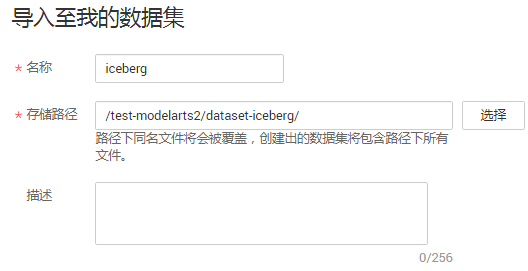
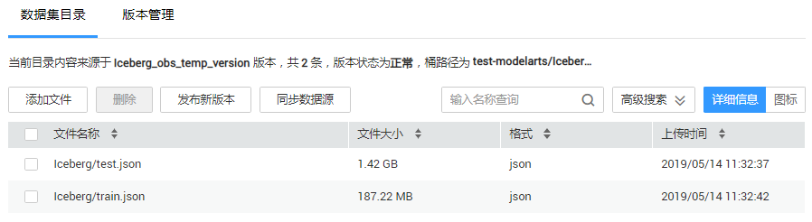
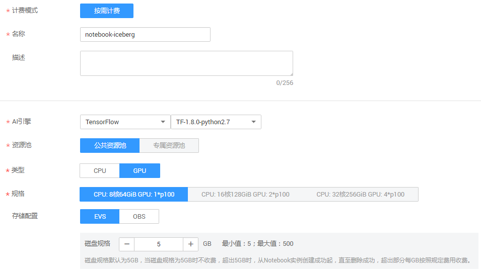
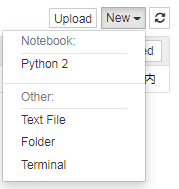
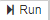
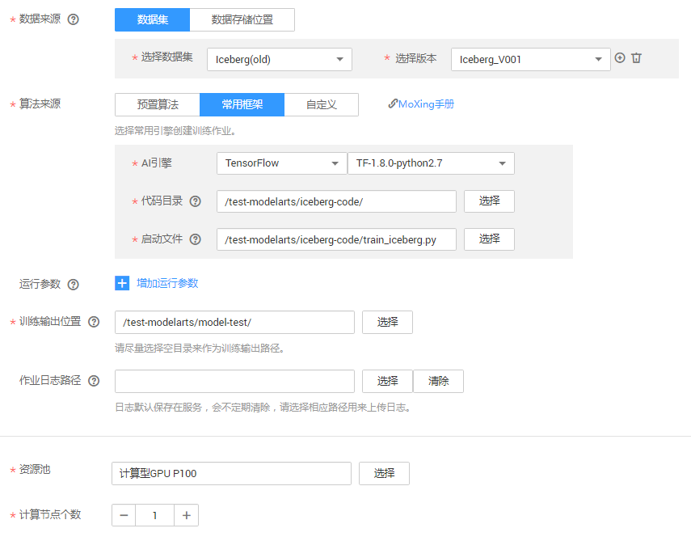
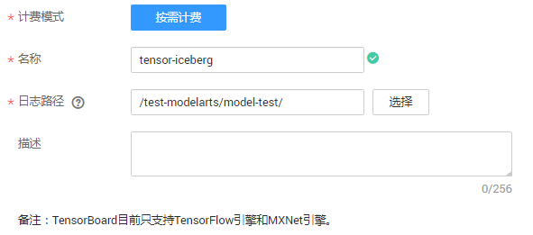
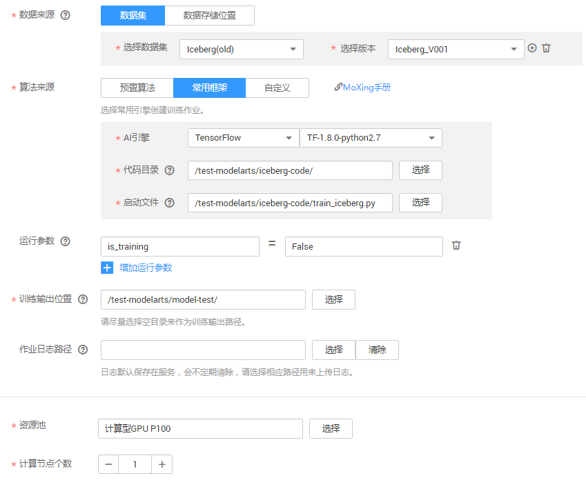
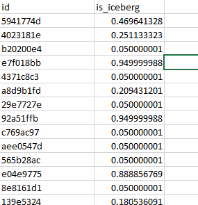

# 冰山识别（使用MoXing框架实现图像分类）

本文介绍如何在ModelArts上使用MoXing实现Kaggle竞赛中的冰山图像分类任务。实验所使用的图像为雷达图像，需要参赛者利用算法识别出图像中是冰山（iceberg）还是船（ship）。

开始使用如下样例前，请务必按[准备工作](https://support.huaweicloud.com/usermanual-modelarts/modelarts_02_0003.html)指导完成必要操作。冰山识别样例的操作流程如下所示。

1.  **[准备数据](#section4865410216)**：在ModelArts市场预置数据集中找到本实验对应的数据集，编写代码将数据集格式转换成TFRecord。
2.  **[训练模型](#section19745720175916)**：使用MoXing API编写用实现冰山图像分类的网络模型，新建训练作业进行模型训练。
3.  **[预测结果](#section148971738105912)**：再次新建训练作业，对示例数据集进行预测，并将结果保存到“csv“文件。
4.  **[查看结果](#section16235530195913)**：查看“csv“文件中的预测结果。

## 准备数据

在ModelArts市场预置数据集中找到本实验对应的数据集，然后通过Notebook将数据集格式转换成TFRecord格式。

1.  登录ModelArts管理控制台，单击左侧导航栏的“AI市场“。
2.  单击“数据集“页签进入数据集汇总页，找到冰山图像分类对应的预置数据集“Iceberg-Data-Set“。
3.  单击数据集进入到该预置数据集“Iceberg-Data-Set“的详情页面，单击“导入到我的数据集“，填写“数据集名称“及“OBS路径“，然后单击“确定“，页面会自动跳转到“数据管理\>数据集“页面。

    **图 1**  导入示例数据集  
    

4.  在“数据管理\>数据集“页面，当数据集状态变为“正常“时，表示“Iceberg-Data-Set“数据集已创建完成，数据详细信息完全加载。

    在数据集目录页面，获取“Iceberg-Data-Set“数据集的桶路径，例如“test-modelarts/iceberg/“。

    **图 2** “Iceberg-Data-Set“数据集完成导入  
    

    其中，训练集“train.json“包含4类数据：“band\_1“、“band\_2“、“inc\_angle“和“is\_iceberg“（测试集）。

    -   “band\_1“和“band\_2“：雷达图像的2个通道，分别是75x75的矩阵。
    -   “inc\_angle“：雷达图拍摄角度，单位是角度。
    -   “is\_iceberg“： 标注。冰山为1，船为0。

5.  进入“开发环境\>Notebook“页面，单击“创建“，在弹出框中填写Notebook名称，“AI引擎“请选择“TensorFlow“和“TF-1.8.0-python2.7“。单击“下一步“，进入规格确认页面，单击“创建“完成创建操作。

    针对当前样例，推荐使用“公共资源池“的“GPU“。如果选择使用“CPU“，Notebook的运行时间可能较长，且运行过程中容易出现故障。

    **图 3**  创建Notebook  
    

6.  Notebook创建完成后，在操作列，单击“打开“，进入“Jupyter Notebook“文件目录界面。
7.  单击右上角的“New\>Python2“，进入代码开发界面。

    **图 4**  创建Notebook开发页面  
    

8.  在Cell中填写数据转换代码。完整代码请参见[data\_format\_conversion.py](https://github.com/huaweicloud/ModelArts-Lab/blob/master/offical_examples/Using_MoXing_to_Create_a_Iceberg_Images_Classification_Application/codes/data_format_conversion.py)。

    > **说明：**   
    >脚本代码中的“BASE\_PATH“参数，请根据数据集实际存储位置修改。本示例中使用的OBS路径为“test-modelarts/iceberg/“, 即“train.json“和“test.json“的OBS父目录。  

9.  单击Cell上方的运行代码。运行代码过程可能需要较长时间，如果长时间没有执行结果，请尝试分段执行代码。将脚本示例代码分成多段放在不同的cell中执行。

    代码运行成功后，将在“test-modelarts/iceberg/“目录下生成如下3个文件：

    -   “iceberg-train-1176.tfrecord“：训练数据集。
    -   “iceberg-eval-295.tfrecord“：验证数据集。
    -   “iceberg-test-8424.tfrecord“：预测数据集。

10. 完成数据准备后，为避免产生不必要的费用，建议进入Notebook管理页面，在操作列中单击“停止“或“删除“，停止或删除此Notebook。

## 训练模型

数据准备完成后，您需要使用MoXing接口编写训练脚本代码，ModelArts提供了一个编写好的代码示例“train\_iceberg.py“，您也可以在ModelArts的“开发环境\>Notebook“中编写模型训练脚本，并转成“py“文件。

如下操作使用“train\_iceberg.py“示例训练模型。

1.  从github下载[ModelArts-Lab](https://github.com/huaweicloud/ModelArts-Lab)工程，并在“ModelArts-Lab“工程的“\\ModelArts-Lab-master\\offical\_examples\\Using\_MoXing\_to\_Create\_a\_Iceberg\_Images\_Classification\_Application\\codes“目录下获取模型训练脚本文件“train\_iceberg.py“。
2.  将“train\_iceberg.py“文件上传至OBS，假设上传至“test-modelarts/iceberg\_code/“文件夹下。
3.  在ModelArts管理控制台，进入“训练作业“页面，单击左上角的“创建“。
4.  填写训练作业相关参数。

    -   “名称“和“描述“：请按照界面提示规则填写。
    -   “数据来源“：选择“数据集“页签，然后在“选择数据集“和“选择版本“下拉框中，选择数据准备中已存储至ModelArts的“iceberg“数据集。
    -   “算法来源“：选择“常用框架“页签，“AI引擎“选择“TensorFlow“和“TF-1.8.0-python2.7“；“代码目录“选择模型训练脚本文件“train\_iceberg.py“所在的OBS父目录（“test-modelarts/iceberg\_code/“），“启动文件“请选择“train\_iceberg.py“。
    -   “训练输出位置“：选择一个OBS路径用于存放生成模型及预测文件，例如“/test-modelarts/model-test/“。
    -   “资源池“：选择一个可用的资源池用于训练。GPU资源池性能优于CPU资源池，但是相应的费用也更高。
    -   “计算节点个数“：此示例建议使用1个节点即可。

    **图 5**  创建训练作业  
    

5.  参数确认无误后，单击“立即创建“，完成训练作业创建。
6.  在训练作业管理页面，当训练作业变为“运行成功“时，即完成了模型训练过程。如有问题，可单击作业名称，进入作业详情界面查看训练作业日志信息。

    > **说明：**   
    >训练作业需要花费一些时间，预计十几分钟。当训练时间超过一定时间（如1个小时），请及时手动停止，释放资源。否则会导致欠费，尤其对于使用GPU训练的模型项目。  

7.  在模型训练的过程中或者完成后，可以通过创建TensorBoard作业查看一些参数的统计信息，如“loss“、“accuracy“等。

    进入“训练作业\>TensorBoard“界面，单击“创建“，填写TensorBoard名称，“日志路径“请选择步骤[4](#li1013661073819)中“训练输出位置“参数中的路径，如“/test-modelarts/model-test/“。根据界面提示完成TensorBoard创建。

    在TensorBoard界面中，当状态变为“运行中“时，表示创建完成。您可以单击TensorBoard的名称跳转到其可视化界面，查看此训练作业的相关信息。

    **图 6**  创建TensorBoard  
    

## 预测结果

待训练作业运行完成后，在“训练输出位置“目录下生成模型文件。由于我们只需要进行一次预测，因此不需要部署在线服务。相关的预测操作已经在“train\_iceberg.py“文件写好，预测结果将输出到“submission.csv“文件。

使用训练作业进行预测的操作步骤如下：

1.  进入ModelArts“训练作业“页面，单击左上角的“创建“。
2.  填写相关参数，然后根据界面提示完成训练作业创建。

    “名称“：请根据界面提示要求填写。例如，“iceberg\_predict“。

    “数据来源“和“算法来源“：填写信息与[训练模型](#section19745720175916)时相同。详情请参见步骤[4](#li1013661073819)。

    “运行参数“：预测时，务必添加参数“is\_training=False“，表示不进行重新训练。

    “训练输出位置“：与步骤[4](#li1013661073819)保持一致，如“/test-modelarts/model-test/“。

    “计算节点个数“：预测时“计算节点个数“只能选择1个节点。

    **图 7**  创建一次预测  
    

3.  进入“训练作业“管理页面，当训练作业状态变为“运行成功“时，表示预测完成。单击训练作业的名称“iceberg\_predict“，进入作业详情页面。

    在“日志“页签中，可以查看到在eval数据集上的loss值。

    > **说明：**   
    >训练作业需要花费一些时间，预计十几分钟。当训练时间超过一定时间（如1个小时），请及时手动停止，释放资源。否则会导致欠费，尤其对于使用GPU训练的模型项目。  

## 查看结果

在“训练输出位置“目录下，如“/test-modelarts/model-test/“，可通过“submission.csv“文件查看预测结果。

**图 8**  预测结果  

