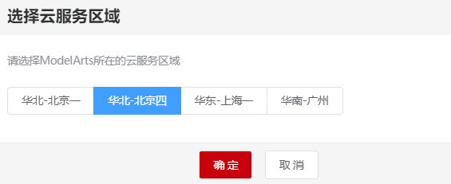
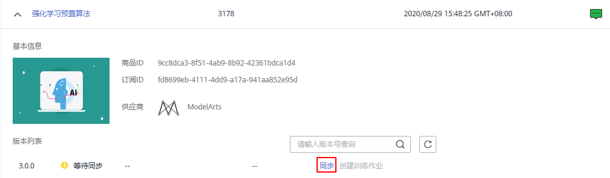
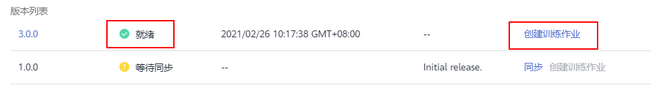
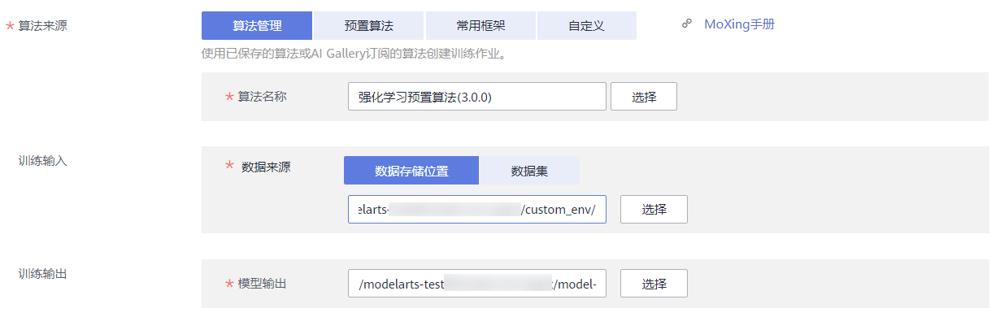
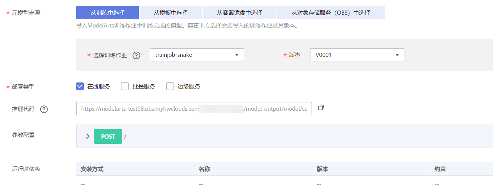
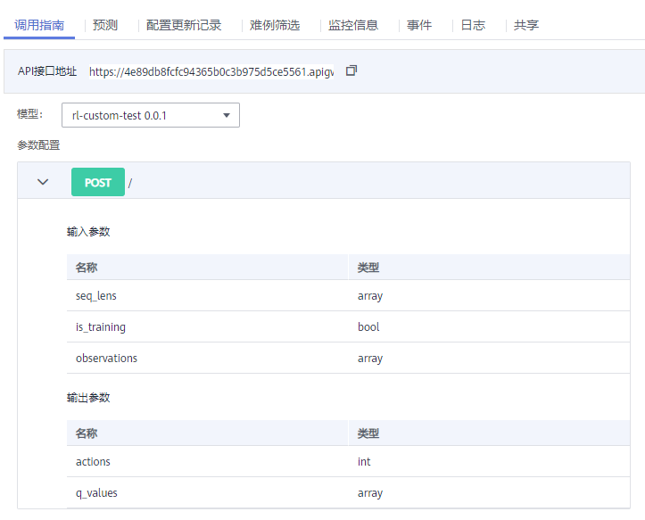
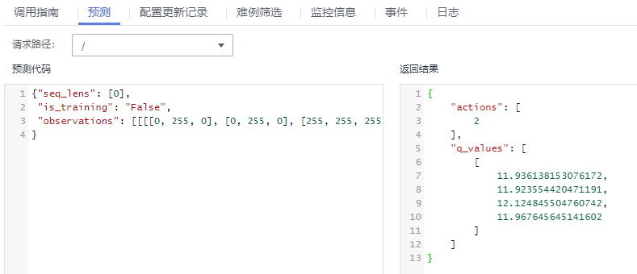

# 使用强化学习预置算法应用于自定义环境

本案例介绍使用AI Gallery强化学习算法训练自定义环境“贪吃蛇”示例。


## 准备工作
参考[此文档](https://github.com/huaweicloud/ModelArts-Lab/blob/master/docs/ModelArts%E5%87%86%E5%A4%87%E5%B7%A5%E4%BD%9C/%E5%87%86%E5%A4%87%E5%B7%A5%E4%BD%9C%E7%AE%80%E6%98%93%E7%89%88.md)，完成ModelArts准备工作。包括注册华为云账号、ModelArts全局配置和OBS相关操作。

## 环境介绍与实现

如下所示仅提供本示例的自定义环境描述，帮助理解后续步骤。当您使用此功能时，需替换为您的自定义环境，同时将您的自定义环境相关文件按文件结构要求上传至OBS桶中。

本案例自定义环境相关代码，可从[下载代码](https://hhj-ml-notebook.obs.cn-north-4.myhuaweicloud.com:443/Reinforcement_Learning_Custom_Env_Example_Code/Reinforcement_Learning_Custom_Env_Example_Code.zip?AccessKeyId=VGLWS83UEKYDHY94TE37&Expires=1614931079&response-content-disposition=inline&x-obs-security-token=gQpjbi1ub3J0aC00jg5gl4DGODh_w7WjV859NPsFtjuZL6hWzmY04H3ZF4F7sgFQzEzhUrRc_cbZxTWbQBmAuAxJuF7r6QCceeGYlddM2TBQmSzKVu8xGSDvtMGvyKwkN7FnZTafi9ocZEw8JmaRPom5WCQdpFpPwMOGe4kh0tMNnLp9GEk0JxAzHPZzOeXW727LuYAmcvcK1_nk4tIeD-rQkgLYquk3NzzPpiAAidsXuQpx2JcL-3S4giWedCMhtq7DBgr4z2hG8GoaCW7CtzD74na-iTiEcsNOlGeYJCi2tl5kDHk1qX8gOrY679tY1mbCNyMIEDvjHD7ck9qXf_TAaIVpSKMIIwKDOaeJxyeT5_cRMsSGiAXk73onEHwxQmOToJVilxemaONgeSgS2IVMkfQp3wBp9wxBD2G7d0d4WPdYOLskyYDqUguT6ABCJn70hnA5ZHwT3HklqYiM5qCGiR5bGcHDfly-lEU6AbuhEfKTnxivlw2tF8kKJyCdcftgVojeg5ziEOohBeF18TAWLWetk8AV3dkDDlaVgZSEZ1G01U-lDOq_Y8rBpa3p5wRj8rparv9RevK_gmh9U6zH3nYSHrAo1i4z2Yla4BI69yS3lRDtKOGoUpYVDK6B8ubmcVXrij_l2m5MBWjay2KNsmyxUOdw1YPbthqkKXKruQRAfbup4m07s2wEXFZnq0dwB4rbEWz50j96SvN-Ec1dE4c32IzcJZtiTUDFwjVBmLJYK-XyekkAbgTyrFaBfevLhNwh54f8bnabgPBlzd_wdk-HlLtJ9-DJg5rZYDhsbCAVMDfZUHMFkmqr&Signature=uTaTPw5Hpj/08ZInCKzAxO%2BxIgU%3D)获得。将训练代码“custom\_env“上传至OBS桶中,Single_Step_Data_For_Inference文件为预测代码。后面预测会用到。

**环境介绍**

   贪吃蛇游戏是一款休闲益智类游戏，该游戏通过控制蛇头方向吃果实，从而使得蛇的长度变得越来越长，随着蛇本身长度的增加，游戏难度也随之增加。

**问题描述**
    目标：利用强化学习训练智能体控制蛇移动并不断吃果实，以期获得尽可能多的分数或者尽可能长的长度。
    环境：贪吃蛇游戏环境，每吃到一个果实，积分增加1并且蛇的长度增加1；若蛇的头部碰到边界或者自己的身体，则蛇死亡，游戏失败。
    状态：游戏画面信息
    动作：上、下、左、右

**环境实现**

本案例中，代码及文件结构如下所示。

    ```
    |- custom_env
      |- snake_env
        |- snake_env.py
      |- __init__.py
    ```

其中，环境的实现文件和\_\_init\_\_.py文件一起放在命名为“custom\_env”的文件夹内（说明：此文件夹必须命名为“custom\_env”），本示例中，snake\_env文件夹内的snake\_env.py是环境的具体实现代码。

其中，在snake\_env.py中除了环境的实现代码（满足gym标准），还必须包含一个方法，主要用来实例化环境类并返回这个实例。snake\_env.py相应内容结构如下所示。

```
​```
class Snake_env(gym.Env):
    def __init__()
    ... ...

def create_custom_env(env_config):
    custom_env = Snake_env()
    return custom_env
​```
```

上述中的\_\_init\_\_.py主要用于控制导入的模块，本案例中内容如下所示。

```
​```
from .snake_env.snake_env import create_custom_env
    __all__ = ["create_custom_env"]
​```
```


## 进入AI Gallery订阅强化学习算法

ModelArts预置的强化学习算法（名为“强化学习预置算法“）发布在AI Gallery中。您可以前往[AI Gallery](https://marketplace.huaweicloud.com/markets/aihub/modelhub/list/)，订阅此模型，然后同步至ModelArts中。

1.  在ModelArts管理控制台中，在左侧菜单栏中选择“AI Gallery“，进入AI Gallery。
2.  在AI Gallery中，在搜索框中输入“强化学习预置算法“，查找对应的算法。
    如图：
   
3.  单击算法名称进入算法详情页，单击右侧的“订阅“，根据界面提示完成算法订阅。

 此算法由ModelArts官方提供，目前免费开放。订阅算法完成后，页面的“订阅“按钮显示为“已订阅“。。

4.  单击商品详情页的“前往控制台“，此时弹出“选择云服务区域“对话框，选择“华北-北京四”，然后再单击“确定“，

页面将自动跳转至ModelArts的“算法管理\>市场订阅“中同步对应的算法。
前往控制台


选择云服务区域



5.  在ModelArts管理控制台的算法管理页面，算法将自动同步至ModelArts中。

未同步的算法，无法直接用于创建训练作业，因此从AI Gallery订阅完成后，需在ModelArts管理控制台执行同步操作。同步成功后，下方界面中的“创建训练作业“按钮可用，且状态变更为“就绪“。
同步算法




## 使用订阅算法创建训练作业

算法订阅成功后，算法将呈现在“算法管理\>市场订阅“中，您可以使用订阅的“强化学习预置算法“算法创建训练作业，获得模型。

1. 进入“算法管理\>市场订阅“页面，选择订阅的“强化学习预置算法“算法，单击左侧的小三角展开算法，在版本列表中，单击“创建训练作业“。

**图 4**  创建训练作业 



2. 在创建训练作业页面，参考如下说明填写关键参数。
  * “算法来源“：系统默认选择上一步骤订阅的算法，请勿随意修改。
 * “训练输入“：本示例使用自定义环境，所以“训练输入\>数据来源“需要选择自定义模型所在的文件夹，也就是选择到“custom\_env“这个层级即可（具体自定义环境文件结构请参见[环境介绍与实现](#section9254693203)）。
 * “训练输出“：选择一个OBS空目录存储训练输出的模型。
 * “调优参数“：由于不需要使用内置环境，需将参数“use\_preset\_env“设置为“False“。其他参数在本示例中建议采用默认值。
 * “资源池“：建议选择CPU规格的资源池，例如“modelarts.vm.cpu.8u“规格。

**图 5**  训练作业参数  



**图 6**  调优参数配置 


3. 参数填写完成后，单击“下一步“，根据界面提示完成训练作业创建。
4. 进入“训练管理\>训练作业“页面，等待训练作业完成。

 训练作业运行需要几分钟时间，请耐心等待。根据经验，此样例不会超过10分钟。
 当训练作业的状态变更为“运行成功“时，表示已运行结束。您可以单击训练作业名称，进入详情页面，了解训练作业的“配置信息”、“日志”、“资源占用情况”等信息。您也可以在配置的“训练输出位置“对应的OBS目录下获得训练生成的模型。


## 导入模型

1. 在ModelArts管理控制台，选择“模型管理 \> 模型“。
2. 在模型列表页面，单击“导入“。进入导入模型页面，参考如下说明填写关键参数。

3. “元模型来源“：选择“从训练中选择“。然后在“选择训练作业“右侧下拉框中选择上一步创建的训练作业。

**图 7**  从训练中选择模型 



4. 模型导入参数填写完成后，单击“立即创建“。页面自动跳转至模型列表页面，等待模型导入结果。

当模型的状态变为“正常“时，表示模型导入成功。

**图 8**  模型导入成功  


## 部署为在线服务

模型导入成功后，可将此模型部署为在线服务，部署完成后即可在ModelArts管理控制台进行预测。

1. 在模型列表中，单击操作列的“部署 \> 在线服务“。

**图 9**  部署模型 


2. 在部署页面，参考如下说明填写关键参数。

* “资源池“：选择“公共资源池“。

* “选择模型及配置”：“模型“及“版本“会自动选择前面导入的模型。
* “计算节点规格”，在下拉框中选择CPU或GPU，本示例选择CPU资源进行部署。
* “计算节点个数”，需设置为“1“，目前仅支持单机部署，只能设置为“1“，不可修改。

其他参数可使用默认值。

**图 10**  部署模型参数 


3. 参数设置完成后，单击“下一步“，根据界面提示，完成在线服务的部署。

4. 您可以进入“在线服务列表“页面，等待服务部署结束，当服务状态变为“运行中“时，表示服务部署成功。

5. 在线服务部署完成后，您可以单击服务名称进入服务详情页。

 **访问服务**

了解“调用指南“，获取“API接口地址“，了解“输入参数“和“输出参数“，可通过postman或使用curl命令发送请求，调用方法请参见[访问在线服务](https://support.huaweicloud.com/engineers-modelarts/modelarts_23_0063.html)。

**图 11**  调用指南  



 **预测**：

单击“预测“页签，输入相应的参数或代码，单击“预测“即可看到运行结果，具体格式及要求参考[算法说明文档](https://marketplace.huaweicloud.com/markets/aihub/modelhub/detail/?id=9cc8dca3-8f51-4ab9-8b92-42361bdca1d4)。

示例提供了可用于推理预测的数据,在代码下载时获得用于预测的数据文件。在本地打开“Single_Step_Data_For_Inference.txt“文件，拷贝文件中的所有内容，然后将内容黏贴至预测界面的“预测代码“输入框中。


 **说明：**

对于不同的环境，其环境状态不同，对应的“observations”就不同，应用推理时需要明确。
在线部署推理仅为单步预测，如果想实现完整的业务推理，需要使用训练保存的模型，编写相应的推理程序。

单击“预测”后，显示预测结果：

**图 12**  预测结果 



至此，本案例完成。


