# 花卉识别（使用MXNet预置算法实现图像分类）

针对有一定AI基础的AI初学者，ModelArts基于业界的主流引擎提供了预置算法，无需关注模型开发过程，直接使用预置算法对已有数据进行训练，并快速部署为服务。预置算法可用于物体类别和位置、图像分类等场景。

本章节提供了一个花卉图像分类应用的样例，帮助您快速熟悉使用ModelArts预置算法构建模型的过程。此样例针对预置的花卉图像数据集，对已有图像数据进行标注，然后使用预置的“ResNet\_v1\_50“算法对数据进行训练，得到一个可用的模型，最后，将此模型部署为在线服务。部署完成后，用户可通过在线服务识别输入图片的花卉种类。

开始使用样例前，请仔细阅读[准备工作](#zh-cn_topic_0168474774_section12968454194113)罗列的要求，提前完成准备工作。使用预置算法完成模型构建的步骤如下所示：

-   [步骤1：准备数据，从市场导入数据管理](#zh-cn_topic_0168474774_section1620725194417)
-   [步骤2：训练模型](#zh-cn_topic_0168474774_section10578162455118)
-   [步骤3：（可选）创建TensorBoard，查看模型训练过程](#zh-cn_topic_0168474774_section015619501442)
-   [步骤4：导入模型](#zh-cn_topic_0168474774_section11162185717358)
-   [步骤5：部署上线](#zh-cn_topic_0168474774_section5256839360)
-   [步骤6：测试服务](#zh-cn_topic_0168474774_section83221114133613)
-   [步骤7：清除相应资源，避免产生费用](#zh-cn_topic_0168474774_section411272110528)

## 准备工作

-   已注册华为云账号，且在使用ModelArts前检查账号状态，账号不能处于欠费或冻结状态。
-   获取此账号的“AK/SK“，并在ModelArts全局配置中填写此信息，完成配置。详细操作指导请参见[获取访问密钥并完成ModelArts配置](https://support.huaweicloud.com/prepare-modelarts/modelarts_08_0002.html)。
-   已在OBS服务中创建桶和文件夹，用于存放样例数据集以及模型。如下示例中，请创建命名为“test-modelarts“的桶，并创建如[表1](#zh-cn_topic_0168474774_table128141340103319)所示的文件夹。

    创建OBS桶和文件夹的操作指导请参见[创建桶](https://support.huaweicloud.com/usermanual-obs/zh-cn_topic_0045829050.html)和[新建文件夹](https://support.huaweicloud.com/usermanual-obs/zh-cn_topic_0045829103.html)。由于ModelArts在“华北-北京一“区域下使用，为保证数据能正常访问，请务必在“华北-北京一“区域下创建OBS桶。

    **表 1**  文件夹列表

    
    <table><thead align="left"><tr id="zh-cn_topic_0168474774_row381324010337"><th class="cellrowborder" valign="top" width="31.180000000000003%" id="mcps1.2.3.1.1">
文件夹名称

    </th>
    <th class="cellrowborder" valign="top" width="68.82000000000001%" id="mcps1.2.3.1.2">
用途

    </th>
    </tr>
    </thead>
    <tbody><tr id="zh-cn_topic_0168474774_row17813840173315"><td class="cellrowborder" valign="top" width="31.180000000000003%" headers="mcps1.2.3.1.1 ">
“dataset-flowers”

    </td>
    <td class="cellrowborder" valign="top" width="68.82000000000001%" headers="mcps1.2.3.1.2 ">
用于存储数据集。

    </td>
    </tr>
    <tr id="zh-cn_topic_0168474774_row188141240193313"><td class="cellrowborder" valign="top" width="31.180000000000003%" headers="mcps1.2.3.1.1 ">
“model-test”

    </td>
    <td class="cellrowborder" valign="top" width="68.82000000000001%" headers="mcps1.2.3.1.2 ">
用于存储训练输出的模型和预测文件。

    </td>
    </tr>
    <tr id="zh-cn_topic_0168474774_row281444023315"><td class="cellrowborder" valign="top" width="31.180000000000003%" headers="mcps1.2.3.1.1 ">
“train-log”

    </td>
    <td class="cellrowborder" valign="top" width="68.82000000000001%" headers="mcps1.2.3.1.2 ">
用于存储训练作业的日志。

    </td>
    </tr>
    </tbody>
    </table>

## 步骤1：准备数据，从市场导入数据管理

由于ModelArts在“AI市场“中提供了各种花卉的示例数据集，命名为“Flowers-Data-Set“，因此，本文的操作示例使用此数据集进行模型构建。您需要执行如下操作，将数据集从市场导入到您的数据集中，以便用于模型训练和构建。

> **说明：**   
>-   由于“Flowers-Data-Set“数据集已完成数据标注，数据集中文件格式为“.txt“是对应图片的标注文件，因此在此操作步骤中忽略了数据标注操作。  
>-   如果您想使用自己的数据集，可跳过此步骤，直接将数据上传至OBS文件夹中，并在[步骤2：训练模型](#zh-cn_topic_0168474774_section10578162455118)操作中直接选择此目录即可。如果您使用的数据集未进行标注，在创建训练作业前请在“数据管理\>数据标注“页面创建标注作业进行人工标注。  

1.  登录[ModelArts管理控制台](https://console.huaweicloud.com/modelarts/?region=cn-north-1#/manage/dashboard)，在左侧菜单栏中选择“AI市场“，进入AI市场主页。
2.  单击“数据集“页签进入数据集管理页面，找到花卉数据集“Flowers-Data-Set“，单击数据集所在区域进入详情页面。

    **图 1**  找到花卉数据集  
    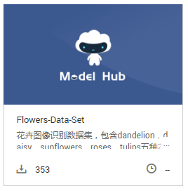

3.  在详情页面中，单击“导入至我的数据集“。
4.  在“导入至我的数据集“对话框中，填写数据集“名称“及“存储路径“。名称可自行定义，存储路径选择[准备工作](#zh-cn_topic_0168474774_section12968454194113)中已创建的OBS桶及文件夹。填写完成后单击“确定“。

    **图 2**  导入至我的数据集  
    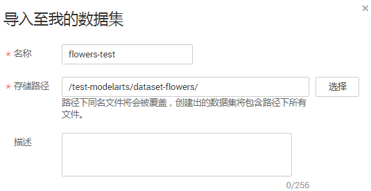

5.  （可选）如果您的OBS未开启多版本控制功能，此处将弹出“多版本控制“对话框，提示您启用。由于ModelArts创建数据集时，必须开启OBS的多版本控制功能。单击“确定“启用多版本控制功能。

    **图 3**  启用多版本控制  
    

6.  操作完成后，您可以前往“数据管理\>数据集“页面，查看数据导入情况。数据集的导入需要一定时间，大概几分钟，请耐心等待。

    在“数据集目录“中，当数据集版本状态为“正常“时，表示数据集已导入成功，您可以使用此数据集开始模型构建。数据集导入后，此示例数据将被拷贝至步骤[4](#zh-cn_topic_0168474774_li113453011212)中的OBS路径下。

    **图 4**  数据集导入成功  
    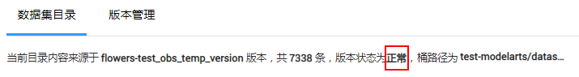

## 步骤2：训练模型

数据准备完成后，您可以创建一个训练作业，选用预置算法“ResNet\_v1\_50“，并最终生成一个可用的模型。

“ResNet\_v1\_50“算法基于“TensorFlow, TF-1.8.0-python2.7“引擎，其用途为图像分类。如果您想获取更多预置算法的介绍，您可以在“训练作业“页面中，单击“预置算法“页签，了解ModelArts提供的算法信息，如用途、引擎类型、精度等。

1.  在ModelArts管理控制台，在左侧导航栏中选择“训练作业“，进入“训练作业“管理页面。
2.  单击“创建“，进入“创建训练作业“页面。
3.  在“创建训练作业“页面，填写相关信息，参数填写指导请参见如下步骤。
    1.  在基本信息区域，“计费模式“和“版本“为系统自动生成，不需修改。请根据界面提示填写“名称“和“描述“。

        **图 5**  填写名称和描述  
        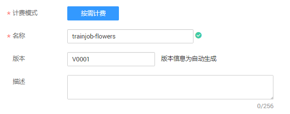

    2.  在参数配置区域，选择“数据来源“，设置“算法来源“、“运行参数“、“训练输出位置“和“作业日志路径“。

        “数据来源“：由于导入的数据集已完成标注，因此直接从数据存储位置导入即可。单击“数据存储位置“，然后单击文本框右侧的“选择“，选择数据集所在的OBS路径，如“/test-modelarts/dataset-flowers/“。

        “算法来源“：单击“选择“，从“预置算法“列表中，选择“ResNet\_v1\_50“算法。

        “运行参数“：单击“增加运行参数“，增加“max\_epoches=10“参数。针对“max\_epoches“参数，1个epoch代表整个数据集训练一遍，此运行参数表示训练10个epoch，数值可更改，不填写时使用默认值（默认值为100），epoches值越大训练时间越长。

        “训练输出位置“：从已有的OBS桶中选择模型和预测文件存储路径。使用准备工作中已创建好的“model-test“文件夹。如果没有可用文件夹，您可以单击“选择“，在弹出对话框中新建文件夹。

        “作业日志路径“：从已有的OBS桶中选择日志存储路径。使用准备工作中已创建好的“train-log“文件夹。如果没有可用文件夹，您可以单击“选择“，在弹出对话框中新建文件夹。

        **图 6**  参数配置  
        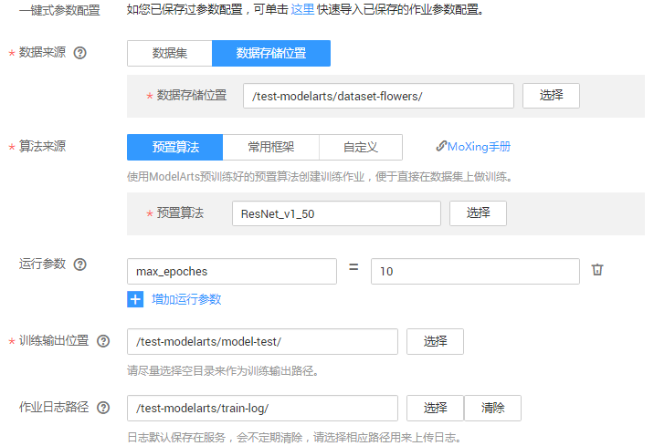

    3.  在资源设置区域，单击资源池文本框右侧的“选择“，选择“公共资源池“，“计算节点个数“设置为“1“。

        **图 7**  设置使用的资源  
        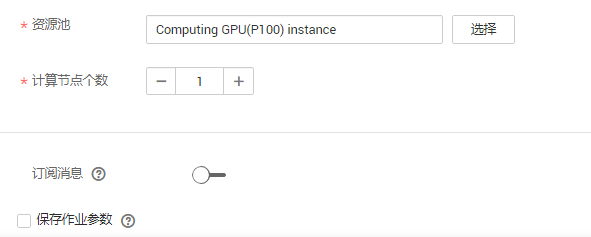

    4.  单击“下一步“完成信息填写。

4.  在“规格确认“页面，确认训练作业的参数信息，确认无误后单击“立即创建“。
5.  在“训练作业“管理页面，可以查看新建训练作业的状态。训练作业的创建和运行需要一些时间，预计十几分钟，当状态变更为“运行成功“时，表示训练作业创建完成。

    您可以单击训练作业的名称，可进入此作业详情页面，了解训练作业的“配置信息“、“日志“、“资源占用情况“和“评估详情“等信息。在“训练输出位置“所在的OBS路径中，即“/test-modelarts/model-test/“路径，可以获取到生成的模型文件。

    **图 8**  训练作业详情  
    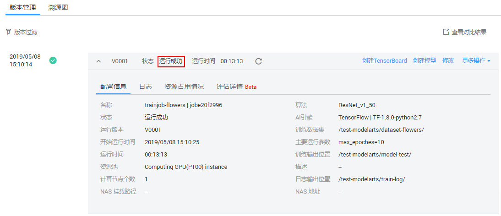

## 步骤3：（可选）创建TensorBoard，查看模型训练过程

TensorBoard是一个可视化工具，能够有效地展示TensorFlow在运行过程中的计算图、各种指标随着时间的变化趋势以及训练中使用到的数据信息。TensorBoard当前只支持基于TensorFlow和MXNet引擎的训练作业。

如果训练详情页的详细信息已足够支撑您判断模型好坏并构建模型，您可以选择跳过此步骤，直接执行[步骤4：导入模型](#zh-cn_topic_0168474774_section11162185717358)的操作。

1.  在ModelArts管理控制台，在左侧导航栏中选择“训练作业“，然后单击“TensorBoard“页签进入“TensorBoard“管理页面。
2.  在“TensorBoard“管理页面，单击创建。
3.  在“创建TensorBoard“页面，设置相关参数，然后单击“下一步“。

    设置TensorBoard的“名称“，以及“日志存储路径“。“日志存储路径“需要设置为训练作业中的“训练输出位置“，上述步骤中“训练输出位置“为“/test-modelarts/model-test/“。

    **图 9**  设置TensorBoard参数信息  
    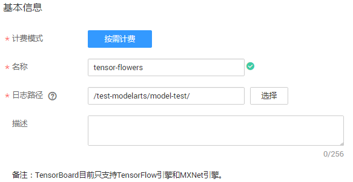

4.  在“规格确认“页面，信息确认完毕后，单击“立即创建“。
5.  进入“TensorBoard“管理页面，等待一段时间，当TensorBoard的状态为“运行中“时，表示已创建成功。

    针对运行中的TensorBoard，您可以单击TensorBoard的名称跳转到其可视化界面。您可以通过此界面的信息，了解到此模型的具体训练过程。如果此模型训练过程和参数满足要求，您可以开始执行[步骤4：导入模型](#zh-cn_topic_0168474774_section11162185717358)操作。

    **图 10**  TensorBoard可视化界面  
    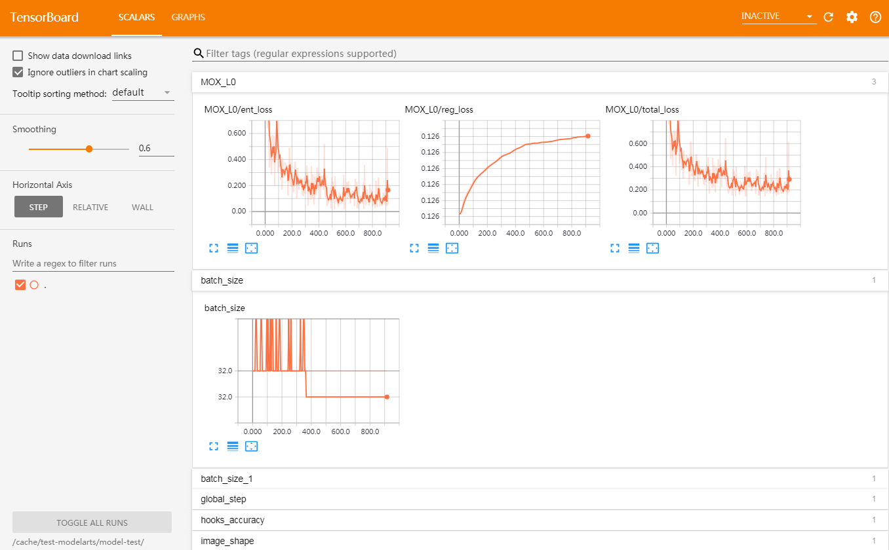

## 步骤4：导入模型

训练完成的模型还是存储在OBS路径中，您可以将此模型导入到ModelArts中进行管理和部署。

1.  在ModelArts管理控制台中，单击左侧导航栏中的“模型管理“，进入“模型管理“页面。
2.  在“模型管理“页面，单击“导入“。
3.  在“导入模型“页面，设置相关参数，然后单击“立即创建“。

    设置模型的“名称“和“版本“，然后在“元模型来源“参数中，选择“从训练中选择“，此时系统会自动选择您创建的训练作业，您可以从下拉框中可以选择系统中可用的训练作业。由于本示例数据较简单，其他参数采用默认值。

    **图 11**  导入模型  
    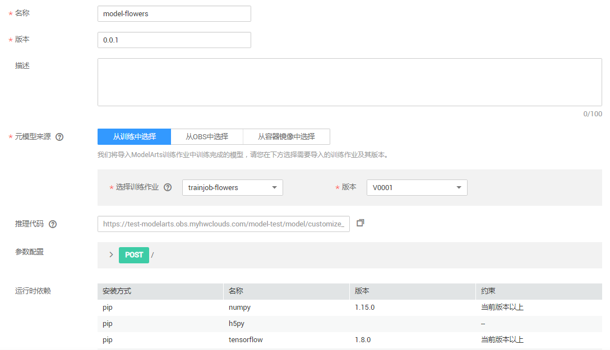

4.  模型导入完成后，系统将自动跳转至模型管理页面。您可以在模型管理页面查看已导入的模型及其版本。

    **图 12**  模型管理  
    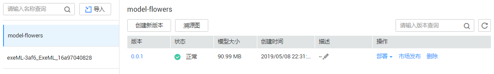

## 步骤5：部署上线

模型导入完成后，您可以将模型部署上线，可部署为“在线服务“、“批量服务“或“边缘服务“。如下操作步骤以部署为在线服务为例。

1.  在“模型管理“页面，单击操作列的“部署“，然后在下拉框中选择“在线服务“，进入“部署“页面。
2.  在“部署“页面中，设置相关参数，然后单击“下一步“。

    设置在线服务的“名称“。在“选择模型及配置“区域中，系统将自动选择[步骤4：导入模型](#zh-cn_topic_0168474774_section11162185717358)中的模型及其版本，在“计算节点规格“右侧下拉框中选择使用的资源，本示例选用“2核 | 8GiB“资源部署在线服务。其他参数使用默认值。

    **图 13**  部署为在线服务  
    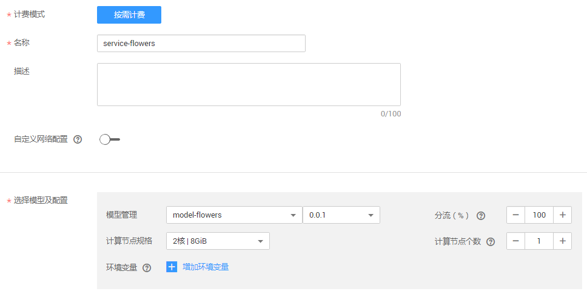

3.  在“规格确认“页面，确认信息完毕后，单击“立即创建“。
4.  在“部署上线 \> 在线服务“页面，您可以查看在线服务的相关信息。由于模型部署上线需要花费一些时间，请耐心等待几分钟。当在线服务的状态为“运行中“时，表示在线服务已部署完成。

## 步骤6：测试服务

在线服务部署成功后，您可以进入在线服务，发起预测请求进行测试。

1.  在“在线服务“管理页面，单击在线服务名称，进入在线服务详情页面。
2.  在线服务详情页面中，单击“预测“页签，进入预测页面。
3.  在“选择预测图片文件“右侧，单击“...“按钮，上传一张带花的图片，然后单击“预测“。

    预测完成后，预测结果显示区域将展示预测结果，根据预测结果得分，可识别出此图片的花为“tulips“。

    > **说明：**   
    >由于此处是测试服务，为保证测试效果，建议选择图片时，不要使用示例数据集中已有的图片。  

    **图 14**  预测结果  
    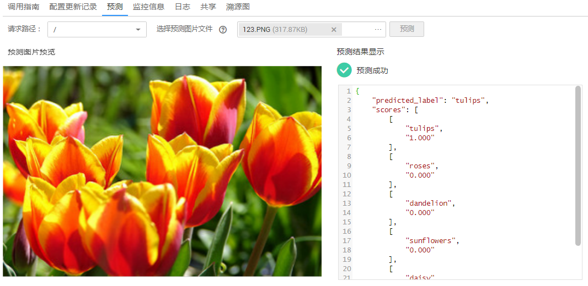

## 步骤7：清除相应资源，避免产生费用

为避免产生不必要的费用，在完成试用后，建议您删除相关资源，如在线服务、TensorBoard、训练作业、数据集及其OBS目录。

-   删除在线服务：在“在线服务“页面，单击操作列的“更多\>删除“。
-   删除TensorBoard：在“训练作业\>TensorBoard“页面，单击操作列的“删除“。
-   删除训练作业：在“训练作业“页面，单击操作列的“删除“。
-   删除数据集：在“数据管理\>数据集“页面，在“flowers-test“数据集右侧，将鼠标移至数据集名称，然后单击删除按钮。在弹出的对话框中，勾选“删除数据集同时删除桶内文件“，避免OBS因存储数据而继续收费。

    **图 15**  删除数据集  
    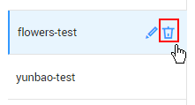

