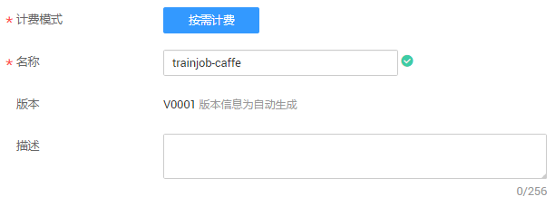
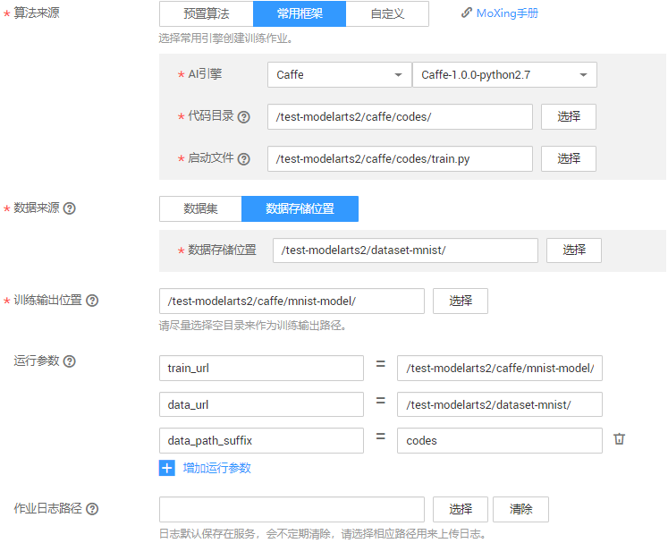
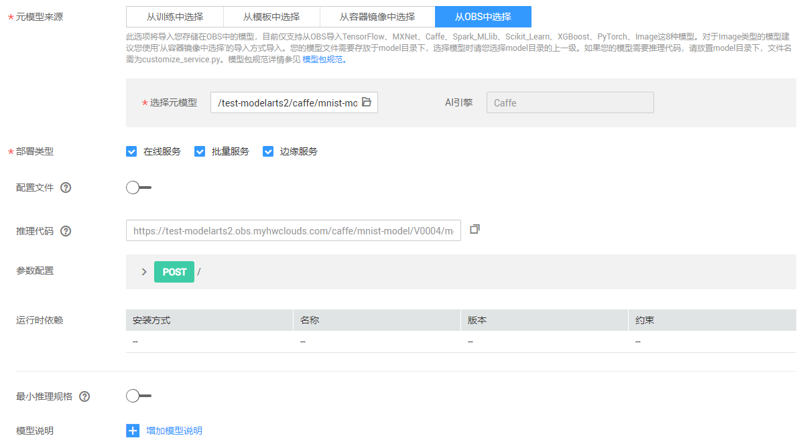
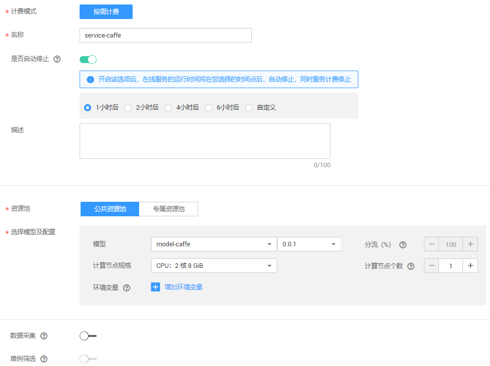
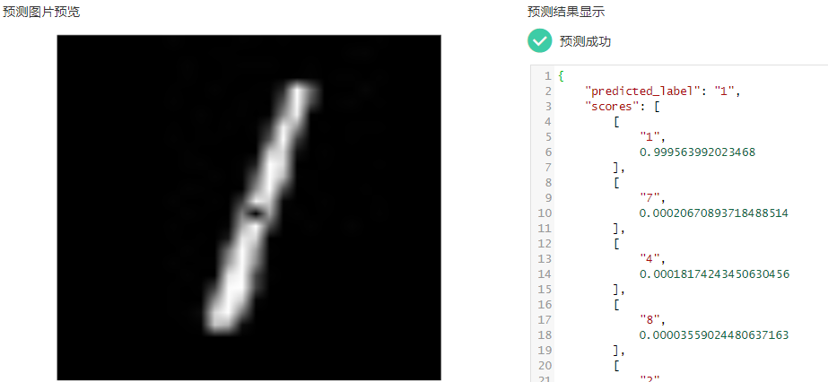

# 使用Caffe实现手写数字识别<a name="modelarts_10_0011"></a>

本章节介绍在ModelArts平台如何使用Caffe实现MNIST数据集的手写数字图像识别应用。

使用Caffe实现手写数字图像识别样例的操作流程如下所示。

1.  **[准备数据](#section336312088)**：获取MNIST数据集，并上传至OBS。
2.  **[编写模型](#section1128061013338)**：编写训练脚本，并编写prototxt文件定义网络结构和配置网络训练时各种参数，然后上传至OBS桶中。
3.  **[训练模型](#section715011268333)**：使用ModelArts服务，新建训练作业进行模型训练。
4.  **[部署模型](#section740614592308)**：训练结束后，将模型导入ModelArts，并将模型部署为在线服务。
5.  **[预测结果](#section9961181112311)**：发起预测请求获取预测结果。

## 准备数据<a name="section336312088"></a>

ModelArts在公共OBS桶中提供了MNIST数据集，命名为“Mnist-Data-Set“，因此，本文的操作示例使用此数据集进行模型构建。您需要执行如下操作，将数据集上传至您的OBS目录下，即准备工作中您创建的OBS目录“test-modelarts/dataset-mnist“。

1.  单击[数据集下载链接](https://modelarts-cnnorth1-market-dataset.obs.cn-north-1.myhuaweicloud.com/dataset-market/Mnist-Data-Set/archiver/Mnist-Data-Set.zip)，将“Mnist-Data-Set“数据集下载至本地。
2.  在本地，将“Mnist-Data-Set.zip“压缩包解压。例如，解压至本地“Mnist-Data-Set“文件夹下。
3.  参考[上传文件](https://support.huaweicloud.com/usermanual-obs/obs_03_0307.html)，使用批量上传方式将“Mnist-Data-Set“文件夹下的所有文件上传至“test-modelarts/dataset-mnist“OBS路径下。

    “Mnist-Data-Set“数据集包含的内容如下所示，其中“.gz“为对应的压缩包。

    -   “t10k-images-idx3-ubyte“：验证集，共包含10000个样本。
    -   “t10k-images-idx3-ubyte.gz“：验证集的压缩包文件。
    -   “t10k-labels-idx1-ubyte“：验证集标签，共包含10000个样本的类别标签。
    -   “t10k-labels-idx1-ubyte.gz“：验证集标签的压缩包文件。
    -   “train-images-idx3-ubyte“：训练集，共包含60000个样本。
    -   “train-images-idx3-ubyte.gz“：训练集的压缩包文件。
    -   “train-labels-idx1-ubyte“：训练集标签，共包含60000个样本的类别标签。
    -   “train-labels-idx1-ubyte.gz“：训练集标签的压缩包文件。


## 编写模型<a name="section1128061013338"></a>

数据完成准备后，您需要基于Caffe接口编写模型及其相关的配置文件。在本示例中，ModelArts提供了已编写好的训练脚本和相关配置文件。

1.  从gitee下载[ModelArts-Lab](https://gitee.com/ModelArts/ModelArts-Lab)工程，解压缩文件，并在“ModelArts-Lab“工程的“ModelArts-Lab-master\\official\_examples\\Using\_Caffe\_to\_Create\_a\_MNIST\_Dataset\_Recognition\_Application\\codes“目录下获取“train.py“和“src“文件夹。其中，“src“文件夹包含文件及其介绍请参见[表1](#table773145417296)。

    **表 1**  示例代码文件

    <a name="table773145417296"></a>
    <table><thead align="left"><tr id="row1373155412910"><th class="cellrowborder" valign="top" width="26.419999999999998%" id="mcps1.2.3.1.1"><p id="p12731105416296"><a name="p12731105416296"></a><a name="p12731105416296"></a>文件</p>
    </th>
    <th class="cellrowborder" valign="top" width="73.58%" id="mcps1.2.3.1.2"><p id="p14731654192920"><a name="p14731654192920"></a><a name="p14731654192920"></a>描述</p>
    </th>
    </tr>
    </thead>
    <tbody><tr id="row7731155414292"><td class="cellrowborder" valign="top" width="26.419999999999998%" headers="mcps1.2.3.1.1 "><p id="p1873119541290"><a name="p1873119541290"></a><a name="p1873119541290"></a><span class="filepath" id="filepath17669396308"><a name="filepath17669396308"></a><a name="filepath17669396308"></a>“train.py”</span></p>
    </td>
    <td class="cellrowborder" valign="top" width="73.58%" headers="mcps1.2.3.1.2 "><p id="p207319542291"><a name="p207319542291"></a><a name="p207319542291"></a>训练脚本。</p>
    </td>
    </tr>
    <tr id="row16731185442915"><td class="cellrowborder" valign="top" width="26.419999999999998%" headers="mcps1.2.3.1.1 "><p id="p147327548299"><a name="p147327548299"></a><a name="p147327548299"></a><span class="filepath" id="filepath3831141110311"><a name="filepath3831141110311"></a><a name="filepath3831141110311"></a>“src/lenet_solver.prototxt”</span></p>
    </td>
    <td class="cellrowborder" valign="top" width="73.58%" headers="mcps1.2.3.1.2 "><p id="p673216549299"><a name="p673216549299"></a><a name="p673216549299"></a>配置训练时参数的prototxt文件。</p>
    </td>
    </tr>
    <tr id="row9732254112914"><td class="cellrowborder" valign="top" width="26.419999999999998%" headers="mcps1.2.3.1.1 "><p id="p17323546298"><a name="p17323546298"></a><a name="p17323546298"></a><span class="filepath" id="filepath168736162313"><a name="filepath168736162313"></a><a name="filepath168736162313"></a>“src/lenet_train_test.prototxt”</span></p>
    </td>
    <td class="cellrowborder" valign="top" width="73.58%" headers="mcps1.2.3.1.2 "><p id="p137321554172912"><a name="p137321554172912"></a><a name="p137321554172912"></a>训练时的网络结构文件。</p>
    </td>
    </tr>
    <tr id="row473245412911"><td class="cellrowborder" valign="top" width="26.419999999999998%" headers="mcps1.2.3.1.1 "><p id="p1073265413295"><a name="p1073265413295"></a><a name="p1073265413295"></a><span class="filepath" id="filepath154419583354"><a name="filepath154419583354"></a><a name="filepath154419583354"></a>“src/lenet_deploy.prototxt”</span></p>
    </td>
    <td class="cellrowborder" valign="top" width="73.58%" headers="mcps1.2.3.1.2 "><p id="p2073212545298"><a name="p2073212545298"></a><a name="p2073212545298"></a>推理模型。</p>
    </td>
    </tr>
    <tr id="row16732185416294"><td class="cellrowborder" valign="top" width="26.419999999999998%" headers="mcps1.2.3.1.1 "><p id="p13732754202911"><a name="p13732754202911"></a><a name="p13732754202911"></a><span class="filepath" id="filepath2963180193619"><a name="filepath2963180193619"></a><a name="filepath2963180193619"></a>“src/customize_service.py”</span></p>
    </td>
    <td class="cellrowborder" valign="top" width="73.58%" headers="mcps1.2.3.1.2 "><p id="p1173215419293"><a name="p1173215419293"></a><a name="p1173215419293"></a>推理脚本。</p>
    </td>
    </tr>
    <tr id="row6732125415296"><td class="cellrowborder" valign="top" width="26.419999999999998%" headers="mcps1.2.3.1.1 "><p id="p273275492920"><a name="p273275492920"></a><a name="p273275492920"></a><span class="filepath" id="filepath99389443613"><a name="filepath99389443613"></a><a name="filepath99389443613"></a>“src/config.json”</span></p>
    </td>
    <td class="cellrowborder" valign="top" width="73.58%" headers="mcps1.2.3.1.2 "><p id="p1573245417291"><a name="p1573245417291"></a><a name="p1573245417291"></a>推理使用的配置文件。</p>
    </td>
    </tr>
    </tbody>
    </table>

2.  将获取的文件上传至OBS中。例如“/test-modelarts/caffe/codes/“，结构如下所示。

    > **说明：**   
    >由于配置文件和训练脚本已编写了绝对路径，建议您直接上传的OBS文件夹必须以“codes“命名。  

    ```
    test-modelarts
        |--caffe
            |--codes
                |--train.py
                |--src
                    |--lenet_solver.prototxt
                    |--lenet_train_test.prototxt
                    |--lenet_deploy.prototxt
                    |--customize_service.py
                    |--config.json
    ```


## 训练模型<a name="section715011268333"></a>

最后，利用已经上传的数据集和训练程序脚本完成模型训练，训练结束后，将在指定目录生成模型。

1.  在ModelArts管理控制台，进入“训练管理 \> 训练作业“页面，单击左上角的“创建“。
2.  在“创建训练作业“页面，参考[图1](#fig54731540185512)和[图2](#fig1647364017555)填写相关信息，然后单击“下一步“。

    “算法来源“：选择的代码目录必须包含[表1](#table773145417296)所示文件，且必须使用命名为“codes“文件目录。

    “数据来源“：选择数据存储位置，然后选择数据集存储的OBS路径。

    “运行参数“：“data\_path\_suffix“用于指定代码目录的最后一级目录名称，本示例为“data\_path\_suffix=codes“。如果此处不设置codes目录，训练作业将执行失败。

    “资源池“：由于训练时间较长，建议选择GPU资源池。

    **图 1**  创建训练作业-基本信息<a name="fig54731540185512"></a>  
    

    **图 2**  创建训练作业-详细参数<a name="fig1647364017555"></a>  
    

3.  在“规格确认“页面，确认训练作业的参数信息，确认无误后单击“提交“。
4.  在训练作业管理页面，当训练作业变为“运行成功“时，即完成了模型训练过程。如有问题，可单击作业名称，进入作业详情界面查看训练作业日志信息。

    系统将生成的模型存储在此训练输出位置下的model文件夹中，您可以在前往OBS查看生成的模型文件。本示例中，生成的模型存储在“/test-modelarts/caffe/mnist-model/model“目录下。

    > **说明：**   
    >训练作业需要花费一些时间，预计十几分钟。当训练时间超过一定时间（如1个小时），请及时手动停止，释放资源。否则会导致欠费，尤其对于使用GPU训练的模型项目。  


## 部署模型<a name="section740614592308"></a>

模型训练完成后，可以将模型部署为在线预测服务。在部署模型之前，确保[准备数据](#section336312088)中的推理代码和配置文件已按要求上传。您也可以基于[模型包规范](https://support.huaweicloud.com/engineers-modelarts/modelarts_23_0091.html)，开发自己所需的推理代码及配置文件。

1.  在ModelArts管理控制台，单击左侧导航栏中的“模型管理\>模型“，进入“模型“页面，单击“导入“。
2.  在“导入模型“页面，参考[图3](#fig1391183516364)填写相关参数，然后单击“立即创建“。

    在“元模型来源“中，选择“从OBS中选择“页签。然后在“选择元模型“右侧文本框选择训练作业中“训练输出位置“指定的路径。

    **图 3**  导入模型<a name="fig1391183516364"></a>  
    

    在“模型列表“页面，当模型状态变为“正常“时，表示模型已导入成功。

3.  单击模型名称左侧的小三角，打开此模型下的所有版本。在对应版本所在行，单击操作列“部署\>在线服务“，将模型部署为在线服务。

    在“部署“页面，参考[图4](#fig3534111012408)填写参数，然后根据界面提示完成在线服务创建。

    **图 4**  部署模型<a name="fig3534111012408"></a>  
    


## 预测结果<a name="section9961181112311"></a>

完成模型部署后，等待服务部署完成，当服务状态显示为“运行中“，表示服务已部署成功。

1.  在“在线服务“页面，单击在线服务名称，进入服务详情页面。
2.  单击“预测“页签，在“选择预测图片文件“右侧，单击“上传“按钮选择一张黑底白字的图片，然后单击“预测“。

    预测完成后，预测结果显示区域将展示预测结果，根据预测结果内容，可识别出此图片的数字是“1“。

    > **说明：**   
    >-   由于推理代码和配置文件中已指定图片要求，用于预测的图片，大小必须为“28px\*28px“，且图片必须是黑底白字。  
    >-   建议不要使用数据集中自带的图片，可以使用Windows自带的画图工具绘制一张。  

    **图 5**  预测结果展示<a name="zh-cn_topic_0168474775_fig2049295319516"></a>  
    

3.  如果不再需要使用此模型及在线服务，建议清除相关资源，避免产生不必要的费用。
    -   在“在线服务“页面，“停止“或“删除“刚创建的在线服务。
    -   在“模型管理“页面，“删除“刚导入的模型。
    -   在“训练作业“页面，“删除“运行结束的训练作业。
    -   进入OBS，删除本示例使用的OBS桶及文件夹，以及文件夹的文件。


