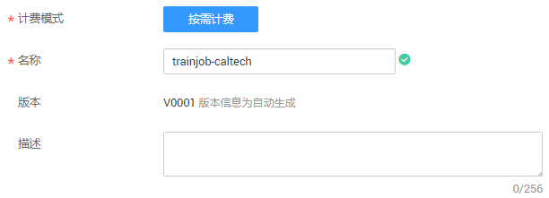
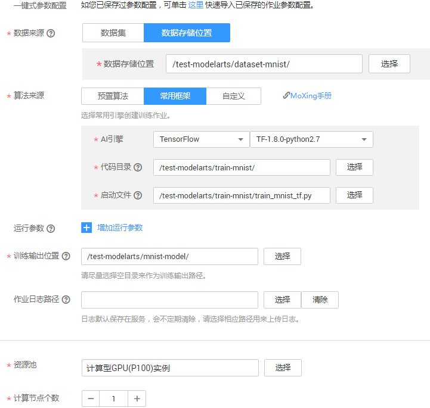
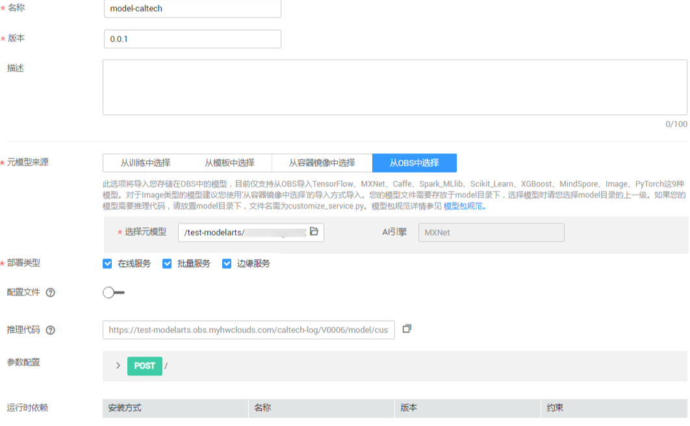
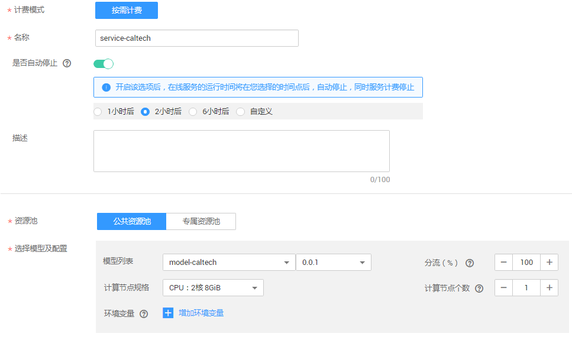
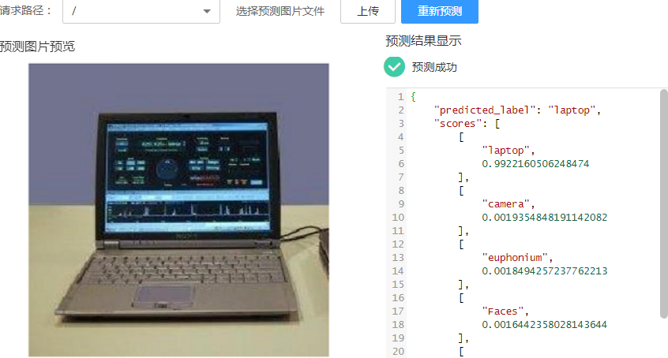
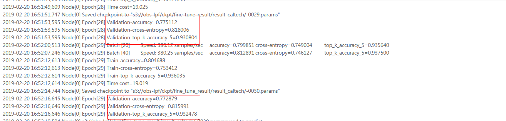
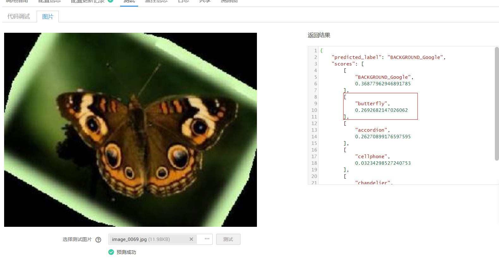
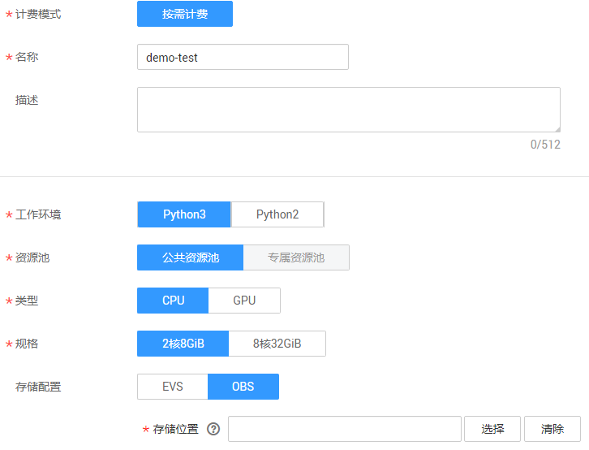

# 使用MXNet实现Caltech图像识别

本示例介绍在ModelArts平台如何使用深度学习框架MXNet训练Caltech数据集，并把得到的模型发布成一个可用的推理服务。

首先，参考[准备工作](#section19807134731917)完成前期准备，然后，参考如下基本流程使用MXNet完成Caltech图像识别应用。

1.  **[准备数据](#section79314482239)**：获取Caltech101数据集，并上传至OBS。
2.  **[训练模型](#section23901369314)**：使用MXNet原生接口编写模型训练脚本，新建训练作业进行模型训练。
3.  **[部署模型](#section740614592308)**：得到训练好的模型文件后，新建预测作业将模型部署为在线预测服务。
4.  **[预测结果](#section9961181112311)**：发起预测请求获取预测结果。

如果您了解MXNet引擎，且想基于此示例进行更多操作，请参见[进阶使用说明](#section163341538103113)了解更多。

## 准备工作

-   在OBS管理控制台，新建桶和文件夹，用于存储数据和示例代码文件。本示例使用的桶和文件夹如[表1](#table3397184752211)所示。

    **表 1**  需要新建的桶和文件夹

    
    <table><thead align="left"><tr id="row1339784762218"><th class="cellrowborder" valign="top" width="20.01%" id="mcps1.2.4.1.1">
OBS桶

    </th>
    <th class="cellrowborder" valign="top" width="29.42%" id="mcps1.2.4.1.2">
文件夹

    </th>
    <th class="cellrowborder" valign="top" width="50.57000000000001%" id="mcps1.2.4.1.3">
用途

    </th>
    </tr>
    </thead>
    <tbody><tr id="row17397647102217"><td class="cellrowborder" rowspan="3" valign="top" width="20.01%" headers="mcps1.2.4.1.1 ">
test-modelarts

    </td>
    <td class="cellrowborder" valign="top" width="29.42%" headers="mcps1.2.4.1.2 ">
Caltech

    </td>
    <td class="cellrowborder" valign="top" width="50.57000000000001%" headers="mcps1.2.4.1.3 ">
用于存储Caltech数据集。

    </td>
    </tr>
    <tr id="row10397947162217"><td class="cellrowborder" valign="top" headers="mcps1.2.4.1.1 ">
codes

    </td>
    <td class="cellrowborder" valign="top" headers="mcps1.2.4.1.2 ">
用于存储示例代码。

    </td>
    </tr>
    <tr id="row76493524234"><td class="cellrowborder" valign="top" headers="mcps1.2.4.1.1 ">
caltech-log

    </td>
    <td class="cellrowborder" valign="top" headers="mcps1.2.4.1.2 ">
用于存储生成的模型文件。

    </td>
    </tr>
    </tbody>
    </table>

-   从gitee下载[ModelArts-Lab](https://gitee.com/ModelArts/ModelArts-Lab)工程，并在“ModelArts-Lab“工程中获取[codes](https://gitee.com/ModelArts/ModelArts-Lab/tree/master/official_examples/Using_MXNet_to_Train_Caltech101/codes)文件夹中的示例代码，并上传至OBS中。详细文件及对应OBS路径请参见[表2](#table4435153217207)。

    **表 2**  获取示例文件并上传OBS

    
    <table><thead align="left"><tr id="row1443693292013"><th class="cellrowborder" valign="top" width="33.64%" id="mcps1.2.3.1.1">
获取的文件

    </th>
    <th class="cellrowborder" valign="top" width="66.36%" id="mcps1.2.3.1.2">
存储的OBS路径

    </th>
    </tr>
    </thead>
    <tbody><tr id="row12436932122015"><td class="cellrowborder" valign="top" width="33.64%" headers="mcps1.2.3.1.1 "><ul id="ul187029572212"><li>“train_caltech.py”</li><li>“libimageaugdefault.so”</li><li>“symbol”目录及其下所有文件</li></ul>
    </td>
    <td class="cellrowborder" valign="top" width="66.36%" headers="mcps1.2.3.1.2 ">
“test-modelarts/codes”

    </td>
    </tr>
    <tr id="row15436432172016"><td class="cellrowborder" valign="top" width="33.64%" headers="mcps1.2.3.1.1 "><ul id="ul1020010892720"><li>“customize_service.py”</li><li>“config.json”</li></ul>
    </td>
    <td class="cellrowborder" valign="top" width="66.36%" headers="mcps1.2.3.1.2 ">
“test-modelarts/caltech-log/model”

    
 说明： 
<ul id="ul18729134210313"><li>请在训练作业完成后，再执行上传操作。</li><li>如果训练作业运行多次，将生成不同的版本，“caltech-log”目录下将生成多种版本的目录，如“V0001”、“V0002”，请基于训练作业的版本，将文件上传至对应版本下的“model”文件夹内。</li></ul>
    

    </td>
    </tr>
    </tbody>
    </table>

## 准备数据

Caltech101数据集是加利福尼亚理工学院提供的101类（加一个背景类）开源图像数据集，每一类大约有40\~800张左右的图片，每张图片是接近300×200大小不等的。关于该数据集详细请参见[Caltech 101](http://www.vision.caltech.edu/Image_Datasets/Caltech101/#Description)。

ModelArts已将Caltech101数据集存储到OBS公共桶中，且命名为“Caltech101-data-set“。您可以通过如下步骤获取数据集，并上传至OBS桶对应的文件夹下。例如本示例中的路径为“test-modelarts/Caltech/data“。

1.  单击[数据集下载链接](https://modelarts-cnnorth1-market-dataset.obs.cn-north-1.myhuaweicloud.com/dataset-market/Caltech101-data-set/archiver/Caltech101-data-set.zip)，将“Caltech101-data-set“数据集下载至本地。
2.  在本地，将“Caltech101-data-set.zip“压缩包解压。例如，解压至本地“Caltech101-data-set“文件夹下。
3.  参考[上传文件](https://support.huaweicloud.com/usermanual-obs/obs_03_0307.html)，使用批量上传方式将“Caltech101-data-set“文件夹下的所有文件上传至“test-modelarts/Caltech/data“OBS路径下。

    为了方便进行预处理操作，已经制作好了MXNet使用的“rec“文件。需要说明的是，在深度学习领域，训练之前一般会把数据集按“6:2:2“的比例分成训练集、验证集和测试集。训练集就是训练时使用的数据集，验证集是在训练过程中评估模型好坏的数据集，测试集是在训练完成以后评估模型的数据集。由于本示例不需要评估模型最终的结果如何，所以没有使用测试集，直接按“8:2“分成了训练集和验证集。“train“是训练集，“val“是验证集。数据集中的“lst“文件和“idx“文件，“lst“文件里是图片路径的列表，即“train“和“val“数据集里各有哪些图片。“idx“文件可以帮忙做shuffle的文件，但是开发者在训练模型时不需要此文件，整个示例操作过程中不需关注。

## 训练模型

数据准备完成后，您需要使用MXNet接口编写训练脚本代码。ModelArts提供了一个编写好的代码示例，train\_caltech.py，如下操作使用此示例训练模型。

本示例使用深度卷积神经网络resnet进行了训练，resnet的卷积层个数可选为“18“、“34“、“50“。在可选的“18“、“34“、“50“情况下，模型层数越大，代表模型越深，训练所需的时间越长，模型准确率能更好。resnet是常用的图像分类卷积神经网络之一。

1.  请参见[准备工作](#section19807134731917)，将“codes“目录下训练作业所需文件上传至OBS，例如“test-modelarts/Caltech/code“。

    > **说明：**   
    >-   codes目录下训练模型所需文件为：“train\_caltech.py“、“libimageaugdefault.so“和“symbol“目录下所有文件。  
    >-   OBS中用于存储训练脚本的文件夹必须命名为“codes“。否则训练作业将执行失败。  

2.  在ModelArts管理控制台，进入“训练管理 \> 训练作业“页面，单击左上角的“创建“。
3.  在“创建训练作业“页面，参考[图1](#fig131391562296)和[图2](#fig1813955602910)填写相关信息，然后单击“下一步“。

    “算法来源“：设置为“train\_caltech.py“示例脚本所在路径。

    “数据来源“：设置为Caltech101示例数据存储的路径。

    “运行参数“：增加“max\_epoches=10“参数。针对“max\_epoches“参数，1个epoch代表整个数据集训练一遍，此运行参数表示训练10个epoch，数值可更改，不填写时使用默认值（默认值为100），“max\_epoches“值越大训练时间越长。更多运行参数的指导请参见[表3](#table197372255464)。

    > **说明：**   
    >-   AI引擎请务必选择“MXNet“，“MXNet-1.2.1-python3.6“。由于示例代码已编写其使用引擎版本，如果使用“MXNet-1.2.1-python2.7“，训练作业将运行失败。  
    >-   由于此训练作业数据量较大，运行时间较长，建议选择GPU资源。  

    **图 1**  创建训练作业-填写基本信息  
    

    **图 2**  创建训练作业-详细参数  
    

4.  在“规格确认“页面，确认训练作业的参数信息，确认无误后单击“提交“。
5.  在训练作业管理页面，当训练作业变为“运行成功“时，即完成了模型训练过程。如有问题，可单击作业名称，进入作业详情界面查看训练作业日志信息。

    > **说明：**   
    >训练作业需要花费一些时间，预计十几分钟。当训练时间超过一定时间（如1个小时），请及时手动停止，释放资源。否则会导致欠费，尤其对于使用GPU训练的模型项目。  

6.  （可选）在模型训练的过程中或者完成后，可以通过创建可视化作业查看一些参数的统计信息。详细操作指导请参见[创建可视化作业](https://support.huaweicloud.com/engineers-modelarts/modelarts_23_0050.html)。

    其中，“训练输出位置“请选择步骤训练作业中“训练输出位置“参数中的路径。根据界面提示完成可视化作业创建。

**表 3**  运行参数说明

<table><thead align="left"><tr id="row207371625124613"><th class="cellrowborder" valign="top" width="36.33%" id="mcps1.2.3.1.1">
参数

</th>
<th class="cellrowborder" valign="top" width="63.67%" id="mcps1.2.3.1.2">
说明

</th>
</tr>
</thead>
<tbody><tr id="row373832544613"><td class="cellrowborder" valign="top" width="36.33%" headers="mcps1.2.3.1.1 ">
num_epochs

</td>
<td class="cellrowborder" valign="top" width="63.67%" headers="mcps1.2.3.1.2 ">
训练需要迭代的次数，默认为“30”。

</td>
</tr>
<tr id="row2738132544618"><td class="cellrowborder" valign="top" width="36.33%" headers="mcps1.2.3.1.1 ">
batch_size

</td>
<td class="cellrowborder" valign="top" width="63.67%" headers="mcps1.2.3.1.2 ">
训练的每次更新包含的样本数量大小， 默认为“128”。

</td>
</tr>
<tr id="row073813257464"><td class="cellrowborder" valign="top" width="36.33%" headers="mcps1.2.3.1.1 ">
lr

</td>
<td class="cellrowborder" valign="top" width="63.67%" headers="mcps1.2.3.1.2 ">
学习率，默认为“0.1”。

</td>
</tr>
<tr id="row10738122514614"><td class="cellrowborder" valign="top" width="36.33%" headers="mcps1.2.3.1.1 ">
lr_step

</td>
<td class="cellrowborder" valign="top" width="63.67%" headers="mcps1.2.3.1.2 ">
学习率减小的epoch，默认为“16,24,27”。也就是说学习率会在第16个epoch结束时减小为原来的0.1倍，为0.01，第24、27epoch同理。

</td>
</tr>
<tr id="row373842514619"><td class="cellrowborder" valign="top" width="36.33%" headers="mcps1.2.3.1.1 ">
num_layers

</td>
<td class="cellrowborder" valign="top" width="63.67%" headers="mcps1.2.3.1.2 ">
resnet模型的卷积层数，可供选择的有“18”、“34”、“50”，默认为“34”

</td>
</tr>
<tr id="row18242192074812"><td class="cellrowborder" valign="top" width="36.33%" headers="mcps1.2.3.1.1 ">
disp_batches

</td>
<td class="cellrowborder" valign="top" width="63.67%" headers="mcps1.2.3.1.2 ">
每隔多少步输出一次，默认为“20”。

</td>
</tr>
</tbody>
</table>

## 部署模型

模型训练完成后，可以创建预测作业，将模型部署为在线预测服务。在部署模型之前，获取推理代码“customize\_service.py“和配置文件“config.json“并上传至OBS中。此推理代码和配置文件为ModelArts为操作样例提供的示例。您也可以基于[模型包规范](https://support.huaweicloud.com/engineers-modelarts/modelarts_23_0091.html)，开发自己所需的推理代码及配置文件。

1.  在部署模型之前，请参见[准备工作](#section19807134731917)，将推理代码和配置文件上传至对应OBS路径下。本示例使用的OBS路径为“/test-modelarts/Caltech/output/“。
2.  在ModelArts管理控制台，单击左侧导航栏中的“模型管理\>模型“，进入“模型“页面，单击“导入“。
3.  在“导入“页面，参考[图3](#fig1391183516364)填写相关参数，然后单击“立即创建“。

    在“元模型来源“中，选择“从OBS中选择“页签。然后在“选择元模型“右侧文本框选择训练作业中“训练输出位置“指定的路径。

    **图 3**  导入训练模型  
    

    在“模型“页面，当模型状态变为“正常“时，表示模型已导入成功。

4.  单击模型名称左侧的小三角，打开此模型下的所有版本。在对应版本所在行，单击操作列“部署\>在线服务“，将模型部署为在线服务。

    在“部署“页面，参考[图4](#fig3534111012408)填写参数，然后根据界面提示完成在线服务创建。

    **图 4**  部署模型为在线服务  
    

## 预测结果

完成模型部署后，等待服务部署完成，当服务状态显示为“运行中“，表示服务已部署成功。

1.  在“在线服务“页面，单击在线服务名称，进入服务详情页面。
2.  单击“预测“页签，然后单击“上传“选择本地用于预测的图片，然后单击“预测“。

    “predicted\_label“：表示模型最终认为这张图片的归类，这里我们可以看到输出的是“laptop“也就是笔记本电脑，表示模型预测正确。

    “scores“：置信度，也就是模型认为这张图片属于某一类的概率。会输出概率最高的前五项，是在网络的最后一层加入了softmax层转化来的。

    **图 5**  图片预测  
    

3.  如果不在需要使用此模型及在线服务，建议清除相关资源，避免产生不必要的费用。
    -   在“在线服务“页面，“停止“或“删除“刚创建的在线服务。
    -   进入OBS，删除本示例使用的OBS桶及文件夹，以及文件夹的文件。
    -   删除数据：前往OBS，删除上传的数据，然后删除文件夹及OBS桶。

## 进阶使用说明

-   **优化模型**

    当然，并不是所有的图片都能够预测正确，比如本实验如果使用的全都是默认的参数去进行训练，在验证集上差不多只有78%左右的准确率。如果对结果不满意，或者想自己尝试让深度学习的模型效果更加好，可以调节下列参数“num\_epochs“、“batch\_size“、“lr“、“lr\_step“、“num\_layers“，详细参数说明请参见[表3](#table197372255464)。在训练日志中，每个epoch结束都会输出模型当前在验证集上的表现，如[图6](#fig17325182014115)所示，可以通过这些变化来观察改动了上述参数后对训练模型有什么样的影响。

    **图 6**  训练输出日志  
    

    **表 4**  指标值解释

    
    <table><thead align="left"><tr id="row153744523120"><th class="cellrowborder" valign="top" width="31.630000000000003%" id="mcps1.2.3.1.1">
指标值

    </th>
    <th class="cellrowborder" valign="top" width="68.37%" id="mcps1.2.3.1.2">
说明

    </th>
    </tr>
    </thead>
    <tbody><tr id="row1237411523110"><td class="cellrowborder" valign="top" width="31.630000000000003%" headers="mcps1.2.3.1.1 ">
Validation-accuracy

    </td>
    <td class="cellrowborder" valign="top" width="68.37%" headers="mcps1.2.3.1.2 ">
预测的置信度最高的类别是正确的比例，即上述推理测试时输出predicted_label正确占总预测结果的比例，结果越高，模型越好。在深度学习领域一般称为top-1

    </td>
    </tr>
    <tr id="row83740524113"><td class="cellrowborder" valign="top" width="31.630000000000003%" headers="mcps1.2.3.1.1 ">
Validation-cross-entropy

    </td>
    <td class="cellrowborder" valign="top" width="68.37%" headers="mcps1.2.3.1.2 ">
交叉熵，用来评判对每一类预测准确率的损失值，越小越好

    </td>
    </tr>
    <tr id="row1937519527114"><td class="cellrowborder" valign="top" width="31.630000000000003%" headers="mcps1.2.3.1.1 ">
Validation-top_k_accuracy_5

    </td>
    <td class="cellrowborder" valign="top" width="68.37%" headers="mcps1.2.3.1.2 ">
预测的置信度最高的前5类中如果有正确的那一类，就认为这次预测是正确的。在深度学习领域一般称为top-5，同样，结果越高，模型越好。

    </td>
    </tr>
    </tbody>
    </table>

    数值的改变并不能提供一个直观的模型效果提升，建议使用更多测试图片，图片在现有的模型上有的能预测正确，有的不能。例如，如[图7](#fig9215923330)所示图片，这张图片概率排在第二的是预测正确的，也就是top5是正确的。经过调参，可以让这张图片预测的结果变成正确的，同样，也可能将原来那些预测不正确的图片预测正确，这就是对模型的能力有一定提升。当然，如果会使用MXNet，完全可以自己修改代码或者制作自己的rec文件来进行训练，ModelArts同样提供开发环境可以让使用者直接在云上修改代码，详情操作请参见[•使用开发环境修改模型](#li92552361286)。

    **图 7**  预测错误的图片  
    

-   **使用开发环境修改模型**

    如下操作只针对想使用开发环境在云上修改代码或者修改文件的使用者。

    1.  在ModelArts管理控制台，在左侧导航栏中选择“开发环境\>Notebook“，在“Notebook“页面，单击“创建“，创建一个新的Notebook。
    2.  在创建Notebook页面，根据界面提示填写参数，如[图8](#fig19628193601219)所示。然后根据界面提示完成Notebook创建。

        **图 8**  Notebook配置  
        

    3.  当Notebook状态变为运行中时，单击操作列打开，进入Jupyter页面。在Jupyter界面可以直接打开相应文件进行更改然后保存，也可以在右上角的“New“中创建Python环境运行代码做调试，或者新建“Terminal“（linux云上开发环境）去调试代码。

        > **说明：**   
        >如果不需要使用Notebook时，请及时在“Notebook“页面停止服务，避免造成欠费。  

