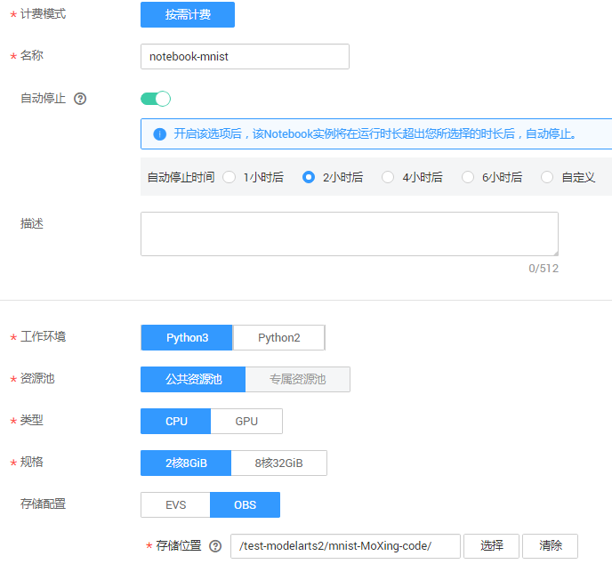

# 使用Notebook实现手写数字识别<a name="modelarts_10_0008"></a>

ModelArts为AI工程师提供了Notebook功能，工程师可在Notebook中一站式完成数据准备、模型训练、预测等操作。

本章节提供了使用MoXing实现手写数字图像识别应用的示例，帮助您快速梳理ModelArts的Notebook开发流程。

MNIST是一个手写体数字识别数据集，常被用作深度学习的入门样例。本示例将针对MNIST数据集，使用MoXing接口编写的模型训练和预测代码（ModelArts默认提供），您可以使用此示例，在Notebook中一站式完成模型训练，并上传图片进行预测。

开始使用样例前，请仔细阅读[准备工作](#zh-cn_topic_0169395480_section18603111615523)罗列的要求，提前完成准备工作。使用Notebook完成模型构建的步骤如下所示：

-   [步骤1：准备数据](#zh-cn_topic_0169395480_section31463233105)
-   [步骤2：使用Notebook训练模型并预测](#zh-cn_topic_0169395480_section1097133612916)
-   [步骤3：删除相关资源，避免计费](#zh-cn_topic_0169395480_section157112269308)

## 准备工作<a name="zh-cn_topic_0169395480_section18603111615523"></a>

-   已注册华为云账号，且在使用ModelArts前检查账号状态，账号不能处于欠费或冻结状态。
-   获取此账号的“AK/SK“，并在ModelArts全局配置中填写此信息，完成配置。详细操作指导请参见[获取访问密钥并完成ModelArts配置](https://support.huaweicloud.com/prepare-modelarts/modelarts_08_0002.html)。
-   已在OBS服务中创建桶和文件夹，用于存放样例数据集以及模型。如下示例中，请创建命名为“test-modelarts“的桶，并创建如[表1](#zh-cn_topic_0169395480_table1477818571332)所示的文件夹。

    创建OBS桶和文件夹的操作指导请参见[创建桶](https://support.huaweicloud.com/usermanual-obs/zh-cn_topic_0045829050.html)和[新建文件夹](https://support.huaweicloud.com/usermanual-obs/zh-cn_topic_0045829103.html)。由于ModelArts在“华北-北京一“区域下使用，为保证数据能正常访问，请务必在“华北-北京一“区域下创建OBS桶。

    **表 1**  文件夹列表

    <a name="zh-cn_topic_0169395480_table1477818571332"></a>
    <table><thead align="left"><tr id="zh-cn_topic_0169395480_row1077718579336"><th class="cellrowborder" valign="top" width="31.180000000000003%" id="mcps1.2.3.1.1"><p id="zh-cn_topic_0169395480_p7777105714334"><a name="zh-cn_topic_0169395480_p7777105714334"></a><a name="zh-cn_topic_0169395480_p7777105714334"></a>文件夹名称</p>
    </th>
    <th class="cellrowborder" valign="top" width="68.82000000000001%" id="mcps1.2.3.1.2"><p id="zh-cn_topic_0169395480_p19777157163317"><a name="zh-cn_topic_0169395480_p19777157163317"></a><a name="zh-cn_topic_0169395480_p19777157163317"></a>用途</p>
    </th>
    </tr>
    </thead>
    <tbody><tr id="zh-cn_topic_0169395480_row377775753311"><td class="cellrowborder" valign="top" width="31.180000000000003%" headers="mcps1.2.3.1.1 "><p id="zh-cn_topic_0169395480_p77771257203315"><a name="zh-cn_topic_0169395480_p77771257203315"></a><a name="zh-cn_topic_0169395480_p77771257203315"></a><span class="parmvalue" id="zh-cn_topic_0169395480_parmvalue207771257153312"><a name="zh-cn_topic_0169395480_parmvalue207771257153312"></a><a name="zh-cn_topic_0169395480_parmvalue207771257153312"></a>“dataset-mnist”</span></p>
    </td>
    <td class="cellrowborder" valign="top" width="68.82000000000001%" headers="mcps1.2.3.1.2 "><p id="zh-cn_topic_0169395480_p47771557183316"><a name="zh-cn_topic_0169395480_p47771557183316"></a><a name="zh-cn_topic_0169395480_p47771557183316"></a>用于存储数据集。</p>
    </td>
    </tr>
    <tr id="zh-cn_topic_0169395480_row977835717337"><td class="cellrowborder" valign="top" width="31.180000000000003%" headers="mcps1.2.3.1.1 "><p id="zh-cn_topic_0169395480_p277885783319"><a name="zh-cn_topic_0169395480_p277885783319"></a><a name="zh-cn_topic_0169395480_p277885783319"></a><span class="filepath" id="zh-cn_topic_0169395480_filepath11777145733313"><a name="zh-cn_topic_0169395480_filepath11777145733313"></a><a name="zh-cn_topic_0169395480_filepath11777145733313"></a>“mnist-MoXing-code”</span></p>
    </td>
    <td class="cellrowborder" valign="top" width="68.82000000000001%" headers="mcps1.2.3.1.2 "><p id="zh-cn_topic_0169395480_p1177820577331"><a name="zh-cn_topic_0169395480_p1177820577331"></a><a name="zh-cn_topic_0169395480_p1177820577331"></a>用于存储编写好的模型代码<span class="filepath" id="zh-cn_topic_0169395480_filepath877855719333"><a name="zh-cn_topic_0169395480_filepath877855719333"></a><a name="zh-cn_topic_0169395480_filepath877855719333"></a>“mnist_example.ipynb”</span>。</p>
    </td>
    </tr>
    <tr id="zh-cn_topic_0169395480_row1077815712334"><td class="cellrowborder" valign="top" width="31.180000000000003%" headers="mcps1.2.3.1.1 "><p id="zh-cn_topic_0169395480_p17786579337"><a name="zh-cn_topic_0169395480_p17786579337"></a><a name="zh-cn_topic_0169395480_p17786579337"></a><span class="parmvalue" id="zh-cn_topic_0169395480_parmvalue177813570337"><a name="zh-cn_topic_0169395480_parmvalue177813570337"></a><a name="zh-cn_topic_0169395480_parmvalue177813570337"></a>“train-log”</span></p>
    </td>
    <td class="cellrowborder" valign="top" width="68.82000000000001%" headers="mcps1.2.3.1.2 "><p id="zh-cn_topic_0169395480_p1377805713314"><a name="zh-cn_topic_0169395480_p1377805713314"></a><a name="zh-cn_topic_0169395480_p1377805713314"></a>用于存储图片，此图片用于预测。</p>
    </td>
    </tr>
    </tbody>
    </table>

-   针对此示例，ModelArts提供了一个编写好的模型代码“mnist\_example.ipynb“。您需要从Github中提前获取文件，待模型训练结束后，需要将此文件上传至对应位置。
    1.  在Github的[ModelArts-Lab](https://github.com/huaweicloud/ModelArts-Lab)工程中，单击“Clone or download“，然后在如下页面中单击“Download Zip“，下载工程。

        **图 1**  下载ModelArts-Lab<a name="zh-cn_topic_0169395480_fig141101453183910"></a>  
        

    2.  下载完成后，解压缩“ModelArts-Lab-master.zip“文件，然后在“\\ModelArts-Lab-master\\official\_examples\\Using\_Notebook\_to\_Create\_a\_MNIST\_Dataset\_Recognition\_Application\\code“目录中获取到示例代码文件“mnist\_example.ipynb“。
    3.  参考[上传文件至OBS](https://support.huaweicloud.com/usermanual-obs/zh-cn_topic_0045829660.html)的操作指导，将“mnist\_example.ipynb“文件上传至“test-modelarts“桶的“mnist-MoXing-code“文件夹中。

-   准备一张黑底白字的图片，且尺寸为“28px\*28px“，图片中手写一个数字。例如准备一张命名为“7.jpg“图片，图片中有一个手写数字7。将准备好的图片上传至“test-modelarts“桶的“train-log“文件夹中，用于预测。

## 步骤1：准备数据<a name="zh-cn_topic_0169395480_section31463233105"></a>

ModelArts在公共OBS桶中提供了MNIST数据集，命名为“Mnist-Data-Set“，因此，本文的操作示例使用此数据集进行模型构建。您需要执行如下操作，将数据集上传至您的OBS目录下，即准备工作中您创建的OBS目录“test-modelarts/dataset-mnist“。

1.  单击[数据集下载链接](https://modelarts-cnnorth1-market-dataset.obs.cn-north-1.myhuaweicloud.com/dataset-market/Mnist-Data-Set/archiver/Mnist-Data-Set.zip)，将“Mnist-Data-Set“数据集下载至本地。
2.  在本地，将“Mnist-Data-Set.zip“压缩包解压。例如，解压至本地“Mnist-Data-Set“文件夹下。
3.  参考[上传文件](https://support.huaweicloud.com/usermanual-obs/zh-cn_topic_0045829660.html)，使用批量上传方式将“Mnist-Data-Set“文件夹下的所有文件上传至“test-modelarts/dataset-mnist“OBS路径下。

    “Mnist-Data-Set“数据集包含的内容如下所示，其中“.gz“为对应的压缩包。

    -   “t10k-images-idx3-ubyte“：验证集，共包含10000个样本。
    -   “t10k-labels-idx1-ubyte“：验证集标签，共包含10000个样本的类别标签。
    -   “train-images-idx3-ubyte“：训练集，共包含60000个样本。
    -   “train-labels-idx1-ubyte“：训练集标签，共包含60000个样本的类别标签。


## 步骤2：使用Notebook训练模型并预测<a name="zh-cn_topic_0169395480_section1097133612916"></a>

数据准备完成后，您需要使用Notebook编写代码构建模型。ModelArts提供了一个基于MoXing实现手写数字图像训练、预测的示例代码“mnist\_example.ipynb“。

1.  <a name="zh-cn_topic_0169395480_li12891132171711"></a>参考[准备工作](#zh-cn_topic_0169395480_section18603111615523)的操作指导，获取“mnist\_example.ipynb“文件，并上传至OBS，例如“test-modelarts/mnist-MoXing-code“。
2.  在ModelArts管理控制台，进入“开发环境\>Notebook“页面，单击左上角的“创建“。
3.  在“创建Notebook“页面，参考[图2](#zh-cn_topic_0169395480_fig877937114415)填写相关信息，然后单击“下一步“。

    “存储配置“：请选择“OBS“，并在“存储位置“选择示例文件存储的OBS路径，例如“test-modelarts/mnist-MoXing-code“。

    **图 2**  创建Notebook<a name="zh-cn_topic_0169395480_fig877937114415"></a>  
    

4.  在“规格确认“页面，确认信息无误后，单击“提交“。
5.  在“Notebook“管理页面，当新建的Notebook状态变为“运行中“时，表示Notebook已创建完成。单击操作列的“打开“，进入“Jupyter“页面。
6.  在“Jupyter“页面的“Files“页签下，您可以看到步骤[1](#zh-cn_topic_0169395480_li12891132171711)上传的示例代码文件。单击文件名称，进入Notebook详情页。在详情页根据页面提示，选择和代码环境相匹配的Kernel环境。
7.  在Notebook详情页，示例代码文件已提供了详细的描述，包含“数据准备“、“训练模型“和“预测“。
    1.  **数据准备**：[步骤1：准备数据](#zh-cn_topic_0169395480_section31463233105)已完成数据准备，数据集所在路径为“test-modelarts/dataset-mnist/“。示例代码提供了数据集的介绍说明。
    2.  **训练模型**

        在训练模型区域，将“data\_url“修改为[步骤1：准备数据](#zh-cn_topic_0169395480_section31463233105)中数据集所在OBS路径，您可以从数据集管理页面拷贝OBS路径，并将OBS路径修改为“s3://“格式。例如：

        ```
        data_url = 's3://test-modelarts/dataset-mnist/'
        ```

        代码修改完成后，从第一个Cell开始，单击运行代码，将训练模型区域下的所有Cell运行一遍。在训练模型区域最后，将显示运行日志，当日志出现如下类似信息时，表示模型训练成功。如下日志信息表示模型训练成功，且模型文件已成功生成。

        ```
        INFO:tensorflow:No assets to write. 
        INFO:tensorflow:No assets to write. 
        INFO:tensorflow:Restoring parameters from ./cache/log/model.ckpt-1000 
        INFO:tensorflow:Restoring parameters from ./cache/log/model.ckpt-1000 
        INFO:tensorflow:SavedModel written to: b'./cache/log/model/saved_model.pb' 
        INFO:tensorflow:SavedModel written to: b'./cache/log/model/saved_model.pb' 
        An exception has occurred, use %tb to see the full traceback.
        ```

    3.  **预测**

        模型训练完成后，可上传一张图片，并使用生成的模型预测。参考[准备工作](#zh-cn_topic_0169395480_section18603111615523)操作指导示例，已将用于预测的“7.jpg“图片上传至“test-modelarts/train-log“路径中。

        在Notebook中，将预测区域的“src\_path“修改为图片实际存放的路径和名称。此处请使用“s3://“格式的OBS路径。

        ```
        src_path = 's3://test-modelarts/train-log/7.jpg'
        ```

        代码修改完成后，从第一个Cell开始，单击运行代码，将预测区域下的所有Cell运行一遍。在预测区域最后，将显示运行日志，当日志出现如下类似信息时，显示图片预测结果，例如本示例中图片的手写数字为“7“。请对比图片中的数字和预测结果，判断预测结果是否正确。

        ```
        INFO:tensorflow:Running local_init_op. 
        INFO:tensorflow:Done running local_init_op. 
        INFO:tensorflow:Done running local_init_op. 
        The result: [7] 
        INFO:tensorflow:[1 examples] 
        INFO:tensorflow:	[1 examples] 
        An exception has occurred, use %tb to see the full traceback.
        ```


## 步骤3：删除相关资源，避免计费<a name="zh-cn_topic_0169395480_section157112269308"></a>

为避免产生不必要的费用，在完成试用后，建议您删除相关资源，本示例包含数据集和Notebook。

-   删除Notebook：在“开发环境\>Notebook“页面，单击操作列的“删除“。
-   删除数据集：在“数据管理\>数据集“页面，在“dataset-mnist“数据集右侧，单击删除按钮。在弹出的对话框中，勾选“删除数据集同时删除桶内文件“，避免OBS因存储数据而继续收费。

    **图 3**  删除数据集<a name="zh-cn_topic_0169395480_fig14240219113212"></a>  
    


