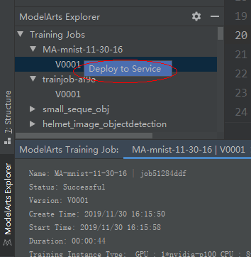
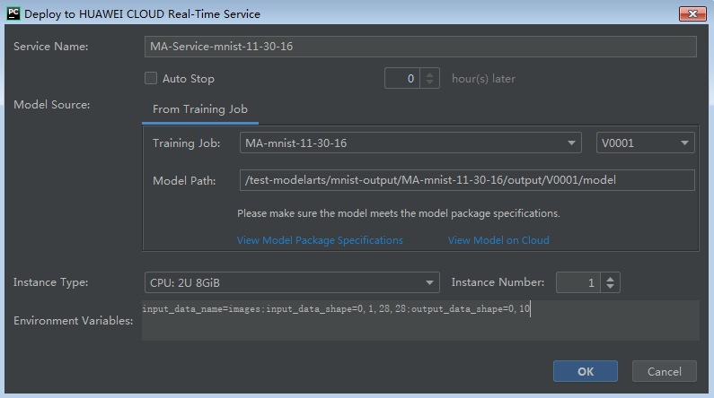
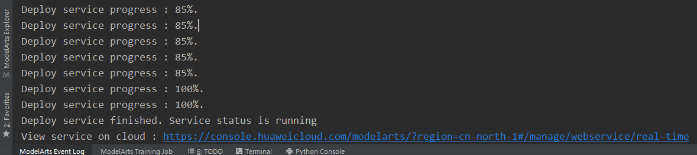

# 使用PyCharm ToolKit工具快速实现模型训练和部署

本章节提供了使用MXNet实现手写数字图像识别应用的示例，帮助您使用ModelArts提供的PyCharm ToolKit工具，在本地快速完成模型的训练和部署。

MNIST是一个手写体数字识别数据集，常被用作深度学习的入门样例。本示例将针对MNIST数据集，使用MXNet原生接口编写的模型训练脚本（ModelArts默认提供），在ModelArts PyCharm ToolKit中完成模型训练，并将此模型部署为在线服务。部署完成后，用户可通过在线服务识别输入图片中的数字。

开始使用样例前，请仔细阅读[准备工作](#section12968454194113)罗列的要求，提前完成准备工作。本示例模型构建的步骤如下所示：

## 准备工作

-   本地已安装PyCharm 2019.2，推荐Windows版本，Community或Professional均可，请单击[PyCharm工具下载地址](https://www.jetbrains.com/pycharm/download/other.html)获取工具并在本地完成安装。
-   已注册华为云账号，且在使用ModelArts前检查账号状态，账号不能处于欠费或冻结状态。
-   获取此账号的“AK/SK“，安装PyCharm ToolKit，并在PyCharm ToolKit中填写此信息。详细操作指导请参见[使用访问秘钥登录](https://support.huaweicloud.com/tg-modelarts/modelarts_15_0005.html)。
-   已在OBS服务中创建桶和文件夹，用于存放样例数据集以及模型。如下示例中，请创建命名为“test-modelarts“的桶，并创建如[表1](#table2061005120337)所示的文件夹。

    创建OBS桶和文件夹的操作指导请参见[创建桶](https://support.huaweicloud.com/usermanual-obs/obs_03_0306.html)和[新建文件夹](https://support.huaweicloud.com/usermanual-obs/obs_03_0316.html)。确保您使用的OBS目录与ModelArts在同一区域。

    **表 1**  文件夹列表

    
    <table><thead align="left"><tr id="row1860945116333"><th class="cellrowborder" valign="top" width="31.180000000000003%" id="mcps1.2.3.1.1">
文件夹名称

    </th>
    <th class="cellrowborder" valign="top" width="68.82000000000001%" id="mcps1.2.3.1.2">
用途

    </th>
    </tr>
    </thead>
    <tbody><tr id="row06099518334"><td class="cellrowborder" valign="top" width="31.180000000000003%" headers="mcps1.2.3.1.1 ">
“dataset-mnist”

    </td>
    <td class="cellrowborder" valign="top" width="68.82000000000001%" headers="mcps1.2.3.1.2 ">
用于存储数据集。

    </td>
    </tr>
    <tr id="row11609185115337"><td class="cellrowborder" valign="top" width="31.180000000000003%" headers="mcps1.2.3.1.1 ">
“mnist-output”

    </td>
    <td class="cellrowborder" valign="top" width="68.82000000000001%" headers="mcps1.2.3.1.2 ">
用于存储训练输出的模型和日志文件。

    </td>
    </tr>
    </tbody>
    </table>

## 步骤1：准备数据

ModelArts在公共OBS桶中提供了MNIST数据集，命名为“Mnist-Data-Set“，因此，本文的操作示例使用此数据集进行模型构建。您需要执行如下操作，将数据集上传至您的OBS目录下，即准备工作中您创建的OBS目录“test-modelarts/dataset-mnist“。

1.  单击[数据集下载链接](https://modelarts-cnnorth1-market-dataset.obs.cn-north-1.myhuaweicloud.com/dataset-market/Mnist-Data-Set/archiver/Mnist-Data-Set.zip)，将“Mnist-Data-Set“数据集下载至本地。
2.  在本地，将“Mnist-Data-Set.zip“压缩包解压。例如，解压至本地“Mnist-Data-Set“文件夹下。
3.  参考[上传文件](https://support.huaweicloud.com/usermanual-obs/obs_03_0307.html)，使用批量上传方式将“Mnist-Data-Set“文件夹下的所有文件上传至“test-modelarts/dataset-mnist“OBS路径下。

    “Mnist-Data-Set“数据集包含的内容如下所示，其中“.gz“为对应的压缩包。

    -   “t10k-images-idx3-ubyte“：验证集，共包含10000个样本。
    -   “t10k-images-idx3-ubyte.gz“：验证集的压缩包文件。
    -   “t10k-labels-idx1-ubyte“：验证集标签，共包含10000个样本的类别标签。
    -   “t10k-labels-idx1-ubyte.gz“：验证集标签的压缩包文件。
    -   “train-images-idx3-ubyte“：训练集，共包含60000个样本。
    -   “train-images-idx3-ubyte.gz“：训练集的压缩包文件。
    -   “train-labels-idx1-ubyte“：训练集标签，共包含60000个样本的类别标签。
    -   “train-labels-idx1-ubyte.gz“：训练集标签的压缩包文件。

## 步骤2：编写训练代码

ModelArts提供了本示例需要使用的训练代码，请获取并在PyCharm工程中打开。

1.  在gitee的[ModelArts-Lab](https://gitee.com/ModelArts/ModelArts-Lab)工程中，单击“克隆/下载“，然后单击“下载ZIP“，下载工程。
2.  下载完成后，解压缩“ModelArts-Lab-master.zip“文件，然后在“\\ModelArts-Lab-master\\official\_examples\\Using\_MXNet\_to\_Create\_a\_MNIST\_Dataset\_Recognition\_Application\\codes“目录中获取到训练代码文件“train\_mnist.py“、
3.  打开PyCharm工具，单击“File \> Create Project“创建新工程， 在工程目录下创建“src“文件夹，并将训练代码文件“train\_mnist.py“拷贝到“src“文件夹下。

    **图 1**  将训练代码拷贝至src目录  
    

## 步骤3：训练模型

数据和代码准备完成后，您可以创建一个训练作业，选用MXNet引擎，基于本地的train\_mnist.py训练脚本，并最终生成一个可用的模型。本示例已提供编码完成的脚本（基于MXNet引擎的原生接口），如果使用自行编写的代码，请使用ModelArts支持的引擎类型及其对应版本的接口，并满足其要求。

1.  在PyCharm工具栏中，选择“ModelArts \> Edit Training Job Configuration“。
2.  在弹出的对话框中，按照如下示例配置训练参数。

    -   “Job Name“：自动生成，首次提交训练作业时，该名称也可以自己指定。
    -   “AI Engine“：选择“MXNet“，版本为“MXNet-1.2.1-python3.6“。
    -   “Specifications“：选择GPU规格。
    -   “OBS Path“：填写[步骤1：准备数据](#section1620725194417)中数据上传的OBS目录。
    -   “Data Path in OBS“：填写[步骤1：准备数据](#section1620725194417)中数据上传的OBS目录。此处需完整OBS路径，需包含OBS桶名称。

        此示例填写的值如图所示，请务必修改为您自己的OBS桶及路径。

    -   “Boot File Path“：选择本地的训练脚本“train\_mnist.py“。
    -   “Code Directory“：选择启动脚本所在“src“目录。
    -   “Running Parameters“：是训练脚本所需要的输入参数，本样例中没有参数，无需填写。

    填写完成后，单击“Apply and Run“提交训练作业到云上ModelArts。

    > **说明：**   
    >由于MNIST数据集数据较多，为提升训练效率，操作示例选择GPU训练。但是，GPU的费用高于CPU，请根据实际情况选择可用的资源池。  

    **图 2**  配置训练作业  
    

3.  训练作业提交后，可在下方查看训练日志。当训练日志中出现“Current training job status: Successful“类似信息时，表示训练作业运行成功。

    **图 3**  查看训练日志  
    

    其中，  “ModelArts Event Log“栏为工具打印的日志，“ModelArts Training Log“为训练脚本代码打印的日志。

    从日志可以看到，工具会先将本地工程的代码自动上传至云上OBS，然后自动提交一个训练作业。作业提交成功后，工具会实时从云上的训练环境获取日志并展示在“ModelArts Training Log“窗口，直至作业运行结束。

4.  在PyCharm的左边菜单栏，单击“ModelArts Explorer“，选择刚才提交的作业，双击版本号“V0001“，可以查看作业详情。

    **图 4**  选择对应的训练作业及版本  
    

    **图 5**  训练作业详情  
    

## 步骤4：编写推理代码和配置文件，并上传至模型所在路径

ModelArts提供了本示例需要使用的推理代码“customize\_service.py“和配置文件“config.json“文件路径和下载的git工程中的训练代码在同一目录。此推理代码和配置文件是ModelArts提供的示例。

在[步骤3：训练模型](#section10578162455118)中，训练作业生成的模型存储在“test-modelarts/mnist-output/MA-mnist-11-30-16/output/V0001“路径下（其中MA-mnist-11-30-16是Job Name，如果配置时填写了自定义Job Name，则路径中就是自定义的Job Name），且系统将自动生成“model“文件夹，模型相关的文件存储在此目录下。将获取的“customize\_service.py“和“config.json“文件，上传至OBS的“model“文件夹下。

> **说明：**   
>如果训练作业运行多次，将在“训练输出位置“生成不同的版本，即“mnist-output“目录下将生成多种版本的目录，如“V0001“、“V0002“，请基于训练作业的版本，将文件上传至对应版本下的“model“文件夹内。  

前往OBS管理控制台，找到“test-modelarts“桶，然后进入“test-modelarts/mnist-output/MA-mnist-11-30-16/output/V001/model“路径，执行“上传对象“的操作。OBS的上传操作指导，请参见[上传文件](https://support.huaweicloud.com/usermanual-obs/obs_03_0307.html)。

## 步骤5：部署在线服务

训练完成的模型还是存储在OBS路径中，您可以将此模型导入到ModelArts中并部署为在线服务。

1.  在训练作业版本号上单击鼠标右键，选择“Deploy to Service“。

    **图 6**  部署为在线服务  
    

2.  在弹出的对话框中，按照如下说明填写部署为在线服务的参数。

    -   “Service Name“：自动生成，也可以自定义。

    -   “Auto Stop“：勾选Auto Stop，表示启动自动停止功能，服务会在指定时间后自动停止。
    -   “Model Path“：自动填写，无需自己配置。与您选择的训练作业及其版本一致。
    -   “Environment Variables“：填写运行参数，设置为“input\_data\_name=images;input\_data\_shape=0,1,28,28;output\_data\_shape=0,10“。
        -   “input\_data\_name“：参数值必须是images。针对自己开发训练脚本的场景，此参数是必须设置的。您可以在导入模型时设置参数，也可以写到推理代码中。
        -   “input\_data\_shape“：代表NCHW。本示例的数值为“0,1,28,28“，表示设置了输入图片的规则，其中，输入预测图片大小必须是“28px\*28px“。
        -   “output\_data\_shape“：置信度。本示例指定范围为“0～10“。表示输出结果会显示“0～10“中10个类别，属于每一个类别的概率。

    信息填写完成后，单击“OK“，开始服务部署。

    **图 7**  部署为在线服务  
    

    可以在最下方的日志栏查看服务部署进度。

    **图 8**  查看部署进度  
    

    模型部署上线需要花费一些时间，请耐心等待几分钟。当出现类似“Service status is running”信息时，表示服务部署成功。服务部署成功后，将展示在线服务的链接，单击链接可以进入华为云ModelArts在线服务的界面。

    > **说明：**   
    >首次进入需要输入华为云账号密码登录。  

    **图 9**  完成部署  
    

## 步骤6：测试服务

在线服务部署成功后，您可以进入在线服务，发起预测请求进行测试。

1.  部署成功后，单击提供的链接进入在线服务。
2.  在线服务详情页面中，单击“预测“页签，进入预测页面。
3.  在“选择预测图片文件“右侧，单击“上传“按钮，上传一张黑底白字的图片，然后单击“预测“。

    预测完成后，预测结果显示区域将展示预测结果，根据预测结果内容，可识别出此图片的数字是“8“的概率为“1“。

    > **说明：**   
    >-   由于推理代码和配置文件中已指定图片要求，用于预测的图片，大小必须为“28px\*28px“，且图片必须是黑底白字。  
    >-   建议不要使用数据集中自带的图片，可以使用Windows自带的画图工具绘制一张。  

    **图 10**  预测结果  
    

## 步骤7：清除相应资源，避免产生费用

为避免产生不必要的费用，在完成试用后，建议您删除相关资源，如在线服务、训练作业、数据集及其OBS目录。

-   进入ModelArts管理控制台，删除在线服务：在“在线服务“页面，单击操作列的“更多\>删除“。
-   进入ModelArts管理控制台，删除训练作业：在“训练作业“页面，单击操作列的“删除“。
-   进入OBS管理控制台，删除数据准备阶段创建的OBS桶。先逐个删除桶内文件夹和文件，再执行删除桶的操作。

