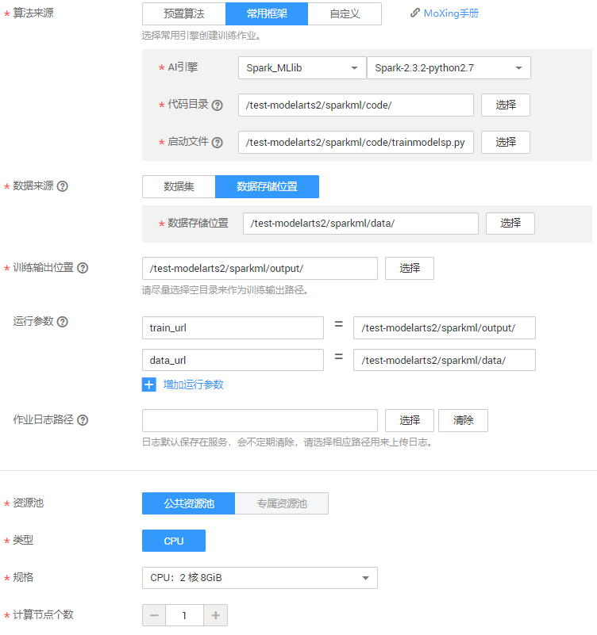
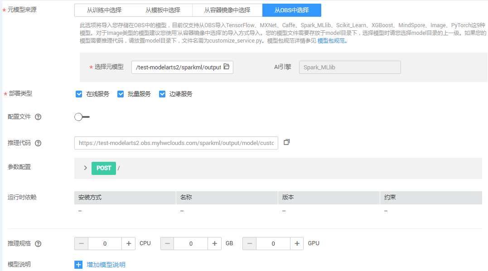
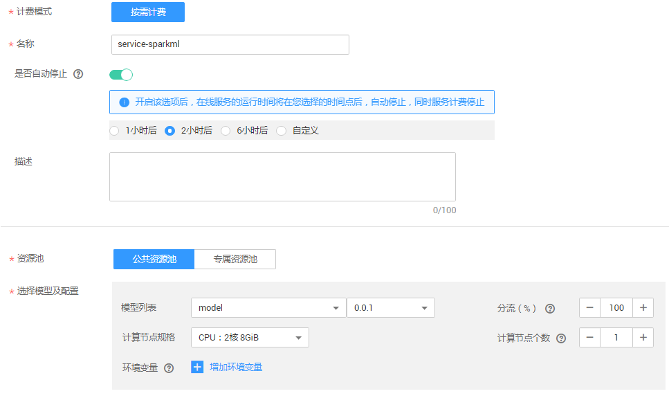
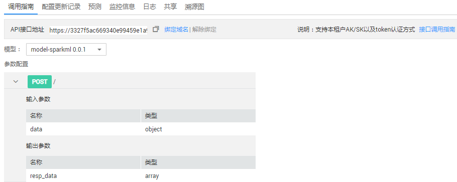

# 使用Spark MLlib实现精准推荐<a name="modelarts_10_0012"></a>

消费无处不在，但每一次消费行为带给人们的感受却或好或坏。在时间成本高昂的背景下，消费者不希望花太多时间就能找到自己喜欢的事物。而快速、准确的消费品推荐，可显著降低消费者寻找的时间成本，不仅提升用户消费感受，也能提高商家的销售量。

您可以使用ModelArts平台上的Spark MLlib算法，提供精准营销的方向和辅助决策，提升消费品转化率和商家利润，改善消费者的消费体验。

开始使用如下样例前，请务必按[准备工作](https://support.huaweicloud.com/prepare-modelarts/modelarts_08_0001.html)指导完成必要操作。精准推荐样例的操作流程如下所示。

1.  **[准备数据](#section173231827111011)**：下载数据集、示例代码，然后上传至OBS桶中。
2.  **[训练模型](#section520916579104)**：编写基于Spark MLlib中ALS算法的模型训练脚本，新建训练作业进行模型训练。
3.  **[部署模型](#section88321514117)**：得到训练好的模型文件后，新建预测作业将模型部署为在线预测服务。
4.  **[预测结果](#section92339128111)**：发起预测请求获取预测结果。

## 准备数据<a name="section173231827111011"></a>

ModelArts提供了用于训练的数据集和示例代码，执行如下步骤，下载数据集和示例代码，并上传至OBS中。

1.  在gitee的[ModelArts-Lab](https://gitee.com/ModelArts/ModelArts-Lab)工程中，单击“克隆/下载“，然后单击“下载ZIP“，下载工程。
2.  <a name="li1747181114110"></a>下载完成后，将“ModelArts-Lab-master.zip“文件解压缩，然后在“ModelArts-Lab-master\\official\_examples\\Using\_Spark\_MLlib\_to\_Create\_a\_Precise\_Recommendation\_Application“目录中获取到训练数据集“ratings.csv“和示例代码“trainmodelsp.py“ “customize\_service.py“。

    **表 1**  获取的文件说明

    <a name="table1222116474916"></a>
    <table><thead align="left"><tr id="row32211547796"><th class="cellrowborder" valign="top" width="33.26%" id="mcps1.2.3.1.1"><p id="p192213471498"><a name="p192213471498"></a><a name="p192213471498"></a>文件名称</p>
    </th>
    <th class="cellrowborder" valign="top" width="66.74%" id="mcps1.2.3.1.2"><p id="p122184710913"><a name="p122184710913"></a><a name="p122184710913"></a>说明</p>
    </th>
    </tr>
    </thead>
    <tbody><tr id="row52212471596"><td class="cellrowborder" valign="top" width="33.26%" headers="mcps1.2.3.1.1 "><p id="p52217471916"><a name="p52217471916"></a><a name="p52217471916"></a><span class="filepath" id="filepath099211246179"><a name="filepath099211246179"></a><a name="filepath099211246179"></a>“ratings.csv”</span></p>
    </td>
    <td class="cellrowborder" valign="top" width="66.74%" headers="mcps1.2.3.1.2 "><p id="p1822217471397"><a name="p1822217471397"></a><a name="p1822217471397"></a>训练数据集。数据集的详情如<a href="#table821421931718">表2</a>和<a href="#table1321521912176">表3</a>所示。</p>
    </td>
    </tr>
    <tr id="row1622224711910"><td class="cellrowborder" valign="top" width="33.26%" headers="mcps1.2.3.1.1 "><p id="p1122217474914"><a name="p1122217474914"></a><a name="p1122217474914"></a><span class="filepath" id="filepath5835091715"><a name="filepath5835091715"></a><a name="filepath5835091715"></a>“trainmodelsp.py”</span></p>
    </td>
    <td class="cellrowborder" valign="top" width="66.74%" headers="mcps1.2.3.1.2 "><p id="p152224474913"><a name="p152224474913"></a><a name="p152224474913"></a>训练脚本。示例代码是使用ALS算法编写的Python训练脚本。</p>
    </td>
    </tr>
    <tr id="row61244470173"><td class="cellrowborder" valign="top" width="33.26%" headers="mcps1.2.3.1.1 "><p id="p11251747101715"><a name="p11251747101715"></a><a name="p11251747101715"></a><span class="filepath" id="filepath19232184121819"><a name="filepath19232184121819"></a><a name="filepath19232184121819"></a>“customize_service.py”</span></p>
    </td>
    <td class="cellrowborder" valign="top" width="66.74%" headers="mcps1.2.3.1.2 "><p id="p1612554701714"><a name="p1612554701714"></a><a name="p1612554701714"></a>用户自定义的预测脚本，需与训练脚本<span class="filepath" id="filepath172128194175"><a name="filepath172128194175"></a><a name="filepath172128194175"></a>“trainmodelsp.py”</span>上传至相同OBS目录下。训练过程中，将被自动拷贝至相应的模型目录下。</p>
    </td>
    </tr>
    </tbody>
    </table>

    **表 2**  数据源的具体字段及意义

    <a name="table821421931718"></a>
    <table><thead align="left"><tr id="row1721321911713"><th class="cellrowborder" valign="top" width="22.89%" id="mcps1.2.5.1.1"><p id="p32131519161717"><a name="p32131519161717"></a><a name="p32131519161717"></a>字段名</p>
    </th>
    <th class="cellrowborder" valign="top" width="20.94%" id="mcps1.2.5.1.2"><p id="p9213131991712"><a name="p9213131991712"></a><a name="p9213131991712"></a>含义</p>
    </th>
    <th class="cellrowborder" valign="top" width="18.38%" id="mcps1.2.5.1.3"><p id="p112135196170"><a name="p112135196170"></a><a name="p112135196170"></a>类型</p>
    </th>
    <th class="cellrowborder" valign="top" width="37.79%" id="mcps1.2.5.1.4"><p id="p172131819161714"><a name="p172131819161714"></a><a name="p172131819161714"></a>描述</p>
    </th>
    </tr>
    </thead>
    <tbody><tr id="row1021331912178"><td class="cellrowborder" valign="top" width="22.89%" headers="mcps1.2.5.1.1 "><p id="p6213171961712"><a name="p6213171961712"></a><a name="p6213171961712"></a>attr_1</p>
    </td>
    <td class="cellrowborder" valign="top" width="20.94%" headers="mcps1.2.5.1.2 "><p id="p221361913173"><a name="p221361913173"></a><a name="p221361913173"></a>用户ID</p>
    </td>
    <td class="cellrowborder" valign="top" width="18.38%" headers="mcps1.2.5.1.3 "><p id="p5213141911713"><a name="p5213141911713"></a><a name="p5213141911713"></a>Int</p>
    </td>
    <td class="cellrowborder" valign="top" width="37.79%" headers="mcps1.2.5.1.4 "><p id="p62131619191710"><a name="p62131619191710"></a><a name="p62131619191710"></a>消费者标识。</p>
    </td>
    </tr>
    <tr id="row1521320199174"><td class="cellrowborder" valign="top" width="22.89%" headers="mcps1.2.5.1.1 "><p id="p102131619121711"><a name="p102131619121711"></a><a name="p102131619121711"></a>attr_2</p>
    </td>
    <td class="cellrowborder" valign="top" width="20.94%" headers="mcps1.2.5.1.2 "><p id="p6213141916173"><a name="p6213141916173"></a><a name="p6213141916173"></a>商品ID</p>
    </td>
    <td class="cellrowborder" valign="top" width="18.38%" headers="mcps1.2.5.1.3 "><p id="p4213131911719"><a name="p4213131911719"></a><a name="p4213131911719"></a>Int</p>
    </td>
    <td class="cellrowborder" valign="top" width="37.79%" headers="mcps1.2.5.1.4 "><p id="p521361911719"><a name="p521361911719"></a><a name="p521361911719"></a>消费品标识。</p>
    </td>
    </tr>
    <tr id="row18214151911173"><td class="cellrowborder" valign="top" width="22.89%" headers="mcps1.2.5.1.1 "><p id="p122131819141715"><a name="p122131819141715"></a><a name="p122131819141715"></a>attr_3</p>
    </td>
    <td class="cellrowborder" valign="top" width="20.94%" headers="mcps1.2.5.1.2 "><p id="p5213141914178"><a name="p5213141914178"></a><a name="p5213141914178"></a>评分</p>
    </td>
    <td class="cellrowborder" valign="top" width="18.38%" headers="mcps1.2.5.1.3 "><p id="p721481913174"><a name="p721481913174"></a><a name="p721481913174"></a>Real</p>
    </td>
    <td class="cellrowborder" valign="top" width="37.79%" headers="mcps1.2.5.1.4 "><p id="p9214519111718"><a name="p9214519111718"></a><a name="p9214519111718"></a>消费者对消费品的评分（1-5）。</p>
    </td>
    </tr>
    </tbody>
    </table>

    **表 3**  数据集样本数据

    <a name="table1321521912176"></a>
    <table><thead align="left"><tr id="row42141319121713"><th class="cellrowborder" valign="top" width="33.33333333333333%" id="mcps1.2.4.1.1"><p id="p621411991719"><a name="p621411991719"></a><a name="p621411991719"></a>attr_1</p>
    </th>
    <th class="cellrowborder" valign="top" width="33.33333333333333%" id="mcps1.2.4.1.2"><p id="p19214819131713"><a name="p19214819131713"></a><a name="p19214819131713"></a>attr_2</p>
    </th>
    <th class="cellrowborder" valign="top" width="33.33333333333333%" id="mcps1.2.4.1.3"><p id="p16214419191718"><a name="p16214419191718"></a><a name="p16214419191718"></a>attr_3</p>
    </th>
    </tr>
    </thead>
    <tbody><tr id="row152144195170"><td class="cellrowborder" valign="top" width="33.33333333333333%" headers="mcps1.2.4.1.1 "><p id="p1821461911174"><a name="p1821461911174"></a><a name="p1821461911174"></a>1</p>
    </td>
    <td class="cellrowborder" valign="top" width="33.33333333333333%" headers="mcps1.2.4.1.2 "><p id="p16214619191719"><a name="p16214619191719"></a><a name="p16214619191719"></a>146</p>
    </td>
    <td class="cellrowborder" valign="top" width="33.33333333333333%" headers="mcps1.2.4.1.3 "><p id="p221451917178"><a name="p221451917178"></a><a name="p221451917178"></a>5</p>
    </td>
    </tr>
    <tr id="row72141819121714"><td class="cellrowborder" valign="top" width="33.33333333333333%" headers="mcps1.2.4.1.1 "><p id="p1821413191174"><a name="p1821413191174"></a><a name="p1821413191174"></a>1</p>
    </td>
    <td class="cellrowborder" valign="top" width="33.33333333333333%" headers="mcps1.2.4.1.2 "><p id="p921411199174"><a name="p921411199174"></a><a name="p921411199174"></a>1198</p>
    </td>
    <td class="cellrowborder" valign="top" width="33.33333333333333%" headers="mcps1.2.4.1.3 "><p id="p1221471951718"><a name="p1221471951718"></a><a name="p1221471951718"></a>4</p>
    </td>
    </tr>
    <tr id="row14215119201716"><td class="cellrowborder" valign="top" width="33.33333333333333%" headers="mcps1.2.4.1.1 "><p id="p421419193177"><a name="p421419193177"></a><a name="p421419193177"></a>1</p>
    </td>
    <td class="cellrowborder" valign="top" width="33.33333333333333%" headers="mcps1.2.4.1.2 "><p id="p17215119161711"><a name="p17215119161711"></a><a name="p17215119161711"></a>611</p>
    </td>
    <td class="cellrowborder" valign="top" width="33.33333333333333%" headers="mcps1.2.4.1.3 "><p id="p20215919181713"><a name="p20215919181713"></a><a name="p20215919181713"></a>4</p>
    </td>
    </tr>
    <tr id="row122151198171"><td class="cellrowborder" valign="top" width="33.33333333333333%" headers="mcps1.2.4.1.1 "><p id="p321551961714"><a name="p321551961714"></a><a name="p321551961714"></a>2</p>
    </td>
    <td class="cellrowborder" valign="top" width="33.33333333333333%" headers="mcps1.2.4.1.2 "><p id="p02150198172"><a name="p02150198172"></a><a name="p02150198172"></a>914</p>
    </td>
    <td class="cellrowborder" valign="top" width="33.33333333333333%" headers="mcps1.2.4.1.3 "><p id="p13215619191711"><a name="p13215619191711"></a><a name="p13215619191711"></a>3</p>
    </td>
    </tr>
    <tr id="row82153192177"><td class="cellrowborder" valign="top" width="33.33333333333333%" headers="mcps1.2.4.1.1 "><p id="p62154196178"><a name="p62154196178"></a><a name="p62154196178"></a>2</p>
    </td>
    <td class="cellrowborder" valign="top" width="33.33333333333333%" headers="mcps1.2.4.1.2 "><p id="p921518199178"><a name="p921518199178"></a><a name="p921518199178"></a>146</p>
    </td>
    <td class="cellrowborder" valign="top" width="33.33333333333333%" headers="mcps1.2.4.1.3 "><p id="p112159198177"><a name="p112159198177"></a><a name="p112159198177"></a>4</p>
    </td>
    </tr>
    </tbody>
    </table>

3.  进入OBS管理控制台，新建桶和文件夹，分别用于存储训练数据集和示例代码。例如新建“test-modelarts“桶，并在此桶下新建“sparkml/data“和“sparkml/code“文件夹。

    “sparkml/data“用于存放训练数据集“ratings.csv“，“sparkml/code“用于存放示例代码“trainmodelsp.py“和“customize\_service.py“。

4.  将步骤[2](#li1747181114110)中获取的文件，上传至对应OBS路径下，即“sparkml/data“和“sparkml/code“文件夹。OBS上传文件的操作指导，请参见[上传文件](https://support.huaweicloud.com/usermanual-obs/obs_03_0307.html)。

## 训练模型<a name="section520916579104"></a>

1.  在ModelArts管理控制台，进入“训练管理 \> 训练作业“页面，单击左上角的“创建“。
2.  如[图1](#fig1126811401611)和[图2](#fig526884012119)所示，参考图中示例，填写训练作业相关参数，然后单击“下一步“。

    其中，“数据来源“和“算法来源“即[准备数据](#section173231827111011)上传的OBS路径及文件。“训练输出位置“，建议新建一个OBS文件夹，用于存储训练输出的模型及其预测文件，例如“sparkml/output“。

    **图 1**  创建训练作业-基本信息<a name="fig1126811401611"></a>  
    

    **图 2**  创建训练作业-参数设置<a name="fig526884012119"></a>  
    

3.  在规格确认页面，确认信息无误后，单击“提交“。
4.  在“训练管理 \> 训练作业“管理页面，当训练作业变为“运行成功“时，即完成了模型训练过程。如有问题，可单击作业名称，进入作业详情界面查看训练作业日志信息。

    > **说明：**   
    >训练作业需要花费一些时间，预计十几分钟。当训练时间超过一定时间（如1个小时），请及时手动停止，释放资源。否则会导致欠费，尤其对于使用GPU训练的模型项目。  


## 部署模型<a name="section88321514117"></a>

待训练作业运行完成后，可以将训练好的模型发布成预测服务。

1.  在“模型“页面，单击左上角“导入“，进入“导入模型“页面。
2.  如[图3](#fig7240651191020)所示，参考图片示例填写参数，然后单击“立即创建“。

    其中，“选择元模型“的路径为训练作业中“训练输出位置“指定的路径。同时，系统将从选择的路径下自动匹配到训练作业生成的推理代码。

    **图 3**  导入模型<a name="fig7240651191020"></a>  
    

3.  在模型列表中，当创建的模型处于“正常“状态时，表示模型导入成功。单击模型名称左侧的小三角，打开此模型下的所有版本。在对应版本所在行，您可以在操作列单击“部署\>在线服务“，将模型部署为在线服务。
4.  在“部署“页面，请参考[图4](#fig20614113342113)中的示例填写参数，然后单击“下一步“。

    **图 4**  部署<a name="fig20614113342113"></a>  
    

5.  在“规格确认“页面，确认信息无误后的，单击“提交“。
6.  在线服务创建完成后，系统自动跳转至“部署上线\>在线服务“页面。服务部署需要一定时间，耐心等待即可。当服务状态变为“运行中“时，表示服务部署成功。

## 预测结果<a name="section92339128111"></a>

待部署模型运行完成后，可以验证发布的预测服务是否正常。

1.  在“部署上线\>在线服务“页面，单击服务名称进入详情页面。
2.  在“预测“页签，参考[图 测试服务](#fig11904135513406)所示样例，输入预测代码，然后单击“预测“。在右侧“返回结果“中，查看预测结果。

    预测请求代码如下所示。

    ```
    {
    "data": {
    "req_data": [
    {
    "input_1": 2,
    "input_2": 21
    }
    ]
    }
    }
    ```

    **图 5**  测试服务<a name="fig11904135513406"></a>  
    

3.  在“调用指南“页签，可以获取调用API接口，并使用Postman工具进行测试。

    **图 6**  调用指南<a name="fig197711714182517"></a>  
    


