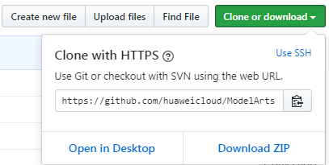
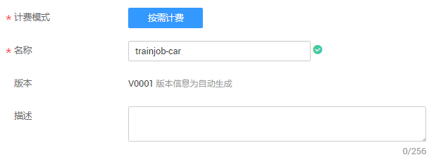
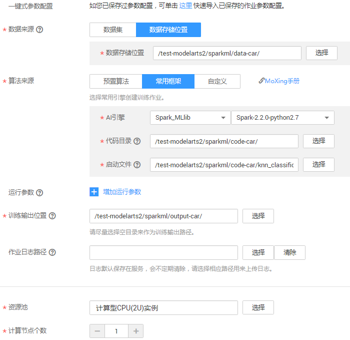
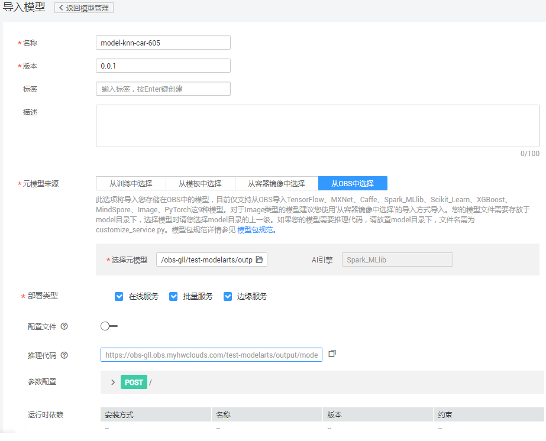
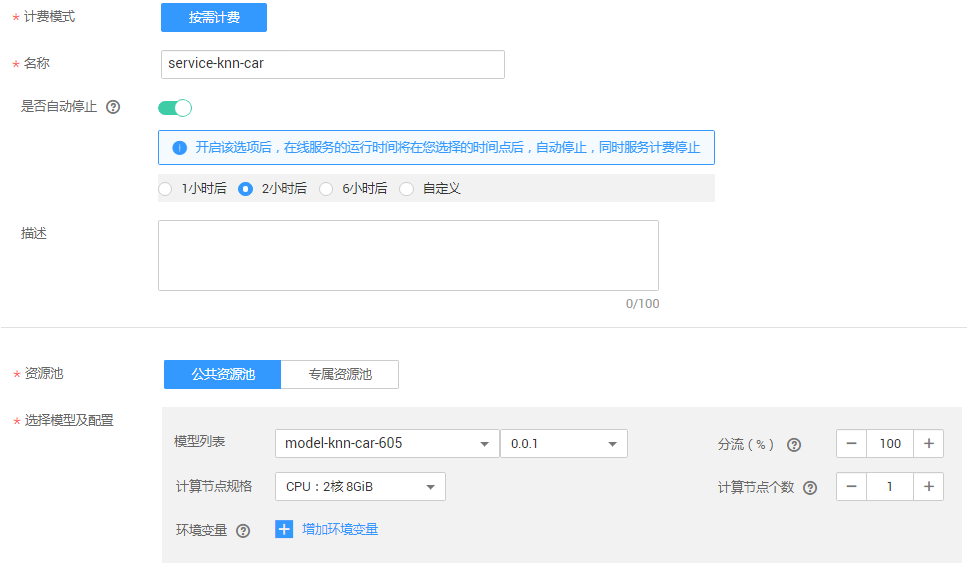
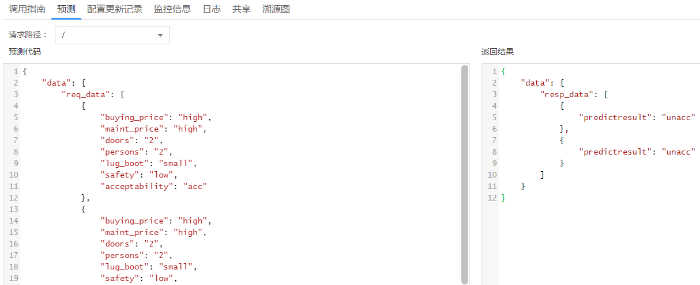
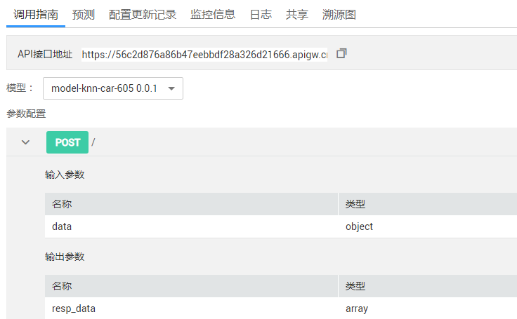

# 使用Spark MLlib实现车辆满意度测评<a name="modelarts_10_0015"></a>

使用KNN分类算法进行车辆满意度测评，选用经典的Car Evaluation数据集，通过对六个特征值进行测评，得到用户对车辆的满意程度。

KNN Classification（K最近邻分类）算法用于产生二分类或多分类模型。基本思想是，如果一个样本在特征空间k个最邻近样本中，大多数属于某一个类别，则该样本也属于这个类别。该算法对噪声具有较好的鲁棒性，并且可以较好的避免样本数量不平衡的问题。其中k是用户指定的整数值，该参数的选取高度依赖输入数据，通常较大的k会抑制噪声的影响，但同时也会使得分类边界变得模糊。该算法适合数据记录数小于100万，维度小于100维的分类场景。在二分类问题中，选取k为奇数有助于避免两个分类平票的情形。

本示例介绍如何使用Spark MLlib引擎的KNN分类算法实现车辆满意度测评应用。车辆满意度测评样例的操作流程如下所示。

1.  **[准备数据](#section16791133871410)**：下载数据集、示例代码，然后上传至OBS桶中。
2.  **[训练模型](#section15883611781)**：编写基于Spark MLlib中ALS算法的模型训练脚本，新建训练作业进行模型训练。
3.  **[部署模型](#section7124946131216)**：得到训练好的模型文件后，新建预测作业将模型部署为在线预测服务。
4.  **[预测结果](#section773012861716)**：发起预测请求获取预测结果。

## 准备数据<a name="section16791133871410"></a>

ModelArts提供了用于训练的数据集和示例代码，执行如下步骤，下载数据集和示例代码，并上传至OBS中。

1.  在Github的  [ModelArts-Lab](https://github.com/huaweicloud/ModelArts-Lab/)工程中，单击“Clone or download“，然后在如下页面中单击“Download Zip“，下载“ModelArts-Lab“工程。

    **图 1**  下载ModelArts-Lab<a name="fig1230292013811"></a>  
    

2.  <a name="li03094311159"></a>下载完成后，解压缩“ModelArts-Lab-master.zip“文件，然后在“\\ModelArts-Lab-master\\official\_examples\\Using\_Spark\_MLlib\_to\_Create\_a\_Car\_Evaluation\_Application“目录中获取到训练数据集和示例代码。

    **表 1**  文件说明

    <a name="table132671845172319"></a>
    <table><thead align="left"><tr id="row1826824510234"><th class="cellrowborder" valign="top" width="24.75%" id="mcps1.2.3.1.1"><p id="p326884562312"><a name="p326884562312"></a><a name="p326884562312"></a>文件名称</p>
    </th>
    <th class="cellrowborder" valign="top" width="75.25%" id="mcps1.2.3.1.2"><p id="p0268745112311"><a name="p0268745112311"></a><a name="p0268745112311"></a>说明</p>
    </th>
    </tr>
    </thead>
    <tbody><tr id="row15268164518236"><td class="cellrowborder" valign="top" width="24.75%" headers="mcps1.2.3.1.1 "><p id="p426811455238"><a name="p426811455238"></a><a name="p426811455238"></a><span class="filepath" id="filepath18224240142311"><a name="filepath18224240142311"></a><a name="filepath18224240142311"></a>“car.csv”</span></p>
    </td>
    <td class="cellrowborder" valign="top" width="75.25%" headers="mcps1.2.3.1.2 "><p id="p0268154513235"><a name="p0268154513235"></a><a name="p0268154513235"></a>训练数据集。数据集的详情如<a href="#table279717015262">表2</a>所示。</p>
    </td>
    </tr>
    <tr id="row132681453232"><td class="cellrowborder" valign="top" width="24.75%" headers="mcps1.2.3.1.1 "><p id="p026824517233"><a name="p026824517233"></a><a name="p026824517233"></a><span class="filepath" id="filepath1224144017231"><a name="filepath1224144017231"></a><a name="filepath1224144017231"></a>“car_meta.desc”</span></p>
    </td>
    <td class="cellrowborder" valign="top" width="75.25%" headers="mcps1.2.3.1.2 "><p id="p3269164582316"><a name="p3269164582316"></a><a name="p3269164582316"></a>元数据文件。</p>
    </td>
    </tr>
    <tr id="row9269154519237"><td class="cellrowborder" valign="top" width="24.75%" headers="mcps1.2.3.1.1 "><p id="p4269645162316"><a name="p4269645162316"></a><a name="p4269645162316"></a><span class="filepath" id="filepath12224140132310"><a name="filepath12224140132310"></a><a name="filepath12224140132310"></a>“knn_classification.py”</span></p>
    </td>
    <td class="cellrowborder" valign="top" width="75.25%" headers="mcps1.2.3.1.2 "><p id="p92691145102318"><a name="p92691145102318"></a><a name="p92691145102318"></a>使用ALS算法编写的训练脚本。</p>
    </td>
    </tr>
    <tr id="row2269045132316"><td class="cellrowborder" valign="top" width="24.75%" headers="mcps1.2.3.1.1 "><p id="p226918453232"><a name="p226918453232"></a><a name="p226918453232"></a><span class="filepath" id="filepath10225740202313"><a name="filepath10225740202313"></a><a name="filepath10225740202313"></a>“customize_service.py”</span></p>
    </td>
    <td class="cellrowborder" valign="top" width="75.25%" headers="mcps1.2.3.1.2 "><p id="p192693458234"><a name="p192693458234"></a><a name="p192693458234"></a>用户自定义的预测脚本，需与训练脚本<span class="filepath" id="filepath99505323256"><a name="filepath99505323256"></a><a name="filepath99505323256"></a>“knn_classification.py”</span>存储在相同OBS目录下。训练过程中，将被自动拷贝至相应的模型目录下。</p>
    </td>
    </tr>
    </tbody>
    </table>

    **表 2**  部分样本数据

    <a name="table279717015262"></a>
    <table><thead align="left"><tr id="row1779770172614"><th class="cellrowborder" valign="top" width="14.285714285714285%" id="mcps1.2.8.1.1"><p id="p6798104262"><a name="p6798104262"></a><a name="p6798104262"></a>buying_price</p>
    </th>
    <th class="cellrowborder" valign="top" width="14.285714285714285%" id="mcps1.2.8.1.2"><p id="p1379890122619"><a name="p1379890122619"></a><a name="p1379890122619"></a>maint_price</p>
    </th>
    <th class="cellrowborder" valign="top" width="14.285714285714285%" id="mcps1.2.8.1.3"><p id="p97982017261"><a name="p97982017261"></a><a name="p97982017261"></a>doors</p>
    </th>
    <th class="cellrowborder" valign="top" width="14.285714285714285%" id="mcps1.2.8.1.4"><p id="p14798150182615"><a name="p14798150182615"></a><a name="p14798150182615"></a>persons</p>
    </th>
    <th class="cellrowborder" valign="top" width="14.285714285714285%" id="mcps1.2.8.1.5"><p id="p8774112410268"><a name="p8774112410268"></a><a name="p8774112410268"></a>lug_boot</p>
    </th>
    <th class="cellrowborder" valign="top" width="14.285714285714285%" id="mcps1.2.8.1.6"><p id="p19774924192615"><a name="p19774924192615"></a><a name="p19774924192615"></a>safety</p>
    </th>
    <th class="cellrowborder" valign="top" width="14.285714285714285%" id="mcps1.2.8.1.7"><p id="p07741024132614"><a name="p07741024132614"></a><a name="p07741024132614"></a>acceptability</p>
    </th>
    </tr>
    </thead>
    <tbody><tr id="row1379860192612"><td class="cellrowborder" valign="top" width="14.285714285714285%" headers="mcps1.2.8.1.1 "><p id="p7858192918267"><a name="p7858192918267"></a><a name="p7858192918267"></a>vhigh</p>
    </td>
    <td class="cellrowborder" valign="top" width="14.285714285714285%" headers="mcps1.2.8.1.2 "><p id="p11373183242617"><a name="p11373183242617"></a><a name="p11373183242617"></a>vhigh</p>
    </td>
    <td class="cellrowborder" valign="top" width="14.285714285714285%" headers="mcps1.2.8.1.3 "><p id="p13685133582618"><a name="p13685133582618"></a><a name="p13685133582618"></a>2</p>
    </td>
    <td class="cellrowborder" valign="top" width="14.285714285714285%" headers="mcps1.2.8.1.4 "><p id="p1268503572617"><a name="p1268503572617"></a><a name="p1268503572617"></a>2</p>
    </td>
    <td class="cellrowborder" valign="top" width="14.285714285714285%" headers="mcps1.2.8.1.5 "><p id="p197981404265"><a name="p197981404265"></a><a name="p197981404265"></a>small</p>
    </td>
    <td class="cellrowborder" valign="top" width="14.285714285714285%" headers="mcps1.2.8.1.6 "><p id="p197981603265"><a name="p197981603265"></a><a name="p197981603265"></a>low</p>
    </td>
    <td class="cellrowborder" valign="top" width="14.285714285714285%" headers="mcps1.2.8.1.7 "><p id="p10798190112613"><a name="p10798190112613"></a><a name="p10798190112613"></a>unacc</p>
    </td>
    </tr>
    <tr id="row27981400264"><td class="cellrowborder" valign="top" width="14.285714285714285%" headers="mcps1.2.8.1.1 "><p id="p1985832918267"><a name="p1985832918267"></a><a name="p1985832918267"></a>vhigh</p>
    </td>
    <td class="cellrowborder" valign="top" width="14.285714285714285%" headers="mcps1.2.8.1.2 "><p id="p9373143212612"><a name="p9373143212612"></a><a name="p9373143212612"></a>vhigh</p>
    </td>
    <td class="cellrowborder" valign="top" width="14.285714285714285%" headers="mcps1.2.8.1.3 "><p id="p11686835192617"><a name="p11686835192617"></a><a name="p11686835192617"></a>2</p>
    </td>
    <td class="cellrowborder" valign="top" width="14.285714285714285%" headers="mcps1.2.8.1.4 "><p id="p36863352269"><a name="p36863352269"></a><a name="p36863352269"></a>2</p>
    </td>
    <td class="cellrowborder" valign="top" width="14.285714285714285%" headers="mcps1.2.8.1.5 "><p id="p5798110202613"><a name="p5798110202613"></a><a name="p5798110202613"></a>small</p>
    </td>
    <td class="cellrowborder" valign="top" width="14.285714285714285%" headers="mcps1.2.8.1.6 "><p id="p27984012615"><a name="p27984012615"></a><a name="p27984012615"></a>med</p>
    </td>
    <td class="cellrowborder" valign="top" width="14.285714285714285%" headers="mcps1.2.8.1.7 "><p id="p879816019260"><a name="p879816019260"></a><a name="p879816019260"></a>unacc</p>
    </td>
    </tr>
    <tr id="row87988072612"><td class="cellrowborder" valign="top" width="14.285714285714285%" headers="mcps1.2.8.1.1 "><p id="p13858172915265"><a name="p13858172915265"></a><a name="p13858172915265"></a>vhigh</p>
    </td>
    <td class="cellrowborder" valign="top" width="14.285714285714285%" headers="mcps1.2.8.1.2 "><p id="p1537323252615"><a name="p1537323252615"></a><a name="p1537323252615"></a>vhigh</p>
    </td>
    <td class="cellrowborder" valign="top" width="14.285714285714285%" headers="mcps1.2.8.1.3 "><p id="p10686135152613"><a name="p10686135152613"></a><a name="p10686135152613"></a>2</p>
    </td>
    <td class="cellrowborder" valign="top" width="14.285714285714285%" headers="mcps1.2.8.1.4 "><p id="p1168623552617"><a name="p1168623552617"></a><a name="p1168623552617"></a>2</p>
    </td>
    <td class="cellrowborder" valign="top" width="14.285714285714285%" headers="mcps1.2.8.1.5 "><p id="p479819011264"><a name="p479819011264"></a><a name="p479819011264"></a>small</p>
    </td>
    <td class="cellrowborder" valign="top" width="14.285714285714285%" headers="mcps1.2.8.1.6 "><p id="p0798200182617"><a name="p0798200182617"></a><a name="p0798200182617"></a>high</p>
    </td>
    <td class="cellrowborder" valign="top" width="14.285714285714285%" headers="mcps1.2.8.1.7 "><p id="p67987042619"><a name="p67987042619"></a><a name="p67987042619"></a>unacc</p>
    </td>
    </tr>
    <tr id="row579820012261"><td class="cellrowborder" valign="top" width="14.285714285714285%" headers="mcps1.2.8.1.1 "><p id="p185917294266"><a name="p185917294266"></a><a name="p185917294266"></a>vhigh</p>
    </td>
    <td class="cellrowborder" valign="top" width="14.285714285714285%" headers="mcps1.2.8.1.2 "><p id="p937353242614"><a name="p937353242614"></a><a name="p937353242614"></a>vhigh</p>
    </td>
    <td class="cellrowborder" valign="top" width="14.285714285714285%" headers="mcps1.2.8.1.3 "><p id="p1468623502620"><a name="p1468623502620"></a><a name="p1468623502620"></a>2</p>
    </td>
    <td class="cellrowborder" valign="top" width="14.285714285714285%" headers="mcps1.2.8.1.4 "><p id="p568633519268"><a name="p568633519268"></a><a name="p568633519268"></a>2</p>
    </td>
    <td class="cellrowborder" valign="top" width="14.285714285714285%" headers="mcps1.2.8.1.5 "><p id="p1079817052614"><a name="p1079817052614"></a><a name="p1079817052614"></a>med</p>
    </td>
    <td class="cellrowborder" valign="top" width="14.285714285714285%" headers="mcps1.2.8.1.6 "><p id="p19798190112619"><a name="p19798190112619"></a><a name="p19798190112619"></a>low</p>
    </td>
    <td class="cellrowborder" valign="top" width="14.285714285714285%" headers="mcps1.2.8.1.7 "><p id="p1579811032615"><a name="p1579811032615"></a><a name="p1579811032615"></a>unacc</p>
    </td>
    </tr>
    </tbody>
    </table>

3.  进入OBS管理控制台，新建桶和文件夹，分别用于存储训练数据集和示例代码。例如新建“test-modelarts2“桶，并在此桶下新建“sparkml/data-car“和“sparkml/code-car“文件夹。
4.  将步骤[2](#li03094311159)中获取的文件，上传至对应OBS路径下，即“sparkml/data-car“和“sparkml/code-car“文件夹。OBS上传文件的操作指导，请参见[上传文件](https://support.huaweicloud.com/usermanual-obs/zh-cn_topic_0045829661.html)。

## 训练模型<a name="section15883611781"></a>

1.  在ModelArts管理控制台，进入“训练作业“页面，单击左上角的“创建“。
2.  如[图2 创建训练作业-基本信息](#fig15446195119431)和[图3 创建训练作业-详细参数](#fig123361917164414)  所示，参考图中示例，填写训练作业相关参数，然后单击“下一步“。

    其中，“数据来源“和“算法来源“即[准备数据](#section16791133871410)上传的OBS路径及文件。“训练输出位置“，建议新建一个OBS文件夹，用于存储训练输出的模型及其预测文件，例如“test-modelarts/output-car“。

    **图 2**  创建训练作业-基本信息<a name="fig15446195119431"></a>  
    

    **图 3**  创建训练作业-详细参数<a name="fig123361917164414"></a>  
    

3.  在规格确认页面，确认信息无误后，单击“提交“。
4.  在“训练作业“管理页面，当训练作业变为“运行成功“时，即完成了模型训练过程。如有问题，可单击作业名称，进入作业详情界面查看训练作业日志信息。

    > **说明：**   
    >训练作业需要花费一些时间，预计十几分钟。当训练时间超过一定时间（如1个小时），请及时手动停止，释放资源。否则会导致欠费，尤其对于使用GPU训练的模型项目。  


## 部署模型<a name="section7124946131216"></a>

待训练作业运行完成后，可以将训练好的模型发布成预测服务。

1.  在“模型列表“页面，单击左上角“导入“，进入“导入模型“页面。
2.  如[图4](#fig12976154019442)所示，参考图片示例填写参数，然后单击“立即创建“。

    其中，“选择原模型“的路径为训练作业中“训练输出位置“指定的路径。同时，系统将从选择的路径下自动匹配到“AI引擎“和“推理代码“。

    **图 4**  导入模型<a name="fig12976154019442"></a>  
    

3.  在模型列表中，当创建的模型处于“正常“状态时，表示模型导入成功。您可以在操作列单击“部署\>在线服务“，将模型部署为在线服务。
4.  在“部署“页面，请参考[图5](#fig016581993014)中的示例填写参数，然后单击“下一步“。

    **图 5**  部署服务<a name="fig016581993014"></a>  
    

5.  在“规格确认“页面，确认信息无误后的，单击“提交“。
6.  在线服务创建完成后，系统自动跳转至“部署上线\>在线服务“页面。服务部署需要一定时间，耐心等待即可。当服务状态变为“运行中“时，表示服务部署成功。

## 预测结果<a name="section773012861716"></a>

待部署模型运行完成后，可以验证发布的预测服务是否正常。

1.  在“部署上线\>在线服务“页面，单击服务名称进入详情页面
2.  在“预测“页签，参考[图6 测试服务](#fig499920518455)所示样例，输入预测代码，然后单击“预测“。在右侧“返回结果“中，查看预测结果。

    预测请求示例代码如下所示。

    ```
    {
    	"data": {
    		"req_data": [
    			{
    				"buying_price": "high",
    				"maint_price": "high",
    				"doors": "2",
    				"persons": "2",
    				"lug_boot": "small",
    				"safety": "low",
    				"acceptability": "acc"
    			},
    			{
    				"buying_price": "high",
    				"maint_price": "high",
    				"doors": "2",
    				"persons": "2",
    				"lug_boot": "small",
    				"safety": "low",
    				"acceptability": "acc"
    			}
    		]
    	}
    }
    ```

    **图 6**  测试服务<a name="fig499920518455"></a>  
    

3.  在“调用指南“页签，可以获取调用API接口，并使用Postman工具进行测试。

    **图 7**  调用接口<a name="fig17832101013336"></a>  
    


